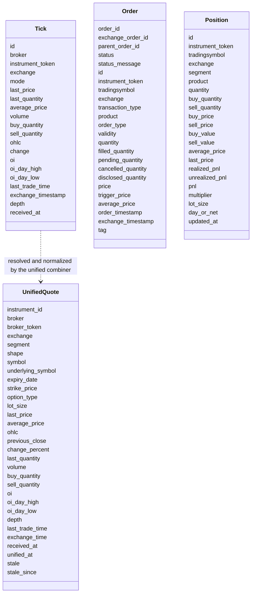
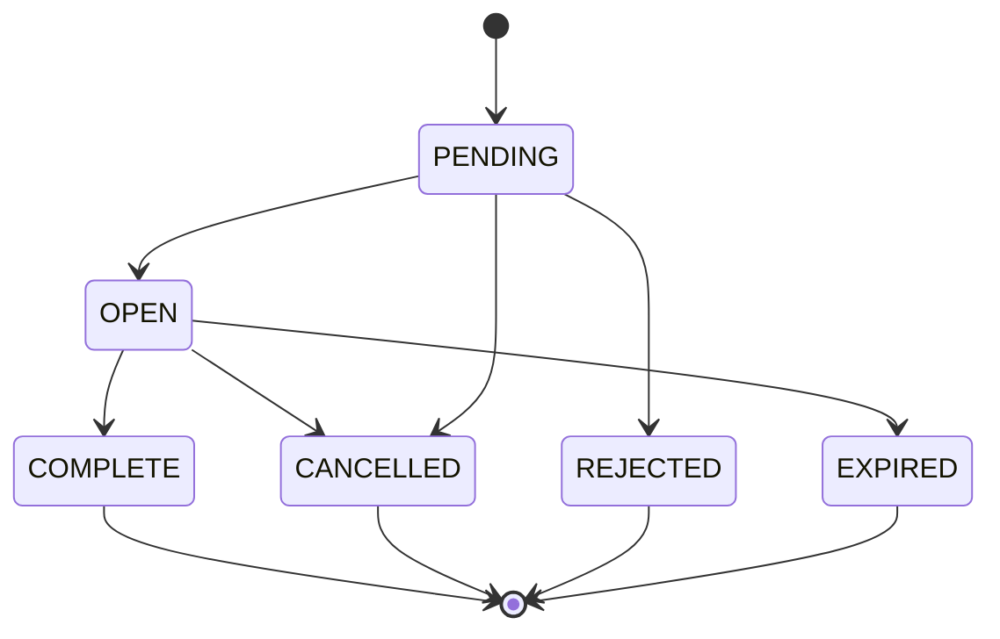

# Data contracts

Ten brokers describe the same things in ten different ways. The project's answer is four fixed dictionary shapes, called contracts here, which every broker's data is converted into before anything else reads it. A tick from Zerodha and a tick from Shoonya are the same dictionary with the same keys, and so are two brokers' orders or positions.

Three rules hold for every contract:

- **Every key is always present.** A field the broker does not send is `None` in Python and `null` in JSON. It is never missing.
- **Nothing validates the shape at runtime.** Each script writes every key out explicitly, in its own code, so a reviewer checks the shape by reading that code.
- **The broker's own payload is kept beside the normalized one.** Redis entries carry it as `data`, and the database tables as `raw`. Nothing is corrected or dropped on the way in.

## The four shapes and who produces them

The table below shows, for each contract, which scripts produce it and where it is stored.

| Contract | Produced by | Stored in |
|---|---|---|
| [Tick](#the-tick) | Each broker's quote socket in `stock_brokers/websockets/<broker>.py`, run by `bin/<broker>/instruments/websocket_quotes` | `<broker>:quotes:live`, `<broker>:quotes:stream`, then `<broker>.ticks` |
| [Order](#the-order) | `bin/<broker>/orders/api_order_details` and `bin/<broker>/orders/websocket_order_details` | The `order` member of each entry in `<broker>:orders:orders`, then `<broker>.order_updates` |
| [Position](#the-position) | `bin/<broker>/portfolio/positions`, and the order update socket for the four brokers that stream positions | The `position` member of each entry in `<broker>:portfolio:positions`, then `<broker>.positions` |
| [Unified quote](#the-unified-quote) | `bin/unified/instruments/websocket_quotes`, and the REST API's quote fallback | `unified:quotes:live`, `unified:quotes:stream`, then `unified.ticks` |

The class diagram below shows the four shapes side by side. The first three are per broker, in the broker's own vocabulary for tokens and exchanges. The unified quote is per instrument, after the broker's token has been resolved to a unified `instrument_id`.



## The tick

A tick is one market data update for one instrument, as a broker's quote socket decoded it. Every socket builds the same twenty keys; `ZerodhaQuotesSocket` in `stock_brokers/websockets/zerodha.py`, for example, starts each tick from a template with every key set to `None`.

The same key does not always mean the same thing at every broker, even though the key is the same. MCX quantities are lots at one broker and units at another, and `close` is the previous session's close at one broker and today's close after the bell at another. Those differences are resolved later, by the broker's `TickNormalizer` in `stock_brokers/instruments/ticks/`, when the unified combiner builds the unified quote.

| Key | Type | Meaning |
|---|---|---|
| `id` | text | The instrument's name in the broker's master, such as `NSE:RELIANCE`, or the token when the master does not name it |
| `broker` | text | The broker's name, such as `zerodha` |
| `instrument_token` | number or text | The broker's own token for the instrument |
| `exchange` | text | The exchange or segment in the broker's own spelling |
| `mode` | text | The feed mode the tick came from; Kite sends `ltp`, `quote` or `full` |
| `last_price` | number | Last traded price, in rupees |
| `last_quantity` | integer | Quantity of the last trade |
| `average_price` | number | The day's volume-weighted average price |
| `volume` | integer | The day's traded volume |
| `buy_quantity` | integer | Total quantity bid |
| `sell_quantity` | integer | Total quantity offered |
| `ohlc` | object | `open`, `high`, `low` and `close` |
| `change` | number | Percentage change against `ohlc.close` |
| `oi` | integer | Open interest |
| `oi_day_high` | integer | The day's highest open interest |
| `oi_day_low` | integer | The day's lowest open interest |
| `last_trade_time` | number | Time of the last trade, as epoch seconds |
| `exchange_timestamp` | number | The exchange's time for the tick, as epoch seconds |
| `depth` | object | `buy` and `sell`, each a list of up to five levels of `price`, `quantity` and `orders` |
| `received_at` | number | When the script decoded the tick, as epoch seconds with a fraction |

The persister flattens a tick into columns: `open`, `high`, `low` and `close` come out of `ohlc`, the two timestamps become `timestamptz` values, and the depth becomes `bid1_price` to `ask5_orders`. The row's `time` column is `received_at`.

## The order

An order is one order at one broker, as the broker's order book or order update socket reported it. It is built by the same function in both scripts, so a polled order and a streamed one are indistinguishable. The broker-specific field mapping is in each script's docstring; for example, `bin/zerodha/orders/api_order_details` has a table from Kite's field names to these.

| Key | Type | Meaning |
|---|---|---|
| `order_id` | text | The broker's order id |
| `exchange_order_id` | text | The exchange's order id, once assigned |
| `parent_order_id` | text | The parent order's id, for a bracket or cover leg |
| `status` | text | The status on the [shared vocabulary](#status) |
| `status_message` | text | The broker's reason text, such as a rejection reason |
| `id` | text | `EXCHANGE:TRADINGSYMBOL` |
| `instrument_token` | text | The broker's token |
| `tradingsymbol` | text | The broker's trading symbol |
| `exchange` | text | The broker's exchange code |
| `transaction_type` | text | `BUY` or `SELL`, on the [shared vocabulary](#transaction-type) |
| `product` | text | On the [shared vocabulary](#product) |
| `order_type` | text | On the [shared vocabulary](#order-type) |
| `validity` | text | On the [shared vocabulary](#validity) |
| `quantity` | integer | Quantity ordered |
| `filled_quantity` | integer | Quantity filled so far |
| `pending_quantity` | integer | Quantity still open |
| `cancelled_quantity` | integer | Quantity cancelled; `null` at Stoxkart, which does not send it |
| `disclosed_quantity` | integer | Disclosed quantity |
| `price` | number | Limit price |
| `trigger_price` | number | Trigger price for a stop order |
| `average_price` | number | Average fill price |
| `order_timestamp` | text | When the order was placed, as ISO 8601 text with the IST offset |
| `exchange_timestamp` | text | The exchange's last update time, as ISO 8601 text with the IST offset |
| `tag` | text | The caller's tag, when the broker supports one |

In Redis an order never appears alone. It is the `order` member of an entry that also records when and how it was seen, as shown below.

```json
{"observed_at": 1789012345.123, "source": "rest", "order": {"order_id": "…", "status": "OPEN", "…": "…"}, "data": {"…": "the broker's own order"}}
```

`source` is `rest` for the poller and `websocket` for the socket, and `observed_at` decides which write wins, as described in [Design choices](design-choices.md#the-poll-and-websocket-race-is-settled-inside-redis). Stoxkart's entries add `variety`, which its cancel request needs.

## The position

A position is one position at one broker. `day_or_net` records whether a row covers today's activity alone (`DAY`) or carried-forward and today's activity together (`NET`). What decides it differs by broker: Zerodha, Stoxkart and Wisdom Capital report both views, Fyers marks a row `NET` when it carries a quantity forward, several brokers report only `NET`, and INDmoney leaves it `null`. The entry around a position has the same shape as an order's, with `position` in place of `order`.

| Key | Type | Meaning |
|---|---|---|
| `id` | text | `EXCHANGE:TRADINGSYMBOL` |
| `instrument_token` | text | The broker's token |
| `tradingsymbol` | text | The broker's trading symbol |
| `exchange` | text | The broker's exchange code |
| `segment` | text | The broker's segment, where it sends one |
| `product` | text | On the [shared vocabulary](#product) |
| `quantity` | integer | Net quantity, signed: negative is short |
| `buy_quantity` | integer | Quantity bought |
| `sell_quantity` | integer | Quantity sold |
| `buy_price` | number | Average buy price |
| `sell_price` | number | Average sell price |
| `buy_value` | number | Value bought |
| `sell_value` | number | Value sold |
| `average_price` | number | Average price of the net position |
| `last_price` | number | Last price the broker reported |
| `realized_pnl` | number | Booked profit or loss |
| `unrealized_pnl` | number | Open profit or loss |
| `pnl` | number | Total profit or loss |
| `multiplier` | number | The contract multiplier |
| `lot_size` | integer | Lot size, where the broker sends one |
| `day_or_net` | text | `NET` or `DAY`, as described above |
| `updated_at` | text | The broker's update time, where it sends one |

Kite sends no segment, lot size or update time on a position, so for Zerodha those three are `null`. Each broker script's docstring lists which fields its broker leaves out.

## The unified quote

A unified quote is one instrument's latest market data after the unified combiner has resolved the broker's token to a unified instrument, chosen the broker that owns the instrument at that moment, and normalized the values. It is written by `quote_document` in `bin/unified/instruments/websocket_quotes`, and by `quote_document` in `stock_brokers/instruments/ticks/utilities/pipeline.py` for the REST API's fallback, so a fetched quote has the same shape as a streamed one. Quantities are in units, not lots, and times are epoch seconds.

| Key | Type | Meaning |
|---|---|---|
| `instrument_id` | text (UUID) | The unified instrument id from `unified.instruments` |
| `broker` | text | The broker that owned the instrument when this quote was written |
| `broker_token` | text | That broker's token, as stored in `unified.broker_mappings` |
| `exchange` | text | The canonical exchange, such as `nse` |
| `segment` | text | The exchange-prefixed segment, such as `nse_equities` |
| `shape` | text | `security`, `future` or `option` |
| `symbol` | text | The security's symbol |
| `underlying_symbol` | text | A derivative's underlying |
| `expiry_date` | text | A derivative's expiry, as an ISO date |
| `strike_price` | number | An option's strike |
| `option_type` | text | An option's type |
| `lot_size` | integer | Units per lot, decided from every broker's mapping |
| `last_price` | number | Last traded price, rounded to 4 places for currency and 2 otherwise |
| `average_price` | number | The day's average price |
| `ohlc` | object | `open`, `high` and `low` |
| `previous_close` | number | The previous session's close, taken only where the broker's `close` means that |
| `change_percent` | number | Change since `previous_close`, as a percentage rounded to 4 places |
| `last_quantity` | integer | Quantity of the last trade, in units |
| `volume` | integer | The day's volume, in units |
| `buy_quantity` | integer | Total quantity bid, in units |
| `sell_quantity` | integer | Total quantity offered, in units |
| `oi` | integer | Open interest, in units |
| `oi_day_high` | integer | The day's highest open interest |
| `oi_day_low` | integer | The day's lowest open interest |
| `depth` | object | `buy` and `sell` lists of `price`, `quantity` and `orders`, with empty levels dropped |
| `last_trade_time` | number | Last trade time, or `null` where the broker's value is not trusted |
| `exchange_time` | number | Exchange time, or `null` where the broker's value is not trusted |
| `received_at` | number | When the broker's script decoded the tick |
| `unified_at` | number | When the combiner wrote this quote |
| `stale` | boolean | `true` when the owning broker went silent and no healthy backup took over |
| `stale_since` | number | When the quote became stale, or `null` |

The REST API adds `source` to a quote on its way out, `cache` or `broker`, to say whether the quote came from Redis or was fetched from a broker for this request. It is not stored.

## The shared vocabulary

Brokers spell the same status, side, product, order type and validity in many ways, from `TRADED` to `FILLED` to `COMPLETE`. Each order normalizer maps the broker's spelling onto one shared set of values. The lookup upper-cases the broker's term, turns underscores into spaces and collapses repeated spaces. A term the table does not know is passed through upper-cased rather than dropped, so a new spelling shows up instead of disappearing.

The tables below come from the code. Nine brokers, all except Stoxkart, carry byte-identical copies of one table in each of their `api_order_details` and `websocket_order_details` scripts, and their `portfolio/positions` scripts carry the same product table. That table is the union of every spelling the nine brokers use, so it is not split by broker. Stoxkart's scripts carry their own, smaller tables, in `StoxkartOrderNormalizer` in the order-book poller, an identical copy in `StoxkartUpdateNormalizer` in the order socket script, and a product table in `StoxkartPositionNormalizer`. Each table below therefore has one column for the nine brokers' shared table and one for Stoxkart's.

### Status

The six shared statuses are `PENDING`, `OPEN`, `COMPLETE`, `CANCELLED`, `REJECTED` and `EXPIRED`. The table below lists every spelling that maps to each.

| Shared value | Dhan, Flattrade, Fyers, Groww, INDmoney, Kotak, Shoonya, Wisdom Capital, Zerodha | Stoxkart |
|---|---|---|
| `PENDING` | `PENDING`, `TRANSIT`, `VALIDATION PENDING`, `PUT ORDER REQ RECEIVED`, `TRIGGER PENDING`, `AMO REQ RECEIVED`, `PENDINGNEW`, `O-PENDING`, `MODIFY AMO REQ RECEIVED`, `AFTER MARKET ORDER REQ RECEIVED`, `AMO PENDING`, `MODIFY AFTER MARKET ORDER REQ RECEIVED`, `QUEUED`, `PROCESSING`, `SL-PENDING` | `PENDING`, `TRANSIT`, `TRIGGER PENDING`, `AMO REQ RECEIVED`, `AMO PENDING`, `AFTER MARKET ORDER REQ RECEIVED`, `O-PENDING` |
| `OPEN` | `OPEN`, `OPEN PENDING`, `NEW`, `REPLACED`, `ACKED`, `APPROVED`, `MODIFICATION REQUESTED`, `MODIFIED`, `MODIFY VALIDATION PENDING`, `MODIFY PENDING`, `PARTIALLY FILLED`, `PARTIALLY EXECUTED`, `PLACED`, `PART TRADED`, `PARTIALLYFILLED`, `PENDINGREPLACE`, `CONFIRMED`, `PARTIALLY TRADED`, `INITIATED` | `OPEN`, `NEW`, `MODIFIED`, `REPLACED`, `PARTIALLY EXECUTED`, `PARTIALLY FILLED`, `PART TRADED`, `PARTIALLY TRADED` |
| `COMPLETE` | `COMPLETE`, `COMPLETED`, `TRADED`, `FILLED`, `EXECUTED`, `FULLY EXECUTED`, `DELIVERY AWAITED`, `SUCCESS` | `COMPLETE`, `COMPLETED`, `EXECUTED`, `FULLY EXECUTED`, `TRADED`, `FILLED` |
| `CANCELLED` | `CANCELLED`, `CANCELED`, `CANCEL`, `CANCEL PENDING`, `CANCELLATION REQUESTED`, `PENDINGCANCEL`, `CANCELLED AFTER MARKET ORDER`, `AMO CANCELLED`, `PARTIALLY FILLED - CANCELLED` | `CANCELLED`, `CANCELED`, `CANCEL`, `AMO CANCELLED` |
| `REJECTED` | `REJECTED`, `REJECT`, `FAILED`, `ABORTED` | `REJECTED`, `REJECT`, `FAILED` |
| `EXPIRED` | `EXPIRED`, `PARTIALLY FILLED - EXPIRED` | `EXPIRED` |

The diagram below shows how the shared statuses usually follow each other. Brokers do not all report every step; an order can appear first as `OPEN`, or go straight from `PENDING` to `REJECTED`.



### Transaction type

The side of an order is `BUY` or `SELL`. The numeric spellings come from brokers that send the side as a code.

| Shared value | Nine brokers' shared table | Stoxkart |
|---|---|---|
| `BUY` | `BUY`, `B`, `1`, `BUY ORDER` | `BUY`, `B` |
| `SELL` | `SELL`, `S`, `-1`, `2`, `SELL ORDER` | `SELL`, `S` |

### Product

The product says how the position is held: delivery, intraday, carried forward on margin, and so on. The same table is used for positions.

| Shared value | Nine brokers' shared table | Stoxkart |
|---|---|---|
| `CNC` | `CNC`, `C`, `DELIVERY`, `CASH` | `DELIVERY`, `CNC` |
| `MIS` | `MIS`, `I`, `INTRADAY` | `INTRADAY`, `MIS` |
| `NRML` | `NRML`, `NORMAL`, `MARGIN`, `CARRYFORWARD`, `M` | `CARRYFORWARD`, `CARRY FORWARD`, `NRML`, `NORMAL` |
| `CO` | `CO`, `H` | `CO`, `COVER ORDER` |
| `BO` | `BO`, `B` | `BO`, `BRACKET ORDER` |
| `MTF` | `MTF` | `MTF` |
| `ARB` | `ARB` | none |

### Order type

The order type says how the price is set. `SL` is a stop order that becomes a limit order, and `SL-M` is a stop order that becomes a market order.

| Shared value | Nine brokers' shared table | Stoxkart |
|---|---|---|
| `MARKET` | `MARKET`, `MKT`, `MKT ORDER`, `2` | `MARKET`, `MKT`, `RL MKT`, `RL-MKT` |
| `LIMIT` | `LIMIT`, `LMT`, `L`, `1` | `LIMIT`, `RL`, `L` |
| `SL` | `SL`, `SL-LMT`, `STOPLIMIT`, `SL LIMIT`, `4`, `STOP LOSS` | `STOPLOSS LIMIT`, `SL`, `SL LIMIT` |
| `SL-M` | `SL-M`, `SL-MKT`, `STOPMARKET`, `SL MARKET`, `3`, `SL M`, `SLM`, `STOP LOSS MARKET` | `STOPLOSS MARKET`, `SL-M`, `SL M`, `SL-MKT`, `SL MKT` |

### Validity

The validity says how long an unfilled order stays at the exchange.

| Shared value | Nine brokers' shared table | Stoxkart |
|---|---|---|
| `DAY` | `DAY`, `EOS`, `0` | `DAY`, `EOTODY`, `EOSESS` |
| `IOC` | `IOC`, `IMMEDIATE`, `1` | `IOC` |
| `GTT` | `GTT` | `GTT` |
| `GTC` | `GTC` | `GTC` |
| `GTD` | `GTD` | `GTD` |

### The REST API's words for products

The unified layer speaks to API clients in lower-case words rather than broker codes. `bin/unified/portfolio/positions` maps the broker's product onto them with its own table, shown below, and the unified position documents use these words.

| REST API value | Broker spellings |
|---|---|
| `delivery` | `CNC`, `C`, `DELIVERY` |
| `intraday` | `MIS`, `I`, `INTRA`, `INTRADAY` |
| `carry` | `NRML`, `M`, `MARGIN`, `NORMAL`, `CARRYFORWARD` |
| `margin_trading` | `MTF` |
| `cover` | `CO`, `H` |
| `bracket` | `BO`, `B` |

[Constants](../rest-api/constants.md) lists every enumerated value the REST API accepts and returns.
