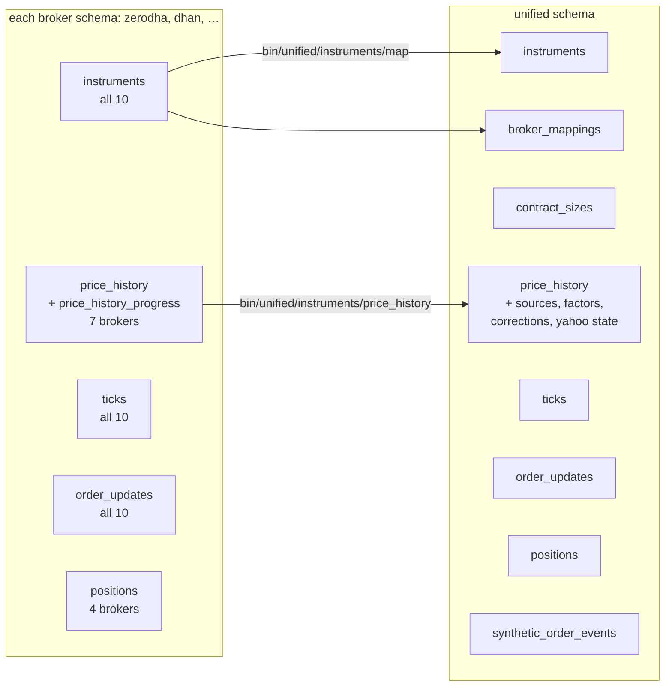
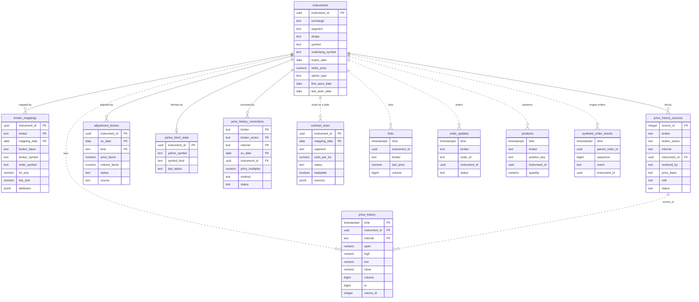
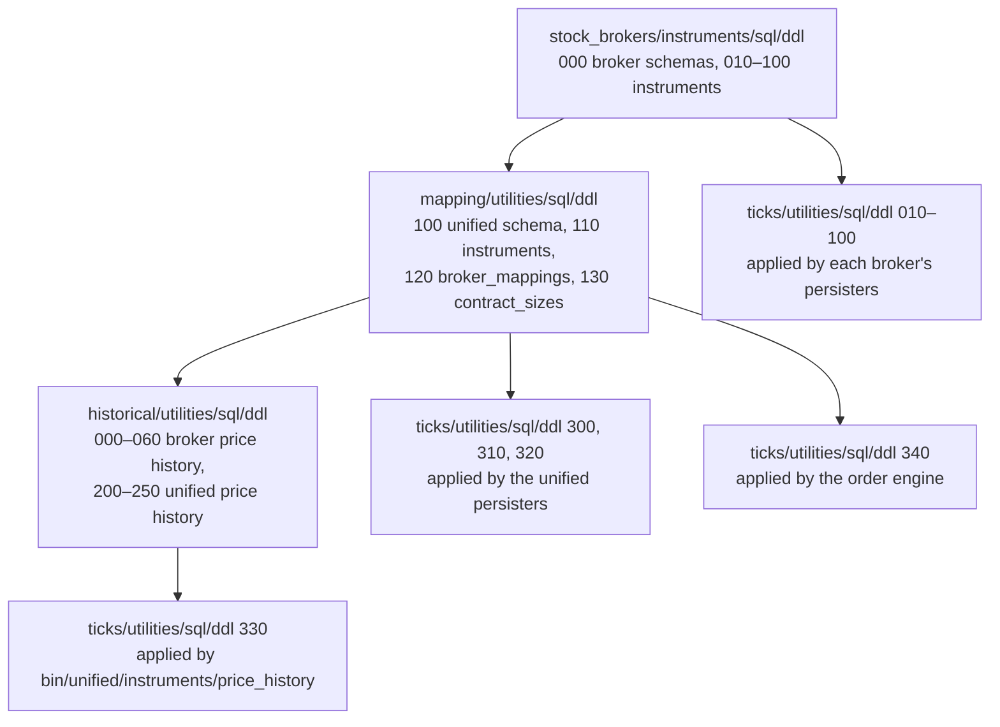

# Database

TimescaleDB holds everything the system keeps over time: every tick, every order update, every position snapshot, every day's instrument lists and years of candles. It is PostgreSQL with the TimescaleDB extension, which splits a large time-ordered table into chunks, one per day or month, and compresses the old chunks. MongoDB holds the much smaller set of documents that configure the system. This page describes both.

## Schemas

The project creates eleven schemas. Each broker has its own schema, named after it, holding the raw data exactly as that broker sent it. The `unified` schema holds data that combines brokers, keyed by the unified `instrument_id`. There is no shared table of raw broker data with a `broker` column; [Design choices](design-choices.md#one-schema-per-broker-for-raw-data) explains why.

The diagram below shows which tables each schema holds.



The per-broker tables are not present for every broker. The table below shows which broker has which.

| Broker | `instruments` | `ticks` | `order_updates` | `positions` | `price_history` |
|---|:-:|:-:|:-:|:-:|:-:|
| `dhan` | :material-check: | :material-check: | :material-check: | | :material-check: |
| `flattrade` | :material-check: | :material-check: | :material-check: | | :material-check: |
| `fyers` | :material-check: | :material-check: | :material-check: | :material-check: | :material-check: |
| `groww` | :material-check: | :material-check: | :material-check: | :material-check: | |
| `indmoney` | :material-check: | :material-check: | :material-check: | | :material-check: |
| `kotak` | :material-check: | :material-check: | :material-check: | :material-check: | |
| `shoonya` | :material-check: | :material-check: | :material-check: | | :material-check: |
| `stoxkart` | :material-check: | :material-check: | :material-check: | | |
| `wisdom_capital` | :material-check: | :material-check: | :material-check: | :material-check: | :material-check: |
| `zerodha` | :material-check: | :material-check: | :material-check: | | :material-check: |

Only four brokers send position updates on their order socket, so only they have a `positions` table; every broker's positions still reach Redis through its poller. The three brokers without `price_history` have no candle downloader in `stock_brokers/instruments/historical/`.

## Every table

The table below lists every table in the database. "Chunk" is the size of each TimescaleDB chunk, and "Compressed after" is the age at which the columnstore policy compresses a chunk. A table with no chunk size is an ordinary PostgreSQL table.

| Schema | Table | Chunk | Compressed after | Written by | DDL file |
|---|---|---|---|---|---|
| each broker | `instruments` | 1 month, by `download_date` | not compressed | `bin/<broker>/instruments/daily_feed` | `stock_brokers/instruments/sql/ddl/010_…` to `100_instruments_<broker>.sql` |
| each broker | `ticks` | 1 day | 7 days | `bin/<broker>/instruments/store_quotes_to_db` | `stock_brokers/instruments/ticks/utilities/sql/ddl/<nnn>_<broker>_streams.sql` |
| each broker | `order_updates` | 1 day | 7 days | `bin/<broker>/orders/store_orders_to_db` | the same streams file |
| fyers, groww, kotak, wisdom_capital | `positions` | 1 day | 7 days | `bin/<broker>/portfolio/store_positions_to_db` | the same streams file |
| seven brokers | `price_history` | 1 month | 30 days | `bin/<broker>/instruments/price_history` | `stock_brokers/instruments/historical/utilities/sql/ddl/0x0_price_history_<broker>.sql` |
| seven brokers | `price_history_progress` | ordinary table | | `bin/<broker>/instruments/price_history` | the same price history file |
| `unified` | `instruments` | ordinary table | | `bin/unified/instruments/map` | `stock_brokers/instruments/mapping/utilities/sql/ddl/110_unified_instruments.sql` |
| `unified` | `broker_mappings` | 1 month, by `mapping_date` | not compressed | `bin/unified/instruments/map` | `…/mapping/utilities/sql/ddl/120_unified_broker_mappings.sql` |
| `unified` | `contract_sizes` | 1 month, by `mapping_date` | not compressed | `bin/unified/instruments/map` | `…/mapping/utilities/sql/ddl/130_unified_contract_sizes.sql` |
| `unified` | `price_history` | 1 month | 30 days | `bin/unified/instruments/price_history` | `…/historical/utilities/sql/ddl/200_unified_price_history.sql` |
| `unified` | `price_history_sources` | ordinary table | | `bin/unified/instruments/price_history` | `…/historical/utilities/sql/ddl/210_unified_price_history_sources.sql` |
| `unified` | `adjustment_factors` | ordinary table | | `bin/unified/instruments/price_history` | `…/historical/utilities/sql/ddl/220_unified_adjustment_factors.sql` |
| `unified` | `yahoo_fetch_state` | ordinary table | | `bin/unified/instruments/price_history` | `…/historical/utilities/sql/ddl/230_unified_yahoo_fetch_state.sql` |
| `unified` | `price_history_corrections` | ordinary table | | `bin/unified/instruments/price_history` | `…/historical/utilities/sql/ddl/250_unified_price_history_corrections.sql` |
| `unified` | `ticks` | 1 day | 7 days | `bin/unified/instruments/store_quotes_to_db` | `…/ticks/utilities/sql/ddl/300_unified_ticks.sql` |
| `unified` | `order_updates` | 1 month | 7 days | `bin/unified/orders/store_orders_to_db` | `…/ticks/utilities/sql/ddl/310_unified_order_updates.sql` |
| `unified` | `positions` | 1 month | 7 days | `bin/unified/portfolio/store_positions_to_db` | `…/ticks/utilities/sql/ddl/320_unified_positions.sql` |
| `unified` | `synthetic_order_events` | 1 day | 7 days | `bin/unified/orders/order_engine` | `…/ticks/utilities/sql/ddl/340_unified_synthetic_order_events.sql` |

The seven brokers with price history are `zerodha`, `dhan`, `flattrade`, `shoonya`, `fyers`, `indmoney` and `wisdom_capital`, in the files numbered `000` to `060`.

Chunk sizes follow how dense the data is. Ticks arrive in millions a day, so a trading day fits one chunk, which is also the unit compression acts on. Order updates and positions in the unified schema are sparse, hundreds a day, so a month to a chunk keeps chunks from being mostly overhead. The price history files record that seven-day chunks were tried first: daily bars going back two decades spread across 1,133 chunks of 98 rows each for a single instrument.

### Tables with no primary key

The tick, order update and position tables have no primary key on purpose. The DDL comments give two reasons. Two ticks for one instrument can share a microsecond, and a key violation would fail a whole `COPY` batch. And a stream entry is delivered at least once, so a batch can be written twice after a crash; a key would turn that into a failed load. `unified.synthetic_order_events` has no key either, because a hypertable's unique index must include the time column, and the engine's recovery ignores a duplicated row anyway.

## Views and the adjustment function

Prices are stored unadjusted, exactly as served, and adjusted for splits, bonuses and demergers only when read. Correcting a factor therefore corrects every later query at once, without rewriting any stored row. The table below lists the views and the function that do this.

| Object | Kind | Created by | What it gives |
|---|---|---|---|
| `unified.adjustment_ranges` | view | `240_unified_price_history_adjusted.sql` | One row per instrument and span between consecutive confirmed ex-dates, with the combined `price_factor` and `volume_factor` for bars inside it |
| `unified.price_history_adjusted` | view | `240_unified_price_history_adjusted.sql` | Every bar of `unified.price_history`, adjusted with every confirmed factor known today |
| `unified.adjusted_bars(p_instrument_id, p_interval, p_from, p_to, p_known_as_of)` | SQL function | `240_unified_price_history_adjusted.sql` | One instrument's bars in a time range, adjusted as they would have been on `p_known_as_of` |
| `unified.correction_ranges` | view | `250_unified_price_history_corrections.sql` | The combined multiplier undoing an adjustment a broker had already applied to a series |
| `unified.ticks_adjusted` | view | `330_unified_ticks_adjusted.sql` | Every row of `unified.ticks`, adjusted like the candles; open interest is left alone |

The REST API's `/api/instruments/prices` reads adjusted candles through `unified.adjusted_bars()`, and `/api/instruments/ticks` reads adjusted ticks through `unified.ticks_adjusted`. Both apply adjustment only to equities, exchange traded funds and investment trusts; every other instrument is read from the raw tables exactly as the broker served it. The function's last argument, `p_known_as_of`, defaults to `NULL`, which applies every confirmed factor. With a date, it applies only the factors whose ex-date is on or before that date, which is what a chart showed on that day and what a backtest standing on that day may use. It is one SQL `SELECT` marked `STABLE`, so PostgreSQL inlines it into the calling query and the time conditions still reach the hypertable's chunk exclusion.

```sql
SELECT *
FROM unified.adjusted_bars(
    '11111111-1111-5111-8111-000000000001',
    'day',
    '2023-01-01',
    '2024-01-01',
    '2023-06-30'
);
```

The instrument id in the example is made up.

## The unified schema

The diagram below shows the tables of the `unified` schema and how they refer to each other. Solid lines are foreign keys declared in the DDL. Dotted lines are references the loaders keep without a foreign key, because a check on every row of a hypertable load would cost more than the guarantee is worth.



The large tables are shortened in the diagram to their key columns. The DDL files hold every column.

### How an instrument gets its id

`unified.instruments.instrument_id` is not allocated from a sequence. It is a UUID5 computed from the exchange, segment, shape and the identity fields for that shape. Two brokers publishing the same contract therefore arrive at the same id independently, and the mapping's upsert merges them with no matching step. Three partial unique indexes state the identity for each shape, so the database itself rejects a second row claiming the same real instrument.

| Shape | Unique on |
|---|---|
| `security` | `exchange`, `segment`, `symbol` |
| `future` | `exchange`, `segment`, `underlying_symbol`, `expiry_date` |
| `option` | `exchange`, `segment`, `underlying_symbol`, `expiry_date`, `strike_price`, `option_type` |

`unified.broker_mappings` is dated rather than current, because a broker can renumber a scrip. A position opened in March has to be read back with March's token, not today's.

## DDL rules

Schemas live only in numbered `.sql` files under four `ddl` directories, and there is no migration tool and no version table. The rules below keep that workable. Break one and the next run of a runner, or the next start of a persister, fails.

1. **Every statement can be run again.** Use `CREATE SCHEMA IF NOT EXISTS`, `CREATE TABLE IF NOT EXISTS`, `CREATE INDEX IF NOT EXISTS`, `CREATE OR REPLACE VIEW` and `FUNCTION`, `create_hypertable(…, if_not_exists => TRUE)` and `CALL add_columnstore_policy(…, if_not_exists => TRUE)`.
2. **A new column is appended, not edited in.** Add `ALTER TABLE … ADD COLUMN IF NOT EXISTS` to the table's existing file, as `120_unified_broker_mappings.sql` does for `attributes`. Editing the `CREATE TABLE` would change nothing on a database where the table already exists.
3. **Files run in filename order, inside one transaction.** `apply_all` in `stock_brokers/instruments/sql/apply_ddl.py` executes every file of a directory in one transaction, so a broken file rolls the whole run back. A persister applies its single file the same way.
4. **Nothing that refuses a transaction.** Continuous aggregates and `CREATE INDEX CONCURRENTLY` cannot run inside a transaction block, so they cannot go into these files.
5. **Each file can be applied on its own.** Unified files repeat `CREATE SCHEMA IF NOT EXISTS unified;` so they do not fail when applied alone, though that does not replace the ordering below.

### Applying the DDL on a fresh database

On an empty database the directories must be applied in the order below, because later files refer to objects that earlier ones create.



The reasons for each arrow are in the files themselves:

- The broker price history tables live in the broker schemas that `000_schemas.sql` creates.
- `unified.broker_mappings` has a foreign key to `unified.instruments`, so `110` must run before `120`.
- `210`, `220`, `230` and `250` refer to `unified.instruments`, so the mapping directory must run before the historical one.
- `330_unified_ticks_adjusted.sql` reads `unified.adjustment_ranges`, which `240` creates, so it is applied by `bin/unified/instruments/price_history` after the historical DDL, together with `300`.

The commands for the three runners are on [Installation](../get-started/installation.md#4-create-the-database-tables).

## MongoDB collections

MongoDB holds five collections. They are small, and each one is read far more often than it is written. The table below describes them.

| Collection | Keyed by | Holds | Written by | Read by |
|---|---|---|---|---|
| `settings` | `broker_name` | Each broker's credentials, and the REST API's `api_key` and `api_secret` under `unified_broker_interface` | You, by hand | Each broker's API class, which also copies it into the Redis hash `settings`; the REST API's connect; `bin/unified/session/*` |
| `last_login` | `broker_name` | Each broker's current token and login time, and the REST API's token and expiry | Each broker's login; the REST API's connect and disconnect; `bin/unified/session/*` | `BrokerAPI._current_login` when Redis has nothing; `ensure_session`; the REST API when Redis has nothing |
| `exchange_details` | `exchange` | Each exchange's details, trading hours, holidays and special sessions | `bin/import-api-details` | `bin/unified/exchanges/unified_details`, which caches it in `unified:details:exchanges` |
| `broker_details` | `broker_name` | Reference details for each broker | `bin/import-api-details` | `bin/unified/brokers/unified_details`, which caches it in `unified:details:brokers` |
| `user_details` | nothing | The account holder's profiles | `bin/import-api-details` | `bin/unified/user/unified_details`, which caches it in `unified:details:users` |

[Configuration](../get-started/configuration.md#mongodb-documents) lists the fields of the `settings` and `last_login` documents.
