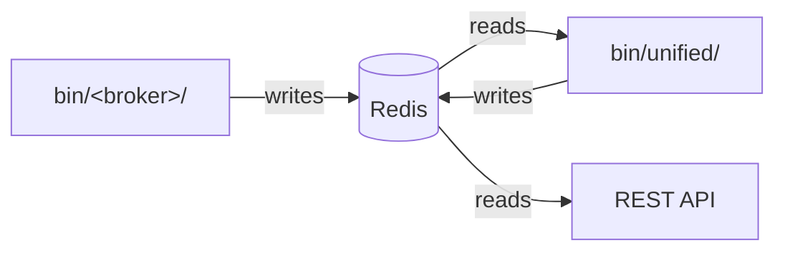
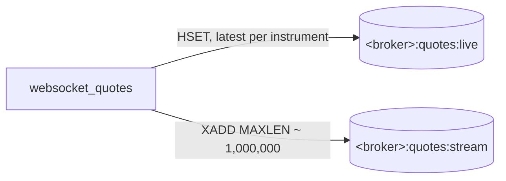
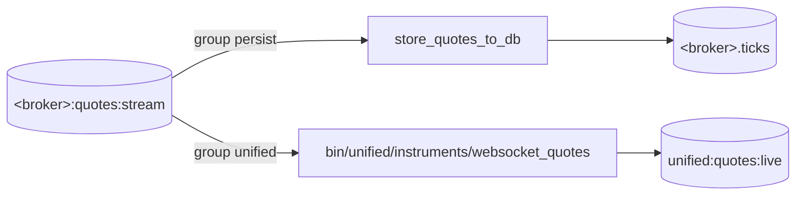
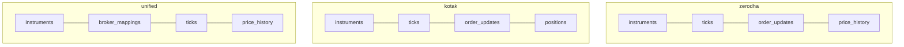
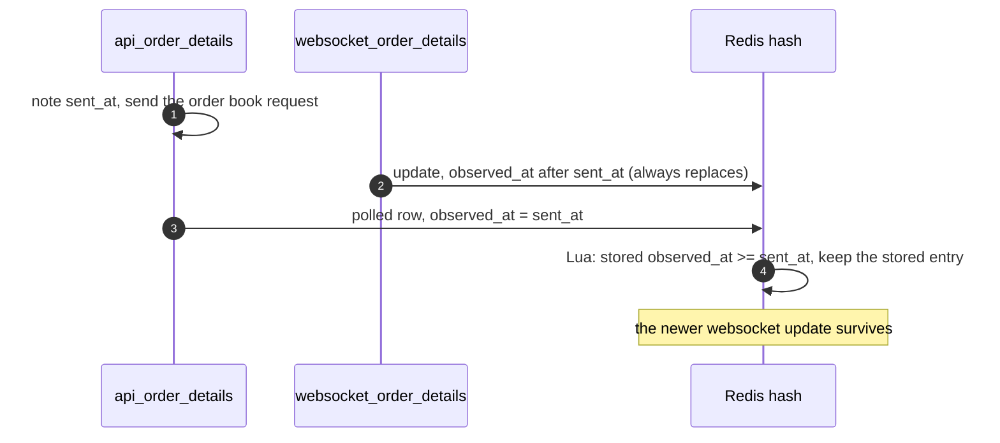
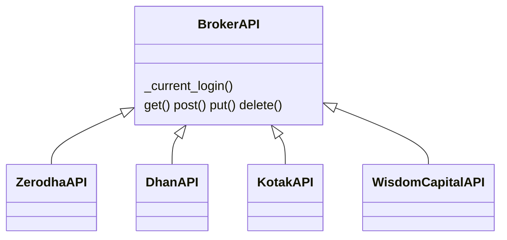
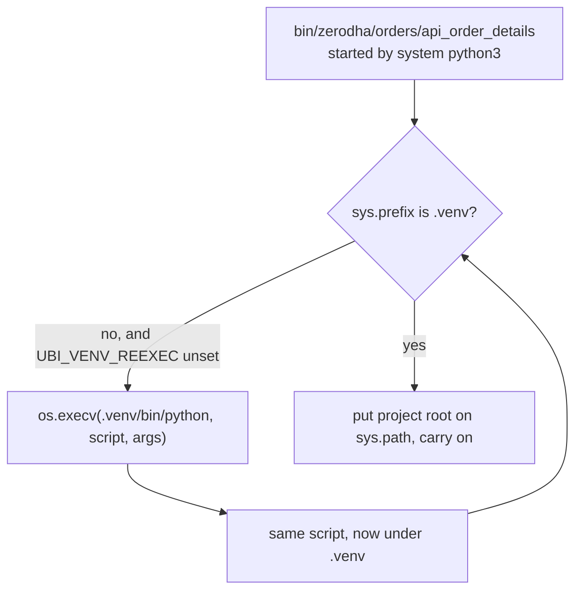
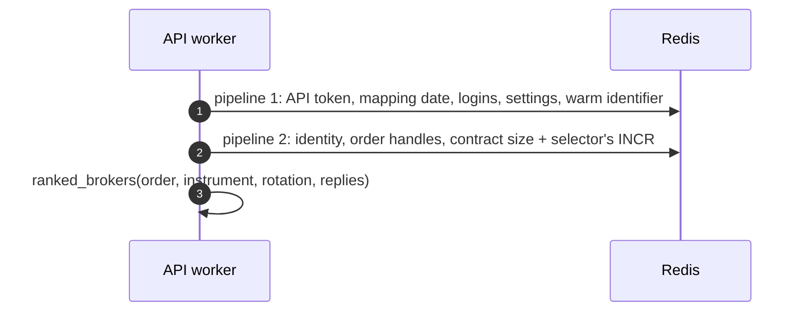

# Design choices

This page records the decisions that shape the system. Each record says what problem the decision solves, what was chosen, why, and what it costs, and it names the files where you can see the decision in the code. The costs are real: every choice here gave something up, and knowing what was given up is the best guide to changing it safely.

## The decisions at a glance

The table below lists every record on this page with its main benefit and its main cost.

| Decision | What it buys | What it costs |
|---|---|---|
| [Layers that run independently](#layers-that-run-independently) | One broker or one layer failing does not stop the rest | Documents can go stale, and every reader has to check |
| [A hash of current state plus a capped stream per feed](#a-hash-of-current-state-plus-a-capped-stream-per-feed) | Instant reads of the latest value, and a history nobody has to wait for | Entries trimmed from the stream before they were read are lost |
| [Two consumer groups on the same stream](#two-consumer-groups-on-the-same-stream) | Archiving and combining never slow each other down | Delivery is at least once, so a crash can write a row twice |
| [Websockets never write PostgreSQL](#websockets-never-write-postgresql) | A slow database cannot stall a live feed | One more process per feed, and the stream cap bounds the outage it survives |
| [One schema per broker for raw data](#one-schema-per-broker-for-raw-data) | Each broker's data compresses, retains and reloads on its own | Ten copies of similar DDL, and cross-broker questions need the unified schema |
| [Re-runnable numbered DDL with no migration tool](#re-runnable-numbered-ddl-with-no-migration-tool) | One command creates or updates the schema, any number of times | No renames or drops, no record of what ran, and ordering rules on a fresh database |
| [The poll and websocket race is settled inside Redis](#the-poll-and-websocket-race-is-settled-inside-redis) | An older snapshot never overwrites a newer update | A stale entry waits for the next poll to be corrected |
| [The broker's raw payload is kept beside the normalized one](#the-brokers-raw-payload-is-kept-beside-the-normalized-one) | Nothing the broker said is ever lost to a normalization bug | Every order and position is stored twice |
| [One self-contained class or script per broker](#one-self-contained-class-or-script-per-broker) | Each broker can be read, fixed and tested alone | The same code is repeated across brokers |
| [Every script re-executes itself under the virtual environment](#every-script-re-executes-itself-under-the-virtual-environment) | Scripts run from cron, systemd or any shell without activation | One extra `exec` at start, and a dependency on `.venv` at the project root |
| [Logins are read through one shared record](#logins-are-read-through-one-shared-record) | A token obtained by any process is used by all at once | A Redis read on every request, and strict rules on who may write the token |
| [Logins never happen inside a web request](#logins-never-happen-inside-a-web-request) | A web worker never starts a headless browser or knocks out another process's token | A request that meets a dead session fails at that broker instead of waiting |
| [Broker selectors ride on the existing Redis round trip](#broker-selectors-ride-on-the-existing-redis-round-trip) | Choosing a broker adds no network round trip to an order | A selector can only queue commands up front and cannot read and then decide |

## Layers that run independently

**The problem.** Ten brokers fail in ten different ways, often at the worst moment. If one broker's websocket drops, or its login breaks, the rest of the system should not notice. A design where the API asks each broker in turn for every request would make every request as slow and as fragile as the worst broker.

**The choice.** The system is split into three layers that never call each other. Broker scripts under `bin/<broker>/` are the only code that polls or streams from a broker. They write `<broker>:*` keys and streams in Redis. The unified scripts under `bin/unified/` read only Redis and the database and write `unified:*` keys and the `unified` schema. The REST API in `unified_broker_interface/` serves what the unified layer wrote.

**Why.** Each process can crash, restart or be stopped without taking anything else down, and each broker's scripts run without any other broker's. Almost every read route answers from memory in one Redis round trip, whatever the brokers are doing.

**The cost.** The API serves documents that are only as fresh as the script that last wrote them. Every read route therefore has to check the age of what it serves, and it answers `503` naming the key when the writer has stopped. Two parts of the system still talk to brokers on purpose: the REST API's order routes and its quote fallback, and the order engine when placement is set to `engine`.

**In the code.** `bin/unified/orders/api_order_details` and every other combiner say "Nothing here calls a broker" in their docstrings. `unified_broker_interface/utilities/unified_documents.py` decides when a document is too old to serve.

## A hash of current state plus a capped stream per feed

**The problem.** A feed has two kinds of reader. Some want only the latest value, such as the latest quote for an instrument or the latest state of an order. Others want every change, in order, such as the persister that archives ticks. One data structure cannot serve both well.

**The choice.** Every feed writes twice, in one Redis pipeline: it replaces the latest value in a hash, and it appends the same event to a Redis Stream capped with `MAXLEN ~`. For quotes that is `<broker>:quotes:live` and `<broker>:quotes:stream`; for order updates it is `<broker>:orders:orders` and `<broker>:order-updates:stream`.

**Why.** A hash answers "what is the price now" in one lookup, however busy the feed is. A stream keeps the order of events and lets any number of readers work through it at their own pace.

**The cost.** The cap is what keeps Redis from growing without limit, and it is also the one way data is lost. The persisters' docstrings say it plainly: ticks trimmed while the persister is stopped are gone. The quote streams are capped near 1,000,000 entries, the broker order update streams near 20,000, and the unified order and position streams near 50,000. [Redis keys and streams](redis-keys.md#streams) lists every cap.

**In the code.** `write_ticks` in `bin/zerodha/instruments/websocket_quotes` does the hash write and the stream appends in one pipeline. `STREAM_MAX_LENGTH` in each broker's `websocket_quotes` and `websocket_order_details` sets the cap.

## Two consumer groups on the same stream

**The problem.** Two very different readers need every entry of a broker's stream: the persister, which writes to the database in large batches, and the unified combiner, which has to react to each tick in well under a second. If they shared one reader, a slow database write would delay live quotes.

**The choice.** Each stream is read by two Redis consumer groups. The persister reads as the group `persist`, and the unified combiner reads as the group `unified`. A consumer group keeps its own position in the stream and its own list of entries read but not yet acknowledged, so each group receives every entry.

**Why.** Neither reader can slow the other down, and each can be restarted on its own. An entry is acknowledged only after the batch holding it has been committed, so a crash leaves the batch pending, and the next start takes the pending entries first.

**The cost.** Delivery is at least once, not exactly once. A batch committed just before a crash, and not yet acknowledged, is written a second time, and the tick tables have no unique key to stop that. The two groups also start in different places: the `unified` quote group is created at the end of the stream, because a live cache has no use for history, while each `persist` group is created at the beginning, so its first run archives everything already there.

**In the code.** `GROUP = "persist"` in every `store_*_to_db`, and `GROUP = "unified"` in `bin/unified/instruments/websocket_quotes` and `bin/unified/orders/websocket_order_details`. The order engine adds a third group, `engine`, on `unified:order-updates:stream` and `unified:orders:intents:stream`.

## Websockets never write PostgreSQL

**The problem.** A websocket has to read its socket continuously. If the thread that decodes ticks also waited for a database insert, a slow disk, a vacuum or a database restart would back the socket up, and the broker would eventually drop the connection.

**The choice.** No websocket script opens a PostgreSQL connection. Each one writes only to Redis, and a separate `store_*_to_db` script drains the stream into TimescaleDB with `COPY`, a batch at a time. A batch is written when it holds `--batch-size` entries or has waited `--flush-interval` seconds, whichever comes first.

**Why.** Redis writes take microseconds and never block on disk in the same way, so the socket keeps flowing. `COPY` is the fastest way to load many rows into PostgreSQL, and batching turns thousands of tiny inserts into a few large ones.

**The cost.** Every feed needs a second process, and the database is always slightly behind the feed. The stream is the only buffer, so a persister that stays down longer than the stream cap allows loses the entries trimmed in the meantime.

**In the code.** None of `bin/*/instruments/websocket_quotes` or `bin/*/orders/websocket_order_details` imports `get_postgres`. The `COPY` is `cursor.copy_expert(...)` in each persister, for example `bin/zerodha/instruments/store_quotes_to_db`.

## One schema per broker for raw data

**The problem.** Each broker's raw data has its own columns, its own volume and its own life. Zerodha's instrument table has twelve columns from the broker and Kotak's has eighty; one broker streams positions and another does not. A single shared table with a `broker` column would need the union of every broker's columns, and it would compress and retain every broker's data together.

**The choice.** Each broker has its own PostgreSQL schema named after it, holding that broker's `instruments`, `price_history`, `ticks`, `order_updates` and, for four brokers, `positions`. Data that combines brokers lives in the separate `unified` schema.

**Why.** The stream DDL states the reason in its header: one table per broker keeps each stream compressing, retaining and reloading on its own. A broker's tables can be dropped or reloaded without touching any other broker's, and each table stores exactly what that broker sends.

**The cost.** There are ten copies of very similar DDL, and adding a broker means adding a schema and several files. A question across brokers cannot be answered from the raw tables; it goes through the `unified` schema, where a `broker` column does appear, recording which broker a unified row came from.

**In the code.** `stock_brokers/instruments/sql/ddl/000_schemas.sql` creates the ten schemas. The per-broker stream files are `stock_brokers/instruments/ticks/utilities/sql/ddl/010_zerodha_streams.sql` to `100_stoxkart_streams.sql`.

## Re-runnable numbered DDL with no migration tool

**The problem.** The database has to be creatable from nothing, and it has to pick up changes on a machine that already has data. Migration tools solve this with a version table and ordered up and down scripts, at the price of another tool and another source of truth.

**The choice.** Tables are defined only in numbered `.sql` files under four `ddl` directories, and every statement can be run again safely: `CREATE … IF NOT EXISTS`, `CREATE OR REPLACE`, `create_hypertable(…, if_not_exists => TRUE)`, and `ALTER TABLE … ADD COLUMN IF NOT EXISTS` for a new column. The runner applies a directory's files in filename order inside one transaction.

**Why.** "Apply the DDL" is always the right command, on a fresh database or an old one, and running it twice changes nothing. The files are the schema, so there is nothing else to keep in step.

**The cost.** There is no record of what has been applied, and no way to rename or drop a column except by hand. Because a whole directory runs inside one transaction, the files cannot contain continuous aggregates or `CREATE INDEX CONCURRENTLY`, which PostgreSQL refuses inside a transaction. On a fresh database the directories also have to be applied in the right order, because the unified price history tables refer to `unified.instruments`. [Database](database.md#ddl-rules) lists the rules.

**In the code.** `apply_all` in `stock_brokers/instruments/sql/apply_ddl.py` is the runner; the mapping and historical runners call it with their own directory.

## The poll and websocket race is settled inside Redis

**The problem.** Each broker's orders reach one Redis hash, `<broker>:orders:orders`, from two writers. The websocket writes each update the moment it arrives. The poller fetches the whole order book every half second or so. A poll request that was sent before an update arrived, but answered after it, carries an older state. Written naively, it would overwrite the newer update, and an order that just filled would appear open again.

**The choice.** Every entry records `observed_at`, and a polled row records the moment its request was sent. Both writers merge through one Lua script, which Redis runs atomically. A websocket entry always replaces the current one. A polled row replaces it only when the stored entry was observed before the poll's request was sent.

**Why.** The check and the write happen together inside Redis, so no other write can slip in between them. Doing the same in Python would need a lock across two processes.

**The cost.** A stale entry that the rule protects is corrected only by the next poll. Each script carries its own copy of the Lua script. The same rule, with the same script, guards `<broker>:portfolio:positions`.

**In the code.** `MERGE_SCRIPT` in `bin/zerodha/orders/api_order_details` and in `bin/zerodha/orders/websocket_order_details`, registered with `register_script`; the same pattern in every broker's `orders/` and `portfolio/positions` scripts.

## The broker's raw payload is kept beside the normalized one

**The problem.** Normalizing ten brokers' vocabularies into one is error-prone. A field can be mapped to the wrong name, a new status spelling can appear, or a broker can start sending something new. If only the normalized form were kept, a normalization bug would destroy information for good.

**The choice.** The broker's untouched payload is stored next to the normalized one. In Redis each order and position entry has `data`, the broker's own object, beside `order` or `position`. In the database the per-broker `order_updates` and `positions` tables have a `raw` JSONB column. Data is stored exactly as the broker sent it, and nothing is corrected or dropped on the way in.

**Why.** A bug in a normalizer can be fixed and the history re-read from the raw copy. When a broker sends a value the shared vocabulary does not know, the normalizer passes it through upper-cased rather than dropping it, so the unknown term is visible.

**The cost.** Every order and position is stored twice, in Redis and in the database. The unified `order_updates` table reserves a `raw` column that stays `NULL` while the unified stream does not carry the payload.

**In the code.** The entry shape `{"observed_at", "source", "order", "data"}` is documented in every `bin/<broker>/orders/api_order_details`. `raw jsonb` is in each `*_streams.sql`.

## One self-contained class or script per broker

**The problem.** Ten brokers do the same jobs in ten different ways. The usual answer is one shared, parameterized abstraction with the differences pushed into configuration. That makes each broker harder to read on its own, and a change for one broker can quietly break another.

**The choice.** Each case gets its own readable, self-contained unit. Every package implemented once per broker holds `__init__.py`, a `base.py` with the class the brokers subclass, and one `<broker>.py` per broker; everything else goes into a `utilities/` subpackage. The base class holds only what is genuinely identical. The scripts go further: each poller carries its own requests and normalization with no shared poller base class, and each order script carries its own copy of the vocabulary tables.

**Why.** A reader can open one file and see everything about one broker. Listing a package's directory answers "which brokers does this support". A fix for one broker cannot change another broker's behavior.

**The cost.** Code is repeated. The vocabulary tables in the nine brokers' `api_order_details` and `websocket_order_details` scripts other than Stoxkart are identical copies, so a new spelling has to be added in eighteen places, and Stoxkart keeps its own, smaller tables. Adding a broker touches many registries.

**In the code.** `stock_brokers/api/`, `stock_brokers/websockets/`, `stock_brokers/instruments/historical/`, `stock_brokers/instruments/mapping/`, `stock_brokers/instruments/ticks/`, `unified_broker_interface/utilities/broker_quotes/` and `unified_broker_interface/utilities/broker_orders/` all follow the three-file layout.

## Every script re-executes itself under the virtual environment

**The problem.** The scripts in `bin/` are executable files without an extension. Their shebang finds the system `python3`, which has none of the project's dependencies. Requiring every cron job, systemd unit and shell to activate `.venv` first is fragile.

**The choice.** Each script's first action is `run_under_venv(__file__)` from `utilities/bootstrap.py`. When the running interpreter is not the project's virtual environment, it replaces the process with `.venv/bin/python` running the same script and arguments, using `os.execv`. It then puts the project root on `sys.path`.

**Why.** The scripts then work from any directory, from cron and from a systemd unit with a bare environment. The check compares `sys.prefix`, not the interpreter's path, because `.venv/bin/python` is a symlink to the system interpreter: resolving both paths makes them equal, and the switch would silently never happen. The module's docstring records that this bug shipped once. The environment variable `UBI_VENV_REEXEC` is set across the switch so that a switch that fails to take cannot loop. The module imports only the standard library, because it runs before the switch, when no dependency is available.

**The cost.** Every start costs one extra `exec`. The virtual environment must live at `.venv` in the project root; when it does not exist, the script carries on under whatever interpreter started it.

**In the code.** `utilities/bootstrap.py`, and the two lines at the top of every file in `bin/`.

## Logins are read through one shared record

**The problem.** Many processes use the same broker token: pollers, websockets, candle downloaders and the REST API's workers. At Zerodha every login invalidates the previous token. If each process kept the token it loaded at start, one process logging in would leave every other process sending a dead token until it restarted.

**The choice.** Every request reads the login in force through `BrokerAPI._current_login`, which reads the Redis hash `last_login` on every call. A login writes MongoDB first and the Redis hash second. A constructor never writes the token to Redis. Of the process's own login and the shared one, the newer by its `last_login` time wins.

**Why.** A token obtained by any process is used by every other process on its very next request, with no restarts. Only a login writes the shared token, so a process that read an old token cannot put it back.

**The cost.** There is one Redis read per broker request. The rule "constructors never write Redis" has to be kept by every broker class, because a constructor that copied MongoDB into Redis would race a login and could restore an old token for everyone. [Sessions and logins](sessions.md) walks through the details.

**In the code.** `_current_login` and `__init__` in `stock_brokers/api/base.py`.

## Logins never happen inside a web request

**The problem.** A broker's API class logs in when its probe of the stored token fails, and for Zerodha and Shoonya that means starting a headless Chrome. If a REST API worker constructed the class during a request, a passing network error could start a browser inside the web server, and a second Zerodha login would invalidate the token every other process holds.

**The choice.** The REST API builds broker clients without running the constructor's probe, so it never logs a broker in. When a broker refuses a request because the session is dead, the API sends it once more if another process has already replaced the session; otherwise it starts that broker's `<broker>-login.service` without waiting, and the request moves on to the next broker.

**Why.** systemd runs one instance of a unit at a time, so any number of refusals in any number of workers start at most one login. The login script itself probes the stored session first, so a login asked for after another process refreshed it changes nothing.

**The cost.** The request that met the dead session fails at that broker, instead of waiting for a login. A worker asks for a login at most once every five minutes per broker.

**In the code.** `unified_broker_interface/utilities/broker_quotes/utilities/clients.py`, whose docstring states the rule "The API never logs a broker in".

## Broker selectors ride on the existing Redis round trip

**The problem.** `POST /api/orders/place` names an instrument, not a broker, so something has to choose the broker. The round-robin selector needs a counter shared by every gunicorn worker, which lives in Redis. A separate Redis call for the counter would add a network round trip to every order.

**The choice.** A selector does not talk to Redis itself. It implements `queue_redis_commands`, which adds its commands to the pipeline the route is already sending to read the instrument's identity, order handles and contract size, and `ranked_brokers` receives the replies. The round-robin selector queues one `INCR unified:orders:round_robin`; the fixed-priority selector queues nothing.

**Why.** Choosing a broker adds no network round trip. When the worker already holds the instrument in its own memory and the selector queues nothing, the second round trip is skipped entirely.

**The cost.** A selector can only queue commands before it knows the instrument's details, and it cannot read something and then decide what to read next. With round robin, a turn is spent as soon as the order has been validated, even if the order is refused afterwards, and the broker after one that cannot take the order takes two turns in a row.

**In the code.** `BrokerSelector` in `unified_broker_interface/utilities/broker_selection/base.py`, `RoundRobinSelector` and `FixedPrioritySelector` beside it, and the two pipelines in the place route of `unified_broker_interface/blueprints/orders.py`.
