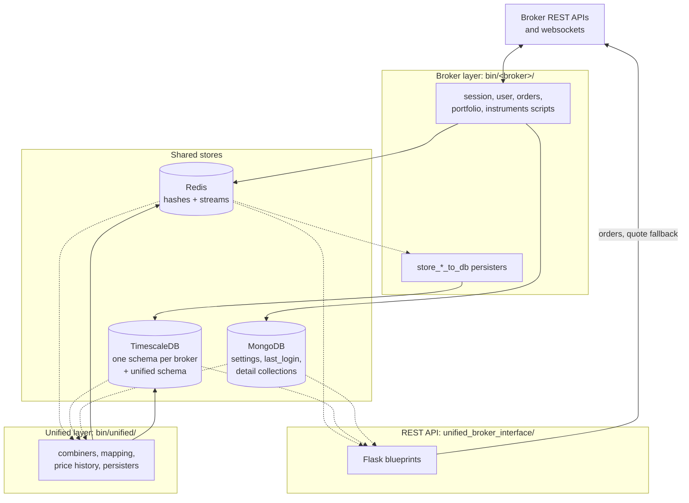

# Architecture

The system is built as three independent layers sitting over three shared data stores. The bottom layer talks to the brokers, the middle layer combines what the brokers said into one view, and the top layer serves that view over HTTP. The layers never call each other; each one reads what the layer below it left in Redis or TimescaleDB, and writes its own results there.

A useful way to picture it is a newsroom. Ten reporters (the broker scripts) each file raw copy in their own language onto their own spike (a Redis Stream). An editor (the unified layer) reads every spike, translates, picks the best version of each story and pins it on one board (a Redis hash). Readers (your program, through the REST API) only ever look at the board. The archive clerk (a persister) reads the same spikes independently and files everything into the archive (TimescaleDB).

## One tick through the system

The animation below follows a single price update from a broker's server to your program. The orange dot is the tick on its way to the API. The blue dot is the same tick being archived, which happens in parallel and never delays the orange one.

<figure class="diagram">
--8<-- "docs/assets/diagrams/layers.svg"
<figcaption>The orange dot is one tick travelling from the broker's websocket to GET /api/instruments/ltp; the blue dot is the same tick read from the same stream by the persister and copied into TimescaleDB.</figcaption>
</figure>

The numbered steps below describe the same journey in words, with the script and the Redis key at each step.

1. `bin/<broker>/instruments/websocket_quotes` receives the tick on the broker's websocket and decodes it into the [tick shape](contracts.md#the-tick) every broker shares.
2. In one Redis pipeline, it replaces the instrument's entry in the hash `<broker>:quotes:live` and appends the tick to the stream `<broker>:quotes:stream`, which is capped near 1,000,000 entries.
3. `bin/unified/instruments/websocket_quotes` reads all ten brokers' streams as the consumer group `unified`. It resolves the broker's token to a unified instrument, drops ticks outside the trading session and ticks from a broker that does not currently own the instrument, normalizes prices and quantities, and writes the [unified quote](contracts.md#the-unified-quote) into the hash `unified:quotes:live`.
4. `GET /api/instruments/ltp` reads the instrument's entry from `unified:quotes:live`. Only when no fresh quote is there does it ask a broker directly.
5. Separately, `bin/<broker>/instruments/store_quotes_to_db` reads the same stream as the consumer group `persist` and writes the tick into `<broker>.ticks` with `COPY`, a batch at a time.

## The three layers

The diagram below shows the layers and the stores between them. Solid arrows are writes and dashed arrows are reads.

Each layer can run without the others, and each broker's scripts run without any other broker's. If the Zerodha scripts stop, the other nine brokers keep flowing and the unified layer keeps combining them. If the unified layer stops, the broker scripts keep collecting and the persisters keep archiving; the REST API then answers `503` for documents that have gone stale and names the key.

## Which layer may talk to what

The rules below are what keep the layers independent. The table shows, for each part of the system, whether it talks to each other part.

| Part | Brokers | Redis | TimescaleDB | MongoDB |
|---|---|---|---|---|
| Broker scripts, `bin/<broker>/` except persisters | :material-check: the only code that polls or streams from a broker | Writes `<broker>:*` keys and streams | :material-close: never, not even the websocket scripts | Reads `settings`; a login writes `last_login` |
| Broker persisters, `bin/<broker>/*/store_*_to_db` | :material-close: | Reads streams as group `persist` | Writes `<broker>.ticks`, `order_updates`, `positions` | :material-close: |
| Broker downloads, `daily_feed` and `price_history` | :material-check: | `daily_feed` writes `<broker>:instruments:*` | Writes `<broker>.instruments`, `price_history` | Through the login, when one is needed |
| Unified scripts, `bin/unified/` | :material-close: never, with the order engine as the one exception | Reads `<broker>:*`, writes `unified:*` | Reads broker tables, writes `unified.*` | Reads detail collections and `settings` |
| Order engine, `bin/unified/orders/order_engine` | :material-check: places orders, only when `UNIFIED_BROKER_INTERFACE_API_ORDER_PLACEMENT=engine` | Reads intents, writes answers and its caches | Writes `unified.synthetic_order_events` | :material-close: |
| REST API, `unified_broker_interface/` | :material-check: for order routes, and for a quote when no fresh one is cached; it never logs a broker in | Reads `unified:*`, the `last_login` and `settings` hashes | Reads the unified tables | Reads `settings`, writes its own `last_login` document |

The REST API reads a broker's token but never logs a broker in. When a broker refuses a quote request because the session is dead, the API starts that broker's `<broker>-login.service` and moves on to the next broker. [Sessions and logins](sessions.md#what-the-rest-api-does-with-a-dead-session) describes this.

## The three stores

Each store does one job. The table below says what each one holds and why that store was chosen for it.

| Store | Holds | Why this store |
|---|---|---|
| Redis | Current state (the latest quote, order, position and document), the streams that buffer every feed, the instrument caches, locks and counters | Every read route answers from memory, and a stream lets a slow reader fall behind without slowing the writer |
| TimescaleDB | Ticks, order updates, position snapshots, instrument snapshots and price history | Hypertables split the time series into chunks and compress old ones |
| MongoDB | Broker credentials (`settings`), login tokens (`last_login`) and the three detail collections | Each broker needs a different set of credential fields, which suits documents better than columns |

## Where to go next

The pages in this tab go deeper into each part of the design.

-   :material-scale-balance:{ .lg .middle } **Design choices**

    ---

    Why the system is built this way: each decision with its problem, its reasoning and its cost.

    [:octicons-arrow-right-24: Design choices](design-choices.md)

-   :material-file-document-outline:{ .lg .middle } **Data contracts**

    ---

    The four dictionary shapes every broker is converted into, and the shared vocabulary for status, product, order type and validity.

    [:octicons-arrow-right-24: Data contracts](contracts.md)

-   :material-key-chain:{ .lg .middle } **Redis keys and streams**

    ---

    Every key and stream, who writes it, who reads it, and how long it lives.

    [:octicons-arrow-right-24: Redis keys](redis-keys.md)

-   :material-database:{ .lg .middle } **Database**

    ---

    Every schema, table, view and function in TimescaleDB, the DDL rules, and the MongoDB collections.

    [:octicons-arrow-right-24: Database](database.md)

-   :material-login:{ .lg .middle } **Sessions and logins**

    ---

    How each broker logs in, how one token is shared by every process, and the lock that stops two logins racing.

    [:octicons-arrow-right-24: Sessions](sessions.md)

-   :material-pipe:{ .lg .middle } **Data pipelines**

    ---

    Follow market data, orders, positions and instruments stage by stage.

    [:octicons-arrow-right-24: Market data](../pipelines/market-data.md)

