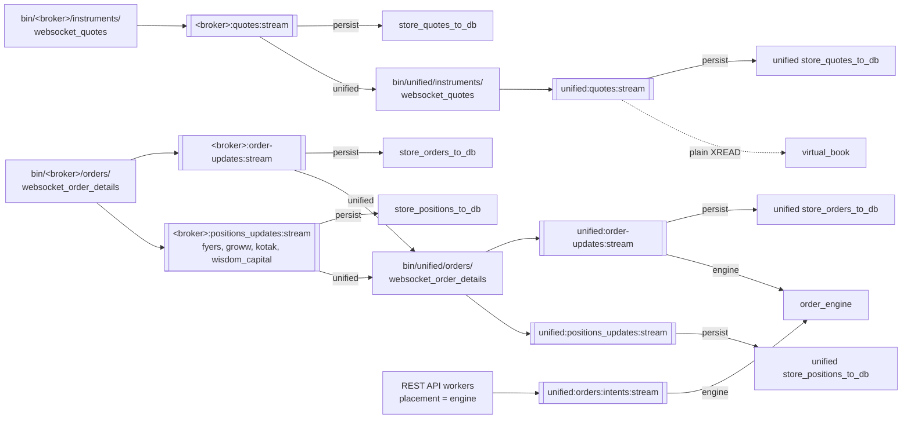
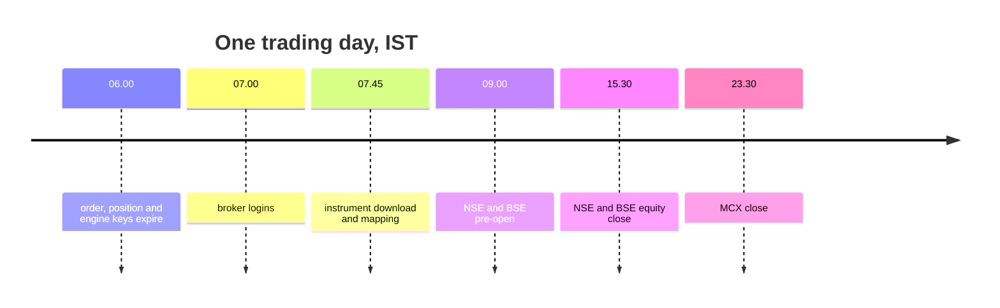

# Redis keys and streams

Redis is where the layers meet. Every broker script writes its results under keys that start with the broker's name, every unified script writes under `unified:`, and the REST API reads almost everything it serves from there. This page lists every key and stream the code uses, who writes it and who reads it.

## How the key names are built

Key names follow one pattern, `<owner>:<subject>:<thing>`, so the name alone says which layer wrote it. The table below explains the prefixes.

| Prefix | Owner | Example |
|---|---|---|
| `<broker>:` | That broker's scripts in `bin/<broker>/` | `zerodha:orders:orders` |
| `unified:` | The unified scripts in `bin/unified/`, the REST API and the order engine | `unified:quotes:live` |
| `ubi:login…` | The cross-process login lock in `stock_brokers/api/utilities/session.py` | `ubi:login:zerodha` |
| no prefix | Shared by every broker, one field per broker | `last_login`, `settings` |

Everything is stored as JSON text, because the Redis client is created with `decode_responses=True`. A hash holds one JSON value per field, and a plain key holds one JSON document.

## Who writes and who reads each stream

Streams are the queues between the layers. The diagram below shows, for every stream, the script that writes it and the consumer groups that read it. Each consumer group receives every entry of its stream, independently of the others.



## Streams

Every stream is trimmed approximately (`MAXLEN ~`) as entries are added, so it holds about its cap and never grows without limit. Entries trimmed before a group read them are lost to that group. The table below lists every stream, the field each entry carries, its cap and its readers.

| Stream | Field | Written by | Cap (about) | Consumer groups |
|---|---|---|---:|---|
| `<broker>:quotes:stream`, all ten brokers | `tick` | `bin/<broker>/instruments/websocket_quotes` | 1,000,000 | `persist`: `bin/<broker>/instruments/store_quotes_to_db`; `unified`: `bin/unified/instruments/websocket_quotes` |
| `<broker>:order-updates:stream`, all ten brokers | `update` | `bin/<broker>/orders/websocket_order_details` | 20,000 | `persist`: `bin/<broker>/orders/store_orders_to_db`; `unified`: `bin/unified/orders/websocket_order_details` |
| `<broker>:positions_updates:stream`, for `fyers`, `groww`, `kotak`, `wisdom_capital` | `position` | `bin/<broker>/orders/websocket_order_details` | 20,000 | `persist`: `bin/<broker>/portfolio/store_positions_to_db`; `unified`: `bin/unified/orders/websocket_order_details` |
| `unified:quotes:stream` | `quote` | `bin/unified/instruments/websocket_quotes` | 1,000,000 | `persist`: `bin/unified/instruments/store_quotes_to_db`; also read without a group by `bin/unified/orders/virtual_book` |
| `unified:order-updates:stream` | `update` | `bin/unified/orders/websocket_order_details` | 50,000 | `persist`: `bin/unified/orders/store_orders_to_db`; `engine`: `bin/unified/orders/order_engine` |
| `unified:positions_updates:stream` | `position` | `bin/unified/orders/websocket_order_details` | 50,000 | `persist`: `bin/unified/portfolio/store_positions_to_db` |
| `unified:orders:intents:stream` | `intent` | REST API workers, when `UNIFIED_BROKER_INTERFACE_API_ORDER_PLACEMENT=engine` | 10,000 | `engine`: `bin/unified/orders/order_engine` |

The caps come from `STREAM_MAX_LENGTH` in each writer, and `QUOTES_STREAM_MAX_LENGTH` in `bin/unified/instruments/websocket_quotes`. Where each group starts reading the first time differs:

- Every `persist` group is created at the start of its stream, so a persister's first run archives everything already there.
- The `unified` group on the broker quote streams is created at the end, because a live quote cache has no use for history. The `unified` group on the order and position streams starts at the beginning.
- The order engine's `engine` group starts at the beginning of the intent stream, because an intent written while the engine was down is an order somebody is still owed an answer for, and at the end of the order update stream, because older updates are about orders placed before the engine existed.

To see how far a group has fallen behind, ask Redis for the stream's groups.

```bash
redis-cli XINFO GROUPS zerodha:quotes:stream
```

## Per-broker keys

Each broker's scripts write the keys below, with the broker's name in place of `<broker>`. Not every broker has every key; the notes column says which do not.

| Key | Type | Written by | Read by | Notes |
|---|---|---|---|---|
| `<broker>:session:status` | string | `bin/<broker>/session/connect` and `disconnect` | People and the login units' logs | `{"status", "access-token", "last_login"}`, replaced on every run |
| `<broker>:user:details` | string | `bin/<broker>/user/details` | `bin/unified/user/details` | Kotak has no profile endpoint, so `KotakAPI` writes `kotak:user:details` itself when it logs in |
| `<broker>:quotes:live` | hash | `bin/<broker>/instruments/websocket_quotes` | Nothing in the pipeline; it is for looking a tick up by hand | The latest [tick](contracts.md#the-tick) per instrument, keyed by its name; not cleared at start |
| `<broker>:quotes:instruments` | hash | `bin/<broker>/instruments/websocket_quotes` | People | Every subscribed token and its name; replaced whole at start |
| `<broker>:quotes:subscriptions` | set | You, with `redis-cli SADD` | `bin/<broker>/instruments/websocket_quotes` | The instruments to subscribe to; Zerodha has none, because its feed subscribes to the whole instrument master |
| `<broker>:instruments:master` | hash | `bin/<broker>/instruments/daily_feed` | Zerodha's, INDmoney's and Stoxkart's `websocket_quotes`; `bin/stoxkart/portfolio/positions` | The day's instrument master, one row per instrument as a JSON array |
| `<broker>:instruments:master:staging` | hash | `bin/<broker>/instruments/daily_feed` | Nothing | Built first, then renamed over the master, so a reader never sees half a file |
| `<broker>:instruments:master:previous` | hash | `bin/<broker>/instruments/daily_feed` | Nothing | The previous master, unlinked once the swap is done |
| `<broker>:instruments:meta` | string | `bin/<broker>/instruments/daily_feed` | The same readers as the master | `download_date`, `rows`, `columns` (the order the arrays follow) and `written_at` |
| `<broker>:orders:orders` | hash | `bin/<broker>/orders/api_order_details` and `websocket_order_details`, through one Lua merge script | `bin/unified/orders/api_order_details`; the REST API's modify, cancel and flatten routes; the order engine | One entry per order: `{"observed_at", "source", "order", "data"}`; expires at the next 06:00 IST |
| `<broker>:orders:orders:polled_at` | string | `bin/<broker>/orders/api_order_details` | `bin/unified/orders/api_order_details`; the order engine's recovery | When the book was last read, so an empty book can be told apart from a stopped poller |
| `<broker>:orders:trades` | string | `bin/<broker>/orders/api_trade_details` | `bin/unified/orders/api_trade_details` | The day's trades |
| `<broker>:portfolio:positions` | hash | `bin/<broker>/portfolio/positions`, and the order update socket for the four brokers that stream positions | `bin/unified/portfolio/positions`; the REST API's flatten route | One entry per position: `{"observed_at", "source", "position", "data"}`; expires at the next 06:00 IST |
| `<broker>:portfolio:positions:polled_at` | string | `bin/<broker>/portfolio/positions` | `bin/unified/portfolio/positions` | When the positions were last read |
| `<broker>:portfolio:holdings` | string | `bin/<broker>/portfolio/holdings` | `bin/unified/portfolio/holdings` | The broker's holdings |
| `<broker>:portfolio:funds` | string | `bin/<broker>/portfolio/funds` | `bin/unified/portfolio/funds` | `{"timestamp", "status", "code", "data"}` |
| `wisdom_capital:session:marketdata:lock` | string | `WisdomCapitalAPI` | `WisdomCapitalAPI` | The pid of the process logging in to Wisdom Capital's market data API; expires after 120 seconds |

## Shared hashes

Two hashes hold one field per broker and are read by every layer. They carry credentials and tokens, so treat Redis as holding secrets.

| Key | Type | Written by | Read by |
|---|---|---|---|
| `last_login` | hash, one field per `broker_name` | Every broker login, after it writes MongoDB; the REST API's connect and disconnect; `bin/unified/session/*`. `BrokerAPI._current_login` fills an empty field from MongoDB with `HSETNX`, so it can never overwrite a newer login. | `BrokerAPI._current_login` on every broker request; the REST API's token check and order routes; the order engine |
| `settings` | hash, one field per `broker_name` | `BrokerAPI.__init__`, which copies the broker's MongoDB `settings` document every time a broker class is constructed | The REST API's order routes and the order engine, which need each broker's keys to build an order request |

## Login lock keys

`ensure_session` keeps three keys per broker so that only one process logs a broker in at a time and failed logins are not retried too often. [Sessions and logins](sessions.md#one-login-at-a-time-across-processes) explains how they are used.

| Key | Type | Holds | Lifetime |
|---|---|---|---|
| `ubi:login:<broker>` | string | The pid of the process logging the broker in | Set with `NX` and expires after 300 seconds; deleted when the login ends, or earlier when its holder has died |
| `ubi:login-attempt:<broker>` | string | Epoch of the last login attempt | Kept |
| `ubi:login-ok:<broker>` | string | Epoch of the last confirmed working session | Kept |

## Unified keys

The unified scripts, the REST API and the order engine write the keys below. They fall into four groups: the instrument mapping, market data, orders and portfolio, and the smaller documents.

### Instrument mapping

`bin/unified/instruments/map` writes the day's mapping into Redis after it has written the unified tables. The four hashes are built under `:staging` keys and swapped in together with the meta key, so a reader sees yesterday's complete cache or today's, never a mix.

| Key | Type | Holds | Read by |
|---|---|---|---|
| `unified:instruments` | hash | Every instrument mapped on the date, keyed by `instrument_id`, each a JSON array in the column order the meta key gives | Unified quote, order, trade, holding and position combiners |
| `unified:broker_mappings` | hash | The date's mappings keyed `broker:instrument_id`, each `[broker_token, broker_symbol, order_symbol, lot_size, tick_size]` | `bin/unified/instruments/websocket_quotes`, to turn a Fyers symbol into its token |
| `unified:broker_tokens` | hash | The reverse lookup, keyed `broker:broker_token`, each a list of the instrument ids that token names | Every unified combiner that resolves a broker token |
| `unified:instrument_symbols` | hash | Securities by symbol, keyed `segment:SYMBOL`, for brokers that send no token | Order, trade, holding and position combiners |
| `unified:mapping:meta` | string | `mapping_date`, the four counts, `columns` and `written_at` | Every reader of the four hashes |

The same run warms the REST API's instrument catalogue under `unified:catalogue:`, and clears every other date's keys there. The table below lists those keys, where `<date>` is the ISO mapping date.

| Key | Type | Holds |
|---|---|---|
| `unified:catalogue:current_date` | string | The latest warmed mapping date |
| `unified:catalogue:warm_identifier` | string | A value that changes on every warm, so a process holding catalogue data in memory knows when to drop it |
| `unified:catalogue:<date>:identity` | hash | Each instrument's identity, by instrument id |
| `unified:catalogue:<date>:tokens:<broker>` | hash | One broker's tokens, by broker token |
| `unified:catalogue:<date>:order_handles` | hash | What each broker needs to place an order on the instrument, by instrument id |
| `unified:catalogue:<date>:contract_sizes` | hash | The day's contract size decision for currency and commodity derivatives, by instrument id |
| `unified:catalogue:<date>:additional_attributes` | hash | Extra broker attributes, kept apart so the order path stays small |
| `unified:catalogue:<date>:segments` | hash | How many instruments each segment has |
| `unified:catalogue:<date>:catalogue:<segment>` | sorted set | One segment's instruments in name order |
| `unified:catalogue:<date>:names:<segment>` | sorted set | One segment's distinct names, which the search scans |
| `unified:catalogue:<date>:seen` | hash | Each instrument's first and last seen dates |

### Market data

The unified quote combiner, the REST API and the price history job write these keys.

| Key | Type | Written by | Read by | Notes |
|---|---|---|---|---|
| `unified:quotes:live` | hash | `bin/unified/instruments/websocket_quotes` | The REST API's `ltp`, `ohlc` and `quote`; `bin/unified/portfolio/holdings` and `positions`; the order engine | One [unified quote](contracts.md#the-unified-quote) per `instrument_id`; quotes stale for a week are removed |
| `unified:quotes:fetched` | hash | The REST API | The REST API | Quotes fetched from a broker when no fresh one was cached; each field expires after two days |
| `unified:quotes:stats` | string | `bin/unified/instruments/websocket_quotes` | People | Counts: received, unresolved, out_of_session, not_owner, no_price, duplicate, written |
| `unified:quotes:unresolved` | hash | `bin/unified/instruments/websocket_quotes` | People | A count per `broker:token:reason` that did not resolve |
| `unified:prices:last_run` | string | `bin/unified/instruments/price_history` | The REST API's candle cache | What the last run did and when it finished |
| `unified:prices:cache:<instrument_id>:<interval>:<basis>:<known_as_of>` | string | The REST API | The REST API | One candle series already read from the database; `<known_as_of>` is `latest` when not given; expires after a day |

### Orders and portfolio

The combiners rewrite each document every half second, except where noted.

| Key | Type | Written by | Read by | Notes |
|---|---|---|---|---|
| `unified:orders:orders` | string | `bin/unified/orders/api_order_details` | `GET /api/orders/details` | Every broker's orders in one document |
| `unified:orders:trades` | string | `bin/unified/orders/api_trade_details` | `GET /api/orders/trades` | Every broker's trades |
| `unified:order-updates` | hash | `bin/unified/orders/websocket_order_details` | The order engine's square-off | Latest update per order, keyed `broker:order_id`; expires at the next 06:00 IST |
| `unified:positions_updates` | hash | `bin/unified/orders/websocket_order_details` | People | Latest streamed position, keyed `broker:position_key`; expires at the next 06:00 IST |
| `unified:portfolio:positions` | string | `bin/unified/portfolio/positions` | `GET /api/portfolio/positions`; the order engine | Every broker's positions |
| `unified:portfolio:holdings` | string | `bin/unified/portfolio/holdings` | `GET /api/portfolio/holdings` | Holdings, combined and priced; rewritten every minute |
| `unified:portfolio:funds` | string | `bin/unified/portfolio/funds` | `GET /api/portfolio/funds`; the engine's daily loss check | Every figure summed across brokers |

### Details, profiles and the session

The smaller documents are refreshed every minute or written once per login.

| Key | Type | Written by | Read by |
|---|---|---|---|
| `unified:user:details` | string | `bin/unified/user/details`, from every `<broker>:user:details` | `GET /api/users/details` |
| `unified:details:users` | string | `bin/unified/user/unified_details`, from MongoDB `user_details` | `GET /api/users/details` |
| `unified:details:brokers` | string | `bin/unified/brokers/unified_details`, from MongoDB `broker_details` | `GET /api/brokers/details` |
| `unified:details:exchanges` | string | `bin/unified/exchanges/unified_details`, from MongoDB `exchange_details` | `GET /api/exchanges/details` |
| `unified:session:status` | string | `bin/unified/session/connect` and `disconnect` | People |

## Order engine keys

The order engine and the REST API's order routes share the keys below. The engine's own caches are rebuilt from `unified.synthetic_order_events` on start, so losing them costs a slower start rather than a lost order.

| Key | Type | Written by | Read by | Lifetime |
|---|---|---|---|---|
| `unified:orders:round_robin` | string (counter) | The round-robin broker selector, with `INCR` on each order | The same selector | Kept |
| `unified:orders:daily_count:<broker>` | string (counter) | Every placement, modification and cancellation sent to a broker with a daily cap, from an API worker or the engine | The same code, before sending | Expires at the next 06:00 IST |
| `unified:orders:engine:lock` | string | `bin/unified/orders/order_engine` | A second engine, which then exits | The engine's pid; 30 seconds, refreshed every 10 |
| `unified:orders:intents:result:<intent_id>` | list | The order engine, with `RPUSH` | The waiting API worker, with `BLPOP` | `UNIFIED_BROKER_INTERFACE_API_ORDER_ENGINE_RESULT_TTL_SECONDS`, 300 by default |
| `unified:orders:parents` | hash | The order engine | The engine and `bin/unified/orders/virtual_book` | Every parent order, by id; expires at the next 06:00 IST |
| `unified:orders:parents:open` | set | The order engine | The engine and `virtual_book` | The ids of parents not yet finished; expires at the next 06:00 IST |
| `unified:orders:children` | hash | The order engine | The engine | `broker:broker_order_id` to its parent; expires at the next 06:00 IST |
| `unified:orders:virtual_queue` | hash | `bin/unified/orders/virtual_book` | The engine's `virtual_limit` orders | One queue estimate per held order, by parent id; removed when the parent is no longer open |

!!! danger "Do not delete the engine lock by hand while an engine runs"
    `unified:orders:engine:lock` is what stops two engines reading the same intents. Two engines would each hold pending intents and could place the same order twice, with real money behind both.

## Why so many keys expire at 06:00 IST

The order and position hashes, the engine's caches and the daily order counts all expire at the next 06:00 IST, and every write moves the expiry forward to the next 06:00. That time sits between the end of the evening commodity session and the next morning's logins, so yesterday's orders stay readable overnight and the first write of the day starts afresh. The timeline below shows where 06:00 falls in the day.


