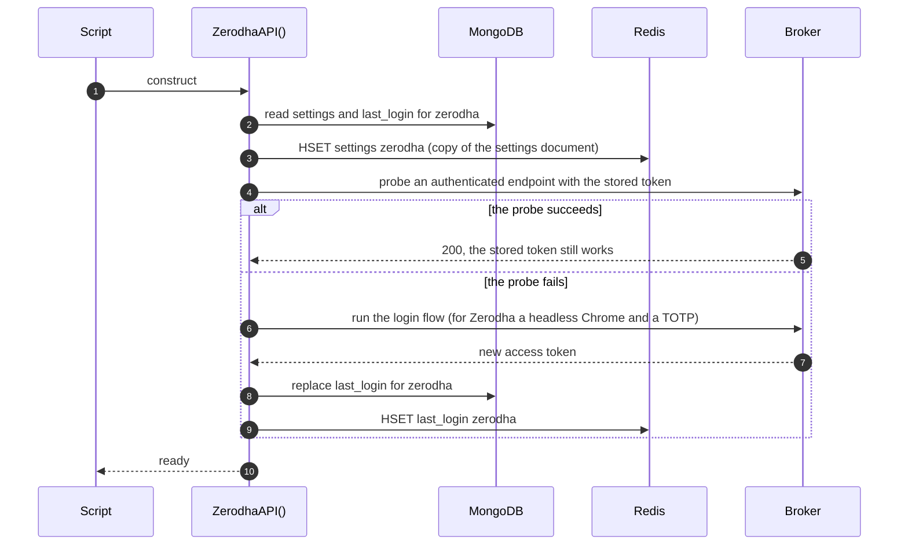
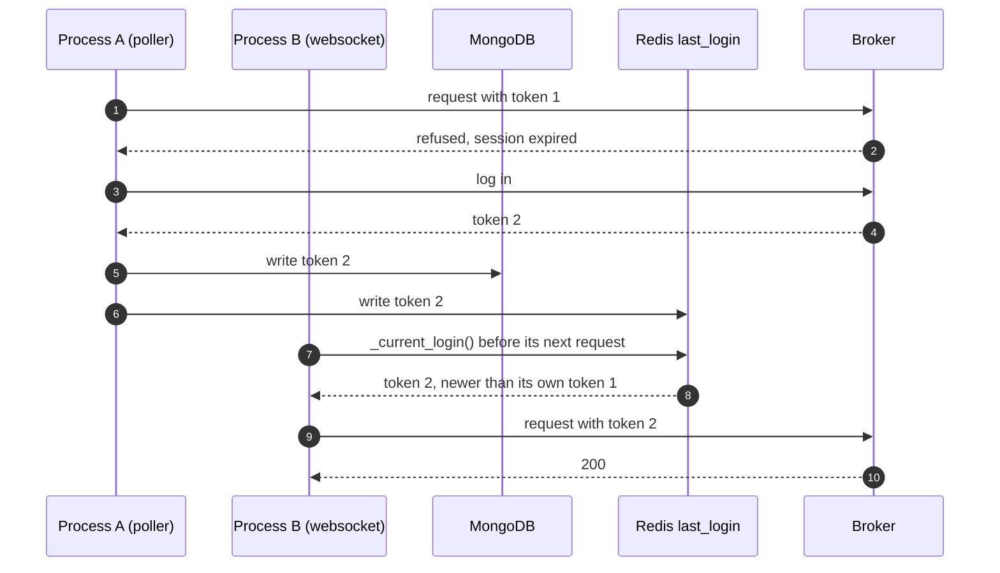
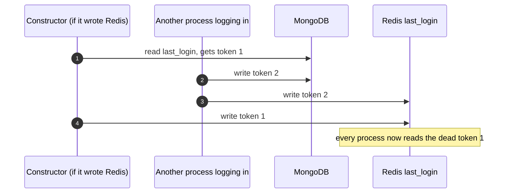
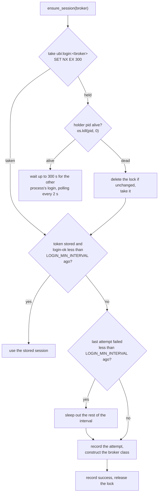
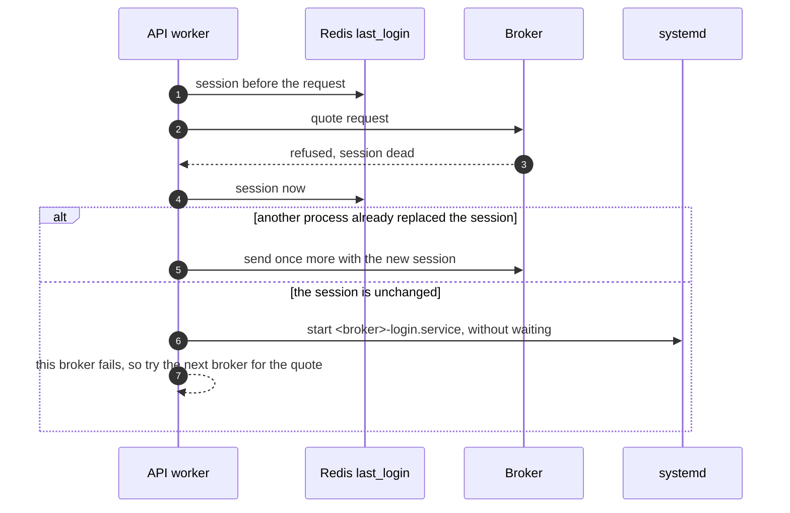

# Sessions and logins

Every broker hands out an access token when you log in, and every request after that carries the token. The tokens last about a day, some brokers allow only one at a time, and several brokers can only be logged in by a program that drives a real browser and types a one-time code. This page explains how the project gets a token for each broker, how many processes share one token without stepping on each other, and how the REST API's own token works.

The short version is in three rules, each explained below:

1. **Try the stored token first.** A broker class logs in only when a request with the stored token fails.
2. **One shared record.** A login writes MongoDB first and the Redis hash `last_login` second, and every request reads the token from Redis, so a token obtained by any process is used by all of them.
3. **One login at a time.** Logins that might race go through a Redis lock, and web requests never log in at all.

## How a broker class gets a session

Each broker has one class in `stock_brokers/api/<broker>.py`, a subclass of [`BrokerAPI`][stock_brokers.api.base.BrokerAPI]. Constructing it is what logs in. The sequence below shows what the constructor does.

The probe is cheap, one HTTP request, so the common case where the morning's token is still good costs almost nothing. The real login runs only when the probe fails.

For eight brokers, any failure of the probe leads to a login, even a network timeout. Two brokers are more careful:

- **Stoxkart** logs in only when the probe is refused as unauthorized (the codes `AuthorizationError`, `401` or `Invalid Session`). Any other error is raised, so an outage is not mistaken for an expired session.
- **Wisdom Capital** treats a rate-limit refusal as proof the token works, because its rate limiter runs only after a request has authenticated. For its market data token, a failure that does not name the session is read as "cannot tell" and the token is kept, because minting a new one would invalidate the token the live feed holds.

## How each broker logs in

The login flows differ widely. Seven brokers log in with plain HTTP requests and a TOTP code computed from the stored seed. Two drive a headless Chrome through Selenium. Wisdom Capital needs neither. The table below summarizes every flow from its broker class.

| Broker | Probe with the stored token | Login flow | Browser | TOTP |
|---|---|---|:-:|:-:|
| Dhan | `GET /v2/profile` | `POST auth.dhan.co/app/generateAccessToken` with the client id, PIN and TOTP | | :material-check: |
| Flattrade | `POST /PiConnectAPI/UserDetails`, which must answer `stat` `Ok` | A session id, then `ftauth` with the user name, a SHA-256 of the password, the API key and the TOTP, then `trade/apitoken` with a SHA-256 of key, code and secret | | :material-check: |
| Fyers | `GET /api/v3/profile` | Five steps: send a login OTP request, verify the TOTP, verify the PIN, obtain an auth code, exchange it at `validate-authcode` | | :material-check: |
| Groww | `GET /v1/user/detail` | `POST /v1/token/api/access` with the stored `totp_token` as bearer and the TOTP | | :material-check: |
| INDmoney | `GET /user/profile` | `POST /generate/token` with the MPIN and the TOTP | | :material-check: |
| Kotak | `GET /quick/user/positions` on the session's stored host | `tradeApiLogin` with the mobile number, UCC and TOTP, then `tradeApiValidate` with the MPIN; stores `sid` and the assigned `base_url` | | :material-check: |
| Shoonya | `POST /NorenWClientAPI/UserDetails`, which must answer `stat` `Ok` | A headless Chrome fills the user id, password and TOTP on the OAuth page, then `GenAcsTok` exchanges the code with a SHA-256 checksum | :material-check: | :material-check: |
| Stoxkart | `GET /funds` | Three steps: `/auth/v2/login` with the password, `/auth/v2/twofa/verify` with the TOTP, then `/auth/token` with an HMAC-SHA256 signature | | :material-check: |
| Wisdom Capital | `GET /interactive/user/balance`, and `GET /apimarketdata/config/clientConfig` for market data | Two separate sessions, each `appKey` and `secretKey` posted to its own login endpoint | | |
| Zerodha | `GET /user/profile` | A headless Chrome fills the user id and password, then the TOTP, on Kite's login page; the request token is exchanged at `/session/token` with a SHA-256 checksum | :material-check: | :material-check: |

A few flows have details that explain odd-looking code:

- **Fyers and Stoxkart wait for a fresh TOTP.** Fyers refuses a code verified within about three seconds of the 30-second boundary, so the class waits past the boundary first. Stoxkart waits when fewer than five seconds remain.
- **Kotak assigns each session its own API host.** A call to any other host is refused even with a valid token, so the login stores the host as `base_url` and every request builds its URL from it. Kotak also has no profile endpoint, so a login writes the account's profile to `kotak:user:details` itself.
- **Wisdom Capital splits trading and market data** into two applications with separate credentials and tokens. The trading token is checked with the balance endpoint rather than the profile endpoint, because the broker allows only about one profile call a day. Its market data login is taken under the Redis lock `wisdom_capital:session:marketdata:lock`, because a second market data login invalidates the first token. A failed market data login is recorded, not raised, so the order and position pollers, which need only the trading token, keep working.
- **Wisdom Capital keeps a browser login switched off.** The class still contains an older Selenium flow, used only when `_USE_LEGACY_LOGIN` is true, and it is `False`.

## One token shared by every process

Many processes use one broker's token at the same time: the pollers, the websockets, the candle downloader and the REST API's workers. If each process kept the token it loaded when it started, a login by any one of them would leave the others sending a dead token.

Instead, every request reads the login in force through `BrokerAPI._current_login`. It reads the broker's field of the Redis hash `last_login` on every call, compares it with the login the object already holds, and keeps the newer of the two by its `last_login` time. When either time cannot be read, it trusts Redis. When Redis holds nothing for the broker, it reads MongoDB and fills Redis with `HSETNX`, which writes only if the field is still empty, so it can fill the cache but never overwrite a login that lands in between.

The sequence below shows two processes sharing one token. Process B never logs in, yet its next request uses the token process A just obtained.

### Why a constructor never writes the token

`BrokerAPI.__init__` reads `last_login` from MongoDB but deliberately does not copy it into Redis. Only a login writes the Redis hash. The sequence below shows the race that rule prevents: a process that read MongoDB just before another process logged in, and wrote Redis just after, would put the old token back for everyone.

A login therefore always writes MongoDB first and Redis second. MongoDB is the record, and Redis is the copy every request reads.

## One login at a time across processes

Two problems remain when several processes might log in on their own. At Zerodha, a second login invalidates the first token, so two processes logging in together leave one of them holding a token that is already dead. And several brokers log in through a headless Chrome and a TOTP; under `Restart=always`, a broker outage could mean a full login every time a service restarts, which is how an account gets locked.

[`ensure_session`][stock_brokers.api.utilities.session.ensure_session] in `stock_brokers/api/utilities/session.py` solves both. It is used by the candle downloaders through `BrokerCandles` in `stock_brokers/instruments/historical/`, and by INDmoney's instrument ingester when no usable token is stored. It keeps three Redis keys per broker.

| Key | Holds | Purpose |
|---|---|---|
| `ubi:login:<broker>` | The pid of the process logging in | The lock, taken with `SET NX` and a 300-second expiry |
| `ubi:login-attempt:<broker>` | Epoch of the last login attempt | Spaces out retries after a failure |
| `ubi:login-ok:<broker>` | Epoch of the last confirmed working session | Lets a recent success be used at once |

Two separate markers are needed because the usual outcome is that the stored token was already good: the class only probed it, and nothing new was written to `last_login`. Without a success marker, that outcome could not be told apart from a failed attempt.

The diagram below shows the decisions `ensure_session` makes.

The details behind each branch are as follows:

- **The floor between attempts** is `UNIFIED_BROKER_INTERFACE_LOGIN_MIN_INTERVAL`, 300 seconds by default. It lives in Redis rather than in the process, so it holds however often a service is restarted. `force=True` skips it, for a deliberate manual login.
- **A dead holder is released at once.** Everything that takes the lock runs on this machine, so the holder's liveness is checked with signal 0. The lock is deleted only if it still holds the same pid, so a lock taken between the check and the delete is not stolen. Without this, restarting a service in the middle of a login would look like a five-minute hang.
- **Waiting for another process** succeeds as soon as the stored login is newer than the moment the wait began, or the lock is gone and a usable token is stored. It gives up after 300 seconds.

!!! note "Zerodha's candle downloader goes straight to `ZerodhaAPI`"
    `bin/zerodha/instruments/price_history` logs in through `ZerodhaAPI` rather than through `ensure_session`, so that a refusal caused by another process's login is recovered without a second login: the class probes with the newest stored token first.

## Zerodha allows one token at a time

At Zerodha every login invalidates the previous token. That fact shapes several parts of the code:

- **The websocket sockets share one session object.** `ZerodhaSession` in `stock_brokers/websockets/zerodha.py` logs in again only when the token in force is still the one that failed. If another socket or another process has already replaced it, the socket simply reconnects with the new token.
- **`bin/check-services` never starts a login unit.** Its docstring gives the reason: starting a login service logs in to a live account, and at Zerodha that invalidates the token every running script holds.
- **The REST API never logs in**, as the next section explains.

## What the REST API does with a dead session

A web request must never set off a login. A passing probe failure inside a gunicorn worker would start a Selenium login in the web server, and a second Zerodha login would knock out every other process's token.

So the API builds broker clients without running the constructor's probe: only `BrokerAPI.__init__` runs, which reads the settings and the login. Every request still goes through `_current_login()`. When a broker refuses a request because the session is dead, `relogin` in `unified_broker_interface/utilities/broker_quotes/utilities/clients.py` decides what happens next, as the sequence shows.

systemd runs one instance of a unit at a time, so any number of refusals in any number of workers start at most one login. The login script probes the stored session before it logs in, so a login requested after another process refreshed the session changes nothing. A worker asks at most once every five minutes per broker.

## The daily login

```mermaid
gantt
    title Morning in IST
    dateFormat HH:mm
    axisFormat %H:%M
    section Logins
    Ten login timers fire at random within 30 minutes :07:00, 30m
    section Instruments
    Download and map every master :07:45, 45m
    section Market
    NSE and BSE pre-open :09:00, 15m
```

Each broker has a `<broker>-login.timer` that runs `bin/<broker>/session/connect` at 07:00 IST every day, weekends included. That is before the 07:45 instrument download and the 09:00 pre-open. The timeline below shows the morning.

Each timer adds up to 30 minutes of random delay (`RandomizedDelaySec=1800`), so the ten logins do not fire in the same second, and every one still lands before the instrument download. A login service is tried up to three times an hour, two minutes apart, and each attempt may take up to 300 seconds. A machine that was off at 07:00 does not catch up; the first script to find its token refused logs in then. [Daily schedule](../operations/schedule.md) shows the whole day.

The connect script writes the outcome to `<broker>:session:status` and exits `1` on failure, so systemd retries it. Nothing has to be restarted after a login, because every script reads the current token on its next request.

## The REST API's own token

The REST API has its own login, separate from the brokers'. A client exchanges the `api_key` and `api_secret` of the `unified_broker_interface` settings document for an access token with `POST /api/session/connect`. The token is stored exactly the way a broker's login is: a `last_login` document with `broker_name` `unified_broker_interface`, written to MongoDB first and mirrored into the Redis `last_login` hash second. If the Redis write fails, the field is deleted instead, so the next read falls back to MongoDB rather than trusting a token that has since been replaced.

There is one token for the whole application. A connect returns the token in force when it was issued at or after the most recent 07:00 and has not expired or been revoked; otherwise it issues a new one, which ends every other client's session. `bin/unified/session/connect` does the same from a terminal, except that it always issues a new token. [Session](../rest-api/session.md#how-the-token-lives-and-dies) describes the routes and the token's life in full.
