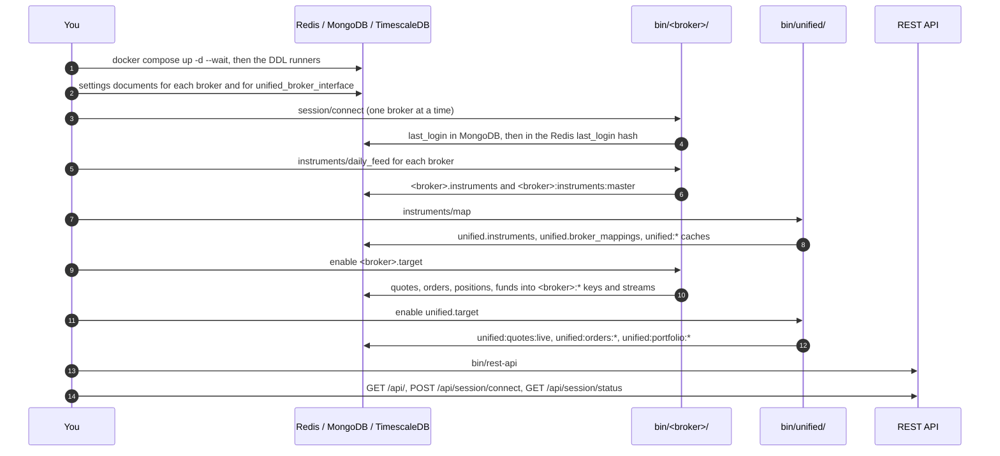

# First run

This page brings the whole system up for the first time, in the order it has to happen. It assumes you have finished [Installation](installation.md) and written the settings described in [Configuration](configuration.md).

## Why the order matters

Every layer reads what the layer before it wrote, so a service started too early simply has nothing to read. A broker's scripts need a login token before they can connect. The unified quote combiner needs the day's instrument mapping before it can resolve a single tick. The REST API needs the unified documents before its read routes can answer. The sequence below shows the order and what each step hands to the next.



## The checklist

The checklist below is the whole first run in one place. Each item has its own section further down.

- [ ] The three stores are up and healthy
- [ ] The three DDL runners have been applied
- [ ] Every broker you use has a `settings` document, and so does `unified_broker_interface`
- [ ] The detail collections are loaded with `bin/import-api-details`
- [ ] Each broker has logged in once with `bin/<broker>/session/connect`
- [ ] The day's instrument masters are downloaded and mapped
- [ ] Each broker's target is enabled
- [ ] The unified target is enabled
- [ ] The REST API answers `GET /api/`
- [ ] You have an access token and `GET /api/session/status` says `connected`

## 1. Start the data stores

The stores come first, because every other step reads or writes them. The compose file and the data folders are described on [Installation](installation.md#3-start-the-data-stores).

```bash
docker compose up -d --wait
docker compose ps
```

## 2. Create the tables

The three runners create every table except the live stream tables, which their own scripts create when they start. Run them in this order.

```bash
.venv/bin/python -m stock_brokers.instruments.sql.apply_ddl
.venv/bin/python -m stock_brokers.instruments.mapping.utilities.sql.apply_ddl
.venv/bin/python -m stock_brokers.instruments.historical.utilities.sql.apply_ddl
```

## 3. Store the credentials and the detail collections

Write one `settings` document per broker, with the fields listed in [Configuration](configuration.md#the-settings-documents), and one for `unified_broker_interface` holding the REST API's `api_key` and `api_secret`. Then load the detail collections.

```bash
bin/import-api-details /path/to/exports
```

## 4. Log each broker in

Each broker has a script that logs in and records the outcome. It constructs the broker's API class, which first tries the stored token and only runs the real login when that fails, and then makes one more authenticated request so that success means a session that has actually been used.

```bash
bin/zerodha/session/connect
redis-cli GET zerodha:session:status
```

The script writes one JSON object to `<broker>:session:status`, replacing it on every run. It exits `0` when the session works and `1` when the login, the check or the Redis write fails.

```json
{"status": "success", "access-token": "<token>", "last_login": "2026-09-14 08:30:02.123456"}
```

!!! warning "Each connect logs in to a live broker account"
    These scripts log in to real trading accounts. They place no orders, but several brokers log in by driving a headless Chrome and consuming a TOTP code, and at Zerodha every new login invalidates the token that every other running process holds. Run each broker once, and do not run them in a loop. From now on the `<broker>-login.timer` units log every broker in at 07:00 IST each day.

You do not have to restart anything after a login. Every broker class reads the current token on every request, so a token obtained by any process is used by all of them. [Sessions and logins](../architecture/sessions.md) explains how.

## 5. Download and map the day's instruments

The unified layer names every instrument by its own `instrument_id`, which the daily mapping computes from every broker's instrument master. Nothing downstream can resolve a tick, an order or a position until that mapping exists for the day.

The simplest way is to run the daily job, which downloads each broker's master and then maps them all.

```bash
systemctl --user start unified-mapping
journalctl --user -u unified-mapping -f
```

The job runs `bin/<broker>/instruments/daily_feed` for all ten brokers and then `bin/unified/instruments/map`. A broker whose file does not arrive does not stop the others, because the mapping skips a broker with no rows stored for the date. The unit's own comment puts the whole job at about three quarters of an hour. Only INDmoney's download needs a broker login; the other nine download public files.

If the unit is not installed yet, the same steps can be run by hand.

```bash
bin/zerodha/instruments/daily_feed
bin/dhan/instruments/daily_feed
# ... one per broker
bin/unified/instruments/map
redis-cli GET unified:mapping:meta
```

From now on `unified-mapping.timer` runs the job at 07:45 IST every day.

## 6. Start the broker services

Each broker's long-running scripts run under systemd, grouped by one target per broker. Enabling the target and its units starts the quote feed, the order and position pollers, the order update websocket and the persisters. Each target file's header lists the exact units to enable; [Services](../operations/services.md#installing-the-units) walks through it. The commands below are the ones in `services/zerodha/zerodha.target`.

```bash
systemctl --user link ~/Projects/unified_broker_interface/services/zerodha/*
systemctl --user daemon-reload
systemctl --user enable --now zerodha.target zerodha-login.timer \
    zerodha-instruments@websocket_quotes.service zerodha-instruments@store_quotes_to_db.service \
    zerodha-orders@websocket_order_details.service zerodha-orders@store_orders_to_db.service zerodha-orders@api_order_details.service zerodha-orders@api_trade_details.service \
    zerodha-portfolio@positions.service zerodha-portfolio@holdings.service zerodha-portfolio@funds.service \
    zerodha-user@details.service \
    zerodha-historical-prices.service
```

!!! tip "Test after hours with MCX"
    NSE and BSE equity close at 15:30 IST, so an equity feed after hours connects but proves nothing. MCX trades until 23:30 IST, so an MCX future is the instrument to watch in the evening.

## 7. Start the unified services

The unified scripts read only what the broker scripts wrote to Redis and the database, and write the combined documents the REST API serves. The commands below are the ones in `services/unified/unified.target`.

```bash
systemctl --user link ~/Projects/unified_broker_interface/services/unified/*
systemctl --user daemon-reload
systemctl --user enable --now unified.target unified-mapping.timer unified-prices.timer \
    unified-instruments@websocket_quotes.service unified-instruments@store_quotes_to_db.service \
    unified-orders@api_order_details.service unified-orders@api_trade_details.service unified-orders@websocket_order_details.service unified-orders@store_orders_to_db.service \
    unified-portfolio@positions.service unified-portfolio@holdings.service unified-portfolio@funds.service unified-portfolio@store_positions_to_db.service \
    unified-user@details.service unified-user@unified_details.service \
    unified-brokers@unified_details.service \
    unified-exchanges@unified_details.service \
    unified-rest-api.service
```

The order engine is deliberately not in that list. It runs only when the API is configured with `UNIFIED_BROKER_INTERFACE_API_ORDER_PLACEMENT=engine`, and exactly one copy may run.

When everything is started, `bin/check-services` reports every unit that is down and starts the long-running ones.

```bash
bin/check-services --check-only
```

## 8. Start the REST API and make the first calls

`unified-rest-api.service` in the list above runs `bin/rest-api`. To run it by hand instead, start it in a terminal. It serves gunicorn on `127.0.0.1:8080` with two workers of four threads each.

```bash
bin/rest-api          # gunicorn
bin/rest-api --dev    # Flask's development server, for debugging
```

The calls below walk through a first session. Each one needs the previous one to have worked.

1. Check that the API is up. This route needs no token.

    ```bash
    curl http://127.0.0.1:8080/api/
    ```

    ```json
    {"message": "Welcome to the Unified Broker Interface API"}
    ```

2. Exchange the key and secret for the day's access token. The values are the `api_key` and `api_secret` of the `unified_broker_interface` settings document.

    ```bash
    curl -X POST http://127.0.0.1:8080/api/session/connect \
         -H "api-key: $API_KEY" -H "api-secret: $API_SECRET"
    ```

    ```json
    {"access-token": "5b0c9d0e-8f7a-4c35-9a53-2f4f0f4f7a61", "expires_at": "2026-09-27 07:00:00.000000"}
    ```

3. Confirm the session.

    ```bash
    curl http://127.0.0.1:8080/api/session/status -H "access-token: $ACCESS_TOKEN"
    ```

    ```json
    {"status": "connected", "expires_at": "2026-09-27 07:00:00.000000"}
    ```

4. Search for an instrument, which proves the mapping and its cache are in place.

    ```bash
    curl "http://127.0.0.1:8080/api/instruments/search?exchange=nse&segment=equities&q=RELIANCE" \
         -H "access-token: $ACCESS_TOKEN"
    ```

    The answer carries the mapping date and a list of instruments. Each instrument has `instrument_id`, `exchange`, `segment`, `shape`, `symbol`, `underlying_symbol`, `expiry_date`, `strike_price` and `option_type`.

The token in these examples is made up. [Session](../rest-api/session.md) describes the three session routes in full, and [Instruments](../rest-api/instruments.md#search) describes the search.

## When something is missing

A read route answers `503` when the Redis document it serves is missing or stale, and the message names the key. The table below maps the usual first-run gaps to the step that fills them.

| Symptom | Step that fixes it |
|---|---|
| An import fails before any script output | The `.env` file is missing a port or the Redis database number (section 2 of [Installation](installation.md#2-write-the-env-file)) |
| `500` with `unified_broker_interface settings are not configured` on connect | The `unified_broker_interface` settings document is missing (step 3) |
| `401` with `Invalid API key or secret` on connect | The headers do not match that document (step 3) |
| Search finds nothing, or the instrument cache is unreachable | The daily mapping has not run (step 5) |
| A `503` naming a `unified:` key | The unified service that writes the key is not running (step 7) |
| `<broker>:session:status` says `failure` | The broker's credentials or TOTP seed are wrong (steps 3 and 4) |
