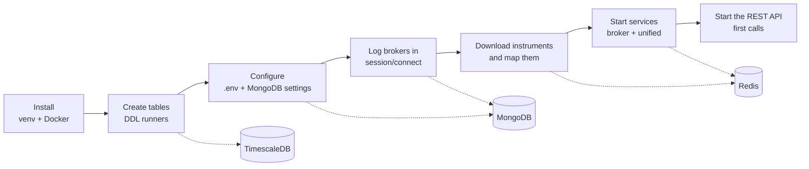

# Get started

This tab takes you from an empty machine to a running API that answers for all ten brokers. It is written for someone who has the broker accounts and wants the system running, and it assumes no knowledge of how the project is built inside.

## What you need before you start

The project runs on one Linux machine. The table below lists what that machine needs, and why each piece is there.

| You need | Why |
|---|---|
| Python 3.14 | The virtual environment in `.venv` is built with it, and every script in `bin/` re-executes itself under `.venv/bin/python` |
| Docker with Compose | `docker-compose.yml` runs Redis, MongoDB and TimescaleDB, so none of them has to be installed on the host |
| Google Chrome and chromedriver | Zerodha and Shoonya log in by driving a headless Chrome through Selenium |
| The TA-Lib C library | The `TA-Lib` package in `requirements.txt` needs it to install |
| Accounts at the brokers you want to use | Every broker script logs in to a real account; there is no sandbox mode |
| Each broker's credentials, stored in MongoDB | The login code reads them from the `settings` collection, one document per broker |
| The repository at `~/Projects/unified_broker_interface` | The systemd unit files point at that path |

!!! warning "These are live trading accounts"
    Every script under `bin/<broker>/` logs in to a real broker account. Logging in is harmless in itself, but at Zerodha each new login invalidates the token that every other running process holds. Read [Sessions and logins](../architecture/sessions.md) before you run logins by hand.

## The path through this tab

Setting the system up happens in a fixed order, because each step needs the one before it. The numbered list below is that order, and each page of this tab covers a part of it.

1. **Install the software.** You create the virtual environment, start the three data stores in Docker, and create the database tables. This is on [Installation](installation.md).
2. **Configure it.** You write the `.env` file that tells every script where the stores are, and you put each broker's credentials into MongoDB. This is on [Configuration](configuration.md).
3. **Bring it up for the first time.** You log each broker in, download the day's instrument lists, start the broker and unified services, start the REST API and make your first calls. This is on [First run](first-run.md).

The diagram below shows the same path, with the stores each step fills.

## The pages

Each card below opens one page of this tab.

-   :material-download:{ .lg .middle } **Installation**

    ---

    The virtual environment, the three Docker containers, the database tables in the right order, the detail collections and the systemd units.

    [:octicons-arrow-right-24: Install it](installation.md)

-   :material-tune:{ .lg .middle } **Configuration**

    ---

    Every environment variable with its default and effect, and the MongoDB documents each broker needs.

    [:octicons-arrow-right-24: Configure it](configuration.md)

-   :material-play-circle:{ .lg .middle } **First run**

    ---

    Bringing everything up for the first time, in order, with a checklist and your first API calls.

    [:octicons-arrow-right-24: Run it](first-run.md)

