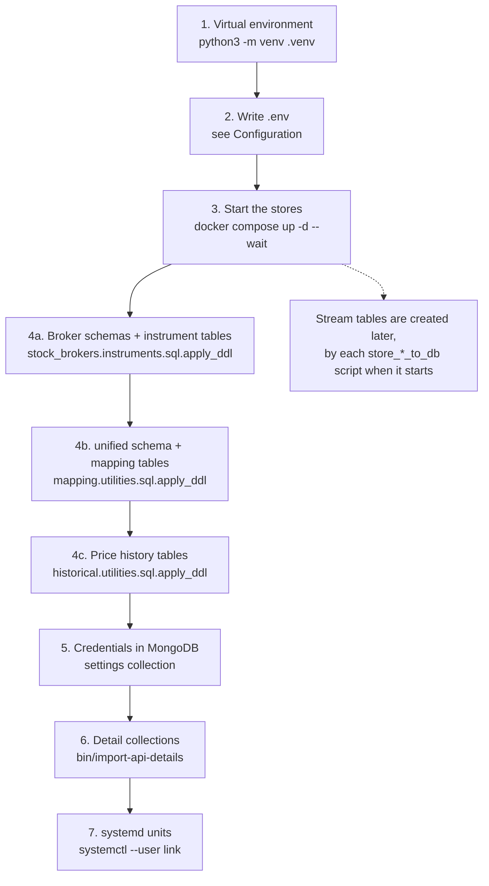

# Installation

This page installs the software and prepares the three data stores. When you finish it, the tables exist and the stores are running, but no broker has logged in yet. Logging in and starting the services is on [First run](first-run.md).

## The order of installation

Each step below needs the one before it, so the order matters. The diagram shows the steps and what each one leaves behind.



## 1. Create the virtual environment

The project has no `pyproject.toml` and no build step. Every dependency, including the documentation toolchain, is listed in `requirements.txt`, so one `pip install` sets up everything.

```bash
python3 -m venv .venv
.venv/bin/pip install --upgrade pip
.venv/bin/pip install -r requirements.txt
```

You never have to activate the environment. Every executable in `bin/` calls `utilities.bootstrap.run_under_venv` as its first action, which re-executes the script under `.venv/bin/python` when it is not already running there. That is why the scripts work from cron, from systemd and from any directory. [Design choices](../architecture/design-choices.md#every-script-re-executes-itself-under-the-virtual-environment) explains how that check works.

## 2. Write the `.env` file

The `.env` file at the project root holds the address and password of each store. [Configuration](configuration.md) lists every variable. Write the file before the next step, because Docker Compose reads the same file for the ports and passwords of the containers.

!!! note "A missing port stops every import"
    `utilities/configurations.py` reads the environment when it is imported, and it converts each port number and the Redis database number with `int()`. If one of those variables is missing, the very first import of the module raises an error, before any script does its own work.

## 3. Start the data stores

`docker-compose.yml` defines three containers on one bridge network named `unified_broker_interface_network`. The table below shows what each container runs, which host port it listens on, and where it keeps its data.

| Service | Image | Host port (variable, default) | Container port | Data folder on the host | Health check |
|---|---|---|---|---|---|
| `redis` | `redis:trixie` | `UNIFIED_BROKER_INTERFACE_REDIS_PORT`, `1002` | 6379 | `/mnt/ubi/docker-volumes/redis` | `redis-cli -a … ping` every 5 s |
| `mongodb` | `mongo:8.0.4` | `UNIFIED_BROKER_INTERFACE_MONGODB_PORT`, `1003` | 27017 | `/mnt/ubi/docker-volumes/mongodb` | `mongosh … db.runCommand({ping:1})` every 5 s |
| `timescaledb` | `timescale/timescaledb:latest-pg18` | `UNIFIED_BROKER_INTERFACE_POSTGRES_PORT`, `1004` | 5432 | `/mnt/ubi/docker-volumes/timescaledb` | `pg_isready` every 5 s |

A few details of the compose file matter when you set it up:

- Redis starts with `--requirepass` set from `UNIFIED_BROKER_INTERFACE_REDIS_PASSWORD` and with `--appendonly yes`, so its data survives a restart.
- MongoDB's root user and password come from `UNIFIED_BROKER_INTERFACE_MONGODB_USERNAME` (default `unified_broker_interface`) and `UNIFIED_BROKER_INTERFACE_MONGODB_PASSWORD`.
- TimescaleDB's database and user come from `UNIFIED_BROKER_INTERFACE_POSTGRES_DB` and `UNIFIED_BROKER_INTERFACE_POSTGRES_USERNAME` (both default to `unified_broker_interface`), and the container gets 1 GB of shared memory.
- Every port is published on `0.0.0.0`, so the stores are reachable from other machines unless a firewall stops them.
- Every container has `restart: unless-stopped`.

The three data folders are bind mounts with `create_host_path: false`. Docker does not create them for you, so create them first.

```bash
sudo mkdir -p /mnt/ubi/docker-volumes/redis /mnt/ubi/docker-volumes/mongodb /mnt/ubi/docker-volumes/timescaledb
docker compose up -d --wait
```

`--wait` makes the command return only when every container reports healthy, so a store that starts but cannot serve shows up as a failure straight away.

!!! warning "Passwords are applied only once"
    MongoDB and PostgreSQL apply their user and password only when their data folder is initialized for the first time. Changing a password in `.env` afterwards does not change it inside the database.

## 4. Create the database tables

Tables are defined only in numbered `.sql` files, and there is no migration tool. Three runners apply them. Each runner executes the files of its own `ddl` directory in filename order, all inside one transaction, so a broken file rolls the whole run back. Every statement can be run again safely, so running a runner twice changes nothing.

Run the three runners in the order below. The order is not arbitrary: the unified price history tables in the third runner carry foreign keys to `unified.instruments`, which the second runner creates, and the per-broker price tables need the broker schemas that the first runner creates.

```bash
.venv/bin/python -m stock_brokers.instruments.sql.apply_ddl
.venv/bin/python -m stock_brokers.instruments.mapping.utilities.sql.apply_ddl
.venv/bin/python -m stock_brokers.instruments.historical.utilities.sql.apply_ddl
```

Each runner prints one line per file it applied and then a count, as its `main()` does.

The table below shows what each runner creates.

| Runner | Directory | Creates |
|---|---|---|
| `stock_brokers.instruments.sql.apply_ddl` | `stock_brokers/instruments/sql/ddl/` | The ten broker schemas and each broker's `instruments` table |
| `stock_brokers.instruments.mapping.utilities.sql.apply_ddl` | `stock_brokers/instruments/mapping/utilities/sql/ddl/` | The `unified` schema, `unified.instruments`, `unified.broker_mappings` and `unified.contract_sizes` |
| `stock_brokers.instruments.historical.utilities.sql.apply_ddl` | `stock_brokers/instruments/historical/utilities/sql/ddl/` | Seven brokers' `price_history` and `price_history_progress`, the unified price history tables, its views and the function `unified.adjusted_bars()` |

The live stream tables have no runner. Each `store_*_to_db` script applies its own file from `stock_brokers/instruments/ticks/utilities/sql/ddl/` when it starts, and so do two other scripts. The table below lists who applies which of those files.

| File | Applied by |
|---|---|
| `010_zerodha_streams.sql` … `100_stoxkart_streams.sql` | That broker's `store_quotes_to_db`, `store_orders_to_db` and, where it exists, `store_positions_to_db` |
| `300_unified_ticks.sql` | `bin/unified/instruments/store_quotes_to_db`, and `bin/unified/instruments/price_history` |
| `310_unified_order_updates.sql` | `bin/unified/orders/store_orders_to_db` |
| `320_unified_positions.sql` | `bin/unified/portfolio/store_positions_to_db` |
| `330_unified_ticks_adjusted.sql` | `bin/unified/instruments/price_history`, after the historical DDL has created the view it reads |
| `340_unified_synthetic_order_events.sql` | `bin/unified/orders/order_engine`, before it places anything |

`bin/unified/instruments/map` also applies the mapping DDL before every run, so the second runner is harmless to repeat. [Database](../architecture/database.md) describes every table.

## 5. Put the credentials into MongoDB

Each broker's login code reads its credentials from one document in the MongoDB `settings` collection, found by its `broker_name`. The REST API's own key and secret live there too, under `broker_name` `unified_broker_interface`. [Configuration](configuration.md#mongodb-documents) lists the fields each broker needs. You write these documents yourself, with `mongosh` or MongoDB Compass; nothing in the project creates them.

## 6. Load the detail collections

The REST API's routes `/api/users/details`, `/api/brokers/details` and `/api/exchanges/details` serve three MongoDB collections. `bin/import-api-details` loads them from a folder of MongoDB Compass JSON exports. The table below shows which export file fills which collection.

| Collection | Export file inside the folder | Keyed by |
|---|---|---|
| `exchange_details` | `unified_broker_interface.exchanges.json` | `exchange` |
| `broker_details` | `mongo_backup/unified_broker_interface.brokers.json` | `broker_name` |
| `user_details` | `unified_broker_interface.user_details.json` | nothing |

```bash
bin/import-api-details /path/to/exports              # upsert exchanges and brokers, load users if empty
bin/import-api-details /path/to/exports --replace    # also reload user_details over what is there
bin/import-api-details --calendars-only              # only re-copy trading hours and holidays
```

The import can be run twice safely. Exchanges and brokers are upserted on their keys, and user profiles are loaded only into an empty collection unless `--replace` is given. After the import, the script copies each exchange's trading hours and holidays into its `exchange_details` document, reading the yearly calendar files in `stock_brokers/instruments/ticks/utilities/calendars/`.

!!! note "The export files stay outside the repository"
    The script reads the exports where they are and never copies them into the project, because `user_details` holds identity documents and bank account numbers.

## 7. Install the systemd units

Everything that runs for a long time runs as a systemd **user** unit from `services/`. The units are linked rather than copied, which is why they expect the repository at `~/Projects/unified_broker_interface`. Each folder's `.target` file carries its own install commands in its header. [Services](../operations/services.md#installing-the-units) walks through the installation for every folder.

The first folder to install is `services/databases/`, because every other unit reads from the stores. Its timer runs `docker compose up -d --wait` every minute, so a stopped container comes back on its own.

```bash
systemctl --user link ~/Projects/unified_broker_interface/services/databases/*
systemctl --user daemon-reload
systemctl --user enable --now databases.target databases.timer
```

User units stop when you log out unless linger is on for your user. `bin/check-services` checks this and suggests `loginctl enable-linger $USER` when it is off.

## What comes next

The software is installed and the stores are ready. [Configuration](configuration.md) describes every setting in detail, and [First run](first-run.md) brings the brokers and the API up.
