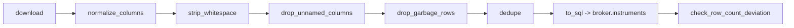

# Instrument masters

Every broker publishes a daily file listing the contracts it will accept orders for - tokens,
trading symbols, expiries, strikes, lot sizes. This subsystem downloads all ten, cleans them, and
appends each day's snapshot to that broker's `instruments` table.

## Running it

```bash
python -m stock_brokers.instruments.sql.apply_ddl        # once, to create the tables
bin/zerodha/instruments                                  # one broker, into zerodha.instruments and Redis
bin/zerodha/instruments --bootstrap                      # replace today's rows
python -m test_runs.download_instruments                 # every broker, tables only
python -m test_runs.download_instruments zerodha dhan    # only these
```

Each morning `unified-instruments.service` runs every broker's `bin/<broker>/instruments`, Stoxkart's
included, and then the mapping. Safe to run daily and safe to run twice: a broker already ingested for a
date is skipped unless `--bootstrap` is given, which replaces that date's rows instead. See
[Broker scripts](broker-scripts.md#instrument-masters) for the Redis copy each script also writes.

!!! warning "A missed snapshot cannot be fetched later"

    Nine of the ten brokers publish only today's file, and Kotak's URL is stamped with today's
    date. There is no archive to go back to. That is why
    [`ingest_all`][stock_brokers.instruments.orchestrator.ingest_all] wraps each broker in its own
    `try`/`except` - one broker's endpoint being down, or its token having expired, must never
    cost the others their snapshot for the day.

## The pipeline



A subclass supplies `download()` and the dedupe key. Everything else comes from
[`BrokerInstruments`][stock_brokers.instruments.base.BrokerInstruments], so the simplest broker
module, Zerodha's, is under thirty lines:

```python
class ZerodhaInstruments(BrokerInstruments):
    BROKER_NAME = "zerodha"
    DEDUPE_KEY_COLUMNS = ["instrument_token"]
    DEDUPE_SORT_COLUMN = None

    def download(self):
        return pandas.read_csv(INSTRUMENTS_URL, dtype=str)
```

## Two deliberate choices

**Everything is read as text.** `dtype=str` on the way in means no value is coerced by pandas and
the broker's own formatting survives for the [mapping pass](instrument-mapping.md) to interpret. A
strike of `1200.00` and a strike of `1200` stay distinguishable.

**An unknown column raises.** If the downloaded file carries a column the table does not have,
`ingest` fails with a message naming the column and telling you to add it to the DDL. A broker
adding a field breaks the job loudly rather than losing the field silently.

## The row count canary

After ingesting, [`check_row_count_deviation`][stock_brokers.instruments.base.BrokerInstruments.check_row_count_deviation]
compares the day's row count against the average of every earlier day, with a default tolerance
of ten percent either way. A large swing usually means the file came back truncated or
unexpectedly bloated.

It reports and never raises. A deviation is a signal to investigate, not a failure - some of them
are real, such as a weekly expiry rolling off.

## Storage

These tables are the raw input to the [instrument mapping](instrument-mapping.md) layer, which
resolves them against each other into `unified.instruments` and `unified.broker_mappings`.

Each broker's snapshots go to `<broker>.instruments`, a hypertable partitioned on `download_date`
by month. Columns are `TEXT` for the same reason the download is: the file is stored as
published, and any typing happens when it is read. Ten brokers have a table, Stoxkart included -
its instrument master is public and needs no login.
