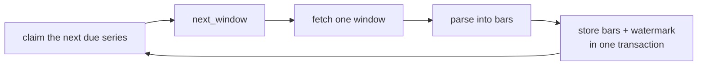

# Price history

Seven of the ten brokers serve historical candles. This subsystem downloads every interval each
of them offers, for every instrument in its instrument master, as far back as it will go, into
`<broker>.price_history`.

Nothing is derived. A five minute bar is the broker's five minute bar, not five one minute bars
added together. That costs roughly three times the requests and it is the point: the stored data
can be compared against the broker's own charts without an argument about aggregation boundaries,
and the seven brokers can be compared against each other.

The queue is worked by `bin/<broker>/instruments/price_history`, one script per broker, run as
`<broker>-historical-prices.service`. Each is built on the broker's `BrokerCandles` subclass and works its
`<broker>.price_history_progress` queue; every login, at startup and after the broker refuses the session,
goes straight through the broker's API class, which logs in when the stored token is dead. Wisdom Capital
needs a second session for its chart endpoint, and `WisdomCapitalAPI` establishes it alongside the trading
one and publishes it in the `last_login` document as `market_data_access_token`, which
`bin/wisdom_capital/instruments/websocket_quotes` reads as well. See
[Broker scripts](broker-scripts.md#historical-prices) and [Running it as a service](services.md).

## Running it

```bash
python -m stock_brokers.instruments.historical.utilities.sql.apply_ddl   # once, to create the tables
bin/dhan/instruments/price_history --seed-only   # register every instrument and interval
bin/dhan/instruments/price_history               # work the queue until stopped
bin/dhan/instruments/price_history --status      # how far it has got
systemctl --user enable --now dhan-historical-prices.service   # the same thing, as a service
```

It is not a job that finishes. The seven brokers together publish a little over eighteen million
series, the deepest reaching back to 2002, and the rates the brokers allow put a complete backfill
in the region of weeks. So `bin/<broker>/instruments/price_history` is a worker that makes progress whenever it
runs and can be stopped at any moment.

## A queue, not a loop

Every instrument and interval gets a row in `<broker>.price_history_progress`, and the downloader
claims one window at a time from it. The process holds no state a restart would lose.



The bars and the watermark that accounts for them are written in the same transaction, so an
interruption costs at most the request in flight - and repeating that window is harmless, because
bars upsert on `(instrument_token, interval, time)`.

Series are claimed in priority order, which is the difference between useful data in days and
useful data in months:

| Priority | What |
| --- | --- |
| 10 | cash daily bars - equities and indices |
| 15, 25 | cash intraday, coarse before fine |
| 30, 60 | live futures, then live options |
| 80, 90+ | expired contracts, futures before options |

Cash daily lands on the first night. Expired option minute bars drain last, for as long as they
are allowed to.

### Walking backwards, then forwards

A new series starts at today and steps back one window at a time until it reaches the broker's
earliest date or the broker stops answering, and only then does it start collecting forward.

!!! warning "The backward walk has to finish first"

    Preferring a forward fill whenever the newest stored bar is older than today looks reasonable
    and does not work. Outside market hours the newest bar is always older than today, so the
    series asks for the same empty recent window forever and never walks back at all. This was a
    real bug, found by running it.

A forward window that brings nothing new defers the series until tomorrow. Without that, the
highest priority series would be re-fetched continuously all weekend.

### When a series stops

Three endings, and they mean different things.

**Backfilled** - the walk reached the broker's earliest date, or three empty windows in a row.
There is no more past to collect; the series stays live and keeps collecting forward.

**Retired** - the broker will not serve this series at all. Either it said so (Kite answers
`invalid token` for an instrument that has left its dump) or the walk finished without a single
bar anywhere in the range the broker offers, which is what a contract that listed and never traded
looks like. Retired series are never claimed again.

**Stuck** - five consecutive failures. The series stops being claimed and `last_failure_reason`
says why. `bin/<broker>/instruments/price_history --status` counts these. A throttle is deliberately not a
failure: it says something about the pace rather than about the series, so it costs the rate
limiter a few seconds and leaves the series claimable.

## What each broker serves

Every figure here was measured against the live API rather than taken from documentation, on the
dates in each module's docstring.

| Broker | Intervals | Daily back to | Intraday back to | Rate | Open interest |
| --- | --- | --- | --- | --- | --- |
| Zerodha | 8 | 2005 | 2005 | 3/s | yes |
| Dhan | 6 | 2002 | 2017 | 3/s, 100k/day | yes |
| Fyers | 16 | 2000 | 2019 | 3/s | yes |
| IND Money | 14 | 2014 | a year or more | 3/s, 100k/day | no |
| Flattrade | 11 | 2019-12 | a rolling year | 10/s | yes |
| Shoonya | 11 | 2021-09 | a rolling year | 1/s | yes |
| Wisdom Capital | 13 | none | 2022 | 1/s | yes |

Three brokers serve nothing, and the reason is recorded in
[`UNSUPPORTED`][stock_brokers.instruments.historical.utilities.orchestrator] rather than left as a
gap to be rediscovered: Groww answers 403 on the historical endpoint, which is an entitlement
rather than a bug; Kotak publishes no candle endpoint at all; Stoxkart has no candle path.

### The traps

Each broker has at least one behaviour that is silently wrong if it is read the obvious way. All
of these are pinned down by `python -m test_runs.candle_parse`.

**An expired contract cannot be backfilled.** Kite answers `invalid token` for an instrument that
has left its dump, not an empty window, so an expired contract's history is unreachable the
moment it expires. Since options are the bulk of every broker's universe, that data can only ever
be captured forward, by the tick feeds.

**Dhan serves five intraday resolutions, and answers the others with an empty array.** Asking for
two or ten minute bars is not refused - it returns nothing, which is indistinguishable from a
market holiday. Its `DH-907` is not an error either: it is how a window before the instrument's
first bar is reported, and retiring a series on it would kill RELIANCE the moment its walk stepped
past 2002.

**Fyers reports an empty window with HTTP 200 and `s` of `no_data`.** And it stamps a daily bar at
midnight UTC where Kite stamps midnight India time - the same trading day, five and a half hours
apart.

**IND Money truncates rather than refusing.** A window wider than it serves comes back holding
only its newest portion, with nothing to say the rest was dropped, so its window sizes are the
point past which data would be lost rather than a documented limit. Its scrip codes are prefixed
by segment and not by exchange: `NFO_68777` for a derivative whose instrument master says NSE.
Asking for `NSE_68777` is accepted and answers zero bars.

**Noren cannot tell an empty window from an unknown instrument.** Flattrade and Shoonya both
answer `Error Occurred : 5 "no data"` to either, so that message is always read as an empty window
and a genuinely dead instrument is retired only when its whole walk collects nothing. Their volume
field is `intv`, the bar's own volume; the `v` beside it is the day's running total, and taking it
by mistake produces a rising series that looks plausible on a chart and is wrong everywhere.

!!! warning "Noren cannot be sent an ampersand"

    Both split the request body on `&` before parsing the JSON inside it, so a trading symbol
    containing one - `M&M`, `ARE&M`, `L&T` - ends the `jData` field early and comes back as
    `jData is not valid json object`. Each broker's API class escapes it as a JSON `\u0026`, which
    Noren decodes back; percent-encoding the field instead is refused outright. This affects every
    Noren request naming such a symbol, not only candles.

**Wisdom Capital's timestamps need two corrections**, and its empty response means nothing at all.
The number is seconds since the epoch computed as though India time were UTC, and it names the
last second of the bar rather than the first. An unknown instrument, a window before the history
begins and an expired market data token all answer identically, so the module keeps a count of
empty windows and, after fifty, asks about an instrument known to have bars before it lets the
base class retire anything. It offers no daily interval: a compression of 86,400 seconds is a
rolling twenty four hour bucket from 09:15 to 09:14:59, not the exchange's session.

### Day bars are normalised, intraday bars are not

Brokers disagree, silently, about what a daily bar's timestamp means - midnight India time,
midnight UTC, or an epoch that decodes to 18:30 UTC. All three name the same trading date once
read in India time, so [`daily_bar_time`][stock_brokers.instruments.historical.base.daily_bar_time]
puts every day, week and month bar at midnight India time on its trading date. Intraday
timestamps are already unambiguous and are stored exactly as the broker sent them.

## Adding a broker

A broker module sets six class attributes and implements two methods. Everything else - the rate
limiter, the queue, the watermarks, the backoff, the upsert - is in
[`BrokerCandles`][stock_brokers.instruments.historical.base.BrokerCandles].

```python
class DhanCandles(BrokerCandles):
    BROKER_NAME = "dhan"
    INTERVALS = {"1minute": "1", "day": "D"}          # stored name -> the broker's code
    MAXIMUM_WINDOW_DAYS = {"1minute": 90, "day": 5000}
    REQUESTS_PER_SECOND = 3.0
    REQUESTS_PER_DAY = 100000
    EARLIEST_AVAILABLE_DATE = datetime.date(2000, 1, 1)

    def fetch_candles(self, token, interval, start_date, end_date): ...
    def parse_response(self, payload, interval): ...
```

Four things decide whether it works.

`parse_response` **must return timezone aware `datetime` objects**, not the broker's text. The
watermarks come back from Postgres as datetimes and are compared against these, so a parser that
passes strings through fails the moment a series starts collecting forward.

**Errors must be classified**, into `CandleInstrumentUnknown` (retire the series),
`CandleThrottled` (back off), `CandleAuthenticationError` (log in once, see below),
`CandleBlocked` (stop the broker) or anything else (retry with backoff). Getting the first one
right is what stops tens of thousands of expired contracts being retried forever - and getting it
wrong in the other direction retires instruments that are perfectly good.

Classify session errors by the **broker's error codes** wherever it has them, not by the wording
of its message. A session error the classifier misses is treated as a fault in one series, and the
loop moves on to the next - with the same dead token. That is how, on 2026-09-13, Fyers'
`-16 "Could not authenticate"` went unrecognised for four hours at about fifty requests a minute
until Cloudflare banned the machine's address, which blocked every Fyers login as well.

**The identifier is whatever the request needs.** Several brokers cannot be addressed by a token
alone - Dhan's security id repeats across its segments, a Noren token repeats across scrip files -
so those modules override `instruments()` and store a composite such as `2885|NSE_EQ|EQUITY` or
`NSE|2885|RELIANCE-EQ`, which `fetch_candles` splits again.

**The session comes from `relogin`.** The base class's default goes through `ensure_session`, which
takes a Redis login lock and a floor on login attempts, and then builds the broker's API class. Each
`bin/<broker>/instruments/price_history` overrides `relogin` and `_build_api` to construct the broker's API class
directly, which logs in when the stored token is dead, as every other script in `bin/<broker>/` does. This
process runs for weeks and will be alive across an overnight token expiry.

## An invalid or expired token

The rule is **log in first, then continue** - never keep sending requests with a dead token.

When a window raises `CandleAuthenticationError`, the base class logs in once, through `relogin`,
and asks for the same window again. If that works, the download carries on and
the one login is re-armed for the next day's expiry. If the login fails, or the fresh session is
refused as well, the downloader stops, and systemd starts it again ten minutes later - into
another login. Nothing is recorded against the series either way, because a session error is a
property of the broker, not of the instrument.

Two hooks let a module take part:

- `_build_api()` constructs the broker's API class around the new session. The default builds the
  broker's class from `api_class_for`; the Noren modules override it with their own.
- `after_relogin()` renews anything built on top of the session. Wisdom Capital uses it to ask
  `WisdomCapitalAPI` to replace the separate market data token its chart endpoint takes. A module
  that has already spent a login
  itself - Wisdom Capital's empty-window check does - sets `_relogin_used` before raising, so the
  base class does not log in a second time.

`CandleBlocked` is different on purpose. A firewall ban on the IP address is not about the session,
so a login would only be one more refused request, and every further request extends the ban. It
stops the broker without logging in.

Then register it in
[`DOWNLOADERS`][stock_brokers.instruments.historical.utilities.orchestrator] and verify it on a
handful of instruments before seeding.

## Storage

`<broker>.price_history` is a hypertable chunked by month, compressed after thirty days, segmented
by instrument and interval - which is how it is read, one instrument's series over a date range.

!!! note "One month chunks, not seven days"

    Seven days was the first choice and measurement said otherwise: two decades of daily bars for
    a single instrument spread across 1,133 chunks holding 98 rows each, where per-chunk overhead
    dwarfed the data and 111,000 bars occupied 75 MB. One month cut the same data to 35 MB. A
    table holding both minute and daily bars has to pick one size for two very different
    densities, and the sparse series is the one that suffers from chunks that are too small.

The DDL lives in `stock_brokers/instruments/historical/utilities/sql/ddl/`, one numbered file per
broker, every statement safe to re-run. See [DDL and migrations](../database/ddl.md).

## Verifying a downloader

Before seeding a new broker, hand-seed two series and watch the walk:

```python
from stock_brokers.instruments.historical.utilities.orchestrator import downloader_for

d = downloader_for("dhan")()
with d._connection.cursor() as cursor:
    cursor.execute("""insert into dhan.price_history_progress
                          (instrument_token, "interval", priority)
                      values ('2885|NSE_EQ|EQUITY', 'day', 10),
                             ('2885|NSE_EQ|EQUITY', '5minute', 25)""")
d._connection.commit()
for _ in range(10):
    series = d.claim()
    print(d.next_window(series), d.visit(series))
```

Expect several backward windows stepping towards the broker's earliest date, then a forward
window, then a deferral to tomorrow. If it repeats one window, the walk logic is wrong.

Then check that re-running a downloaded window does not change the row count, that an interrupted
window leaves the bars and the watermark agreeing, and - the check that catches the most - that
the same instrument's bars agree with another broker's for the same session. All seven were
compared against each other on RELIANCE five minute bars and they agree to the tick.
