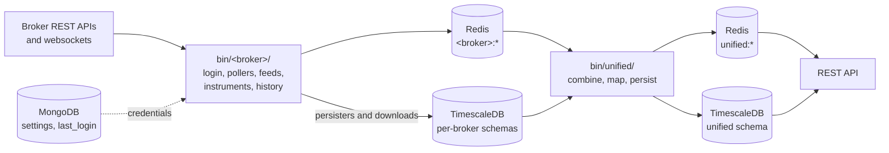

# Unified Broker Interface

One normalized interface over ten Indian retail brokers. Each broker speaks its own REST dialect,
its own websocket protocol and its own vocabulary for the same order; this project maps all of
them onto a single shape so that the code above it never branches on which broker a message came
from.

-   :material-rocket-launch: **Getting started**

    ---

    Install the dependencies, fill in the environment, and bring up Redis, MongoDB and
    TimescaleDB.

    [:octicons-arrow-right-24: Getting started](getting-started/index.md)

-   :material-sitemap: **Architecture**

    ---

    The broker and unified layers, the normalized tick, order, position and quote contracts, and the
    Redis keys that join them.

    [:octicons-arrow-right-24: Architecture](architecture/index.md)

-   :material-bank: **Brokers**

    ---

    Which of the ten brokers has quotes, order updates, streamed positions, instrument masters and
    price history.

    [:octicons-arrow-right-24: Coverage matrix](brokers/coverage.md)

-   :material-code-braces: **API reference**

    ---

    Generated from the source tree, one page per module, every build.

    [:octicons-arrow-right-24: Reference](reference/)

## What the project does

Each broker's own scripts talk to that broker and keep what it says in Redis; a unified layer combines
every broker's data from Redis alone, stores it once, and serves it over the REST API.

| Layer | Where | What it produces |
| --- | --- | --- |
| Broker API clients | `stock_brokers.api` | An authenticated session per broker, on top of which every broker call is made |
| Broker scripts | `bin/<broker>/` | Sessions, profiles, orders, trades, holdings, positions and funds polled into Redis; quote and order update feeds; instrument masters and candles in each broker's schema. See [Broker scripts](guides/broker-scripts.md) |
| Unified scripts | `bin/unified/` | Every broker combined in one shape, the unified instruments and price history, and the streams persisted into the `unified` schema. See [Unified scripts](guides/unified-scripts.md) |
| REST API | `unified_broker_interface` | One HTTP interface over the unified layer. See [REST API](guides/rest-api.md) |
| Services | `services/<broker>/`, `services/unified/`, `services/databases/` | The systemd units and timers that run all of it, and keep the database containers up. See [Running it as a service](guides/services.md) |

## The two ideas worth knowing first

**Everything is normalized on the way in.** A tick from Zerodha and a tick from Shoonya are the
same dictionary with the same keys, and a field the broker does not supply is `None` rather than
absent. The same is true of orders and positions, right down to a shared vocabulary for order
status, product and validity. See [Normalized contracts](architecture/contracts.md).

**Each broker owns a PostgreSQL schema.** Ticks for Zerodha live in `zerodha.ticks`, not in a
shared table with a broker column, so each stream compresses, retains and reloads independently.
See [Database](database/index.md).

!!! danger "The REST API places real orders"

    Order placement through the [REST API](guides/rest-api.md) goes to live broker accounts with real
    money.
