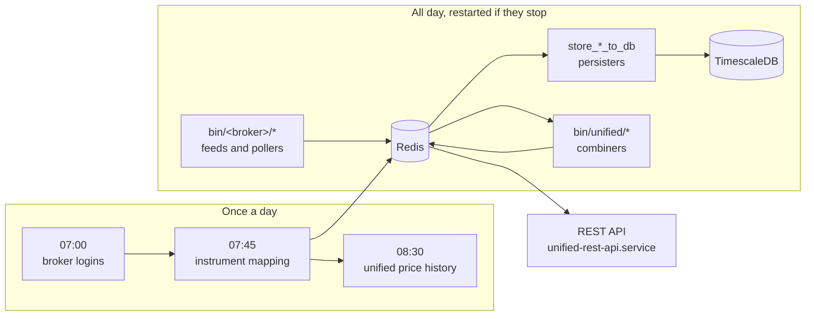

# Operations

This tab is about running UBI day after day on one machine. Everything runs as systemd **user** services, every job has a fixed time in India Standard Time (IST), every script lives in `bin/`, and a set of offline test suites tells you whether a change broke something before it reaches a live account.

-   :material-server-network:{ .lg .middle } **Services**

    ---

    The systemd user units in `services/`, how the templates turn one file into many services, the restart rules, and the exact commands that install each group.

    [:octicons-arrow-right-24: Services](services.md)

-   :material-clock-outline:{ .lg .middle } **Daily schedule**

    ---

    What happens at which time of day, from the 06:00 order count reset to the 23:30 MCX close, drawn as a timeline.

    [:octicons-arrow-right-24: Daily schedule](schedule.md)

-   :material-console:{ .lg .middle } **Scripts**

    ---

    Every executable in `bin/`: the tools you type by hand, the broker scripts systemd runs, and the unified scripts that combine them, with their options and exit codes.

    [:octicons-arrow-right-24: Scripts](scripts.md)

-   :material-test-tube:{ .lg .middle } **Offline tests**

    ---

    The eleven test suites in `test_runs/` that need no network, no broker and no database, how their recordings work, and the lint baseline.

    [:octicons-arrow-right-24: Offline tests](tests.md)

## A day in the life

A normal trading day follows the same steps every time, and no person has to start any of them. The numbered list below walks through one day in the order things happen.

1. At **06:00 IST** the daily order counters in Redis expire, so every capped broker starts the day with its full allowance.
2. At **07:00 IST** the ten broker login timers fire, each after its own random delay of up to 30 minutes, so the ten logins do not all happen in the same second. At the same hour, the REST API's own access token from yesterday stops being reused, and the next `connect` issues a new one.
3. At **07:45 IST** the instrument job downloads every broker's instrument list and maps them all onto one shared list of instruments. The unit's own comment puts this at about three quarters of an hour.
4. At **08:30 IST**, from Monday to Saturday, the unified price history job loads the brokers' candles into one table and refreshes the adjustment factors.
5. From **09:00 IST** the equity pre-open begins, and the unified quote layer starts accepting ticks, because its acceptance window opens at 09:00. NSE and BSE equity trades from 09:15 to 15:30.
6. Through the day, the pollers and websocket scripts keep Redis up to date, the persisters copy every stream into TimescaleDB, and the unified scripts combine every broker into one view that the REST API serves.
7. Commodity trading on MCX carries on into the evening and closes at **23:30 IST** (23:55 while the United States is on standard time).

The diagram below shows the same day as three groups of work: the morning jobs that run once, the long-running services that run all day, and the stores and API they feed.

!!! tip "Checking that everything is up"
    `bin/check-services` walks every unit in `services/`, reports what is down, and starts the long-running services that should be running. Add `--check-only` to report without starting anything. See [Services](services.md#checking-and-restarting-with-bincheck-services).
