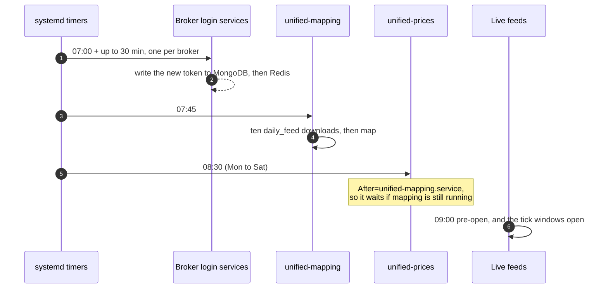

# Daily schedule

UBI's day is fixed to India Standard Time (IST, UTC+05:30). Some things happen because a systemd timer fires, some because a time is written into the code, and the rest because the exchanges open and close. This page puts all of them on one timeline, so you can see what is running at any hour.

## The day at a glance

The chart below shows one weekday from 06:00 to midnight IST. Blue bars and points are UBI's own jobs and cut-off times; orange bars are the exchanges' trading sessions. Hover over a mark to see its exact times and where the time comes from.

```vegalite
{
  "$schema": "https://vega.github.io/schema/vega-lite/v5.json",
  "width": "container",
  "height": 330,
  "data": {
    "values": [
      {"order": 1, "row": "Daily order counts reset", "kind": "UBI job or cut-off", "start": "2026-09-28 06:00", "end": null, "source": "RESET_HOUR in parent_store.py"},
      {"order": 2, "row": "API token renewal time", "kind": "UBI job or cut-off", "start": "2026-09-28 07:00", "end": null, "source": "DAILY_RENEWAL_TIME in tokens.py"},
      {"order": 3, "row": "Broker logins (ten timers)", "kind": "UBI job or cut-off", "start": "2026-09-28 07:00", "end": "2026-09-28 07:30", "source": "<broker>-login.timer, RandomizedDelaySec=1800"},
      {"order": 4, "row": "Instrument download and mapping", "kind": "UBI job or cut-off", "start": "2026-09-28 07:45", "end": "2026-09-28 08:30", "source": "unified-mapping.timer; about 45 minutes per the unit comment"},
      {"order": 5, "row": "Unified price history (Mon to Sat)", "kind": "UBI job or cut-off", "start": "2026-09-28 08:30", "end": null, "source": "unified-prices.timer"},
      {"order": 6, "row": "NSE and BSE equity", "kind": "Trading session", "start": "2026-09-28 09:00", "end": "2026-09-28 09:15", "source": "Pre-open, sessions.py"},
      {"order": 6, "row": "NSE and BSE equity", "kind": "Trading session", "start": "2026-09-28 09:15", "end": "2026-09-28 15:30", "source": "Continuous session, sessions.py"},
      {"order": 7, "row": "Currency derivatives", "kind": "Trading session", "start": "2026-09-28 09:00", "end": "2026-09-28 17:00", "source": "sessions.py"},
      {"order": 8, "row": "MCX commodities", "kind": "Trading session", "start": "2026-09-28 09:00", "end": "2026-09-28 17:00", "source": "Morning session, sessions.py"},
      {"order": 8, "row": "MCX commodities", "kind": "Trading session", "start": "2026-09-28 17:00", "end": "2026-09-28 23:30", "source": "Evening session (23:55 while the US is on standard time), sessions.py"},
      {"order": 9, "row": "NCDEX commodities", "kind": "Trading session", "start": "2026-09-28 10:00", "end": "2026-09-28 17:00", "source": "Morning session, sessions.py"},
      {"order": 9, "row": "NCDEX commodities", "kind": "Trading session", "start": "2026-09-28 17:00", "end": "2026-09-28 21:00", "source": "Evening session, sessions.py"}
    ],
    "format": {"parse": {"start": "date:'%Y-%m-%d %H:%M'", "end": "date:'%Y-%m-%d %H:%M'"}}
  },
  "encoding": {
    "y": {"field": "row", "type": "nominal", "sort": {"field": "order"}, "title": null, "axis": {"labelLimit": 240}},
    "color": {
      "field": "kind",
      "type": "nominal",
      "title": null,
      "scale": {"domain": ["UBI job or cut-off", "Trading session"], "range": ["#2a78d6", "#eb6834"]},
      "legend": {"orient": "top"}
    }
  },
  "layer": [
    {
      "transform": [{"filter": "datum.end != null"}],
      "mark": {"type": "bar", "cornerRadius": 4, "height": 14},
      "encoding": {
        "x": {
          "field": "start",
          "type": "temporal",
          "title": "Time of day (IST)",
          "axis": {"format": "%H:%M", "tickCount": 18, "grid": true, "gridOpacity": 0.3},
          "scale": {"domain": [{"year": 2026, "month": 9, "date": 28, "hours": 6}, {"year": 2026, "month": 9, "date": 29, "hours": 0}]}
        },
        "x2": {"field": "end"},
        "tooltip": [
          {"field": "row", "title": "What"},
          {"field": "start", "type": "temporal", "format": "%H:%M", "title": "From"},
          {"field": "end", "type": "temporal", "format": "%H:%M", "title": "To"},
          {"field": "source", "title": "Source"}
        ]
      }
    },
    {
      "transform": [{"filter": "datum.end == null"}],
      "mark": {"type": "point", "shape": "diamond", "size": 160, "filled": true},
      "encoding": {
        "x": {"field": "start", "type": "temporal"},
        "tooltip": [
          {"field": "row", "title": "What"},
          {"field": "start", "type": "temporal", "format": "%H:%M", "title": "At"},
          {"field": "source", "title": "Source"}
        ]
      }
    }
  ]
}
```

The same facts are listed in the table below, with the file each one comes from.

| Time (IST) | What happens | Days | Where it is set |
|---|---|---|---|
| 06:00 | Every broker's daily order count in Redis (`unified:orders:daily_count:<broker>`) expires | Every day | `RESET_HOUR = 6` in `unified_broker_interface/utilities/order_engine/utilities/parent_store.py`, used by `daily_order_count.py` |
| 07:00 | The REST API stops reusing yesterday's access token; the next `connect` issues a new one | Every day | `DAILY_RENEWAL_TIME = time(7, 0)` in `unified_broker_interface/utilities/tokens.py` |
| 07:00 to 07:30 | Each of the ten `<broker>-login.timer` units fires once, at a random moment in this half hour | Every day, weekends included | `OnCalendar=*-*-* 07:00 Asia/Kolkata`, `RandomizedDelaySec=1800` |
| 07:45 | `unified-mapping.service` downloads ten instrument masters, then maps them | Every day, weekends included | `OnCalendar=*-*-* 07:45 Asia/Kolkata`, `Persistent=true` |
| 08:30 | `unified-prices.service` runs `bin/unified/instruments/price_history daily` | Monday to Saturday | `OnCalendar=Mon..Sat 08:30 Asia/Kolkata`, `Persistent=true` |
| 09:00 to 09:15 | NSE and BSE equity pre-open | Trading days | `EQUITY_SESSION` in `stock_brokers/instruments/ticks/utilities/sessions.py` |
| 09:15 to 15:30 | NSE and BSE cash, index and equity derivatives trade | Trading days | `EQUITY_SESSION` |
| 09:00 to 17:00 | Currency derivatives trade | Trading days | `CURRENCY_SESSION` |
| 09:00 to 17:00, 17:00 to 23:30 | Commodity derivatives on MCX (and the NSE and BSE commodity segments) trade a morning and an evening session; the evening runs to 23:55 while the United States is on standard time | Trading days | `COMMODITY_SESSION` |
| 10:00 to 17:00, 17:00 to 21:00 | NCDEX morning and evening sessions | Trading days | `NCDEX_SESSION` |
| Every minute | `databases.service` starts any stopped database container | Always | `databases.timer`, `OnUnitInactiveSec=1min` |

Two of these times deserve a closer look. The timers name `Asia/Kolkata` explicitly, so they keep IST even if the machine's time zone changes. The token renewal time is compared with `datetime.now()`, which is the machine's local clock, so it matches IST only when the machine runs on India time.

## Why the morning is ordered this way

Each morning step depends on the one before it, which is why they are spaced out. The sequence diagram below shows that chain.



The reasons come from the comments in the unit files:

1. The logins happen at 07:00, which is before the 07:45 instrument download and the 09:00 pre-open, and well clear of MCX's 23:30 close. The half hour of random delay keeps the ten logins apart, several of which drive a headless Chrome or wait on a TOTP, and still lands every one before 07:45.
2. The login timers set `Persistent=false`. A machine that was off at 07:00 does not catch up, because the first script to find its token refused logs in by itself.
3. The mapping timer sets `Persistent=true`. The brokers publish only today's instrument file, so a missed snapshot can never be fetched later, and a machine that was off at 07:45 runs the job as soon as it starts.
4. The price history job runs at 08:30, after the night's candle downloads and the 07:45 mapping. It says `After=unified-mapping.service`, so if the mapping runs late, the price job waits for it. It also runs on Saturday to pick up Friday's last bars and the week's corporate actions.

## What runs all day

The long-running services have no schedule. They start at boot through their target and restart when they stop, as described in [Services](services.md#restart-policy). The broker scripts keep their websockets open outside trading hours too. The unified quote layer drops any tick that arrives outside its instrument's acceptance window, which is wider than the session on both sides: the table below lists those windows from `sessions.py`.

| Kind of instrument | Window opens | Trading ends | Window closes |
|---|---|---|---|
| NSE and BSE equity | 09:00 | 15:30 | 16:00 |
| Currency derivatives | 09:00 | 17:00 | 17:30 |
| Commodity derivatives (MCX and exchange commodity segments) | 09:00 | 23:55 | 23:59:59 |
| NCDEX | 09:00 | 21:00 | 21:30 |

Which days trade comes from the exchanges' own holiday calendars, kept in `stock_brokers/instruments/ticks/utilities/calendars/2026.yaml`. The commodity calendars can close only the morning or only the evening session on a holiday. The file also lists one special session: Muhurat trading on Sunday 2026-11-08, accepted from 09:00 to 23:59:59 until the exchanges publish its hours.

!!! tip "Testing a live feed in the evening"
    NSE and BSE equity closes at 15:30 IST, so an equity feed tested after hours connects but proves nothing about parsing. MCX trades until 23:30 IST, so use MCX futures for evening tests.
