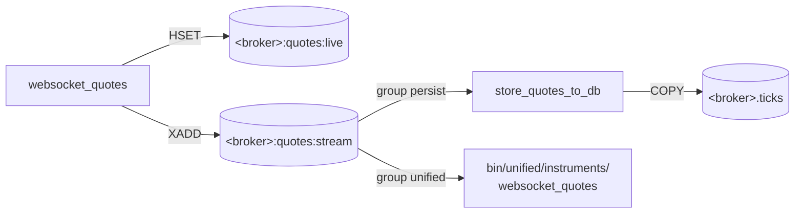

# Scripts

Every program you run in UBI is an executable file in `bin/`, written in Python and saved without a `.py` extension. There are three groups of them. The tools at the top of `bin/` are typed by hand. The scripts under `bin/<broker>/` are the only code that talks to a broker. The scripts under `bin/unified/` combine what the broker scripts write, and never talk to a broker themselves.

The tree below shows how the scripts are laid out. Every broker folder has the same five subfolders, and `bin/unified/` adds two of its own.

```text
bin/
├── rest-api  rest-api-app  check-services  check-broker-connections
├── search-instruments  import-api-details  wait-for-redis  zerodha-quote
├── <broker>/                  one per broker, ten in all
│   ├── session/               connect  disconnect
│   ├── user/                  details
│   ├── orders/                api_order_details  api_trade_details  websocket_order_details  store_orders_to_db
│   ├── portfolio/             positions  holdings  funds  store_positions_to_db
│   └── instruments/           daily_feed  price_history  websocket_quotes  store_quotes_to_db
└── unified/
    ├── session/               connect  disconnect
    ├── user/                  details  unified_details
    ├── brokers/               unified_details
    ├── exchanges/             unified_details
    ├── orders/                api_order_details  api_trade_details  websocket_order_details  store_orders_to_db  order_engine  virtual_book
    ├── portfolio/             positions  holdings  funds  store_positions_to_db
    └── instruments/           map  price_history  websocket_quotes  store_quotes_to_db
```

No script name repeats inside one broker's folder, so a script can be named without its folder. The one name that repeats inside `bin/unified/` is `unified_details`, which caches a different MongoDB collection in each of three folders.

## How a script finds its environment

A script in `bin/` is started by whatever `python3` its first line resolves to, which is the system interpreter, and the system interpreter has none of the project's libraries. So each script switches itself to the project's virtual environment before it imports anything. That switch is what lets the scripts run from any directory, from cron, and from a systemd unit with an empty environment.

The switch happens in two lines at the top of every script. The broker and unified scripts sit four levels below the project root, so they use `parents[3]`:

```python
sys.path.insert(0, str(Path(__file__).resolve().parents[3]))
from utilities.bootstrap import run_under_venv
```

The tools at the top of `bin/` sit one level below the root, so they use `Path(__file__).resolve().parent.parent` instead. A script saved at the wrong depth cannot import `utilities` at all.

`run_under_venv` in `utilities/bootstrap.py` then works through the steps below.

1. It checks whether `.venv/bin/python` exists and whether the running interpreter is already that environment. The check compares `sys.prefix`, not the interpreter's path, because `.venv/bin/python` is a symbolic link to the system Python, and comparing resolved paths would make them look equal.
2. If a switch is needed, it sets the environment variable `UBI_VENV_REEXEC=1` and replaces the current process with `.venv/bin/python <script> <arguments>` through `os.execv`. The variable stops a switch that somehow fails from looping forever.
3. Once running inside the environment, it puts the project root on `sys.path` and returns it, so the script can import `stock_brokers`, `unified_broker_interface` and `utilities`.

## Exit codes

All scripts share one meaning for their exit codes. systemd reads these codes to decide whether to restart a service, as explained in [Services](services.md#why-exit-code-2-stops-the-restarts).

| Code | Meaning | What systemd does |
|---|---|---|
| 0 | Stopped cleanly with Ctrl+C or SIGTERM, or a one-off job finished | Restarts a long-running service anyway (`Restart=always`) |
| 1 | Something failed that a later attempt may fix: a login, a download, a store that could not be written | Restarts after `RestartSec` |
| 2 | A bad argument or configuration, which a restart cannot fix | Leaves the service stopped (`RestartPreventExitStatus=2`), except the candle units |

A few scripts give these codes a more specific meaning, and each script's module docstring lists its own. The candle downloaders `bin/<broker>/instruments/price_history` exit 2 when the first login fails, which is why their units restart on every exit.

## Tools you type by hand

The eight scripts at the top of `bin/` are standalone tools. The table below lists what each one does, its options (read from its `argparse` setup), and whether it reaches a live broker account.

| Script | What it does | Options | Live account? |
|---|---|---|:-:|
| `rest-api` | Serves the REST API with gunicorn on `UNIFIED_BROKER_INTERFACE_API_HOST:PORT` (127.0.0.1:8080 by default), replacing its own process with gunicorn | `--dev` runs Flask's development server; `--workers` (default 2); `--threads` per worker (default 4) | Through the order routes |
| `rest-api-app` | Opens the Streamlit test page `test_runs/rest_api_app.py`, headless, so the first-run email prompt never appears | `--port` (default 8501); `--lan` listens on every interface instead of 127.0.0.1 | No |
| `check-services` | Checks every systemd user unit in `services/` and starts the long-running ones that are down | `--check-only`; `--all` lists every unit | No |
| `check-broker-connections` | Builds each broker's API object, which logs in when the stored token fails, then calls one authenticated endpoint and reports whether data came back | `BROKER ...` to check only some; `--list`; `--verbose` shows the login messages | **Yes** |
| `search-instruments` | Searches one broker's stored instrument master for a symbol or name, choosing the columns to search from the table itself | `BROKER` (required), `term`; `--exact`; `--columns`; `--show-columns`; `--all-columns`; `--date`; `--all-dates`; `--limit` (default 50, 0 for none); `--width` (default 32); `--max-context` | No |
| `import-api-details` | Loads the MongoDB collections `exchange_details`, `broker_details` and `user_details` from MongoDB Compass exports, and copies each exchange's trading hours and holidays into `exchange_details` | `export_directory`; `--replace` reloads `user_details`; `--calendars-only` | No |
| `wait-for-redis` | Waits until Redis answers and has finished loading its saved dataset | `--timeout-seconds` (default 300) | No |
| `zerodha-quote` | Shows one Zerodha symbol's instrument master row, then calls Kite's LTP, OHLC and full quote endpoints | `tradingsymbol`; `--exchange`; `--no-instrument` | **Yes** |

A few usage lines, copied from the scripts' own docstrings, are shown below.

```bash
bin/rest-api                                  # gunicorn on 127.0.0.1:8080
bin/rest-api --dev                            # Flask's development server
bin/search-instruments zerodha INFY
bin/search-instruments fyers --show-columns   # what this broker is searched on
bin/import-api-details /path/to/exports
bin/import-api-details --calendars-only       # after a calendar file changes
bin/wait-for-redis --timeout-seconds 60
```

!!! danger "Two of these tools log in to live broker accounts"
    `bin/check-broker-connections` authenticates to every broker in turn, and `bin/zerodha-quote` calls three live Kite endpoints. Both only read and place no orders, but several brokers log in through a headless Chrome and a TOTP, so each run is a real login. At Zerodha a new login invalidates the token every running Zerodha script holds.

Their exit codes differ slightly from the general rule. `wait-for-redis` exits 1 when the timeout passed. `check-services` exits 1 when a unit is still down, a scheduled job has failed, or linger is off, and 2 when the user's systemd manager cannot be reached. `check-broker-connections` exits 1 when any checked broker failed and 2 for an unknown broker name.

## Broker scripts

!!! danger "Everything under `bin/<broker>/` reaches a live trading account"
    Each of these scripts logs in to a real broker account with the credentials stored in MongoDB, or uses the token another script obtained. None of them places, modifies or cancels an order, but a login is real, and running a script by hand beside its systemd service can knock the service's session off. Do not run them without a reason.

Every broker has the same folders, and every script in a folder does the same job for its broker. The tables below describe each script once, with `<broker>` standing for the broker's name, and note the brokers that differ.

### session

The session scripts log a broker in or mark it logged out. `connect` is what `<broker>-login.service` runs every morning.

| Script | What it does | Reads | Writes |
|---|---|---|---|
| `connect` | Logs in by building the broker's API class, confirms the session answers an authenticated request, and records the outcome | MongoDB `settings`, `last_login` | MongoDB and Redis `last_login` (through the login), Redis `<broker>:session:status` |
| `disconnect` | Marks the broker as logged out | nothing | Redis `<broker>:session:status` |

`connect` exits 0 when the session works and 1 when the login, the check or the Redis write fails, so the login service can retry. Two brokers do a little more: Kotak's login also refreshes `kotak:user:details`, and Wisdom Capital's `connect` confirms both of its sessions.

### user

The user script keeps the broker's profile of the account holder in Redis.

| Script | What it does | Reads | Writes |
|---|---|---|---|
| `details` | Polls the broker's user profile every minute | the broker's profile endpoint | Redis `<broker>:user:details` |

Kotak has no `user/` folder. Wisdom Capital's `details` fetches the profile once a day instead of every minute.

### orders

The order scripts keep today's orders and trades in Redis. Two of them poll the broker's REST API, one listens on the broker's order websocket, and one copies the websocket's stream into the database.

| Script | What it does | Reads | Writes |
|---|---|---|---|
| `api_order_details` | Polls the day's order book and merges it into a hash, one field per order | the broker's order book endpoint | Redis hash `<broker>:orders:orders` |
| `api_trade_details` | Polls the day's trade book | the broker's trade book endpoint | Redis key `<broker>:orders:trades` |
| `websocket_order_details` | Listens for order updates on the broker's websocket, merges each into the same hash, and appends it to a stream | the broker's order websocket | Redis hash `<broker>:orders:orders`, stream `<broker>:order-updates:stream` |
| `store_orders_to_db` | Drains the order update stream into the database with the consumer group `persist` | stream `<broker>:order-updates:stream` | TimescaleDB `<broker>.order_updates` |

Most pollers run every half second. The table below lists the brokers that poll more slowly, as their docstrings state.

| Broker | `api_order_details` | `api_trade_details` |
|---|---|---|
| Fyers | every five seconds | every fifteen seconds |
| Stoxkart | every second | every second |

Four brokers also stream position updates on their order socket, so their `websocket_order_details` writes `<broker>:portfolio:positions` too: Fyers, Groww (derivatives positions), Kotak and Wisdom Capital. The poller and the websocket script write the same orders hash, and a polled row only replaces an entry that was observed before the poll's request was sent. The pollers exit 1 when the first login, or a login after the session died, fails.

### portfolio

The portfolio scripts keep positions, holdings and funds in Redis.

| Script | What it does | Reads | Writes |
|---|---|---|---|
| `positions` | Polls the positions and merges them into a hash | the broker's positions endpoint | Redis hash `<broker>:portfolio:positions` |
| `holdings` | Polls the holdings every minute | the broker's holdings endpoint | Redis key `<broker>:portfolio:holdings` |
| `funds` | Polls the funds and margin | the broker's funds endpoint | Redis key `<broker>:portfolio:funds` |
| `store_positions_to_db` | Drains the position update stream into the database | stream `<broker>:positions_updates:stream` | TimescaleDB `<broker>.positions` |

`positions` and `funds` poll every half second, except at Fyers, where `positions` polls every five seconds and `funds` every thirty, and at Stoxkart, where both poll every second. Only Fyers, Groww, Kotak and Wisdom Capital have `store_positions_to_db`, because only they stream position updates.

### instruments

The instrument scripts download the broker's instrument list and candles, and carry its live quotes.

| Script | What it does | Reads | Writes |
|---|---|---|---|
| `daily_feed` | Downloads the broker's instrument master and appends today's snapshot | the broker's instrument file | TimescaleDB `<broker>.instruments`; Redis `<broker>:instruments:master` and `<broker>:instruments:meta` |
| `price_history` | Downloads historical candles, working a resumable queue until stopped or drained | the broker's candle endpoint | TimescaleDB `<broker>.price_history` |
| `websocket_quotes` | Streams market quotes into a hash of the latest tick per instrument, and appends every tick to a stream | the broker's market data websocket | Redis hash `<broker>:quotes:live`, stream `<broker>:quotes:stream` |
| `store_quotes_to_db` | Drains the quote stream into the database with the consumer group `persist` | stream `<broker>:quotes:stream` | TimescaleDB `<broker>.ticks` |

Groww, Kotak and Stoxkart have no `price_history`, because they offer no usable candle endpoint. The usage lines below come from Zerodha's scripts, and the other brokers take the same kind of options.

```bash
bin/zerodha/instruments/daily_feed --bootstrap           # replace today's stored snapshot
bin/zerodha/instruments/price_history --seed-only        # register new series and exit
bin/zerodha/instruments/price_history --status           # how far it has got
bin/zerodha/instruments/websocket_quotes --tokens 738561,408065
bin/zerodha/instruments/store_quotes_to_db --batch-size 2000 --flush-interval 2
```

Websocket scripts never write to PostgreSQL. The diagram below shows how a feed, its persister and the unified layer share one stream through two separate consumer groups, so each of them sees every entry.



## Unified scripts

The scripts under `bin/unified/` read only Redis, MongoDB and the database, and never call a broker, with one exception: the order engine places orders. The tables below list them folder by folder.

### session

| Script | What it does | Reads | Writes |
|---|---|---|---|
| `connect` | Logs in to UBI with its API key and secret, issues an access token | MongoDB `settings` | MongoDB and Redis `last_login`; Redis `unified:session:status` |
| `disconnect` | Revokes the access token in force | MongoDB `settings` | the stored token; Redis `unified:session:status` |

Both ask for the key and secret, or read `UNIFIED_BROKER_INTERFACE_API_KEY` and `UNIFIED_BROKER_INTERFACE_API_SECRET`; `connect` also takes `--api-key`. They exit 1 for wrong credentials, a missing settings document or a failed write, and 2 when no key or secret was given.

### user, brokers and exchanges

| Script | What it does | Reads | Writes |
|---|---|---|---|
| `user/details` | Combines every broker's user profile into one object, every minute | Redis `<broker>:user:details` | Redis `unified:user:details` |
| `user/unified_details` | Caches a MongoDB collection every minute | MongoDB `user_details` | Redis `unified:details:users` |
| `brokers/unified_details` | Caches a MongoDB collection every minute | MongoDB `broker_details` | Redis `unified:details:brokers` |
| `exchanges/unified_details` | Caches a MongoDB collection every minute | MongoDB `exchange_details` | Redis `unified:details:exchanges` |

The three `unified_details` scripts take `--once` to copy once and exit, and then exit 1 when the copy failed.

### orders

| Script | What it does | Reads | Writes |
|---|---|---|---|
| `api_order_details` | Combines every broker's orders into the document `/api/orders/details` answers with, every half second | Redis `<broker>:orders:orders` | Redis `unified:orders:orders` |
| `api_trade_details` | Combines every broker's trade book, every half second | Redis `<broker>:orders:trades` | Redis `unified:orders:trades` |
| `websocket_order_details` | Reads all ten order update streams and the four position update streams as the consumer group `unified`, and normalizes each entry | `<broker>:order-updates:stream`, `<broker>:positions_updates:stream` | streams `unified:order-updates:stream` and `unified:positions_updates:stream`; hashes `unified:order-updates` and `unified:positions_updates` |
| `store_orders_to_db` | Drains the unified order update stream | `unified:order-updates:stream` | TimescaleDB `unified.order_updates` |
| `order_engine` | Places every order the REST API accepts in engine mode, and runs the synthetic order types | stream `unified:orders:intents:stream`, `unified:order-updates:stream` | the broker, and a reply on `unified:orders:intents:result:<intent_id>` |
| `virtual_book` | Keeps a queue estimate for every held `virtual_limit` order | stream `unified:quotes:stream`, the engine's parent cache | Redis hash `unified:orders:virtual_queue` |

!!! danger "`bin/unified/orders/order_engine` places live orders"
    The order engine sends real orders to real broker accounts. It runs only when `UNIFIED_BROKER_INTERFACE_API_ORDER_PLACEMENT=engine`, and only one may run: it holds the lock in `unified:orders:engine:lock`, and a second engine exits 1. It exits 2 for a bad argument or configuration.

`virtual_book` never calls a broker or places an order. It only estimates, from the quote stream, how an order resting at the exchange would have fared.

### portfolio

| Script | What it does | Reads | Writes |
|---|---|---|---|
| `positions` | Combines every broker's positions, every half second | Redis `<broker>:portfolio:positions` | Redis `unified:portfolio:positions` |
| `holdings` | Combines every broker's holdings, every minute | Redis `<broker>:portfolio:holdings` | Redis `unified:portfolio:holdings` |
| `funds` | Combines every broker's funds, every half second | Redis `<broker>:portfolio:funds` | Redis `unified:portfolio:funds` |
| `store_positions_to_db` | Drains the unified position update stream | `unified:positions_updates:stream` | TimescaleDB `unified.positions` |

### instruments

| Script | What it does | Reads | Writes |
|---|---|---|---|
| `map` | Maps every broker's instrument snapshot onto one shared list, and caches the day's rows | `<broker>.instruments` | TimescaleDB `unified.instruments`, `unified.broker_mappings`; Redis `unified:instruments`, `unified:broker_mappings` |
| `price_history` | Builds `unified.price_history` and its adjustment factors from the brokers' price tables, in steps | `<broker>.price_history`, Yahoo Finance for the factors | TimescaleDB `unified.price_history` and related tables |
| `websocket_quotes` | Combines every broker's live ticks into one quote per instrument, choosing one owning broker at a time | the ten `<broker>:quotes:stream` streams, group `unified` | Redis `unified:quotes:live`, `unified:quotes:stream`, `unified:quotes:stats` |
| `store_quotes_to_db` | Drains the unified quote stream | `unified:quotes:stream` | TimescaleDB `unified.ticks` |

The two jobs in this folder take subcommands and options. The usage lines below are copied from their docstrings.

```bash
bin/unified/instruments/map                                # every broker, today
bin/unified/instruments/map dhan kotak                     # only these
bin/unified/instruments/map --cache-only --date 2026-09-13 # only rewrite the Redis cache
bin/unified/instruments/price_history daily                # load, corrections, load, factors, verify
bin/unified/instruments/price_history status               # what the last run did
```

`map` exits 2 for a bad argument or a date older than the newest one already mapped. `price_history` exits 2 for a bad argument, an interval not loaded, or no instruments matching `--symbols`.
