# Services

Every long-running script and every daily job runs as a systemd **user** unit. A user unit belongs to your login rather than to the whole machine, so it needs no root access, and it is managed with `systemctl --user` instead of plain `systemctl`. The unit files live in the repository under `services/`, and they are linked into systemd from there, so a `git pull` updates them in place.

!!! warning "The units expect the repository at `~/Projects/unified_broker_interface`"
    Every `ExecStart=` line is written as `%h/Projects/unified_broker_interface/bin/...`, where `%h` is your home directory. If the repository lives anywhere else, the units start nothing.

## The unit files

The tree below shows the `services/` directory. Zerodha's folder is shown in full; the other nine broker folders follow the same pattern, with the differences listed in the table after the tree.

```text
services/
├── databases/                          keeps Redis, MongoDB and TimescaleDB running
│   ├── databases.target
│   ├── databases.service               docker compose up -d --wait
│   └── databases.timer                 once a minute
├── unified/                            the unified layer and the REST API
│   ├── unified.target
│   ├── unified-brokers@.service        runs bin/unified/brokers/%i
│   ├── unified-exchanges@.service      runs bin/unified/exchanges/%i
│   ├── unified-instruments@.service    runs bin/unified/instruments/%i
│   ├── unified-orders@.service         runs bin/unified/orders/%i
│   ├── unified-portfolio@.service      runs bin/unified/portfolio/%i
│   ├── unified-user@.service           runs bin/unified/user/%i
│   ├── unified-mapping.service         daily instrument download and mapping
│   ├── unified-mapping.timer           07:45 IST every day
│   ├── unified-prices.service          daily unified price history
│   ├── unified-prices.timer            08:30 IST Monday to Saturday
│   └── unified-rest-api.service        bin/rest-api (gunicorn)
├── zerodha/                            one folder per broker
│   ├── zerodha.target
│   ├── zerodha-instruments@.service    runs bin/zerodha/instruments/%i
│   ├── zerodha-orders@.service         runs bin/zerodha/orders/%i
│   ├── zerodha-portfolio@.service      runs bin/zerodha/portfolio/%i
│   ├── zerodha-user@.service           runs bin/zerodha/user/%i
│   ├── zerodha-historical-prices.service   bin/zerodha/instruments/price_history
│   ├── zerodha-login.service           bin/zerodha/session/connect
│   └── zerodha-login.timer             07:00 IST every day, up to 30 minutes late
├── dhan/  flattrade/  fyers/  groww/  indmoney/
└── kotak/  shoonya/  stoxkart/  wisdom_capital/
```

The broker folders are not all identical. The table below lists the files that are missing from some of them, and why.

| Broker | Missing unit | Reason |
|---|---|---|
| Groww | `groww-historical-prices.service` | The candle downloader lists Groww as unsupported, because Groww answers `403` on its historical endpoint |
| Kotak | `kotak-historical-prices.service` | Kotak publishes no historical candle endpoint |
| Kotak | `kotak-user@.service` | There is no `bin/kotak/user/` folder; a Kotak login refreshes `kotak:user:details` itself |
| Stoxkart | `stoxkart-historical-prices.service` | Stoxkart has no candle endpoint |

Fyers is different in one more way. Each of its template units has an extra `ExecStartPre=/bin/sh -c 'sleep $$(shuf -i 0-30 -n 1)'`, which waits a random 0 to 30 seconds before the script starts. The unit's comment explains why: Fyers refuses more than a handful of requests a second per app, and eleven Fyers scripts checking their session at the same moment would be refused.

## How a template unit works

A file whose name ends in `@.service` is a **template**. systemd creates a real service from it when you add a name after the `@`, and that name is available inside the file as `%i`. Every template here runs the script of the same name from one folder:

```ini
ExecStart=%h/Projects/unified_broker_interface/bin/zerodha/orders/%i
```

So one template file covers every script in a folder. The table below shows how a service name turns into a script.

| Service name | `%i` | Script it runs |
|---|---|---|
| `zerodha-orders@api_order_details.service` | `api_order_details` | `bin/zerodha/orders/api_order_details` |
| `zerodha-instruments@websocket_quotes.service` | `websocket_quotes` | `bin/zerodha/instruments/websocket_quotes` |
| `unified-portfolio@positions.service` | `positions` | `bin/unified/portfolio/positions` |
| `unified-orders@order_engine.service` | `order_engine` | `bin/unified/orders/order_engine` |

Not every script in a folder is meant to run through its template. `daily_feed` is a once-a-day download that `unified-mapping.service` runs, and `price_history` has its own `<broker>-historical-prices.service` because it paces itself differently. Nothing in `session/` runs as a long-lived service: `connect` runs from the login service, and `disconnect` is for manual use.

## Targets

A **target** is a unit that does nothing by itself and exists to group other units. Each folder has one: `zerodha.target`, `unified.target`, `databases.target` and so on. Every service and timer in the folder says `PartOf=<folder>.target`, so stopping the target stops all of them, and says `WantedBy=<folder>.target` (timers say `WantedBy=timers.target`), so enabling them ties them to it. Each target itself says `WantedBy=default.target`, which is the target the user manager starts at boot. The user manager has no `multi-user.target`, so that name is never used.

The flowchart below shows how the targets relate to the services they start. It shows Zerodha as the example broker.

```mermaid
flowchart TB
    D["default.target<br/>(user manager at boot)"]
    D --> DB["databases.target"]
    D --> Z["zerodha.target"]
    D --> U["unified.target"]
    D -.-> O["… 9 more broker targets"]
    TM["timers.target"] --> DBT["databases.timer<br/>every minute"]
    TM --> ZLT["zerodha-login.timer<br/>07:00"]
    TM --> UMT["unified-mapping.timer<br/>07:45"]
    TM --> UPT["unified-prices.timer<br/>08:30 Mon–Sat"]
    DBT --> DBS["databases.service"]
    ZLT --> ZL["zerodha-login.service"]
    UMT --> UM["unified-mapping.service"]
    UPT --> UP["unified-prices.service"]
    Z --> ZI["zerodha-instruments@<br/>websocket_quotes, store_quotes_to_db"]
    Z --> ZO["zerodha-orders@<br/>api_order_details, api_trade_details,<br/>websocket_order_details, store_orders_to_db"]
    Z --> ZP["zerodha-portfolio@<br/>positions, holdings, funds"]
    Z --> ZU["zerodha-user@details"]
    Z --> ZH["zerodha-historical-prices"]
    U --> UI["unified-instruments@<br/>websocket_quotes, store_quotes_to_db"]
    U --> UO["unified-orders@<br/>api_order_details, api_trade_details,<br/>websocket_order_details, store_orders_to_db"]
    U --> UPF["unified-portfolio@<br/>positions, holdings, funds, store_positions_to_db"]
    U --> UU["unified-user@<br/>details, unified_details"]
    U --> UB["unified-brokers@ / unified-exchanges@<br/>unified_details"]
    U --> API["unified-rest-api"]
```



## Restart policy

The long-running services and the daily jobs follow different restart rules, because a feed should come back on its own while a login should not be repeated endlessly. The table below lists the settings, copied from the unit files.

| Unit kind | `Restart=` | `RestartSec=` | Other settings |
|---|---|---|---|
| Broker templates (`<broker>-instruments@`, `-orders@`, `-portfolio@`, `-user@`) | `always` | `15` | `RestartPreventExitStatus=2`, `StartLimitIntervalSec=0`, `TimeoutStopSec=60` |
| Unified templates (`unified-*@`) | `always` | `15` | `RestartPreventExitStatus=2`, `StartLimitIntervalSec=0`, `TimeoutStopSec=60` |
| `<broker>-historical-prices.service` | `always` | `600` | No `RestartPreventExitStatus`; `ExecStartPre=bin/wait-for-redis`; `TimeoutStartSec=420`; `Nice=10`, `IOSchedulingClass=idle`, `CPUWeight=20` |
| `unified-rest-api.service` | `always` | `5` | `RestartPreventExitStatus=2`, `TimeoutStopSec=60` |
| `<broker>-login.service` | `on-failure` | `2min` | `Type=oneshot`, `StartLimitIntervalSec=1h`, `StartLimitBurst=3`, `TimeoutStartSec=300` |
| `unified-mapping.service` | none | | `Type=oneshot`, `TimeoutStartSec=3h`, low priority |
| `unified-prices.service` | none | | `Type=oneshot`, `TimeoutStartSec=4h`, low priority, `After=unified-mapping.service` |
| `databases.service` | none | | `Type=oneshot`, `TimeoutStartSec=180`, runs again from its timer |

`StartLimitIntervalSec=0` on the long-running units means systemd never gives up restarting them. The unit comment gives the reason: a broker outage can outlast any start limit, and each script paces its own logins. Every one of these units also sets `Environment=PYTHONUNBUFFERED=1`, because Python holds back its output when it is not writing to a terminal, and without this setting the journal would stay empty.

### Why exit code 2 stops the restarts

Every script in `bin/` uses exit code 2 for a bad argument or a bad configuration, for example a quote feed that has nothing to subscribe to. Restarting the script would only fail the same way again, so the templates set `RestartPreventExitStatus=2`, and systemd leaves the service stopped for you to look at. Any other non-zero exit, such as a failed login, is restarted after 15 seconds.

The seven `<broker>-historical-prices.service` units are the exception, and they restart on every exit, exit 2 included. Their exit 2 means "the first login failed", and after a reboot that usually happens because Redis was still loading its data from disk when the worker started. These units therefore retry every ten minutes. The unit comment explains the trade-off: ten minutes is slow enough that a real misconfiguration shows up as an obvious slow loop in the journal, and a login that failed only because a store was not ready gets another chance.

### Waiting for Redis before the candle downloaders start

The candle units also carry `ExecStartPre=%h/Projects/unified_broker_interface/bin/wait-for-redis`. After a restart, Redis refuses ordinary commands until it has read its saved dataset back into memory, and a script that reads its broker token during that window cannot tell the refusal apart from a rejected session. `bin/wait-for-redis` asks Redis `INFO persistence` once a second and returns as soon as its `loading` field says the dataset is in memory. It gives up after five minutes, and the unit's `TimeoutStartSec=420` is set to outlast that wait.

## Installing the units

Installing a group takes three steps. `systemctl --user link` makes systemd aware of a unit file where it already is, `daemon-reload` makes systemd re-read its unit files, and `enable --now` both starts the units and marks them to start at every boot. Each target file's header carries the exact commands for its folder, and they are reproduced below.

Install the databases first, because every other group reads from them.

```bash
systemctl --user link ~/Projects/unified_broker_interface/services/databases/*
systemctl --user daemon-reload
systemctl --user enable --now databases.target databases.timer
```

The command below is the Zerodha group. The other brokers use the same commands with their own name, and the tabs after it show where a broker's list differs.

```bash
systemctl --user link ~/Projects/unified_broker_interface/services/zerodha/*
systemctl --user daemon-reload
systemctl --user enable --now zerodha.target zerodha-login.timer \
    zerodha-instruments@websocket_quotes.service zerodha-instruments@store_quotes_to_db.service \
    zerodha-orders@websocket_order_details.service zerodha-orders@store_orders_to_db.service zerodha-orders@api_order_details.service zerodha-orders@api_trade_details.service \
    zerodha-portfolio@positions.service zerodha-portfolio@holdings.service zerodha-portfolio@funds.service \
    zerodha-user@details.service \
    zerodha-historical-prices.service
```

=== "Flattrade"

    Flattrade leaves out the order update socket. Its target file says that Flattrade permits one websocket per session and the quote feed holds it, so running `flattrade-orders@websocket_order_details.service` beside the quote feed would knock one of them off.

    ```bash
    systemctl --user enable --now flattrade.target flattrade-login.timer \
        flattrade-instruments@websocket_quotes.service flattrade-instruments@store_quotes_to_db.service \
        flattrade-orders@store_orders_to_db.service flattrade-orders@api_order_details.service flattrade-orders@api_trade_details.service \
        flattrade-portfolio@positions.service flattrade-portfolio@holdings.service flattrade-portfolio@funds.service \
        flattrade-user@details.service \
        flattrade-historical-prices.service
    ```

=== "Fyers, Wisdom Capital"

    These two brokers stream position updates, so they add `store_positions_to_db`.

    ```bash
    systemctl --user enable --now fyers.target fyers-login.timer \
        fyers-instruments@websocket_quotes.service fyers-instruments@store_quotes_to_db.service \
        fyers-orders@websocket_order_details.service fyers-orders@store_orders_to_db.service fyers-orders@api_order_details.service fyers-orders@api_trade_details.service \
        fyers-portfolio@positions.service fyers-portfolio@holdings.service fyers-portfolio@funds.service fyers-portfolio@store_positions_to_db.service \
        fyers-user@details.service \
        fyers-historical-prices.service
    ```

=== "Groww"

    Groww streams position updates but has no candle unit.

    ```bash
    systemctl --user enable --now groww.target groww-login.timer \
        groww-instruments@websocket_quotes.service groww-instruments@store_quotes_to_db.service \
        groww-orders@websocket_order_details.service groww-orders@store_orders_to_db.service groww-orders@api_order_details.service groww-orders@api_trade_details.service \
        groww-portfolio@positions.service groww-portfolio@holdings.service groww-portfolio@funds.service groww-portfolio@store_positions_to_db.service \
        groww-user@details.service
    ```

=== "Kotak"

    Kotak streams position updates, and has neither a user poller nor a candle unit.

    ```bash
    systemctl --user enable --now kotak.target kotak-login.timer \
        kotak-instruments@websocket_quotes.service kotak-instruments@store_quotes_to_db.service \
        kotak-orders@websocket_order_details.service kotak-orders@store_orders_to_db.service kotak-orders@api_order_details.service kotak-orders@api_trade_details.service \
        kotak-portfolio@positions.service kotak-portfolio@holdings.service kotak-portfolio@funds.service kotak-portfolio@store_positions_to_db.service
    ```

=== "Stoxkart"

    Stoxkart has no candle unit and no position persister, because it streams no position updates. Its target file adds that Stoxkart allows one order socket per client, so a Stoxkart website or app logged in to the same account knocks the socket off, and the script then waits five minutes before reclaiming it.

    ```bash
    systemctl --user enable --now stoxkart.target stoxkart-login.timer \
        stoxkart-instruments@websocket_quotes.service stoxkart-instruments@store_quotes_to_db.service \
        stoxkart-orders@websocket_order_details.service stoxkart-orders@store_orders_to_db.service stoxkart-orders@api_order_details.service stoxkart-orders@api_trade_details.service \
        stoxkart-portfolio@positions.service stoxkart-portfolio@holdings.service stoxkart-portfolio@funds.service \
        stoxkart-user@details.service
    ```

Dhan, INDmoney and Shoonya use exactly the Zerodha list with their own name. Each group needs its own `link` and `daemon-reload` lines first, as in the Zerodha example.

The unified group comes last, because it reads what the broker scripts write.

```bash
systemctl --user link ~/Projects/unified_broker_interface/services/unified/*
systemctl --user daemon-reload
systemctl --user enable --now unified.target unified-mapping.timer unified-prices.timer \
    unified-instruments@websocket_quotes.service unified-instruments@store_quotes_to_db.service \
    unified-orders@api_order_details.service unified-orders@api_trade_details.service unified-orders@websocket_order_details.service unified-orders@store_orders_to_db.service \
    unified-portfolio@positions.service unified-portfolio@holdings.service unified-portfolio@funds.service unified-portfolio@store_positions_to_db.service \
    unified-user@details.service unified-user@unified_details.service \
    unified-brokers@unified_details.service \
    unified-exchanges@unified_details.service \
    unified-rest-api.service
```

!!! note "Turn on linger"
    A user's systemd manager normally exits when the user logs out, and takes every user service with it. `bin/check-services` checks that "linger" is on for your user (it reads `loginctl`'s `Linger=` property) and exits 1 when it is off.

## The order engine and the synthetic order book

The order engine is deliberately left out of the unified install list. It runs only when the REST API is configured with `UNIFIED_BROKER_INTERFACE_API_ORDER_PLACEMENT=engine`, and it uses the same `unified-orders@` template as the other order scripts.

!!! danger "The order engine places real orders"
    `unified-orders@order_engine.service` reads every order the REST API accepts and sends it to a live broker account. Run exactly one. The `unified.target` header says a second engine refuses to start, because two would place every order twice; the engine holds the lock in the Redis key `unified:orders:engine:lock`.

```bash
systemctl --user enable --now unified-orders@order_engine.service
```

The synthetic limit order book runs beside the engine, under the same template. It only matters when `virtual_limit` orders are placed, and it never calls a broker itself.

```bash
systemctl --user enable --now unified-orders@virtual_book.service
```

See [Order engine](../rest-api/order-engine.md) and [Synthetic orders](../rest-api/synthetic-orders.md) for what these two processes do.

## The REST API service

`unified-rest-api.service` runs `bin/rest-api`, which replaces its own process with gunicorn, so systemd supervises gunicorn directly. It restarts after 5 seconds, and it does not restart on exit 2. Its comment says that order writes reach live broker accounts, so a crash loop is worth seeing rather than hiding. The API does not require `unified.target` to be running: a route whose document is missing answers `503` and names the key.

The address, port and token lifetime come from the environment. The unit's header shows how to change them with a drop-in file, which is a small override file systemd keeps beside the unit:

```bash
systemctl --user edit unified-rest-api
```

```ini
[Service]
Environment=UNIFIED_BROKER_INTERFACE_API_PORT=8090
```

## The databases timer

`databases.timer` runs `databases.service` 30 seconds after the timer starts and then one minute after each run finishes (`OnActiveSec=30s`, `OnUnitInactiveSec=1min`). The service runs `docker compose up -d --wait --wait-timeout 120` in the project directory. That command starts any container that is stopped or missing, leaves running containers alone, and fails unless every container reports healthy. Docker already restarts a crashed container through `restart: unless-stopped`; the timer covers the cases Docker leaves alone, such as a container stopped by hand, removed, or never created.

The service is the one unit that sets `Environment=PYTHONPATH=`. Docker Compose reads the project's `.env`, and `.env` sets `PYTHONPATH` to the project plus `$PYTHONPATH`. When `$PYTHONPATH` itself is unset, Compose warns about it on every run, which would be once a minute. Setting it to an empty value silences the warning.

To stop the databases on purpose, stop the timer first, or it starts them again within a minute:

```bash
systemctl --user stop databases.timer
docker compose -f ~/Projects/unified_broker_interface/docker-compose.yml stop
```

## Checking and restarting with bin/check-services

`bin/check-services` finds the units by reading the `services/` directory, so a new broker folder is checked as soon as its units are installed. It sorts each folder's units into four kinds and treats each kind differently, as the table below shows.

| Kind | Which units | Healthy when | What the script does when it is not |
|---|---|---|---|
| Target | `<group>.target` | active | starts it |
| Timer | every `*.timer` in the folder | active (systemd shows it as waiting) | starts it |
| Long-running service | every service the target wants whose `Restart=` is `always` | running, starting, or waiting to be restarted | clears a failed state and starts it |
| Scheduled job | every other non-template service, such as `zerodha-login.service` | anything except failed | reports the failure, never starts it |

Scheduled jobs are never started, because starting a login service logs in to a live broker account, and at Zerodha every login invalidates the token that every other running script holds. A target or timer that is not enabled is reported as skipped. After starting anything, the script waits ten seconds and reads every state again, so a script that crashes the moment it starts is reported as down.

```bash
bin/check-services                # check every unit and start the ones that should be running
bin/check-services --check-only   # report only, start nothing
bin/check-services --all          # list every unit, not only the ones that needed attention
```

It exits 0 when every checked unit is healthy and linger is on, 1 when something is still down, a scheduled job has failed or linger is off, and 2 for a bad argument or when the user's systemd manager cannot be reached.

## Every unit

The matrix below lists every unit a broker target enables, taken from each target file's install command. A tick means the unit exists and is in the install list; the login service is started by its timer rather than enabled.

| Unit | Dhan | Flattrade | Fyers | Groww | INDmoney | Kotak | Shoonya | Stoxkart | Wisdom Capital | Zerodha |
|---|:-:|:-:|:-:|:-:|:-:|:-:|:-:|:-:|:-:|:-:|
| `-login.timer` + `-login.service` | :material-check: | :material-check: | :material-check: | :material-check: | :material-check: | :material-check: | :material-check: | :material-check: | :material-check: | :material-check: |
| `-instruments@websocket_quotes` | :material-check: | :material-check: | :material-check: | :material-check: | :material-check: | :material-check: | :material-check: | :material-check: | :material-check: | :material-check: |
| `-instruments@store_quotes_to_db` | :material-check: | :material-check: | :material-check: | :material-check: | :material-check: | :material-check: | :material-check: | :material-check: | :material-check: | :material-check: |
| `-orders@api_order_details` | :material-check: | :material-check: | :material-check: | :material-check: | :material-check: | :material-check: | :material-check: | :material-check: | :material-check: | :material-check: |
| `-orders@api_trade_details` | :material-check: | :material-check: | :material-check: | :material-check: | :material-check: | :material-check: | :material-check: | :material-check: | :material-check: | :material-check: |
| `-orders@websocket_order_details` | :material-check: | :material-close: | :material-check: | :material-check: | :material-check: | :material-check: | :material-check: | :material-check: | :material-check: | :material-check: |
| `-orders@store_orders_to_db` | :material-check: | :material-check: | :material-check: | :material-check: | :material-check: | :material-check: | :material-check: | :material-check: | :material-check: | :material-check: |
| `-portfolio@positions` | :material-check: | :material-check: | :material-check: | :material-check: | :material-check: | :material-check: | :material-check: | :material-check: | :material-check: | :material-check: |
| `-portfolio@holdings` | :material-check: | :material-check: | :material-check: | :material-check: | :material-check: | :material-check: | :material-check: | :material-check: | :material-check: | :material-check: |
| `-portfolio@funds` | :material-check: | :material-check: | :material-check: | :material-check: | :material-check: | :material-check: | :material-check: | :material-check: | :material-check: | :material-check: |
| `-portfolio@store_positions_to_db` | :material-close: | :material-close: | :material-check: | :material-check: | :material-close: | :material-check: | :material-close: | :material-close: | :material-check: | :material-close: |
| `-user@details` | :material-check: | :material-check: | :material-check: | :material-check: | :material-check: | :material-close: | :material-check: | :material-check: | :material-check: | :material-check: |
| `-historical-prices` | :material-check: | :material-check: | :material-check: | :material-close: | :material-check: | :material-close: | :material-check: | :material-close: | :material-check: | :material-check: |

The unified and database groups have their own units, listed in the table below.

| Unit | Kind | Runs | When |
|---|---|---|---|
| `databases.timer` → `databases.service` | timer + job | `docker compose up -d --wait --wait-timeout 120` | every minute |
| `unified-mapping.timer` → `unified-mapping.service` | timer + job | ten `bin/<broker>/instruments/daily_feed`, then `bin/unified/instruments/map` | 07:45 IST daily |
| `unified-prices.timer` → `unified-prices.service` | timer + job | `bin/unified/instruments/price_history daily` | 08:30 IST Monday to Saturday |
| `unified-instruments@websocket_quotes` | service | combines every broker's ticks into `unified:quotes:live` | always |
| `unified-instruments@store_quotes_to_db` | service | drains `unified:quotes:stream` into `unified.ticks` | always |
| `unified-orders@api_order_details` | service | writes `unified:orders:orders` | always |
| `unified-orders@api_trade_details` | service | writes `unified:orders:trades` | always |
| `unified-orders@websocket_order_details` | service | combines every broker's order and position update streams | always |
| `unified-orders@store_orders_to_db` | service | drains `unified:order-updates:stream` into `unified.order_updates` | always |
| `unified-orders@order_engine` | service, opt-in | places orders in engine mode | always, only in engine mode |
| `unified-orders@virtual_book` | service, opt-in | keeps `unified:orders:virtual_queue` | always, beside the engine |
| `unified-portfolio@positions` | service | writes `unified:portfolio:positions` | always |
| `unified-portfolio@holdings` | service | writes `unified:portfolio:holdings` | always |
| `unified-portfolio@funds` | service | writes `unified:portfolio:funds` | always |
| `unified-portfolio@store_positions_to_db` | service | drains `unified:positions_updates:stream` into `unified.positions` | always |
| `unified-user@details` | service | writes `unified:user:details` | always |
| `unified-user@unified_details` | service | caches MongoDB `user_details` in `unified:details:users` | always |
| `unified-brokers@unified_details` | service | caches MongoDB `broker_details` in `unified:details:brokers` | always |
| `unified-exchanges@unified_details` | service | caches MongoDB `exchange_details` in `unified:details:exchanges` | always |
| `unified-rest-api` | service | `bin/rest-api` (gunicorn) | always |

In `unified-mapping.service`, every `daily_feed` line starts with `-`, which tells systemd to ignore that command's failure. One broker's file not arriving therefore does not cost the other nine their mapping. The mapping step has no `-`, so its exit status is the unit's.

## Reading the logs

Every unit sets a `SyslogIdentifier=`, and its output goes to the user journal. These commands, taken from the unit headers, follow one service and show one daily job:

```bash
journalctl --user -u zerodha-orders@api_order_details -f
journalctl --user -u unified-mapping
```

A daily job can also be run by hand with `systemctl --user start`, for example `systemctl --user start unified-mapping`. Starting a `<broker>-login` service the same way logs in to that broker's live account, and at Zerodha it invalidates the token every running Zerodha script holds.
