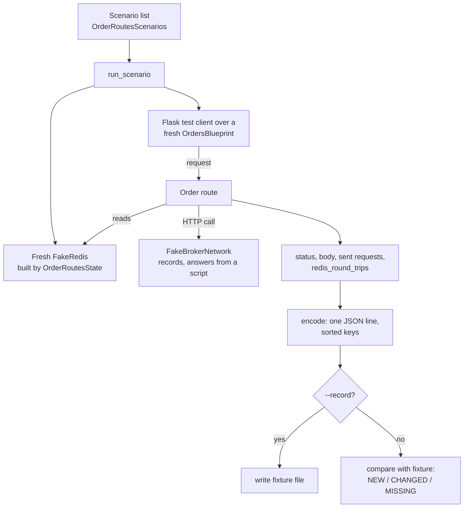

# Offline tests

UBI has no pytest suite. Instead, `test_runs/` holds eleven plain Python scripts, each of which checks one part of the system against scripted inputs. They are called "offline" because they need no network, no broker, no Redis and no database: every outside service is replaced by a stand-in that lives in memory. You run each one as a module from the project root.

```bash
.venv/bin/python -m test_runs.order_routes
```

Because they are plain scripts, there is no way to run a single case other than editing or importing the module. Each one prints its result and exits 0 when everything passes and 1 when something differs.

## The suites

The table below lists all eleven. "Fixture" is the recording a suite compares against, if it has one, and "Runtime" is what one run took on this machine on 2026-09-26.

| Command | What it pins | Fixture | `--record` | Runtime |
|---|---|---|---|---:|
| `python -m test_runs.candle_parse` | The seven historical candle parsers, against payloads recorded from the live APIs on 2026-09-12 | none (expected values in the file) | no | 0.3 s |
| `python -m test_runs.unified_ticks_sessions` | The session gate against the exchanges' 2026 calendars: holidays, half-closed commodity days, NCDEX's shorter evening, Muhurat trading | none | no | 0.1 s |
| `python -m test_runs.order_routes` | `place`, `modify` and `cancel`: status, body, every outgoing broker request and the number of Redis round trips | `test_runs/fixtures/order_routes.jsonl` (618 scenarios) | rewrites the whole file | 2.5 s |
| `python -m test_runs.order_engine_routes` | `POST /api/orders/place` in engine mode: status, body, the intents written to the stream, Redis round trips | `test_runs/fixtures/order_engine_routes.jsonl` (20) | rewrites the whole file | 0.9 s |
| `python -m test_runs.order_engine` | The order engine daemon against scripted intents and stubbed brokers: replies, broker requests, acknowledgements, counters | `test_runs/fixtures/order_engine.jsonl` (154) | rewrites the whole file | 0.9 s |
| `python -m test_runs.order_flatten` | The panic button, including that every cancel is sent and confirmed before any close | `test_runs/fixtures/order_flatten.jsonl` (12) | rewrites the whole file | 1.9 s |
| `python -m test_runs.contract_sizes` | The rule that decides whether a currency or commodity contract size is trusted | none | no | 0.3 s |
| `python -m test_runs.price_cache` | The Redis copy of candles behind `/api/instruments/prices`: slicing, widening, and every reason a copy is thrown away | none | no | 0.4 s |
| `python -m test_runs.virtual_queue` | The queue estimate behind the synthetic limit order book, and the process that keeps it | none | no | 0.1 s |
| `python -m test_runs.websocket_feeds` | Every broker's quotes and order sockets against scripted connections: every Redis command, frame sent, log line, login and wait | `test_runs/fixtures/websocket_feeds.jsonl` (160) | rewrites only the named brokers' lines | 0.6 s |
| `python -m test_runs.connection_warming` | That connection warming and the idle limit never make an order fail, against a local HTTP server that misbehaves | none | no | 36.4 s |

`order_engine_routes` has a fixture of its own on purpose. `--record` rewrites a whole file, so recording its scenarios into `order_routes.jsonl` would silently rewrite the recording that proves the direct path never changed.

## Running them all

The output below is the last lines of each suite from one run on 2026-09-26. `order_routes` was run with `UNIFIED_BROKER_INTERFACE_API_ORDER_PLACEMENT=direct`, for the reason explained in the warning after it.

```text
===== candle_parse
62/62 checks passed.
===== unified_ticks_sessions
41/41 checks passed
===== order_routes
618 of 618 scenarios match the recording, 0 differ
===== order_engine_routes
20 of 20 scenarios match the recording, 0 differ
===== order_engine
154 of 154 scenarios match the recording, 0 differ
===== order_flatten
12 of 12 scenarios match the recording, 0 differ
===== contract_sizes
8/8 checks passed.
===== price_cache
46/46 checks passed.
===== virtual_queue
48/48 checks passed.
===== websocket_feeds
160 of 160 scenarios match the recording, 0 differ
===== connection_warming
19/19 checks passed.
```

!!! warning "`order_routes` needs direct placement mode"
    `order_routes` records the direct path, in which the API worker calls the broker itself. It reads its configuration from `.env`, so when `.env` sets `UNIFIED_BROKER_INTERFACE_API_ORDER_PLACEMENT=engine`, the place route tries to write to a Redis stream that the suite's stand-in does not have. On this machine that made 288 of 618 scenarios fail with status `500` and `AttributeError: 'FakeRedis' object has no attribute 'xadd'` in the log. Setting the variable for the one command fixes it, because an environment variable that is already set wins over `.env`:

    ```bash
    UNIFIED_BROKER_INTERFACE_API_ORDER_PLACEMENT=direct .venv/bin/python -m test_runs.order_routes
    ```

## How the recording suites work

Five suites (`order_routes`, `order_engine_routes`, `order_engine`, `order_flatten` and `websocket_feeds`) do not state their expected results in code. Instead they record everything the code under test did, and compare it with a recording made earlier from code that was known to be right. It works like a flight recorder: any change in behaviour, however small, shows up as a difference.

The flowchart below shows one run of `order_routes`.



In words, `test_runs/order_routes.py` works through these steps:

1. It swaps the blueprint's Redis and MongoDB getters for its own. `FakeRedis` keeps keys in a dictionary and counts round trips, and `FakeBrokerNetwork` stands in for the brokers' servers, recording each request's method, URL, parameters, body, headers, timeout and certificate check, then answering from a script.
2. For each scenario it builds fresh Redis contents and a fresh blueprint, sends the request through Flask's test client, and keeps the status, the body, the requests that would have reached a broker, and the round-trip count.
3. It encodes each result as one line of JSON with sorted keys, so the same behaviour always produces the same text.
4. With `--record`, it writes every line to `test_runs/fixtures/order_routes.jsonl` and prints `recorded N scenarios to ...`.
5. Without it, it reads the recording and compares line by line. A scenario missing from the recording is printed as `NEW`, one whose line differs as `CHANGED` with both versions, and one in the recording but no longer run as `MISSING`. It ends with `N of M scenarios match the recording, K differ`.

Two lines from the real fixture show what a recorded scenario looks like:

```json
{"body": {"error": "Access token is required"}, "name": "token_header_missing", "redis_round_trips": 0, "sent": [], "status": 401}
{"body": {"error": "Invalid access token"}, "name": "token_wrong", "redis_round_trips": 1, "sent": [], "status": 401}
```

`websocket_feeds` records a different kind of thing. `test_runs/websocket_feeds/harness.py` gives each broker's socket class stand-ins for the websocket library, Redis, the broker's API class, the clock and the backoff waits, and each case file (`dhan.py`, `zerodha.py` and so on) drives the socket through a scripted list of connections. Everything the socket does to the outside world goes into one ordered `EventLog`: Redis commands, frames sent, log lines, logins and waits. The clock is frozen at 2026-09-25 10:15:30 IST, and bytes are stored as tagged base64, so every run produces the same log. When a scenario differs, the suite prints the first event where it departs from the recording rather than the whole log.

`websocket_feeds` also accepts broker names, and then runs and records only those brokers, keeping every other broker's lines in the fixture untouched:

```bash
.venv/bin/python -m test_runs.websocket_feeds zerodha
.venv/bin/python -m test_runs.websocket_feeds zerodha --record
```

!!! tip "When to use `--record`"
    Record only after an intended change, and read the `CHANGED` lines first to be sure every difference is one you meant. A refactor of `unified_broker_interface/blueprints/orders.py` must leave `order_routes` unchanged, with no recording needed.

## Which suites read `.env`

None of the suites connects to anything, but most of them import `utilities.configurations`, which loads the project's `.env` with python-dotenv. The docstrings of `order_routes`, `order_engine_routes`, `order_engine` and `order_flatten` state that `.env` has to exist for that import. Checking which modules the import pulls in shows the split below.

| Loads `utilities.configurations` on import | Does not |
|---|---|
| `candle_parse`, `order_routes`, `order_engine_routes`, `order_engine`, `order_flatten`, `contract_sizes`, `price_cache`, `connection_warming` | `unified_ticks_sessions`, `virtual_queue`, `websocket_feeds` (the package itself) |

Settings in `.env` can change what the API code does, as the `order_routes` warning above shows, so a failing suite is worth checking against `.env` before assuming the code is wrong.

## Scripts in test_runs that are not offline

Three files in `test_runs/` are not offline suites, and two of them reach the outside world.

| File | What it does | Offline? |
|---|---|:-:|
| `broker_login_test.py` | Builds broker API objects, which logs in to the live accounts; which brokers it logs in to depends on which lines are commented out | :material-close: |
| `download_instruments.py` | Downloads each broker's instrument master and appends today's snapshot to `<broker>.instruments`; `--bootstrap` replaces today's snapshot | :material-close: |
| `rest_api_app.py` | The Streamlit test page that `bin/rest-api-app` serves; it calls the local API | not a test |

!!! danger "`broker_login_test.py` logs in to live broker accounts"
    Running `test_runs/broker_login_test.py` performs real logins, some through a headless Chrome and a TOTP, and at Zerodha a new login invalidates the token every running Zerodha script holds. `download_instruments.py` also contacts the brokers and writes to the database. Run neither without a reason.

## Lint baseline

The project is linted with ruff 0.11.2, with no configuration file, so ruff's default rules apply. The tree is not clean: a run on 2026-09-26 reported 41 findings.

```bash
.venv/bin/ruff check .
```

```text
Found 41 errors.
[*] 11 fixable with the `--fix` option (14 hidden fixes can be enabled with the `--unsafe-fixes` option).
```

The table below breaks those 41 findings down by rule.

| Rule | Meaning | Count |
|---|---|---:|
| `F403` | `from module import *` | 14 |
| `F841` | A local variable is assigned but never used | 11 |
| `E712` | A comparison to `True` or `False` with `==` | 10 |
| `F401` | An import is unused | 3 |
| `F405` | A name may come from a star import | 2 |
| `E731` | A lambda is assigned to a name | 1 |

Almost all of them are in two places: 24 in `stock_brokers/api/` and 14 in `test_runs/broker_login_test.py`. The remaining three are two in `stock_brokers/instruments/` and one in `test_runs/unified_ticks_sessions.py`. Treat 41 as the baseline, and judge a change by whether it adds a finding rather than by whether the run is silent.
