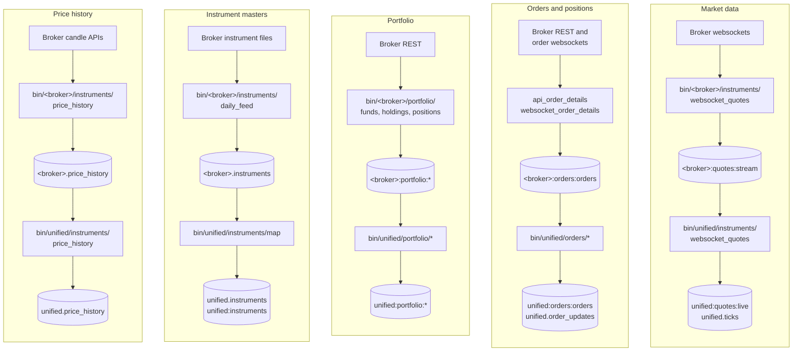

# Data pipelines

A pipeline, on these pages, is the path one kind of data takes from a broker's server to the REST API. There are five of them, and they are independent: each has its own scripts, its own Redis keys and its own tables, and each can run while the others are stopped. This section follows each one end to end.

## The five pipelines side by side

The flowchart below puts the five pipelines next to each other. Each column starts at a broker (or, for price adjustments, Yahoo Finance) and ends at the unified keys and tables the REST API reads.

The instrument pipeline feeds every other one: the unified scripts in the other four columns all resolve a broker's token to a unified `instrument_id` through the cache that `bin/unified/instruments/map` writes.

## Summary

The table below lists each pipeline's start and end, how often it runs, and the scripts it is made of.

| Pipeline | Starts at | Ends at | How often | Scripts |
|---|---|---|---|---|
| [Market data](market-data.md) | Each broker's quote websocket | `unified:quotes:live`, `<broker>.ticks`, `unified.ticks` | Continuously, tick by tick | `bin/<broker>/instruments/websocket_quotes`, `store_quotes_to_db`; `bin/unified/instruments/websocket_quotes`, `store_quotes_to_db` |
| [Orders and positions](orders-and-positions.md) | Each broker's order book, trade book and order websocket | `unified:orders:orders`, `unified:orders:trades`, `unified.order_updates`, `unified.positions` | Polls every 0.5 s (Fyers 5 s, Stoxkart 1 s), plus websocket pushes | `bin/<broker>/orders/*`, `bin/<broker>/portfolio/store_positions_to_db`; `bin/unified/orders/*`, `bin/unified/portfolio/store_positions_to_db` |
| [Portfolio](portfolio.md) | Each broker's funds, holdings and positions endpoints | `unified:portfolio:funds`, `unified:portfolio:holdings`, `unified:portfolio:positions` | Funds and positions every 0.5 s, holdings every 60 s | `bin/<broker>/portfolio/funds`, `holdings`, `positions`; `bin/unified/portfolio/funds`, `holdings`, `positions` |
| [Instrument masters and mapping](instrument-masters.md) | Each broker's daily instrument file | `<broker>.instruments`, `unified.instruments`, `unified.broker_mappings`, `unified:instruments` and the other cache keys | Once a day at 07:45 IST | `bin/<broker>/instruments/daily_feed`; `bin/unified/instruments/map` |
| [Price history](price-history.md) | Seven brokers' candle APIs, and Yahoo Finance | `<broker>.price_history`, `unified.price_history`, `unified.adjustment_factors` | Broker workers run all the time; the unified job runs at 08:30 IST, Monday to Saturday | `bin/<broker>/instruments/price_history`; `bin/unified/instruments/price_history` |

## Patterns every pipeline shares

The five pipelines were built the same way, so learning one teaches most of the others. These four patterns recur throughout:

- **Only broker scripts talk to brokers.** Among the pipeline scripts, only those under `bin/<broker>/` call a broker; anything under `bin/unified/` reads Redis and the database.
- **Redis first, database second.** A live script writes a Redis hash of current state and a capped Redis Stream of history. A separate `store_*_to_db` script drains the stream into TimescaleDB with `COPY`, using the consumer group `persist`; the unified scripts read the same stream through the group `unified`.
- **Acknowledge after commit.** Every stream reader acknowledges an entry only after its write succeeded, so a restart loses nothing except what the stream's length cap trimmed while it was stopped.
- **Swap, never half-write.** Daily caches are built under a `:staging` key and renamed into place, so a reader sees yesterday's complete data or today's, never a mix.

## Pages in this section

-   :material-chart-line:{ .lg .middle } **Market data**

    ---

    Live ticks from ten websockets, persisted per broker, then combined into one quote per instrument by an owner-per-instrument rule.

    [:octicons-arrow-right-24: Follow a tick](market-data.md)

-   :material-clipboard-list:{ .lg .middle } **Orders and positions**

    ---

    One hash per broker written by a poller and a websocket, the Lua script that settles their race, and the update streams.

    [:octicons-arrow-right-24: Follow an order update](orders-and-positions.md)

-   :material-wallet:{ .lg .middle } **Portfolio**

    ---

    Funds, holdings and positions polled from each broker and summed into three unified documents, with holdings priced from live quotes.

    [:octicons-arrow-right-24: Follow the money](portfolio.md)

-   :material-file-tree:{ .lg .middle } **Instrument masters and mapping**

    ---

    The 07:45 IST job that downloads ten instrument files and maps them onto one list of unified instruments.

    [:octicons-arrow-right-24: Follow an instrument](instrument-masters.md)

-   :material-history:{ .lg .middle } **Price history**

    ---

    Seven brokers' candle queues, and the daily job that builds one adjusted history per instrument.

    [:octicons-arrow-right-24: Follow a candle](price-history.md)

