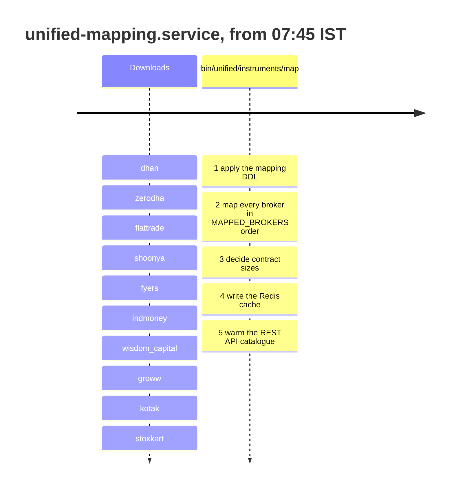
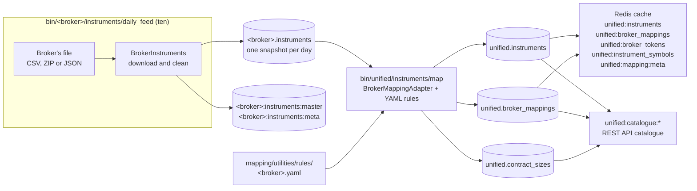
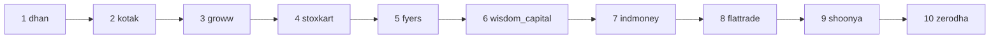

# Instrument masters and mapping

Every broker publishes a daily file listing the instruments it can trade, and every broker names them differently. This pipeline downloads the ten files each morning, keeps a dated copy of each, and then maps every row onto one shared list of instruments, so that "Reliance on NSE" has one `instrument_id` whichever broker you ask. Everything else in the project, from live quotes to order placement, looks instruments up in the result.

## The daily job

The whole pipeline runs as one systemd unit, `unified-mapping.service`, started by `unified-mapping.timer` at 07:45 IST every day, weekends included. The unit runs the ten downloads one after another and then the mapping. Each download line is prefixed with `-` in the unit file, so one broker's file failing does not stop the others or the mapping. The timeline below shows the order of the steps.



The unit file says the whole job takes about three quarters of an hour for ten downloads of up to 120 MB each and a full mapping. It must finish before the 09:00 pre-open, when the live feeds resolve their ticks against the new mapping. The timer is `Persistent=true`, so a machine that was off at 07:45 runs the job as soon as it starts, because the brokers publish only today's file and a missed day can never be fetched later.

## The flow

The flowchart below shows where the data goes, from the brokers' files to the tables and Redis keys that the rest of the project reads.



## Step 1: downloading each broker's master

Each broker's `bin/<broker>/instruments/daily_feed` downloads its master through a subclass of [`BrokerInstruments`][stock_brokers.instruments.base.BrokerInstruments] in `stock_brokers/instruments/<broker>.py`. The subclass only says where the file lives and what shape it arrives in; the base class does the cleaning and the database write. The table below summarizes what the ten brokers publish, as each module's docstring describes it.

| Broker | What the broker publishes | Rows are unique on |
|---|---|---|
| Dhan | One public detailed scrip master CSV | exchange, segment and security id |
| Flattrade | Eight public CSV files on S3, one per exchange and segment | exchange and trading symbol |
| Fyers | Seven public CSV files with no header row | the symbol ticker |
| Groww | One public CSV for every exchange and segment | exchange, segment and trading symbol |
| INDmoney | Three CSV files behind an access token, the only non-public master | exchange, segment and security id |
| Kotak | Seven public CSV files under a URL stamped with the day's date | exchange segment and trading symbol |
| Shoonya | Seven public ZIP archives, one per exchange | exchange and trading symbol |
| Stoxkart | One public CSV of roughly 36 MB | exchange and token |
| Wisdom Capital | A public POST endpoint, one call per exchange segment, returning pipe-delimited text | exchange segment and instrument id |
| Zerodha | One public CSV for every exchange | the instrument token |

### Cleaning and storing the table

[`BrokerInstruments.ingest`][stock_brokers.instruments.base.BrokerInstruments.ingest] takes these steps in order:

1. Read every file as text, so no value is converted on the way in and the broker's own formatting survives for the mapping.
2. Normalize the column names into lowercase SQL identifiers.
3. Strip leading and trailing whitespace from every text column.
4. Drop placeholder columns that are empty on every row, which a trailing delimiter on every line creates.
5. Drop the placeholder instruments some brokers ship, such as Zerodha's `NSETEST` rows.
6. Drop rows that repeat the broker's natural key, after sorting on a column so the row kept is predictable.
7. Add `download_date` and append the rows to `<broker>.instruments`.

A date already stored is skipped unless `--bootstrap` is given, so the job is safe to run twice. A column the table does not know about raises an error rather than being dropped, so a broker adding a field breaks the job loudly instead of losing the field silently. Afterwards the row count is compared with the average of every earlier day, and a swing of more than ten percent is reported but does not fail the job.

The tables are created by the numbered files in `stock_brokers/instruments/sql/ddl/`, applied with `python -m stock_brokers.instruments.sql.apply_ddl`.

### Writing the Redis copy

The same cleaned rows also go to Redis, whether or not the table already had today's snapshot. The swap works in three steps so that a reader never sees half a file:

1. The new hash is built under `<broker>:instruments:master:staging`, one field per instrument, each value the row as a JSON array.
2. In one pipeline, the current `<broker>:instruments:master` is renamed to `<broker>:instruments:master:previous` and the staging hash is renamed to `<broker>:instruments:master`.
3. The previous hash is unlinked, which frees it in the background.

Beside the hash, `<broker>:instruments:meta` holds `download_date`, `rows`, `columns` (the order every array follows), `source_last_modified` and `written_at`. Storing the column names once, instead of in every row, keeps the hash near the file's own size.

??? note "Running the downloads without systemd"
    `stock_brokers/instruments/orchestrator.py` holds the registry `INGESTERS`, one class per broker, and `ingest_all`, which downloads each broker in its own `try` block so that one failure never costs the others their snapshot. The offline helper `python -m test_runs.download_instruments zerodha dhan` uses it, and with no arguments it downloads every broker. It writes only the tables, not the Redis copy that `daily_feed` writes.

## Step 2: mapping to unified instruments

`bin/unified/instruments/map` reads the day's rows from all ten `<broker>.instruments` tables and writes the unified tables. It does five things in order.

| Step | What happens | Writes |
|---|---|---|
| 1. Tables | Applies the DDL in `stock_brokers/instruments/mapping/utilities/sql/ddl`, which is safe to run again | the `unified` schema |
| 2. Mapping | Classifies each broker's rows with its rules file and computes each row's `instrument_id` | `unified.instruments`, `unified.broker_mappings` |
| 3. Contract sizes | Decides how many quotation units one lot of every currency and commodity derivative is | `unified.contract_sizes` |
| 4. Cache | Writes the date's rows to Redis, swapped in all at once | the five keys in the cache table below |
| 5. Catalogue | Warms the REST API's instrument cache for the date and clears other dates | `unified:catalogue:*` |

`--cache-only --date YYYY-MM-DD` runs only the last three steps for a date already mapped. A date older than the newest one already in `unified.broker_mappings` is refused with exit code 2, because mapping an older date on top of newer data resolves seen dates and index names in the wrong order.

### How one instrument id is computed

Each broker's rows are mapped by a subclass of [`BrokerMappingAdapter`][stock_brokers.instruments.mapping.base.BrokerMappingAdapter] in `stock_brokers/instruments/mapping/<broker>.py`. An instrument's identity is a natural key: its exchange, segment and shape, plus a symbol for a security, an underlying and expiry for a future, and a strike and option type as well for an option. Every adapter computes `instrument_id` independently as a UUID5 over that key, so the same instrument from any broker lands on the same row in `unified.instruments` with no matching step. ISINs and broker tokens help classify a row but are never used to merge rows.

A row that no rule matches is not dropped. It lands in an uncategorised segment (`nse_uncategorised`, `bse_uncategorised`, `mcx_uncategorised`, `ncdex_uncategorised`, or plain `uncategorised` when the exchange cannot be told), so classification coverage stays measurable.

### The rules files

Each broker has one YAML file in `stock_brokers/instruments/mapping/utilities/rules/`. The file lists every segment the broker's rows can fall into, in the canonical order that `stock_brokers/instruments/mapping/utilities/segments.py` defines, and ends with the plain `uncategorised` entry. The table below explains every key used across the ten files.

| Key | Level | Meaning |
|---|---|---|
| `broker` | file | The broker's name |
| `raw_table` | file | The table the rows are read from, such as `dhan.instruments` |
| `segments` | file | The list of segment entries, in canonical order |
| `segment` | segment entry | The exchange-prefixed segment, such as `nse_equities` or `mcx_commodity_futures` |
| `exchange` | segment entry | The canonical exchange, such as `nse`, `bse` or `mcx`; `unknown` for the last catch-all |
| `shape` | segment entry | `security`, `future` or `option`, which decides the identity fields |
| `rules` | segment entry | A list of `match` rules; a row belongs to the first segment with a matching rule |
| `match` | rule | Raw column names mapped to one expected value or a list of accepted values; every column must match |
| `identity` | segment entry | Which raw column gives `symbol`, or `underlying_symbol`, `expiry_date`, `strike_price` and `option_type` |
| `broker_fields` | segment entry | Which raw column gives the broker's `token`, `broker_symbol`, `order_symbol`, `lot_size` and `tick_size` |
| `column`, `transform` | field | Used instead of a bare column name when a value needs converting |

The eight named transforms are `divide_by_100`, `divide_by_10_thousand`, `divide_by_10_million`, `day_month_year_date`, `day_month_name_year_date`, `unix_epoch_date`, `kotak_expiry_epoch` and `strip_exchange_prefix`. The first segment of `dhan.yaml` shows the pattern: two rules pick NSE debt rows by instrument type or series, the identity is the ISIN, and the tick size is divided by 100.

```yaml
  - segment: nse_fixed_income
    exchange: nse
    shape: security
    rules:
      - match:
          exch_id: NSE
          segment: E
          instrument_type:
            - DBT
            - DEB
            - TB
            - GB
            - CB
            - PTC
      - match:
          exch_id: NSE
          segment: E
          instrument_type: Other
          series:
            - GB
            - SG
            - TB
            - N0
            - N2
    identity:
      symbol: isin
    broker_fields:
      token: security_id
      broker_symbol: display_name
      lot_size: lot_size
      tick_size:
        column: tick_size
        transform: divide_by_100
```

Equality rules cannot express everything, so each adapter overrides the base class where it must. The base class names Zerodha as the fully custom case, whose classification is written in code rather than rules, and Stoxkart's adapter is the largest at 728 lines.

### The processing order

The brokers are mapped in a fixed order, `MAPPED_BROKERS` in `segments.py`, which is not alphabetical and not configurable. Several adapters resolve their index names against the `nse_equity_indices` rows that earlier brokers wrote for the same date, so the brokers with a clean index vocabulary go first.



Each broker is mapped in its own `try` block, so one wrong rules file does not cost the others their mapping. A broker's rows for the date are deleted before its insert, so a re-run after a fix leaves no stale rows.

### Cross-references and collisions

Two helpers step outside the rule that each adapter stands alone:

- **Cross-references** (`crossref.py`). Zerodha, Shoonya, Flattrade and INDmoney carry no ISIN column, so they cannot tell a fund, an exchange traded fund, an investment trust or a bond from an equity. These helpers let them classify against the answer an ISIN-bearing broker already gave, because a misfiled row is worse than an unmapped one.
- **Collisions** (`collisions.py`). A broker sometimes lists two rows for one scrip, such as Flattrade listing BSE token 500040 as both CENTURYTEX and ABREL after a rename. When all ten brokers had rows for the date, the mapping ends by merging away the stale name, using the other brokers' votes to decide which name is live. `--skip-collisions` turns this off.

### Contract sizes

The brokers' own lot sizes cannot be compared on currency and commodity markets, because each broker counts a lot in its own unit: on MCX, GOLD's lot is 1 at Zerodha, 1 at Kotak and 100 at Groww. `contract_sizes.py` reads the exchange's contract size from several brokers' files as independent sources and records a decision for every live contract.

| Status | When | Tradeable? |
|---|---|:---:|
| `confirmed` | At least two sources give a size and all agree | :material-check: |
| `single_source` | Exactly one source gives a size | only on BSE currencies and NCDEX |
| `conflict` | Sources disagree | :material-close: |
| `no_source` | No source gives a size | :material-close: |

A failure in this step is logged and does not fail the run, but orders on those contracts are then refused, because the catalogue warm finds no decision for them.

Before this step, the job runs `ANALYZE` on `unified.broker_mappings`, `unified.instruments` and every broker's `instruments` table, which takes about half a minute. The day's rows have only just been written, and autovacuum samples a table only once a tenth of it has changed since its last sample, so until then PostgreSQL's planner takes the new date for one that holds almost no rows. With that estimate it joins the day's mappings to a broker's snapshot with a nested loop that re-reads the whole snapshot once per mapping. On 2026-09-26, after a crash had reset the database's change counters, that made this step take about ninety minutes instead of under two seconds.

## Step 3: the Redis cache

The mapped date's rows are written to Redis so that the live scripts can resolve instruments without a database round trip. All four hashes are built under `:staging` keys and renamed into place together with the meta key, so a reader sees yesterday's complete cache or today's, never a mix. For one day that is about half a million instruments and two million mappings.

| Key | Keyed by | Value |
|---|---|---|
| `unified:instruments` | `instrument_id` | JSON array: `exchange`, `segment`, `shape`, `symbol`, `underlying_symbol`, `expiry_date`, `strike_price`, `option_type`, `first_seen_date`, `last_seen_date` |
| `unified:broker_mappings` | `broker:instrument_id` | JSON array: `broker_token`, `broker_symbol`, `order_symbol`, `lot_size`, `tick_size` |
| `unified:broker_tokens` | `broker:broker_token` | JSON array of the instrument ids that token names on the date |
| `unified:instrument_symbols` | `segment:SYMBOL`, such as `nse_equities:RELIANCE` | The instrument id, for brokers that send no token |
| `unified:mapping:meta` | (string key) | `mapping_date`, the four counts, `columns`, `written_at` |

The unified quote combiner in [Market data](market-data.md) re-reads `unified:mapping:meta` every 30 seconds and switches to the new date on its own. The order and portfolio combiners remember each resolved token until the cache's mapping date changes.

### The REST API catalogue

The REST API's instrument routes read a separate cache under `unified:catalogue:`, kept by the classes in `stock_brokers/instruments/mapping/utilities/cache.py`. It holds identities, each broker's tokens, order handles, a browsable catalogue per segment, and the contract size decisions. The cache has three tiers: the process's own memory, then Redis, then PostgreSQL, each filling the ones above it on a miss. The map script warms the Redis tier for the date and clears every other date's keys. A warm that fails is logged and does not fail the run, and the API reads the tables until the next warm succeeds.

## Exit codes

The map script's exit code is the unit's exit code, so it is what `systemctl --user status unified-mapping` reports.

| Code | Meaning |
|---|---|
| 0 | Every broker with rows mapped without errors and the cache was written |
| 1 | A broker failed, rows could not be mapped, no broker had rows for the date, the tables could not be prepared, or the cache could not be written |
| 2 | A bad argument, or a date older than the newest one already mapped |

```bash
systemctl --user start unified-mapping         # run the whole job now
journalctl --user -u unified-mapping           # read its log
redis-cli GET unified:mapping:meta             # which date the cache holds
```
