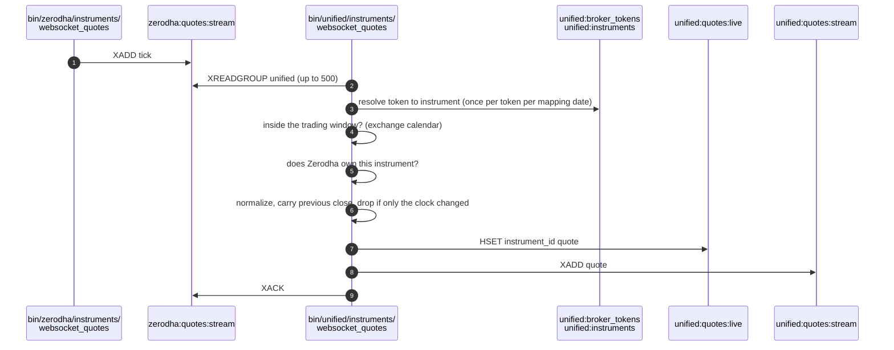
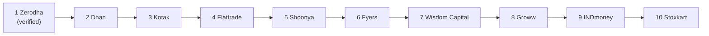

# Market data

This page follows one price update, called a tick, from a broker's websocket to the unified quote that the REST API serves. Every broker streams prices in its own protocol, so the first half of the pipeline is ten separate copies of the same idea. The second half is one script that reads all ten and decides, instrument by instrument, which broker to believe.

<figure class="diagram">
--8<-- "docs/assets/diagrams/market-data.svg"
<figcaption>Orange dots are broker ticks, blue dots are rows on their way to TimescaleDB, and green dots are unified quotes leaving the one script that picks an owner for each instrument.</figcaption>
</figure>

## The stages at a glance

The table below lists the four scripts a tick passes through, in order, with what each one reads and writes.

| Stage | Script | Reads | Writes |
|---|---|---|---|
| 1. Decode | `bin/<broker>/instruments/websocket_quotes` | The broker's websocket | `<broker>:quotes:live`, `<broker>:quotes:stream`, `<broker>:quotes:instruments` |
| 2. Keep the broker's history | `bin/<broker>/instruments/store_quotes_to_db` | `<broker>:quotes:stream`, group `persist` | `<broker>.ticks` |
| 3. Combine | `bin/unified/instruments/websocket_quotes` | All ten `<broker>:quotes:stream`, group `unified` | `unified:quotes:live`, `unified:quotes:stream`, `unified:quotes:stats`, `unified:quotes:unresolved` |
| 4. Keep the unified history | `bin/unified/instruments/store_quotes_to_db` | `unified:quotes:stream`, group `persist` | `unified.ticks` |

Stages 2 and 3 read the same broker stream through two different consumer groups. A consumer group is Redis's way of letting several independent readers each receive every entry, so the persister and the combiner never take ticks away from each other.

## Stage 1: the broker's quote socket

Each broker has one quote script, and each script runs one or more socket objects from `stock_brokers/websockets/<broker>.py`. The socket opens the connection, logs in, decodes the broker's frames and hands the decoded ticks to a function the script gives it. The script does every Redis write itself; the socket never touches Redis.

Nine of the ten sockets subclass [`BrokerWebsocket`][stock_brokers.websockets.base.BrokerWebsocket], which holds the reconnect loop they share. Stoxkart's two streams read a synchronous connection in a loop of their own and are the one exception. The shared loop works like this:

1. Connect, and block until the connection closes.
2. A connection that opened and was not refused resets the failure count and the backoff.
3. A refused handshake, or six failed connects in a row, logs in again once before connecting again.
4. If connecting still fails after that login, the socket gives up, so the script can exit 1 and let systemd restart it.
5. Otherwise the socket waits, doubling the wait from 1 second up to 60, and connects again.

### Which instruments are subscribed

Nine brokers subscribe to whatever is in a Redis set named `<broker>:quotes:subscriptions`, or to the `--tokens` argument when it is given. Zerodha is different: with no `--tokens`, it subscribes to every instrument in that day's `zerodha:instruments:master`, which held 112,657 instruments on 2026-09-16. The table below shows how each broker spells a subscription and how many instruments one connection carries.

| Broker | Instruments come from | One member looks like | Instruments per connection |
|---|---|---|---|
| Dhan | `dhan:quotes:subscriptions` | `NSE_EQ:2885` | up to 5,000 (default 5,000); Dhan allows 5 connections per user |
| Flattrade | `flattrade:quotes:subscriptions` | `NSE\|2885` | default 1,000 |
| Fyers | `fyers:quotes:subscriptions` | `NSE:SBIN-EQ` | up to 5,000 (default 5,000) |
| Groww | `groww:quotes:subscriptions` | `NSE\|CASH\|2885` | default 1,000; commodity tokens are skipped |
| INDmoney | `indmoney:quotes:subscriptions` | `NSE:2885` | default 1,000, one segment per socket |
| Kotak | `kotak:quotes:subscriptions` | `nse_cm\|11536` | 100, the default and the maximum |
| Shoonya | `shoonya:quotes:subscriptions` | `NSE\|2885` | default 1,000 |
| Stoxkart | `stoxkart:quotes:subscriptions` | `NSE:760946` | no per-socket option |
| Wisdom Capital | `wisdom_capital:quotes:subscriptions` | `1:2885` (XTS segment number, then instrument id) | default 1,000 |
| Zerodha | today's `zerodha:instruments:master` | Kite instrument token `738561` | split across `--sockets` sockets, 24 by default |

To add an instrument to a set-driven feed, add a member to its set and restart the script. For example, the Flattrade script's own docstring gives this command:

```bash
redis-cli SADD flattrade:quotes:subscriptions "NSE|2885" "MCX|565899"
```

!!! warning "Zerodha asks for more than Kite documents"
    Kite documents three websockets per API key and 3,000 instruments per websocket. Twenty-four sockets of about 4,700 instruments each exceeds both, so Kite is expected to refuse the sockets past its limit. A refused socket reconnects with backoff and leaves the others streaming, as the script's docstring explains.

### What the script writes

Every script writes one frame's ticks in a single Redis round trip, as a pipeline of two kinds of command:

- `HSET <broker>:quotes:live`, keyed by the instrument's name, holding the latest tick as JSON. The hash is not cleared at startup, so an instrument that is no longer subscribed keeps its last tick.
- `XADD <broker>:quotes:stream` with a field called `tick`, one entry per tick, trimmed approximately to a maximum length.

A third key, `<broker>:quotes:instruments`, maps every subscribed token to its name and is replaced whole when the script starts. Every tick carries the same twenty keys whatever the broker, with `None` for what the broker does not send; [Data contracts](../architecture/contracts.md) defines the tick.

## Stage 2: persisting each broker's ticks

`bin/<broker>/instruments/store_quotes_to_db` reads its broker's stream as the consumer group `persist` and writes ticks to the hypertable `<broker>.ticks` with PostgreSQL `COPY`, a batch at a time. A batch is written when it holds `--batch-size` ticks or has waited `--flush-interval` seconds, whichever comes first.

The persister acknowledges a stream entry only after the batch holding it is committed. The consequences are worth knowing:

- A crash, a refused write or a lost connection leaves the batch pending, and the next read takes pending entries first, so nothing is lost across a restart.
- A batch committed just before a crash, and not yet acknowledged, is written a second time, because `<broker>.ticks` has no unique key.
- Ticks trimmed from the stream while the persister was stopped are gone, and are counted as skipped when their pending ids come back empty.

The table is created when the script starts, from the broker's file in `stock_brokers/instruments/ticks/utilities/sql/ddl` (for example `010_zerodha_streams.sql`). Run only one instance of each persister, because a second would share the consumer name.

!!! danger "The stream cap is the one way ticks are lost"
    Each broker stream is trimmed at about 1,000,000 entries. If a persister stays down long enough for its stream to pass that cap, the oldest ticks are trimmed before they reach the database and cannot be recovered.

## Stage 3: the unified quote

`bin/unified/instruments/websocket_quotes` never calls a broker. It reads all ten `<broker>:quotes:stream` streams together as the consumer group `unified`, in batches of 500, and turns each tick into at most one unified quote. It creates its group at the end of each stream the first time, because a live cache has no use for history.

The sequence below follows one tick through the combiner, from the moment the broker script appends it.



### The six steps, cheapest refusal first

Each tick goes through six steps. The order puts the cheapest way of dropping a tick first, so that ticks which will be dropped cost as little as possible.

1. **Resolve.** The broker's token is turned into a unified instrument, once per token per mapping date. The token is looked up in `unified:broker_tokens` and kept only among the segments its exchange and kind allow. An expired contract is ruled out, and a token that still names more than one instrument is not guessed at. The instrument's lot size is decided from every broker's mapping, and quantities a broker reports in lots are multiplied up to units.
2. **Session gate.** A tick received outside its instrument's trading window is dropped, which keeps weekend replays and mock sessions out.
3. **Ownership.** Only the broker that owns the instrument has its ticks written.
4. **Normalize.** Prices are rounded (4 places for currency, 2 otherwise), negative prices are allowed only for commodity derivatives, empty order book levels are dropped, and timestamps days away from receipt are discarded.
5. **Previous close.** The previous close is carried from an earlier owner's tick on the same India day when the current owner does not send it, and the change is recomputed from it.
6. **De-duplicate.** A tick that changes nothing but the clock is dropped.

### The session gate

The windows are wider than the trading hours, so that a tick arriving a little late is still accepted. The table below lists the windows as they are defined in the script, in IST. A day the exchange calendar marks closed has no window, weekends have none, and special sessions such as Muhurat trading replace the normal window.

| Instruments | Window opens | Trading closes | Window closes |
|---|---|---|---|
| NSE and BSE equity and equity derivatives | 09:00 | 15:30 | 16:00 |
| Currency | 09:00 | 17:00 | 17:30 |
| MCX and other commodities | 09:00 (evening half from 17:00) | 23:55 | 23:59:59 |
| NCDEX | 09:00 (evening half from 17:00) | 21:00 | 21:30 |

The holidays and special sessions come from one YAML file a year in `stock_brokers/instruments/ticks/utilities/calendars/` (today, `2026.yaml`). If only the morning or only the evening session of a commodity exchange is closed, the gate opens only the other half.

### Choosing the owning broker

One broker owns each instrument at a time. The priority below is used for every exchange, and verified brokers always rank above unverified ones. Today Zerodha is the only verified broker.



MCX uses the same order without INDmoney, and NCDEX uses only Shoonya and then Wisdom Capital. Ownership changes hands under the rules in the next table, whose numbers are constants at the top of the script.

| Situation | What happens | Constant |
|---|---|---|
| The top verified broker sends a new instrument | It takes the instrument at once | |
| Any other broker sends a new instrument first | It waits for a better broker before taking it | `INITIAL_GRACE_SECONDS = 5.0` |
| The owner's whole stream goes silent | A backup takes over | `STALE_SOCKET_SECONDS = 45.0` |
| The owner stops sending one instrument while a backup sends it 3 times | The backup takes over | `INSTRUMENT_LAG_SECONDS = 60.0`, `INSTRUMENT_LAG_BACKUP_TICKS = 3` |
| A higher-ranked verified broker has been healthy again for a while | It takes the instrument back | `HANDBACK_HEALTHY_SECONDS = 60.0` |
| The instrument's session ends | Ownership starts afresh | |

Health is judged per broker stream from the ticks it carries, because the streams carry no heartbeats. When an owner goes silent and no backup is healthy, the last quote stays in `unified:quotes:live` with `stale` set to true and `stale_since` set. Quotes that have been stale for a week are removed by an hourly purge.

### What the broker's `close` means

The brokers disagree about what `close` means, so the combiner takes it as the previous session's close only where that is true. The table below is taken from the script's docstring.

| Rule | Brokers |
|---|---|
| `close` is always the previous close | Zerodha, Kotak, Fyers |
| `close` is the previous close only before the session ends | Dhan, Stoxkart, Flattrade, Shoonya |
| `close` is never the previous close | Groww, INDmoney, Wisdom Capital |

### What the combiner writes

The combiner writes each batch in one Redis pipeline and acknowledges the batch afterwards. It also does some housekeeping on a timer.

| Key | Type | Content | Written |
|---|---|---|---|
| `unified:quotes:live` | Hash | One unified quote per `instrument_id` | Every accepted tick |
| `unified:quotes:stream` | Stream | Every quote written, field `quote` | Every accepted tick |
| `unified:quotes:stats` | String (JSON) | `at`, `pipeline` counts (received, unresolved, out_of_session, not_owner, no_price, duplicate, written), `undecodable`, `plans`, `mapping_date` | Every 10 seconds |
| `unified:quotes:unresolved` | Hash | A count per `broker:token:reason` | Every 10 seconds |

The mapping date is re-read every 30 seconds, so the combiner picks up the new instrument cache after the morning mapping job without a restart. At startup it recovers the day's previous closes from `unified:quotes:live`. The fields of one unified quote are listed in [Data contracts](../architecture/contracts.md), and the REST API serves them through [`GET /api/instruments/quote`](../rest-api/market-quotes.md#quote).

??? note "Two copies of the tick normalizers"
    The combiner carries its own normalizer classes inside the script. The package `stock_brokers/instruments/ticks/` holds a second set, one [`TickNormalizer`][stock_brokers.instruments.ticks.base.TickNormalizer] subclass per broker, registered in `NORMALIZERS` in `stock_brokers/instruments/ticks/utilities/registry.py`. That package is what the REST API uses when it has no fresh cached quote and asks a broker's REST API instead (`unified_broker_interface/utilities/broker_quotes/utilities/service.py`), so that a fetched quote is normalized the same way as a streamed one.

## Stage 4: persisting unified quotes

`bin/unified/instruments/store_quotes_to_db` reads `unified:quotes:stream` as its own `persist` group and writes one row per quote to `unified.ticks` with `COPY`. The table is created at startup from `300_unified_ticks.sql`. A quote without an `instrument_id`, a quote flagged `stale`, or an entry that is not JSON is skipped and acknowledged. It follows the same acknowledge-after-commit rule as the broker persisters, so a restart loses nothing except what the stream cap trimmed.

## Stream lengths

Every stream in this pipeline is trimmed approximately (`XADD ... MAXLEN ~`) to a cap set as a constant in the script that writes it. The table below lists those constants, so you can judge how long a persister can be down before ticks are lost.

| Stream | Written by | Cap (`MAXLEN ~`) |
|---|---|---:|
| `<broker>:quotes:stream`, all ten brokers | `bin/<broker>/instruments/websocket_quotes` | 1,000,000 |
| `unified:quotes:stream` | `bin/unified/instruments/websocket_quotes` | 1,000,000 |

!!! note "The unified persister's docstring gives an older number"
    The docstring of `bin/unified/instruments/store_quotes_to_db` says the unified stream is capped at about 200,000 entries, but the constant `QUOTES_STREAM_MAX_LENGTH` in the script that writes the stream is 1,000,000. The table above follows the code.

## Checking the pipeline by hand

These read-only commands, taken from the scripts' docstrings, show each stage's state.

```bash
redis-cli HGET zerodha:quotes:live "NSE:RELIANCE"     # stage 1: one broker's latest tick
redis-cli XINFO GROUPS zerodha:quotes:stream          # stages 2 and 3: lag of persist and unified
redis-cli HGET unified:quotes:live <instrument id>    # stage 3: the unified quote
redis-cli GET unified:quotes:stats                    # stage 3: why ticks were dropped
redis-cli XINFO GROUPS unified:quotes:stream          # stage 4: the unified persister's lag
```
