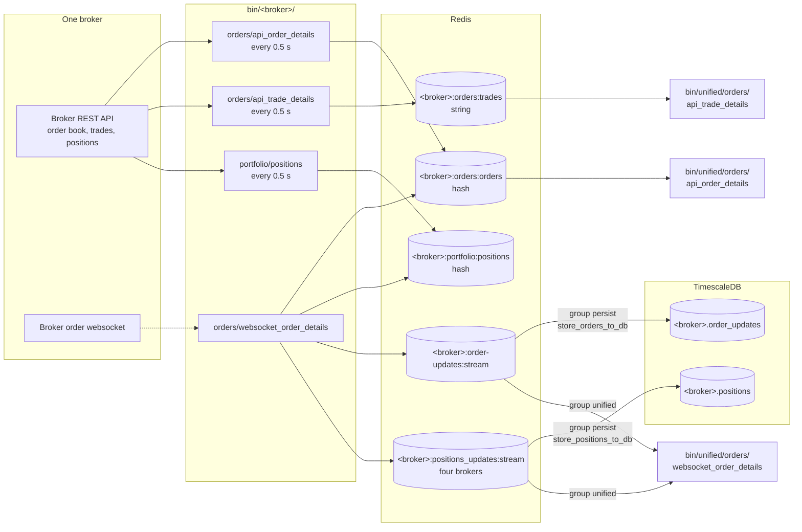
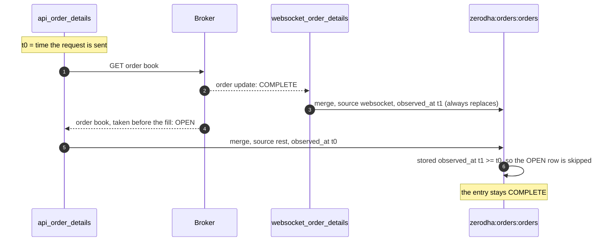

# Orders and positions

This page explains how the project knows the state of every order and position at every broker. Two sources report the same orders: a REST poller that reads the broker's order book every half second, and a websocket that pushes each change as it happens. Both write into one Redis hash per broker, and a small Lua script decides which write wins when they race. Unified scripts then combine the ten hashes into the documents the REST API serves.

Placing, modifying and cancelling orders is a different path, which goes from the REST API straight to a broker. It is described in [REST API](../rest-api/index.md). This page only covers how orders are observed.

## The whole flow

The flowchart below shows every script and key involved for one broker, and the unified layer on the right. Solid arrows are writes; the dotted arrow is the broker's websocket pushing a change.



## One hash per broker

Each broker's orders live in one Redis hash, `<broker>:orders:orders`, keyed by the broker's order id. Two scripts write into it:

- `bin/<broker>/orders/api_order_details` polls the day's order book and merges every row.
- `bin/<broker>/orders/websocket_order_details` merges each update the broker's order websocket delivers.

Every value in the hash has the same four fields, whichever script wrote it.

```json
{"observed_at": 1789012345.678, "source": "rest", "order": {"...": "the normalized order"}, "data": {"...": "the broker's own order"}}
```

The `order` field is the broker's order translated onto one shared vocabulary: status becomes `PENDING`, `OPEN`, `COMPLETE`, `CANCELLED`, `REJECTED` or `EXPIRED`, and an unknown term is passed through uppercased so that it shows up rather than disappearing. The `data` field is the order exactly as the broker sent it. [Data contracts](../architecture/contracts.md) lists the fields of a normalized order.

Positions follow the same pattern in `<broker>:portfolio:positions`, written by `bin/<broker>/portfolio/positions` and, for the four brokers whose websocket carries positions, by `websocket_order_details` too. A position entry holds `position` instead of `order`.

### Daily reset

The hashes expire at 06:00 IST, and every write moves the expiry to the next 06:00. Yesterday's orders therefore stay readable overnight, and the first poll of the day starts a fresh hash. An order is never removed before then, because one the websocket has just reported may not be in the order book yet.

### How often each broker is polled

Most pollers wait half a second between requests. The table below lists the exceptions, with the reason the scripts give.

| Broker | Order book | Trade book | Positions | Why |
|---|---:|---:|---:|---|
| Fyers | 5 s | 15 s | 5 s | Fyers allows an app 200 requests a minute and 100,000 a day, shared by every Fyers script and the history download |
| Stoxkart | 1 s | 1 s | 1 s | Stoxkart documents a limit of one order book request a second |
| Every other broker | 0.5 s | 0.5 s | 0.5 s | |

Each successful order or positions poll also records its time in `<broker>:orders:orders:polled_at` or `<broker>:portfolio:positions:polled_at`. The hash alone cannot say that a poll succeeded when the book is empty, because Redis keeps no empty hash.

## Which write wins

The poller and the websocket can report the same order at almost the same moment, and the poller's answer can be older than what the websocket already wrote. The rule that settles this is simple:

- A websocket update always replaces its order's entry.
- A polled row replaces an entry only when that entry was observed **before** the poll's request was sent.

For this to work, `observed_at` of a polled row is the moment its request was sent, not the moment the answer arrived. The check and the write happen together inside Redis, as one Lua script, so nothing can slip in between them.

### The race it prevents

The sequence below shows an order filling while a poll is in flight. Without the rule, step 6 would overwrite the fill with the older "open" snapshot, and the order would look open until the next poll.



A stale entry that the rule protects by mistake is corrected by the next poll, whose request is sent after the stored `observed_at`.

### The Lua script

Every poller and websocket script carries its own copy of this script, as the project keeps each script self-contained. The copy below is `MERGE_SCRIPT` from `bin/zerodha/orders/api_order_details`. `KEYS[1]` is the hash, and `ARGV` holds the expiry time, the source, the observed-at time, and then pairs of field and value.

```lua
local kind = redis.call('TYPE', KEYS[1])
if type(kind) == 'table' then kind = kind['ok'] end
if kind ~= 'hash' and kind ~= 'none' then redis.call('DEL', KEYS[1]) end
local written = 0
for i = 4, #ARGV, 2 do
    local replace = true
    if ARGV[2] == 'rest' then
        local current = redis.call('HGET', KEYS[1], ARGV[i])
        if current then
            local ok, decoded = pcall(cjson.decode, current)
            if ok and type(decoded) == 'table' and tonumber(decoded['observed_at'])
                    and tonumber(decoded['observed_at']) >= tonumber(ARGV[3]) then
                replace = false
            end
        end
    end
    if replace then
        redis.call('HSET', KEYS[1], ARGV[i], ARGV[i + 1])
        written = written + 1
    end
end
if #ARGV >= 4 then redis.call('EXPIREAT', KEYS[1], ARGV[1]) end
return written
```

Reading it line by line:

1. If the key exists but is not a hash (the order book used to be stored whole, as one string), it is deleted so the hash can replace it.
2. For each field and value pair, a `rest` write first reads the stored entry and decodes its JSON.
3. If the stored `observed_at` is at or after this poll's `observed_at` (`ARGV[3]`), the row is skipped.
4. Any other write, including every `websocket` write, is applied with `HSET`.
5. The expiry is moved to the next 06:00 IST with `EXPIREAT`, and the script returns how many fields it wrote.

## Update streams and their persisters

A hash keeps only the latest state of each order. To keep every transition, each `websocket_order_details` script also appends each update to a Redis Stream, as `{"timestamp": ..., "data": <the broker's payload>}`. A persister reads the stream as the consumer group `persist` and writes one row per update to TimescaleDB with `COPY`.

| Stream | Field | Brokers | Persister | Table |
|---|---|---|---|---|
| `<broker>:order-updates:stream` | `update` | all ten | `bin/<broker>/orders/store_orders_to_db` | `<broker>.order_updates` |
| `<broker>:positions_updates:stream` | `position` | Fyers, Groww, Kotak, Wisdom Capital | `bin/<broker>/portfolio/store_positions_to_db` | `<broker>.positions` |
| `unified:order-updates:stream` | `update` | combined | `bin/unified/orders/store_orders_to_db` | `unified.order_updates` |
| `unified:positions_updates:stream` | `position` | combined | `bin/unified/portfolio/store_positions_to_db` | `unified.positions` |

The broker streams are capped at about 20,000 entries each (`STREAM_MAX_LENGTH = 20000`), and the two unified streams at about 50,000. A position row is a snapshot rather than an event, so `<broker>.positions` is the series of a position's states over time.

The persisters acknowledge an entry only after its batch is committed, so a restart loses nothing, and a batch committed just before a crash can be written twice. Each table is created when its persister starts, from the broker's file under `stock_brokers/instruments/ticks/utilities/sql/ddl`.

!!! danger "Updates past the stream cap are lost"
    If a persister stays stopped long enough for its stream to pass the cap, the trimmed updates never reach the database. They are counted as skipped when their pending ids come back empty.

!!! note "Flattrade's order websocket is not enabled"
    Flattrade permits one websocket per session and the quote feed holds it, so `services/flattrade/flattrade.target` leaves `flattrade-orders@websocket_order_details.service` out. Flattrade's orders come from the poller alone.

## The unified layer

Five scripts in `bin/unified/` combine the brokers' keys. None of them calls a broker; they read only Redis, and resolve each broker's token to a unified `instrument_id` through `unified:broker_tokens` (or `unified:instrument_symbols` for Groww, which sends no token).

| Script | Reads | Writes | How often |
|---|---|---|---|
| `bin/unified/orders/api_order_details` | every `<broker>:orders:orders` and its `polled_at` | `unified:orders:orders` | every 0.5 s |
| `bin/unified/orders/api_trade_details` | every `<broker>:orders:trades` | `unified:orders:trades` | every 0.5 s |
| `bin/unified/orders/websocket_order_details` | the 14 broker update streams, group `unified` | `unified:order-updates:stream`, hash `unified:order-updates`, `unified:positions_updates:stream`, hash `unified:positions_updates` | as updates arrive |
| `bin/unified/orders/store_orders_to_db` | `unified:order-updates:stream`, group `persist` | `unified.order_updates` | as updates arrive |
| `bin/unified/portfolio/store_positions_to_db` | `unified:positions_updates:stream`, group `persist` | `unified.positions` | as updates arrive |

The combined positions document is built by `bin/unified/portfolio/positions`, which is described with the other portfolio documents in [Portfolio](portfolio.md).

### The orders document

`unified:orders:orders` has the shape that [`GET /api/orders/details`](../rest-api/orders.md#order-book) returns: `orders`, `summary` (`count`, `by_status`, `filled_value`), `brokers` and `as_of`. Orders are sorted by broker, then order time, then order id. The `brokers` list says how each broker's hash was read, which lets a client tell an empty order book from a stopped poller.

| Status | Meaning | Orders included? |
|---|---|:---:|
| `ok` | The newest `observed_at` or the last poll is within a minute | :material-check: |
| `stale` | Older than a minute; the poller has probably stopped | :material-check: |
| `missing` | No hash and no recorded poll; the broker's scripts have not run today | :material-close: |
| `unreadable` | The key is not a hash, or no entry in it holds an order | :material-close: |

### The combined update streams

`bin/unified/orders/websocket_order_details` normalizes each broker's update with the same function that broker's own script uses, adds `broker`, `instrument_id` and `observed_at`, and appends it to the unified stream. It also keeps the latest update per order in the hash `unified:order-updates`, keyed `broker:order_id`. Position updates from the four brokers that stream them get the same treatment in `unified:positions_updates`, keyed `broker:position_key`. Their `last_price` and day change are null, because none of the four position streams carries prices.

The unified hashes expire at 06:00 IST like the brokers' hashes. An update observed before the latest 06:00 still goes to the unified stream but not into the hash, so yesterday's orders do not refill today's.

??? note "Under the hood"
    - Per-broker scripts: `bin/<broker>/orders/api_order_details`, `api_trade_details`, `websocket_order_details`, `store_orders_to_db`, and `bin/<broker>/portfolio/positions` and `store_positions_to_db`.
    - Socket classes: `<Broker>OrderUpdatesSocket` in `stock_brokers/websockets/<broker>.py`, and `StoxkartOrderSocket` for Stoxkart.
    - Trade books are not merged: each `api_trade_details` poll replaces `<broker>:orders:trades` whole with `SET`, as `{"timestamp", "status", "code", "data"}`.
    - `bin/unified/orders/order_engine` and `bin/unified/orders/virtual_book` also live in this folder, but they place and follow synthetic orders rather than observing broker orders.
