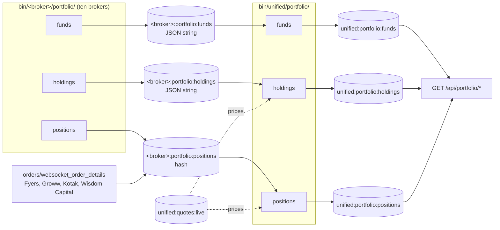
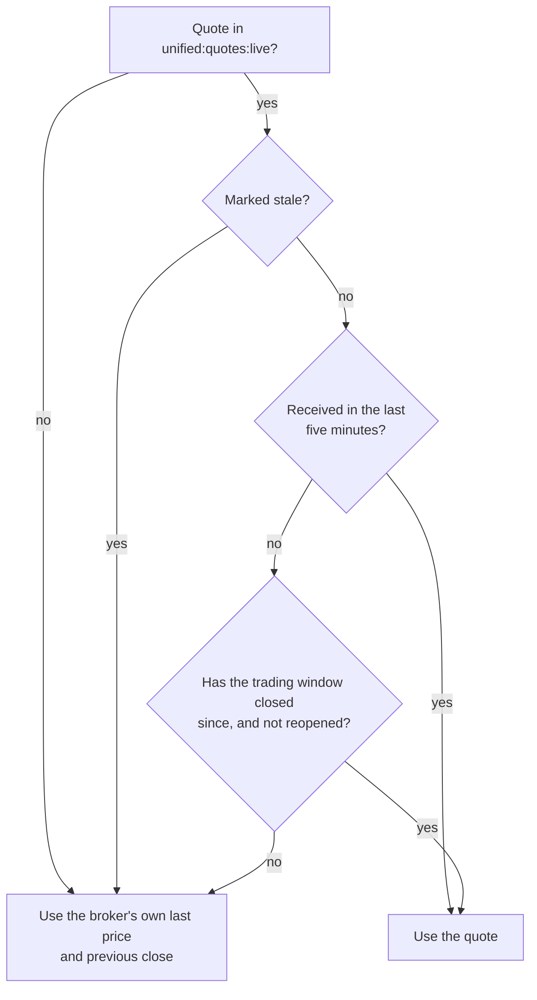

# Portfolio

This page covers how cash, holdings and positions from ten brokers become three documents in Redis that the REST API serves as one account. The work happens in two steps. Per-broker pollers copy each broker's own answer into Redis, and three unified combiners read those copies, translate every broker's field names, and add the numbers up.

## The flow

The flowchart below shows the three per-broker pollers on the left, the keys they fill, and the three unified combiners that turn them into the documents the API reads.



## Per-broker pollers

Each broker has three pollers in `bin/<broker>/portfolio/`. They call the broker's REST API through its class in `stock_brokers/api/`, which logs in first when the stored session is dead, and they never place orders.

Funds and holdings are stored the simple way. Each response is written with `SET` as one JSON string, `{"timestamp", "status", "code", "data"}`, with the broker's own answer under `data`, and it replaces the one before. A failed poll is logged and leaves the key unchanged.

Positions are stored the careful way, as the hash `<broker>:portfolio:positions` with one field per position. The poller and, for four brokers, the order websocket both merge into it, under the same "which write wins" rule that orders use. [Orders and positions](orders-and-positions.md#which-write-wins) explains that rule and quotes the Lua script. The hash expires at 06:00 IST, and every write moves the expiry to the next 06:00.

### How often each broker is polled

The pollers wait a fixed time between requests, set by `DELAY_SECONDS` in each script. The table below lists the values; every broker not named separately uses the first row.

| Broker | Funds | Holdings | Positions |
|---|---:|---:|---:|
| Dhan, Flattrade, Groww, INDmoney, Kotak, Shoonya, Wisdom Capital, Zerodha | 0.5 s | 60 s | 0.5 s |
| Fyers | 30 s | 60 s | 5 s |
| Stoxkart | 1 s | 60 s | 1 s |

Fyers polls more slowly because it allows an app 200 requests a minute and 100,000 a day across every endpoint, shared by all the Fyers scripts and the candle download. Stoxkart polls once a second because it documents a limit of one request a second on its order book.

The chart below puts the same numbers side by side with the three unified combiners. The horizontal axis is logarithmic, because the values run from half a second to a minute.

```vegalite
{
  "$schema": "https://vega.github.io/schema/vega-lite/v5.json",
  "description": "Seconds between refreshes for each poller and combiner, from DELAY_SECONDS in each script.",
  "width": "container",
  "height": 300,
  "data": {"values": [
    {"writer": "Dhan", "document": "funds", "seconds": 0.5},
    {"writer": "Dhan", "document": "holdings", "seconds": 60},
    {"writer": "Dhan", "document": "positions", "seconds": 0.5},
    {"writer": "Flattrade", "document": "funds", "seconds": 0.5},
    {"writer": "Flattrade", "document": "holdings", "seconds": 60},
    {"writer": "Flattrade", "document": "positions", "seconds": 0.5},
    {"writer": "Fyers", "document": "funds", "seconds": 30},
    {"writer": "Fyers", "document": "holdings", "seconds": 60},
    {"writer": "Fyers", "document": "positions", "seconds": 5},
    {"writer": "Groww", "document": "funds", "seconds": 0.5},
    {"writer": "Groww", "document": "holdings", "seconds": 60},
    {"writer": "Groww", "document": "positions", "seconds": 0.5},
    {"writer": "INDmoney", "document": "funds", "seconds": 0.5},
    {"writer": "INDmoney", "document": "holdings", "seconds": 60},
    {"writer": "INDmoney", "document": "positions", "seconds": 0.5},
    {"writer": "Kotak", "document": "funds", "seconds": 0.5},
    {"writer": "Kotak", "document": "holdings", "seconds": 60},
    {"writer": "Kotak", "document": "positions", "seconds": 0.5},
    {"writer": "Shoonya", "document": "funds", "seconds": 0.5},
    {"writer": "Shoonya", "document": "holdings", "seconds": 60},
    {"writer": "Shoonya", "document": "positions", "seconds": 0.5},
    {"writer": "Stoxkart", "document": "funds", "seconds": 1},
    {"writer": "Stoxkart", "document": "holdings", "seconds": 60},
    {"writer": "Stoxkart", "document": "positions", "seconds": 1},
    {"writer": "Wisdom Capital", "document": "funds", "seconds": 0.5},
    {"writer": "Wisdom Capital", "document": "holdings", "seconds": 60},
    {"writer": "Wisdom Capital", "document": "positions", "seconds": 0.5},
    {"writer": "Zerodha", "document": "funds", "seconds": 0.5},
    {"writer": "Zerodha", "document": "holdings", "seconds": 60},
    {"writer": "Zerodha", "document": "positions", "seconds": 0.5},
    {"writer": "Unified combiner", "document": "funds", "seconds": 0.5},
    {"writer": "Unified combiner", "document": "holdings", "seconds": 60},
    {"writer": "Unified combiner", "document": "positions", "seconds": 0.5}
  ]},
  "mark": {"type": "point", "filled": true, "size": 90, "opacity": 0.9},
  "encoding": {
    "y": {"field": "writer", "type": "nominal", "title": null, "sort": null},
    "x": {"field": "seconds", "type": "quantitative", "title": "Seconds between refreshes (log scale)", "scale": {"type": "log", "domain": [0.3, 100]}},
    "color": {"field": "document", "type": "nominal", "title": "Document", "scale": {"domain": ["funds", "holdings", "positions"], "range": ["#2a78d6", "#eb6834", "#1baf7a"]}},
    "shape": {"field": "document", "type": "nominal", "title": "Document"},
    "yOffset": {"field": "document", "type": "nominal"},
    "tooltip": [
      {"field": "writer", "title": "Writer"},
      {"field": "document", "title": "Document"},
      {"field": "seconds", "title": "Seconds"}
    ]
  }
}
```

## The unified combiners

Three scripts in `bin/unified/portfolio/` build the combined documents. They read only Redis, never a broker, and write their document with `SET`.

| Script | Reads | Writes | Refreshes | Stale after |
|---|---|---|---:|---:|
| `bin/unified/portfolio/funds` | every `<broker>:portfolio:funds` | `unified:portfolio:funds` | 0.5 s | 60 s |
| `bin/unified/portfolio/holdings` | every `<broker>:portfolio:holdings`, the instrument cache, `unified:quotes:live` | `unified:portfolio:holdings` | 60 s | 180 s |
| `bin/unified/portfolio/positions` | every `<broker>:portfolio:positions` and its `polled_at`, the instrument cache, `unified:quotes:live` | `unified:portfolio:positions` | 0.5 s | 60 s |

### Each broker's status in the document

Every unified document carries a `brokers` list with one entry per broker, holding a `status` and an `as_of` time. The status tells a reader whether a broker's numbers are current, old, or absent, so that a broker whose scripts have stopped is never mistaken for a broker holding nothing.

| Status | Meaning | Added into the totals? |
|---|---|:---:|
| `ok` | The broker's data was stored recently enough | :material-check: |
| `stale` | Stored longer ago than the "stale after" time above; its script may have stopped | :material-check: |
| `missing` | There is no key at all, so the broker's scripts have not run today | :material-close: |
| `unreadable` | The stored value is not what was expected, such as a refusal a broker carried inside a successful answer | :material-close: |

For positions, `as_of` is the newer of the newest entry's `observed_at` and the last successful poll recorded in `<broker>:portfolio:positions:polled_at`, so a flat account that is being polled reads as `ok` with no positions. For funds, an `unreadable` entry also carries an `error` saying why.

### Funds

`unified:portfolio:funds` has the shape of [`GET /api/portfolio/funds`](../rest-api/portfolio.md#funds): `summary`, `pnl`, `margin_breakdown`, `cash_movement`, `segments`, `brokers` and `as_of`. Every figure is the sum across brokers, rounded to paise. No broker reports a total, so `total_balance` is computed as `available_balance` plus `margin_utilized`. A field a broker does not report contributes nothing, and a blank or non-numeric value, including Wisdom Capital's `"NaN"`, is read as zero.

### Holdings

`unified:portfolio:holdings` has the shape of [`GET /api/portfolio/holdings`](../rest-api/portfolio.md#holdings): `holdings`, `summary`, `brokers` and `as_of`. The combiner takes these steps for every holding:

1. **Read.** Each broker's row is read with that broker's own field names; the script's docstring has the full table.
2. **Resolve.** The broker's token is looked up in `unified:broker_tokens` among the cash segments, on the exchange the broker names, or NSE then BSE when it names none. Groww sends no token, so a Groww holding is looked up by symbol in `unified:instrument_symbols`.
3. **Merge.** Brokers are taken in name order, and two holdings become one row when they share an ISIN or an instrument id. Quantities, invested values and pledged quantities add up.
4. **Price.** The row is priced from the instrument's live quote, as the next section explains.

### How holdings are priced

A resolved holding is priced by its instrument's quote in `unified:quotes:live`, which `bin/unified/instruments/websocket_quotes` keeps (see [Market data](market-data.md)). The quote's `last_price` gives the current value, and its `previous_close` gives the day change. The combiner uses a quote by the same rule the REST API's quote service uses for its cache:



The trading window is judged against the exchanges' calendars, the same ones the market data pipeline uses. When no usable quote exists, the holding falls back to the last price a broker sent, or failing that to the previous close, with no day change. Groww, INDmoney and Wisdom Capital send neither a last price nor a close with their holdings, so a holding only they carry, with no usable quote, has no `last_price`, `current_value`, unrealized profit or day change.

### Positions

`unified:portfolio:positions` has the shape of [`GET /api/portfolio/positions`](../rest-api/portfolio.md#positions): `net`, `day`, `summary`, `brokers` and `as_of`. The `net` list holds every position open now; the `day` list holds today's activity alone, which only Zerodha and Wisdom Capital report. Positions are merged into one row when they share an instrument and a product, and a resolved row's last price comes from `unified:quotes:live`, falling back to the price a broker sent. Profit is always the brokers' own figure.

??? note "Under the hood"
    - Per-broker scripts: `bin/<broker>/portfolio/funds`, `holdings` and `positions`.
    - Unified scripts: `bin/unified/portfolio/funds`, `holdings` and `positions`.
    - Instrument cache read for resolving: `unified:broker_tokens`, `unified:instrument_symbols`, `unified:instruments` and `unified:mapping:meta`, written by `bin/unified/instruments/map` (see [Instrument masters and mapping](instrument-masters.md)).
    - Position history is not kept here: the four brokers that stream positions also append them to `<broker>:positions_updates:stream`, which [Orders and positions](orders-and-positions.md#update-streams-and-their-persisters) follows into the database.
