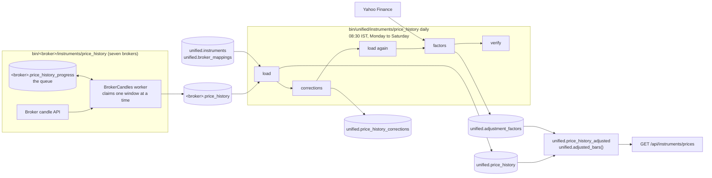

# Price history

This page covers historical candles, which are bars of open, high, low, close and volume over a fixed interval. The pipeline has two halves. Seven brokers' candle downloaders slowly copy each broker's history into that broker's own table, running for weeks as a resumable queue. Then one unified job, every morning, picks the best broker for each instrument, stitches its bars into one history per unified instrument, and works out the corporate action factors that let prices be adjusted on read.

## The flow

The flowchart below shows both halves. The left side runs all the time as seven systemd services; the right side runs once a day from a timer.



## Part 1: broker candles

Seven brokers have a candle downloader. Groww, Kotak and Stoxkart have none. Each downloader is a subclass of [`BrokerCandles`][stock_brokers.instruments.historical.base.BrokerCandles] in `stock_brokers/instruments/historical/<broker>.py`, registered in `DOWNLOADERS` in `stock_brokers/instruments/historical/utilities/orchestrator.py`. Flattrade and Shoonya run on the same Noren platform and share [`NorenCandles`][stock_brokers.instruments.historical.noren.NorenCandles], which differs between them only in host, rate limit and how far back each deployment reaches.

### Why it is a queue and not a loop

The job is enormous. Zerodha alone publishes over 110,000 instruments and serves eight intervals, which is close to a million series, and the deepest of them reach back to 2005. At three requests a second, a complete backfill takes weeks. So the downloader is a worker that makes progress whenever it runs and can be stopped at any moment, rather than a script that runs to completion.

The work is organized like this:

1. **Seeding.** `--seed` or `--seed-only` reads the latest row for every instrument from `<broker>.instruments` and registers one row per instrument and interval in `<broker>.price_history_progress`. Existing rows are left alone, so seeding again after a new master adds only what is new.
2. **Claiming.** The worker claims one window at a time from the progress table, ordered by priority and then by how long a series has waited. Cash instruments come first, then live futures and options, and expired contracts last; within each tier, coarse intervals come before fine ones.
3. **Walking back.** Each series walks backward from today, one window per request, until it reaches the broker's earliest date or three windows in a row come back empty. After that it keeps collecting forward.
4. **Writing.** Each window is upserted into `<broker>.price_history` together with the series' progress, in one transaction, so stopping costs at most the request in flight.

Nothing is derived: a five-minute bar is whatever the broker returned for five minutes, never five one-minute bars added together. An instrument the broker will not serve at all, usually an expired contract, is retired rather than retried.

### The seven brokers

The table below lists each downloader's limits, read from its class attributes. The earliest date is how far back the broker serves anything.

| Broker | Class | Requests per second | Requests per day | Earliest date | Intervals |
|---|---|---:|---:|---|---:|
| Zerodha | `ZerodhaCandles` | 3 | no limit set | 2005-01-01 | 8 |
| Dhan | `DhanCandles` | 3 | 100,000 | 2000-01-01 | 6 |
| Fyers | `FyersCandles` | 3 | no limit set | 2000-01-01 | 16 |
| INDmoney | `IndMoneyCandles` | 3 | 100,000 | 2013-01-01 | 14 |
| Flattrade | `FlattradeCandles` | 10 | no limit set | 2019-01-01 | 11 |
| Shoonya | `ShoonyaCandles` | 1 | no limit set | 2021-01-01 | 11 |
| Wisdom Capital | `WisdomCapitalCandles` | 1 | no limit set | 2021-01-01 | 13 |

The chart below shows the request rates from the same table, which is the main reason some brokers' backfills take far longer than others.

```vegalite
{
  "$schema": "https://vega.github.io/schema/vega-lite/v5.json",
  "description": "Requests per second each candle downloader allows itself, from REQUESTS_PER_SECOND.",
  "width": "container",
  "height": 220,
  "data": {"values": [
    {"broker": "Flattrade", "rate": 10},
    {"broker": "Zerodha", "rate": 3},
    {"broker": "Dhan", "rate": 3},
    {"broker": "Fyers", "rate": 3},
    {"broker": "INDmoney", "rate": 3},
    {"broker": "Shoonya", "rate": 1},
    {"broker": "Wisdom Capital", "rate": 1}
  ]},
  "mark": {"type": "bar", "color": "#2a78d6", "cornerRadiusEnd": 4, "height": {"band": 0.6}},
  "encoding": {
    "y": {"field": "broker", "type": "nominal", "sort": "-x", "title": null},
    "x": {"field": "rate", "type": "quantitative", "title": "Requests per second"},
    "tooltip": [
      {"field": "broker", "title": "Broker"},
      {"field": "rate", "title": "Requests per second"}
    ]
  }
}
```

### Intervals each broker serves

The table below lists the interval names stored in `<broker>.price_history`, taken from each class's `INTERVALS`. A tick means the broker's downloader collects that interval.

| Interval | Zerodha | Dhan | Fyers | INDmoney | Flattrade | Shoonya | Wisdom Capital |
|---|:---:|:---:|:---:|:---:|:---:|:---:|:---:|
| `1minute` | :material-check: | :material-check: | :material-check: | :material-check: | :material-check: | :material-check: | :material-check: |
| `2minute` | | | :material-check: | :material-check: | :material-check: | :material-check: | :material-check: |
| `3minute` | :material-check: | | :material-check: | :material-check: | :material-check: | :material-check: | :material-check: |
| `5minute` | :material-check: | :material-check: | :material-check: | :material-check: | :material-check: | :material-check: | :material-check: |
| `10minute` | :material-check: | | :material-check: | :material-check: | :material-check: | :material-check: | :material-check: |
| `15minute` | :material-check: | :material-check: | :material-check: | :material-check: | :material-check: | :material-check: | :material-check: |
| `20minute` | | | :material-check: | | | | :material-check: |
| `25minute` | | :material-check: | | | | | |
| `30minute` | :material-check: | | :material-check: | :material-check: | :material-check: | :material-check: | :material-check: |
| `45minute` | | | :material-check: | | | | :material-check: |
| `60minute` | :material-check: | :material-check: | :material-check: | :material-check: | :material-check: | :material-check: | :material-check: |
| `120minute` | | | :material-check: | :material-check: | :material-check: | :material-check: | :material-check: |
| `180minute` | | | :material-check: | :material-check: | | | :material-check: |
| `240minute` | | | :material-check: | :material-check: | :material-check: | :material-check: | :material-check: |
| `day` | :material-check: | :material-check: | :material-check: | :material-check: | :material-check: | :material-check: | |
| `week` | | | :material-check: | :material-check: | | | |
| `month` | | | :material-check: | :material-check: | | | |

### How the services run

Each broker's downloader runs as `<broker>-historical-prices.service`, a unit of its own rather than an instance of the `<broker>-instruments@` template, because it paces differently from the live feeds. The unit waits for Redis with `bin/wait-for-redis` before starting, runs at low priority, and restarts ten minutes after every exit, including exit code 2. A first login that failed because a store was not ready yet therefore gets another try, and a real misconfiguration shows up as an obvious slow loop in the journal.

!!! warning "Run only one worker per broker"
    The queue is not locked between processes, so two workers on the same `<broker>.price_history_progress` table would claim the same series and share the broker's rate limit.

```bash
bin/zerodha/instruments/price_history --status      # how far the queue has got
bin/zerodha/instruments/price_history --seed-only   # register new series after a new master, then exit
```

Most downloaders log in through the shared cross-process lock `ensure_session` in `stock_brokers/api/utilities/session.py`. Zerodha's script is the exception: it logs in straight through `ZerodhaAPI`, which tries the newest stored token first, because every Kite login invalidates the token before it.

## Part 2: unified price history

`bin/unified/instruments/price_history` turns the seven brokers' tables into one history per unified instrument, in `unified.price_history`. It never downloads from a broker; it reads `<broker>.price_history` and resolves each broker series to its instrument through `unified.instruments` and `unified.broker_mappings`, which the [instrument mapping](instrument-masters.md) keeps. Every run first applies the mapping DDL and the price history DDL, both safe to run again.

### Subcommands

The table below lists the subcommands. Each run writes its outcome to the Redis key `unified:prices:last_run`.

| Subcommand | What it does | Writes |
|---|---|---|
| `load` | Copies each broker series' new and changed bars for `--interval` (default `day`) into the unified history, choosing a source per instrument and applying confirmed corrections | `unified.price_history`, `unified.price_history_sources` |
| `corrections` | Finds the NSE daily series Flattrade served already adjusted, by comparing them with BSE and with Flattrade's own intraday bars, and records multipliers that undo it | `unified.price_history_corrections` |
| `factors` | Fetches Yahoo Finance for instruments stored unadjusted and derives split, bonus and demerger factors, confirmed against the raw prices | `unified.adjustment_factors`, `unified.yahoo_fetch_state` |
| `verify` | Runs the checks, including known corporate action cases, and fails when any check fails | nothing |
| `sources` | Resolves every broker series and reports how, writing nothing | nothing |
| `status` | Prints the last run and what is stored | nothing |
| `daily` | Runs `load`, `corrections`, `load` again, `factors --stale-days 14` and `verify`; a failed `verify` is reported without failing the job | all of the above |

`unified-prices.service` runs `daily` from `unified-prices.timer` at 08:30 IST, Monday to Saturday. The service is ordered after `unified-mapping.service`, so when the 07:45 instrument job runs late, the price job waits for it and loads against the day's mapping.

### Which broker supplies which instrument

The unified table never blends brokers. For each instrument and interval one broker is the primary source, and a second broker may fill in only whole trading days the primary is missing, and only when its bars agree with the primary's on at least 99.5% of the bars both have. The policy lives in `stock_brokers/instruments/historical/utilities/unified/sources.py`.

| Instruments | Interval | Primary | Gap fill |
|---|---|---|---|
| Cash instruments (equities, ETFs, investment trusts and the other cash segments) | `day` on NSE and BSE, and intraday on NSE | Flattrade | none |
| BSE cash | intraday | Flattrade | Wisdom Capital |
| BSE cash | `20minute`, `45minute`, `180minute` | Wisdom Capital | none |
| Indices | `day` | Zerodha | Dhan, Flattrade |
| Indices | `15minute`, `30minute`, `60minute` | Zerodha | none |
| Indices | other intraday | Flattrade | none |
| Futures, options, currencies and commodities | any | Zerodha | Dhan, Flattrade |

Only Flattrade (daily and intraday, NSE and BSE) and Wisdom Capital (BSE intraday) are listed as serving unadjusted prices, so only they may supply the segments that are stored unadjusted. The module's docstring explains why the others are left out: Zerodha, Dhan, INDmoney and Fyers adjust their history with their own factors at their own times, and Shoonya adjusts inconsistently. The derivative row is policy only, because no derivative bars are stored yet.

### Intervals loaded

The `load` step accepts `day` and fifteen intraday names. Week and month bars are never loaded. The daily timer loads only `day`; intraday intervals are loaded by hand.

| `--interval` | Loaded by the daily job? |
|---|:---:|
| `day` | :material-check: |
| `1minute`, `2minute`, `3minute`, `4minute`, `5minute`, `10minute`, `15minute`, `20minute`, `25minute`, `30minute`, `45minute`, `60minute`, `120minute`, `180minute`, `240minute` | :material-close: (by hand) |

### How a load works

One `load` run, for one interval, takes these steps:

1. **Discover** every series with bars in each source broker's `price_history_progress`.
2. **Resolve** each series to its instrument, using the broker's own mapping first and other brokers' mappings of the exchange token second. A series that stays ambiguous is reported rather than guessed.
3. **Choose work.** An instrument is rebuilt when one of its sources is new, superseded, or has bars its source row has not yet seen.
4. **Stitch** the primary broker's series by time. When a broker's token for an instrument changed, the series with the most recent bars wins where two overlap.
5. **Gap-fill** from the second broker, only on missing trading days.
6. **Filter** out bars on days the exchange did not trade, bars off the interval's grid, and bars whose high is below the open or close or whose low is above them.
7. **Write** in one transaction per instrument, rewriting a row only when a value actually differs.

The trading days come from the bars themselves rather than a holiday list: a day traded when Zerodha has a daily bar for NIFTY 50 (NSE) or SENSEX (BSE), or when Flattrade has daily bars for at least a tenth of the series it had on that month's busiest day.

### Adjusting prices on read

Equities, ETFs and investment trusts are stored unadjusted, and everything else is stored as the broker served it. Adjustment for splits, bonuses and demergers happens when the data is read, from the confirmed rows of `unified.adjustment_factors`, so correcting a factor corrects every query at once and nothing has to be rewritten.

| Object | Kind | What it gives |
|---|---|---|
| `unified.adjustment_ranges` | View | One row per instrument and span between consecutive ex-dates, with the combined `price_factor` and `volume_factor` for bars inside it |
| `unified.correction_ranges` | View | The combined correction multiplier for each span of a broker series between consecutive confirmed ex-dates, in the same shape as `unified.adjustment_ranges` |
| `unified.price_history_adjusted` | View | Every bar, adjusted with everything known today |
| `unified.adjusted_bars(instrument_id, interval, from, to, known_as_of)` | Function | One instrument's bars over a range, adjusted as they would have been on `known_as_of` |

A bar is multiplied by every confirmed factor whose ex-date falls after the bar's trading day. The `known_as_of` argument is what makes backtests honest: without it, a backtest of 2023 would see prices already halved for a bonus that went ex in 2024. The function is a single SQL `SELECT` marked `STABLE`, so PostgreSQL inlines it and the time conditions reach the hypertable's chunk exclusion.

```sql
SELECT * FROM unified.adjusted_bars(
    '11111111-1111-5111-8111-000000000001', 'day',
    '2023-01-01', '2024-12-31', '2023-12-31');
```

The instrument id above is a placeholder; use a real id from `unified.instruments`.

### How factors are found

The `factors` step takes, for each instrument stored unadjusted, the ratio of Yahoo's adjusted close to the stored raw close on every day both have. That ratio is 1 after the last corporate action and steps down at each action going back in time. For RELIANCE it is 1 from 2024-10-28, 0.5 before that bonus, and 0.4615 before the 2023-07-20 demerger of Jio Financial. A step counts only when it holds for several trading days, which passes over Yahoo's one-day bad prints. A step that matches a listed Yahoo split is confirmed; a step with no event is kept as `unclassified` and provisional until a person confirms it, because demergers and rights issues both look like that.

Yahoo tickers are tried as `SYMBOL.NS` for NSE, and as `SYMBOL.BO`, then the BSE scrip code such as `500325.BO`, then `SYMBOL.NS` for BSE. Requests are paced at roughly one a second. `--stale-days 14` limits a run to instruments not fetched for fourteen days, plus any with a raw daily close more than 35% away from the one before in the last five days, which is how a new corporate action is picked up within a day.

??? note "Under the hood"
    - Broker candle DDL: `stock_brokers/instruments/historical/utilities/sql/ddl/000_price_history_zerodha.sql` to `060_price_history_wisdom_capital.sql`, applied with `python -m stock_brokers.instruments.historical.utilities.sql.apply_ddl`.
    - Unified DDL: `200_unified_price_history.sql` to `250_unified_price_history_corrections.sql` in the same directory.
    - Unified package: `stock_brokers/instruments/historical/utilities/unified/` holds `loader.py`, `sources.py`, `resolution.py`, `corrections.py`, `factors.py`, `yahoo.py`, `verify.py`, `calendar.py` and `tables.py`.
    - The REST API reads these tables through [`GET /api/instruments/prices`](../rest-api/historical-data.md#prices).
