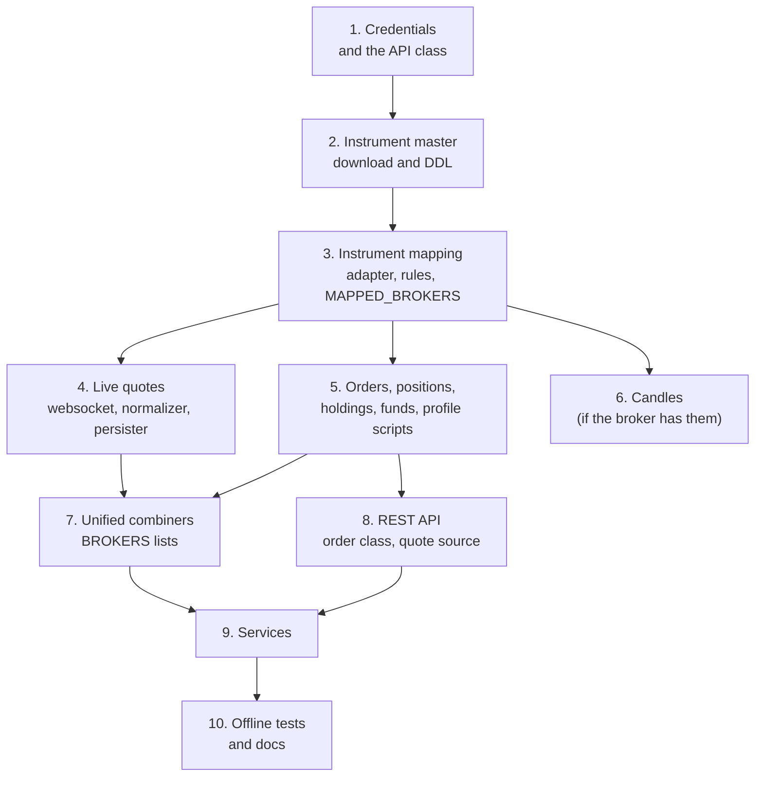

# Adding a broker

A new broker touches many places, because every layer keeps its own list of brokers on purpose: each script and package names the brokers it handles, rather than discovering them. This page lists every one of those places, in an order where each step can be tested before the next one starts. The broker is called `newbroker` in the examples.

!!! danger "A new broker means a new live account"
    Almost every step here is tested by logging in to the new broker's real account, and the order steps place real orders. Test order placement with `"dry_run": true` first, which builds the broker request and returns it without sending it.

## The order of work

The flowchart below shows the steps as groups. Each group depends on the ones above it: nothing can be mapped until the instrument file is downloaded, and nothing can be combined until the broker's scripts write to Redis.



Take one broker all the way through against the live system before copying a pattern to the others. The live-feed rule applies here too: NSE and BSE equity closes at 15:30 IST, so test a quote feed in the evening with MCX futures.

## Checklist

The checklist below names every file to add or edit. The paths are relative to the repository root.

### 1. Credentials and the API class

- [ ] Store the broker's credentials in the MongoDB `settings` collection, in a document with `broker_name: "newbroker"`. `BrokerAPI.__init__` reads it by that key.
- [ ] Write `stock_brokers/api/newbroker.py` with `NewbrokerAPI(BrokerAPI)` and `NewbrokerAPIException(BrokerAPIException)`. Implement `__init__` (try the stored token with an authenticated call, and log in only if that fails) and `_request`. A successful login writes MongoDB first and the Redis `last_login` hash second, and the constructor must not write the token to Redis. See [Sessions and logins](../architecture/sessions.md).
- [ ] Add the class to the `modules` dictionary and to `BROKERS_WITH_API` in `stock_brokers/api/utilities/session.py`.
- [ ] Add it to `API_CLASSES`, and the broker to the `LOGIN_UNITS` tuple, in `unified_broker_interface/utilities/broker_quotes/utilities/clients.py`.
- [ ] Add an entry to `BROKERS` in `bin/check-broker-connections`, naming the module, the class and one authenticated probe endpoint.
- [ ] Write `bin/newbroker/session/connect` and `bin/newbroker/session/disconnect`, copying an existing broker's pair.

### 2. Instrument master

- [ ] Add `CREATE SCHEMA IF NOT EXISTS newbroker;` to `stock_brokers/instruments/sql/ddl/000_schemas.sql`. Every broker has its own PostgreSQL schema.
- [ ] Add `stock_brokers/instruments/sql/ddl/110_instruments_newbroker.sql` for `newbroker.instruments`, with only re-runnable statements (`IF NOT EXISTS`). The files run in name order, and the last existing one is `100_instruments_indmoney.sql`.
- [ ] Write `stock_brokers/instruments/newbroker.py` with a `BrokerInstruments` subclass that sets `BROKER_NAME`, `DEDUPE_KEY_COLUMNS` and `DEDUPE_SORT_COLUMN`, and implements `download()`.
- [ ] Add it to `INGESTERS` in `stock_brokers/instruments/orchestrator.py`. `INSTRUMENT_BROKERS`, which `bin/search-instruments` offers, is built from it.
- [ ] Write `bin/newbroker/instruments/daily_feed`.
- [ ] Apply the DDL and download once:

    ```bash
    python -m stock_brokers.instruments.sql.apply_ddl
    python -m test_runs.download_instruments newbroker
    ```

### 3. Instrument mapping

- [ ] Write `stock_brokers/instruments/mapping/newbroker.py` with a `BrokerMappingAdapter` subclass that sets `BROKER_NAME`, and `stock_brokers/instruments/mapping/utilities/rules/newbroker.yaml` with its classification rules. Override adapter methods only where the rules cannot express something.
- [ ] Add it to `ADAPTERS` in `stock_brokers/instruments/mapping/utilities/orchestrator.py`.
- [ ] Add the broker to `MAPPED_BROKERS` in `stock_brokers/instruments/mapping/utilities/segments.py`. This list is a processing order, not an unordered set, so decide deliberately where the broker goes.
- [ ] Add the broker's token column to `RAW_TOKEN_COLUMNS`, and its ISIN column to `ISIN_COLUMNS` if it has one, in `stock_brokers/instruments/mapping/utilities/resolution.py`.
- [ ] Add its token namespace (token column and the columns that scope it) to `TOKEN_NAMESPACES` in `stock_brokers/instruments/mapping/utilities/collisions.py`.
- [ ] Add its entry to `stock_brokers/instruments/mapping/utilities/raw_attributes.py`.
- [ ] If its lot sizes on currency or commodity markets can serve as a source, add a `ContractSizeSource` in `stock_brokers/instruments/mapping/utilities/contract_sizes.py`.
- [ ] Add a line for its `daily_feed` to `services/unified/unified-mapping.service`, prefixed with `-` like the others, before the `map` line.
- [ ] Run the mapping for the one broker: `bin/unified/instruments/map newbroker`.

### 4. Live quotes

- [ ] Write `stock_brokers/websockets/newbroker.py`: a session class, plus `NewbrokerQuotesSocket(BrokerWebsocket)` and `NewbrokerOrderUpdatesSocket(BrokerWebsocket)`, each implementing `_connect` and `_log_in_again` and handing what it decodes to a callback. The socket never writes Redis.
- [ ] Add `stock_brokers/instruments/ticks/utilities/sql/ddl/110_newbroker_streams.sql` for `newbroker.ticks`, `newbroker.order_updates`, and `newbroker.positions` if the broker streams positions. There is no runner for these files: each persister applies its own broker's file when it starts.
- [ ] Write `bin/newbroker/instruments/websocket_quotes` (writes `newbroker:quotes:live` and `newbroker:quotes:stream`) and `bin/newbroker/instruments/store_quotes_to_db`.
- [ ] Write `stock_brokers/instruments/ticks/newbroker.py` with a `TickNormalizer` subclass (or `NorenTickNormalizer` for a Noren broker) that implements `feed_key` and sets its lot, close and timestamp attributes.
- [ ] Add it to `NORMALIZERS` in `stock_brokers/instruments/ticks/utilities/registry.py`.
- [ ] Add the broker to `DEFAULT_PRIORITY`, and to `EXCHANGE_PRIORITY` where it applies, in `stock_brokers/instruments/ticks/utilities/sources.py`. Leave it out of `VERIFIED_BROKERS` until its normalizer's assumptions have been checked live.

### 5. Orders, portfolio and profile scripts

- [ ] Write `bin/newbroker/orders/api_order_details`, `api_trade_details`, `websocket_order_details` and `store_orders_to_db`. Each normalizing script carries its own copy of the status, product, order type and validity tables from [Data contracts](../architecture/contracts.md).
- [ ] Write `bin/newbroker/portfolio/positions`, `holdings` and `funds`, and `store_positions_to_db` if the broker streams positions.
- [ ] Write `bin/newbroker/user/details`, unless the login already writes the profile (as Kotak's does).
- [ ] Put each script at the same depth as the others, so its bootstrap line `parents[3]` finds the project root.

### 6. Candles

- [ ] If the broker has a candle endpoint, write `stock_brokers/instruments/historical/newbroker.py` with a `BrokerCandles` subclass (or `NorenCandles`) and add it to `DOWNLOADERS` in `stock_brokers/instruments/historical/utilities/orchestrator.py`. If it has none, add it to `UNSUPPORTED` in the same file with the reason.
- [ ] Add `stock_brokers/instruments/historical/utilities/sql/ddl/070_price_history_newbroker.sql` (the last broker file is `060_price_history_wisdom_capital.sql`, and the unified files start at 200) and apply it with `python -m stock_brokers.instruments.historical.utilities.sql.apply_ddl`.
- [ ] If its NSE and BSE token is the exchange's own token, add it to `EXCHANGE_TOKEN_BROKERS` in `stock_brokers/instruments/historical/utilities/unified/resolution.py`.
- [ ] Write `bin/newbroker/instruments/price_history`.

### 7. Unified combiners

Each script in `bin/unified/` keeps its own tuple of broker names, and some keep a reader function per broker.

- [ ] `bin/unified/instruments/websocket_quotes`: `BROKERS`, its own copy of `DEFAULT_PRIORITY`, and a normalizer class for the broker in the script's own table of normalizers (Stoxkart's is `StoxkartNormalizer`).
- [ ] `bin/unified/orders/api_order_details`: `BROKERS`.
- [ ] `bin/unified/orders/api_trade_details`: `BROKERS`, and a reader for the broker's trade book.
- [ ] `bin/unified/orders/websocket_order_details`: `ORDER_BROKERS`, `POSITION_BROKERS` if it streams positions, and the broker's normalization.
- [ ] `bin/unified/portfolio/positions`, `holdings` and `funds`: `BROKERS`, and a reader for the broker's stored shape (for example `stoxkart_funds` in `funds`).
- [ ] `bin/unified/user/details`: `BROKERS`.

### 8. REST API

- [ ] Write `unified_broker_interface/utilities/broker_orders/newbroker.py` with a `BrokerOrders` subclass (or `NorenOrders`): `BROKER_NAME`, `MARKETS`, `QUANTITY_UNITS`, the settings field lists, `build_place_request`, `build_cancel_request`, `read_order_id`, and `MODIFIABLE_FIELDS` with `build_modify_request` if it can modify orders.
- [ ] Add it to `BROKER_ORDER_CLASSES` in `unified_broker_interface/utilities/broker_orders/utilities/registry.py`. The list's order is the order brokers take turns in.
- [ ] If the broker's REST quotes are verified, write `unified_broker_interface/utilities/broker_quotes/newbroker.py` with a `BrokerQuoteSource` subclass and add it to `SOURCES` in `unified_broker_interface/utilities/broker_quotes/utilities/service.py`.
- [ ] Add the broker's display name to `BROKER_CODES` in `unified_broker_interface/utilities/import_details.py`, and its document to the `broker_details` export that `bin/import-api-details` loads.
- [ ] If the broker caps order messages per day, add it to `UNIFIED_BROKER_INTERFACE_API_ORDER_DAILY_CAPS` in `.env`.

### 9. Services

- [ ] Create `services/newbroker/` by copying an existing broker's folder and renaming every file and every occurrence of the name: `newbroker.target`, `newbroker-login.service`, `newbroker-login.timer`, the four templates `newbroker-instruments@.service`, `-orders@`, `-portfolio@`, `-user@`, and `newbroker-historical-prices.service` if it has candles. Keep the comment headers the other units have.
- [ ] Update the install command in the header of `newbroker.target` to list exactly the services this broker runs.
- [ ] Install it as described in [Services](../operations/services.md#installing-the-units). `bin/check-services` finds the new folder by itself.

### 10. Offline tests and docs

- [ ] Write `test_runs/websocket_feeds/newbroker.py` with a `NewbrokerFeedCases` class, add it to `BROKER_CASES` in `test_runs/websocket_feeds/__main__.py`, and record only its lines with `python -m test_runs.websocket_feeds newbroker --record`.
- [ ] Add the broker to `test_runs/order_routes.py` (its broker list, the logins, the settings and the instrument handles in `OrderRoutesState`), check the `NEW` and `CHANGED` lines, then re-record with `--record`.
- [ ] If step 3 added a contract size source, add checks to `test_runs/contract_sizes.py`.
- [ ] Run every suite in [Offline tests](../operations/tests.md) and `ruff check .`.
- [ ] Update [Brokers](../brokers/index.md) and any page that lists what each broker supports.

## Where each registry lives

The table below collects every named registry from the checklist, for quick reference.

| Registry | File | Holds |
|---|---|---|
| `INGESTERS` | `stock_brokers/instruments/orchestrator.py` | Instrument master downloaders |
| `ADAPTERS` | `stock_brokers/instruments/mapping/utilities/orchestrator.py` | Mapping adapters (module, class) |
| `MAPPED_BROKERS` | `stock_brokers/instruments/mapping/utilities/segments.py` | The order brokers are mapped in |
| `DOWNLOADERS`, `UNSUPPORTED` | `stock_brokers/instruments/historical/utilities/orchestrator.py` | Candle downloaders, and brokers without one |
| `NORMALIZERS` | `stock_brokers/instruments/ticks/utilities/registry.py` | Tick normalizers |
| `DEFAULT_PRIORITY`, `EXCHANGE_PRIORITY`, `VERIFIED_BROKERS` | `stock_brokers/instruments/ticks/utilities/sources.py` | Which broker owns an instrument's quote |
| `modules`, `BROKERS_WITH_API` | `stock_brokers/api/utilities/session.py` | API classes for the login lock |
| `API_CLASSES`, `LOGIN_UNITS` | `unified_broker_interface/utilities/broker_quotes/utilities/clients.py` | API classes and login units for the REST API |
| `SOURCES` | `unified_broker_interface/utilities/broker_quotes/utilities/service.py` | REST quote sources in service |
| `BROKER_ORDER_CLASSES` | `unified_broker_interface/utilities/broker_orders/utilities/registry.py` | Order classes, in turn order |
| `BROKER_CODES` | `unified_broker_interface/utilities/import_details.py` | Export display names to broker codes |
| `BROKERS` | `bin/check-broker-connections` | Probe endpoints |
| `BROKERS` and friends | each combiner in `bin/unified/` | Which brokers' keys and streams to read |
| `BROKER_CASES` | `test_runs/websocket_feeds/__main__.py` | Websocket test cases |
