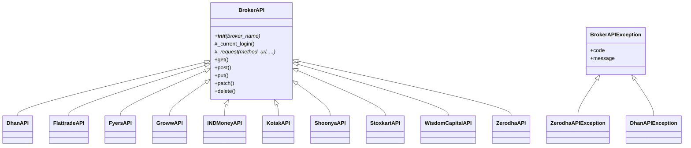
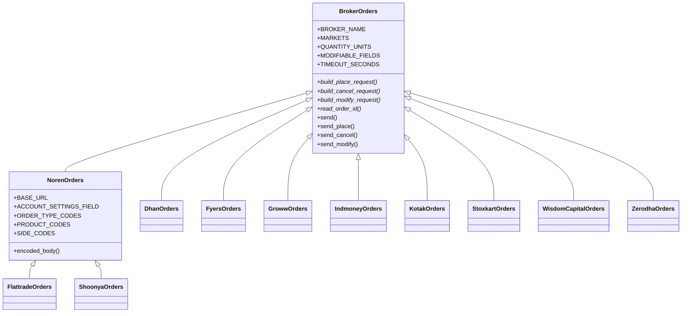
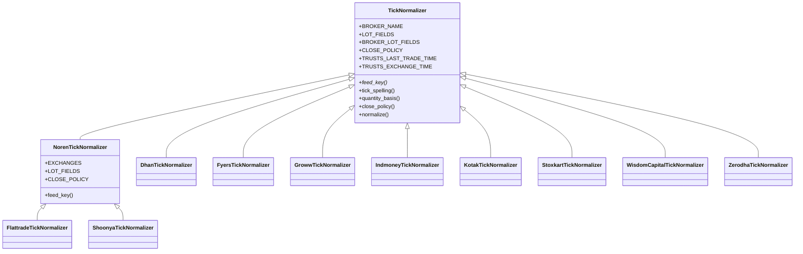
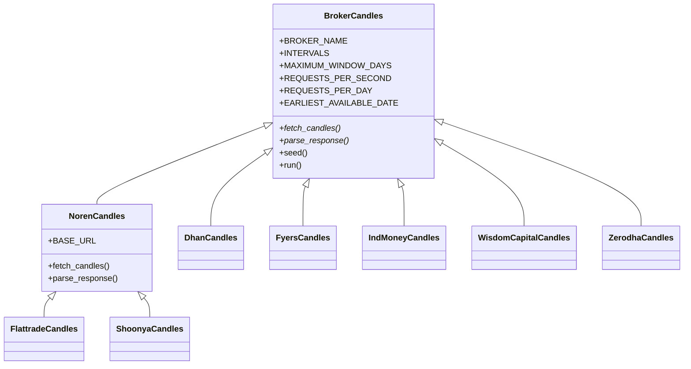

# Per-broker packages

Much of UBI's code does one job ten times, once for each broker: logging in, reading a websocket, downloading an instrument file, normalizing a tick, placing an order. Each of those jobs is a package, and each package is laid out the same way, so that listing its directory answers the question "which brokers does this support?".

## The rule

A package implemented once per broker holds exactly three kinds of file, plus one subpackage for everything else. The tree below shows the layout, using the order package as the example.

```text
unified_broker_interface/utilities/broker_orders/
├── __init__.py
├── base.py            the class every broker subclasses (BrokerOrders)
├── noren.py           shared by the brokers on the Noren platform (NorenOrders)
├── dhan.py            one file per broker, one class per file
├── flattrade.py       FlattradeOrders(NorenOrders)
├── …
├── zerodha.py
└── utilities/         everything else: registries, orchestrators, SQL, helpers
    ├── registry.py    BROKER_ORDER_CLASSES
    ├── placement.py
    └── …
```

The rule has four parts:

1. `__init__.py` marks the package.
2. `base.py` holds the base class. It carries everything the brokers genuinely share.
3. One `<broker>.py` per broker holds that broker's subclass, and only what is different about that broker. `noren.py` sits beside them where Flattrade and Shoonya share the Noren platform, and those two subclass it instead of the base.
4. Everything else the package needs, such as orchestrators, registries, SQL files and their runner, rules files and helpers, goes in a `utilities/` subpackage.

The benefit is that a reader can open one broker's file and see its whole difference from the others without following an abstraction through several layers. Some repetition between broker files is accepted as the price of that.

`stock_brokers/instruments/` is the one exception to the layout. It keeps `orchestrator.py` and `sql/` at its own root rather than under `utilities/`, because its subpackages `mapping/`, `historical/` and `ticks/` also live there.

## The packages

The table below lists every package built this way, the class its broker modules subclass, and what a broker module has to provide. Each entry was checked against the base class's docstring and the methods it leaves unimplemented.

| Package | Base class | A broker module implements | Brokers | Noren base |
|---|---|---|---:|---|
| `stock_brokers/api/` | [`BrokerAPI`][stock_brokers.api.base.BrokerAPI] | `__init__` (the login flow) and `_request` | 10 | none |
| `stock_brokers/websockets/` | `BrokerWebsocket` | Per socket, `_connect` (open and block until closed) and `_log_in_again`, plus the frame handlers; a broker's two sockets share one session class | 10 | none |
| `stock_brokers/instruments/` | `BrokerInstruments` | `BROKER_NAME`, `download()`, and the dedupe key (`DEDUPE_KEY_COLUMNS`, `DEDUPE_SORT_COLUMN`) | 10 | none |
| `stock_brokers/instruments/mapping/` | `BrokerMappingAdapter` | `BROKER_NAME` and a YAML rules file in `utilities/rules/`; overrides only where rules cannot express it | 10 | none |
| `stock_brokers/instruments/historical/` | `BrokerCandles` | Class attributes (`BROKER_NAME`, `INTERVALS`, `MAXIMUM_WINDOW_DAYS`, `REQUESTS_PER_SECOND`, `REQUESTS_PER_DAY`, `EARLIEST_AVAILABLE_DATE`), `fetch_candles` and `parse_response` | 7 | `NorenCandles` in `noren.py` |
| `stock_brokers/instruments/ticks/` | [`TickNormalizer`][stock_brokers.instruments.ticks.base.TickNormalizer] | `feed_key` and class attributes for lots, close policy and trusted timestamps | 10 | `NorenTickNormalizer` in `noren.py` |
| `unified_broker_interface/utilities/broker_quotes/` | `BrokerQuoteSource` | `fetch` and `is_authentication_error` | 8 | `NorenQuoteSource` in `utilities/noren.py` |
| `unified_broker_interface/utilities/broker_orders/` | [`BrokerOrders`][unified_broker_interface.utilities.broker_orders.base.BrokerOrders] | Class attributes including `MARKETS`, `build_place_request`, `build_cancel_request`, `read_order_id`, and `MODIFIABLE_FIELDS` with `build_modify_request` when it modifies orders | 10 | `NorenOrders` in `noren.py` |

A few details in that table are worth spelling out.

- Every broker's API class overrides `_request`, even though `base.py` also defines one.
- In `stock_brokers/websockets/`, Stoxkart is the exception: its two streams (`StoxkartQuoteStream` and `StoxkartOrderSocket`) read a synchronous connection and do not subclass `BrokerWebsocket`.
- `historical/` has no module for Groww, Kotak or Stoxkart. Its orchestrator lists them in `UNSUPPORTED`: Groww answers `403` on the historical endpoint, Kotak publishes no candle endpoint, and Stoxkart has "no candle path".
- `broker_quotes/` has no module for Stoxkart or Wisdom Capital. Of its eight modules, only six are in service in `SOURCES`; the Fyers and Groww modules exist but are held back, as the comment in `broker_quotes/utilities/service.py` explains.
- In `broker_quotes/`, the Noren base lives in `utilities/noren.py` rather than beside the broker files.

### Two packages with the same shape but different cases

Two more packages follow the same layout, but their "cases" are not brokers. The table below lists them.

| Package | Base class | One module per | A module implements |
|---|---|---|---|
| `unified_broker_interface/utilities/broker_selection/` | `BrokerSelector` | selection algorithm (`round_robin.py`, `fixed_priority.py`) | `NAME` and `ranked_brokers`; overrides `queue_redis_commands` when it needs Redis and `record_outcome` when it learns from answers |
| `unified_broker_interface/utilities/order_engine/` | `SyntheticOrder` | synthetic order type (42 of them, from `simple.py` to `virtual_limit.py`) | `SYNTHETIC_TYPE` and `run`; may implement `on_leg_update`, `on_clock_tick` or `on_price_tick` |

The selectors are registered in `BROKER_SELECTOR_CLASSES` in `broker_selection/utilities/registry.py`, and the order types in `SYNTHETIC_ORDER_CLASSES` in `order_engine/utilities/registry.py`.

## Class hierarchies

The diagrams below show three of the hierarchies, with the members that matter most to someone adding a broker. A member marked `*` is one the base leaves for the subclass to provide.

### BrokerAPI

Every broker's REST client subclasses `BrokerAPI` directly; there is no shared Noren class at this level. The base holds the stored settings and login, reads the current token on every request, and offers `get`, `post`, `put`, `patch` and `delete` on top of `_request`.



Each broker module also defines its own exception class, such as `ZerodhaAPIException`, subclassing `BrokerAPIException`; the diagram shows two of the ten.

### BrokerOrders

The order classes are where Flattrade and Shoonya share the most. `NorenOrders` builds the `jData=...&jKey=...` request body, maps the shared order types, products and sides onto Noren's codes, and implements every request builder, so the two broker files only set their base URL, account field and settings lists.



`BROKER_ORDER_CLASSES` in `broker_orders/utilities/registry.py` lists the ten classes, and its docstring says the list is in the order the brokers take turns.

### TickNormalizer

A tick normalizer turns one broker's tick into the shared tick shape. Its class attributes describe the broker's habits: which quantity fields it reports in lots, when its `close` can be trusted as the previous close, and whether its timestamps can be trusted. The defaults are the cautious reading, and a subclass changes only what it has verified.



The normalizers are registered in `NORMALIZERS` in `stock_brokers/instruments/ticks/utilities/registry.py`.

### BrokerCandles

The candle downloaders have the same Noren shape. `NorenCandles` sets the intervals and window sizes the Noren platform allows and implements `fetch_candles` and `parse_response`, leaving each Noren broker only `_build_api` and a few attributes.



## Adding a case

Because every package follows the same layout, adding a broker to one of them is always the same three steps: write `<broker>.py` beside the others, subclass the base (or the Noren base), and add the class to that package's registry in `utilities/`. [Adding a broker](adding-a-broker.md) lists every package and registry in order.
