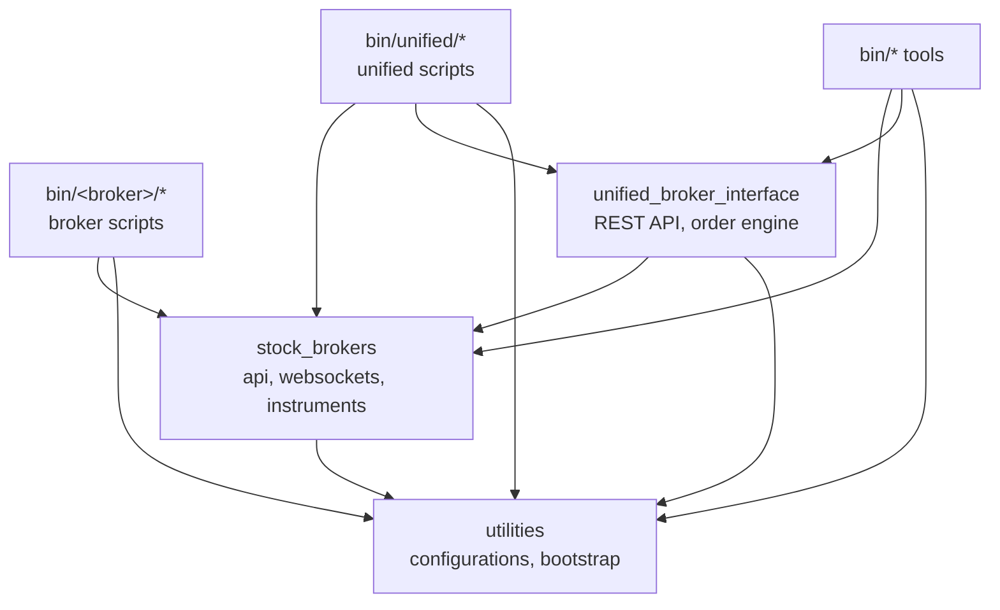

# Repository structure

The repository has no build step and no `pyproject.toml`. It is a folder of Python packages, executable scripts, systemd units and SQL files, and the project root has to be on `PYTHONPATH` for any of it to import (`.env` sets it, and the scripts in `bin/` set it themselves).

## The tree

The tree below shows the repository to a depth of three or four levels, with the purpose of each directory on the right. Folders that repeat once per broker are shown once, as `<broker>`.

```text
unified_broker_interface/                     the repository root
├── bin/                                      every executable; see Operations > Scripts
│   ├── rest-api, check-services, …           eight tools typed by hand
│   ├── <broker>/                             the only code that talks to that broker
│   │   └── session/ user/ orders/ portfolio/ instruments/
│   └── unified/                              combines every broker; reads only the stores
│       └── session/ user/ brokers/ exchanges/ orders/ portfolio/ instruments/
├── stock_brokers/                            broker-specific library code
│   ├── api/                                  one REST client class per broker (BrokerAPI)
│   │   └── utilities/session.py              the cross-process login lock, ensure_session
│   ├── websockets/                           one module per broker, its quote and order sockets
│   └── instruments/                          instrument master downloaders (BrokerInstruments)
│       ├── orchestrator.py                   INGESTERS: which class downloads which broker
│       ├── sql/ddl/                          schemas and <broker>.instruments tables
│       ├── mapping/                          maps every broker onto unified.instruments
│       │   └── utilities/                    orchestrator, segments, rules/*.yaml, sql/ddl/
│       ├── historical/                       candle downloaders (BrokerCandles)
│       │   └── utilities/                    orchestrator, unified/ price history, sql/ddl/
│       └── ticks/                            tick normalizers (TickNormalizer)
│           └── utilities/                    pipeline, sessions, calendars/, sql/ddl/
├── unified_broker_interface/                 the Flask REST API
│   ├── api.py, wsgi.py                       the application and the gunicorn entry point
│   ├── blueprints/                           one module per route group
│   └── utilities/                            what the blueprints share
│       ├── broker_orders/                    placing, modifying, cancelling (BrokerOrders)
│       ├── broker_quotes/                    REST quote fallback (BrokerQuoteSource)
│       ├── broker_selection/                 which broker takes an order (BrokerSelector)
│       ├── order_engine/                     the 42 synthetic order types (SyntheticOrder)
│       └── tokens.py, price_cache.py, …      shared helpers for the routes
├── utilities/                                shared by everything above
│   ├── bootstrap.py                          switches bin/ scripts into .venv
│   ├── configurations.py                     reads .env; the one place that opens Redis, MongoDB, PostgreSQL
│   ├── poll_reporter.py                      quiet logging for half-second polling loops
│   └── gen_ref_pages.py                      builds this site's code reference
├── services/                                 systemd user units
│   ├── <broker>/  unified/  databases/
├── test_runs/                                offline suites and a few live helpers
│   ├── fixtures/                             recordings the suites compare against
│   └── websocket_feeds/                      one case file per broker, plus harness.py
├── docs/                                     this site's hand-written pages
├── docker-compose.yml                        Redis, MongoDB and TimescaleDB containers
├── mkdocs.yml                                this site's configuration
├── requirements.txt                          every dependency, including the docs toolchain
├── .env                                      infrastructure settings (not committed)
└── CLAUDE.md, README.md
```

## What each top-level package is for

The three Python packages have clearly separated jobs. The table below lists them with the kind of code each one holds.

| Package | Holds | Talks to a broker? | Example |
|---|---|:-:|---|
| `stock_brokers` | Everything that knows a broker's dialect: login flows, websocket protocols, instrument file formats, candle formats, tick quirks | Yes, through the classes the scripts run | `stock_brokers/api/zerodha.py` |
| `unified_broker_interface` | The REST API: blueprints, the order path, the order engine, the token store | Only to place, change or cancel orders, and for the quote fallback | `unified_broker_interface/blueprints/orders.py` |
| `utilities` | Configuration, store connections, the `bin/` bootstrap, logging helpers | No | `utilities/configurations.py` |

The `bin/` scripts are not a package, but they are where the other three are put to work. A broker script imports that broker's classes from `stock_brokers`, and every script imports `utilities`.

## Who may import whom

The packages form layers, and imports only go downwards. The diagram below shows which layer imports which, as checked with `grep` over the current tree.



The rules this diagram expresses are listed below.

- `utilities` imports nothing from the project, so everything can use it. `utilities/bootstrap.py` goes further and imports only the standard library, because it runs before the virtual environment is active.
- `stock_brokers` never imports `unified_broker_interface`. Broker code knows nothing about the REST API.
- `unified_broker_interface` imports from `stock_brokers`, mostly the mapping segments, the tick pipeline and a few API classes for the quote fallback.
- `bin/unified/*` imports `stock_brokers` for mapping, candles and DDL runners, and imports the order engine's modules from `unified_broker_interface`, but it never imports a broker's API or websocket class.

## Where the data lives

Each layer writes to the shared stores rather than calling the next layer. The table below shows which store each part of the tree owns.

| Store | Written by | Holds |
|---|---|---|
| Redis `<broker>:*` | `bin/<broker>/*` | Current state (hashes and keys) and capped streams |
| Redis `unified:*` | `bin/unified/*`, the REST API | Combined documents, the unified quote cache, the order engine's state |
| TimescaleDB `<broker>.*` | `store_*_to_db`, `daily_feed`, `price_history` | Ticks, order updates, positions, instruments, candles |
| TimescaleDB `unified.*` | `bin/unified/*` | Unified instruments, mappings, ticks, order updates, positions, price history |
| MongoDB `settings`, `last_login` | Logins | Broker credentials and tokens, keyed by `broker_name` |
| MongoDB `exchange_details`, `broker_details`, `user_details` | `bin/import-api-details` | Reference details the REST API serves |

See [Redis keys and streams](../architecture/redis-keys.md) and [Database](../architecture/database.md) for the full lists.
