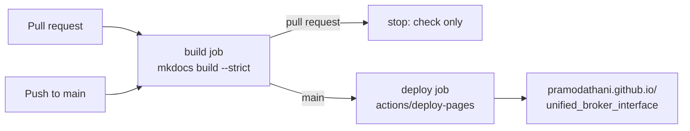
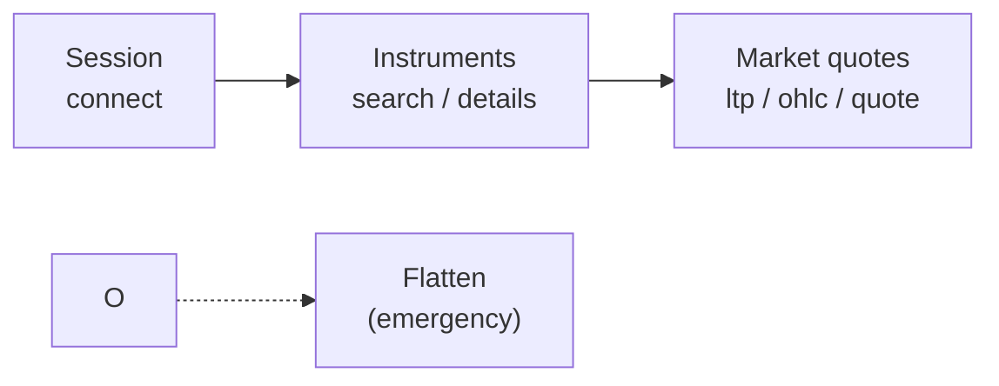
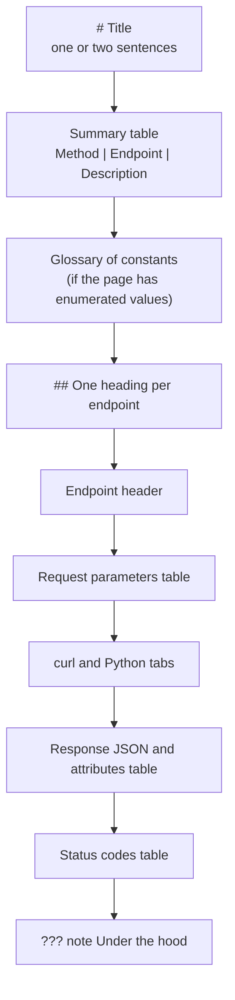

# Writing these docs

This site is built with MkDocs and the Material theme. Its hand-written pages live in `docs/`, and its code reference is generated from the docstrings in the three Python packages every time the site is built. Docs live with the code and change in the same commit as it.

<figure class="diagram">
--8<-- "docs/assets/diagrams/docs-build.svg"
<figcaption>Orange dots are hand-written pages and configuration, blue dots are docstrings becoming reference pages, and the green dot is the finished HTML.</figcaption>
</figure>

## Previewing and building

The documentation toolchain is part of `requirements.txt`, so the project's virtual environment already has it. Two commands cover almost everything, and both run from the project root.

```bash
.venv/bin/mkdocs serve            # live preview on http://127.0.0.1:8000, rebuilt on every save
.venv/bin/mkdocs build --strict   # the full build, failing on any warning
```

`mkdocs serve` also watches `stock_brokers/`, `unified_broker_interface/` and `utilities/` (the `watch:` list in `mkdocs.yml`), so editing a docstring refreshes the code reference too.

Always finish with `mkdocs build --strict`. In strict mode, every warning is an error, so a broken link, a missing page in the nav, a missing snippet file or an unresolvable code cross-reference stops the build. Filtering its output shows only what needs fixing:

```bash
.venv/bin/mkdocs build --strict 2>&1 | grep -E "WARNING|ERROR"
```

### Publishing

The site is published on GitHub Pages at <https://pramodathani.github.io/unified_broker_interface/>. The GitHub Actions workflow `.github/workflows/docs.yml` builds it with `mkdocs build --strict` and deploys it, so nobody publishes by hand. The table below shows what the workflow does for each kind of event.

| Event | Builds and checks the site | Publishes it |
|---|:---:|:---:|
| A push to `main`, which includes merging a pull request | :material-check: | :material-check: |
| A pull request | :material-check: | :material-close: |
| A manual run from the Actions tab | :material-check: | Only on `main` |



The workflow installs only the eight documentation packages from `requirements.txt`, the lines starting with `mkdocs` or `pymdown`. It does not install the trading stack, because mkdocstrings reads source files without importing them. It needs no data store and no credentials. A pull request that breaks a link or a code reference fails its check before it can be merged. Running the strict build locally before pushing still saves a round trip.

The generated `site/` directory is ignored by git and never belongs on a branch.

## The configuration

`mkdocs.yml` holds the whole configuration. The table below lists the plugins it loads and what each one does for this site.

| Plugin | Package (version in `requirements.txt`) | What it does here |
|---|---|---|
| `search` | built into MkDocs (`mkdocs==1.6.1`) | The search box |
| `charts` | `mkdocs-charts-plugin==0.0.13` | Renders ```` ```vegalite ```` fences as Vega-Lite charts, with the `default` theme in light mode and `dark` in dark mode |
| `gen-files` | `mkdocs-gen-files==0.5.0` | Runs `utilities/gen_ref_pages.py` at build time to create one reference page per module |
| `literate-nav` | `mkdocs-literate-nav==0.6.2` | Reads `reference/SUMMARY.md`, which the generator writes, as the navigation of the code reference |
| `section-index` | `mkdocs-section-index==0.3.9` | Lets a section's `index.md` be the page you land on when you click the section |
| `mkdocstrings` | `mkdocstrings[python]==0.29.0` | Turns each `::: dotted.path` line into documentation read from the docstrings, Google style |

The theme is `mkdocs-material==9.6.9`, with deep orange as its primary and accent color and a light, dark and "follow the system" toggle. The Markdown extensions come from `pymdown-extensions==10.21.3`; the ones this site relies on are `admonition` and `pymdownx.details` (boxes), `pymdownx.superfences` (Mermaid and Vega-Lite fences), `pymdownx.tabbed` (content tabs), `pymdownx.snippets` (including the SVG files), `pymdownx.tasklist` (check boxes), `pymdownx.emoji` (Material icons), `attr_list` and `md_in_html` (cards and diagrams).

### How the code reference is generated

`utilities/gen_ref_pages.py` walks every `.py` file under the packages named in its `PACKAGES` tuple (`stock_brokers`, `unified_broker_interface`, `utilities`). The steps below are what it does for each file.

1. It skips any path containing `__pycache__`, `proto` or `gen_ref_pages`.
2. It turns the file path into a page path under `reference/`. A package's `__init__.py` becomes that package's `index.md`, and an empty `__init__.py` is skipped because it has nothing to show.
3. It writes the page in memory, not on disk, with a single line such as `::: unified_broker_interface.utilities.tokens`, which mkdocstrings expands.
4. It records an edit link back to the source file, and adds the page to the navigation.
5. At the end it writes `reference/SUMMARY.md`, which literate-nav reads. That is why the nav in `mkdocs.yml` says only `- Code reference: reference/`.

A new module therefore appears in the reference with no edits anywhere. The mkdocstrings options in `mkdocs.yml` matter when you write docstrings: `filters: ["!^_[^_]"]` hides every name that starts with one underscore, and `show_if_no_docstring: false` hides anything without a docstring.

## Adding a page

A new narrative page takes two steps: create the Markdown file under `docs/`, and add it to `nav` in `mkdocs.yml`. The strict build fails on a page that is not in the nav. Section landing pages are the `index.md` of their folder and are listed without a title, like `- operations/index.md`.

## Links

Links to other pages use relative `.md` paths, which MkDocs checks at build time. A heading's anchor is its text in lower case, with spaces turned into hyphens.

```markdown
See [Services](../operations/services.md#installing-the-units).
```

Links to code use mkdocstrings cross-references, which point into the generated reference. The dotted path must be importable, the object must have a docstring, and its name must be public (no leading underscore), or the strict build fails. This page links to [`BrokerOrders`][unified_broker_interface.utilities.broker_orders.base.BrokerOrders] with this markup:

```markdown
[`BrokerOrders`][unified_broker_interface.utilities.broker_orders.base.BrokerOrders]
```

When you are not sure a name qualifies, cite the file path in backticks instead, such as `unified_broker_interface/blueprints/orders.py`.

## Visual conventions

Every page aims for at least one diagram or chart, and uses tables, lists and code blocks wherever the content has that shape. The table below lists every visual element this site uses and how to write it.

| Element | Use it for | How |
|---|---|---|
| Table | Anything with repeating fields | Markdown table, with a full sentence before it |
| Mermaid diagram | Flows, sequences, class hierarchies, state machines | ```` ```mermaid ```` fence; `sequenceDiagram` starts with `autonumber` |
| Vega-Lite chart | Real numbers from the code, and timelines | ```` ```vegalite ```` fence holding a JSON spec |
| Animated SVG | The site's headline diagrams, with moving dots | An `.svg` file in `docs/assets/diagrams/`, included with a snippet |
| Content tabs | The same thing in several forms, such as `curl` and Python | `=== "curl"` with the content indented four spaces |
| Admonition | Warnings, tips and notes | `!!! danger`, `!!! warning`, `!!! tip`, `!!! note`, `??? note "Under the hood"` |
| Cards | Section landing pages | `<div class="grid cards" markdown>` |
| Method badge | An HTTP method | `<span class="method get">GET</span>` |
| Endpoint header | The top of each endpoint section | `<div class="endpoint" markdown>…</div>` |
| Status chip | An HTTP status code | `<span class="status s2">200</span>` |
| Icon | A tick, cross or lock in a table | `:material-check:`, `:material-close:`, `:material-lock:` |

The custom classes all live in `docs/stylesheets/extra.css`. Use only the classes that exist there.

### Method badges, endpoint headers and status chips

These three elements come from the REST API pages. A method badge is a colored label, with one class per method: `get` is green, `post` blue, `put` amber and `delete` red. The markup and its result are shown below.

```html
<span class="method get">GET</span> <span class="method post">POST</span>
<span class="method put">PUT</span> <span class="method delete">DELETE</span>
```

<span class="method get">GET</span> <span class="method post">POST</span> <span class="method put">PUT</span> <span class="method delete">DELETE</span>

An endpoint header puts the method, the path and the authentication note in one bar. It must be written on one line, with `markdown` on the `div` so the backticks inside it still work:

```html
<div class="endpoint" markdown><span class="method get">GET</span> `/api/portfolio/positions`<span class="auth">access-token</span></div>
```

<div class="endpoint" markdown><span class="method get">GET</span> `/api/portfolio/positions`<span class="auth">access-token</span></div>

A status chip colors a status code by its class: `s2` is green for success, `s4` amber for a client error and `s5` red for a server error.

```html
<span class="status s2">200</span> <span class="status s4">409</span> <span class="status s5">503</span>
```

<span class="status s2">200</span> <span class="status s4">409</span> <span class="status s5">503</span>

### Mermaid

Mermaid diagrams are written as text in a fenced block, and the theme draws them. Keep node labels short and use `<br/>` for a line break. This is the flowchart from the REST API overview:

````markdown

````

### Vega-Lite

A chart is a Vega-Lite JSON spec in a `vegalite` fence. Use the v5 schema, `"width": "container"` so it fills the column, and inline data in `"data": {"values": [...]}`. Only chart real numbers from the code. A minimal spec looks like this:

````markdown
```vegalite
{
  "$schema": "https://vega.github.io/schema/vega-lite/v5.json",
  "width": "container",
  "data": {"values": [{"suite": "order_routes", "scenarios": 618}, {"suite": "order_engine", "scenarios": 152}]},
  "mark": "bar",
  "encoding": {
    "x": {"field": "scenarios", "type": "quantitative"},
    "y": {"field": "suite", "type": "nominal"}
  }
}
```
````

The [Daily schedule](../operations/schedule.md) page has a fuller example: a timeline with bars for time spans, diamonds for single moments, and tooltips.

### Animated SVG

The animated diagrams are hand-written SVG files in `docs/assets/diagrams/`, styled entirely by the classes in `extra.css`, so they follow the light and dark theme without any colors of their own. The table below lists those classes.

| Class | Draws |
|---|---|
| `ubi-svg` | The root `<svg>` element; required for every other class to apply |
| `box` | An ordinary box |
| `store` | A data store, in a bluish fill |
| `accent-box` | The box the diagram is about, with an orange border |
| `wire` | A dashed connector that marches, unless the reader prefers reduced motion |
| `wire-solid` | A still connector |
| `title`, `small`, `mono` | Bold, muted and code-font text |
| `dot`, `dot alt`, `dot ok` | Moving dots in orange, blue and green; hidden when the reader prefers reduced motion |

A dot moves along a path with `<animateMotion>` and `<mpath>`. Every path id starts with the file's name, so two diagrams on one page cannot clash. This is one connector and its dot from `docs-build.svg`, the diagram at the top of this page:

```xml
<path id="docs-build-output" class="wire" d="M710,150 L760,150"/>
<circle class="dot ok" r="6"><animateMotion dur="1s" repeatCount="indefinite"><mpath href="#docs-build-output"/></animateMotion></circle>
```

Each SVG also carries a `<title>` and a `<desc>` for screen readers, and has no blank lines inside it, because a blank line would end the HTML block when the file is pasted into the page. A page includes it with the snippets extension, inside a `figure` with a one-sentence caption, and with no blank lines between the four lines:

```html
<figure class="diagram">
;--8<-- "docs/assets/diagrams/docs-build.svg"
<figcaption>One sentence explaining what moves.</figcaption>
</figure>
```

### Admonitions

Admonitions are the colored boxes. Each type has one job, and `danger` is reserved.

| Type | Use it for |
|---|---|
| `!!! danger` | Only for something that can place a live order or lose data |
| `!!! warning` | A trap that costs time or gives a wrong answer |
| `!!! tip` | A shortcut or a better way |
| `!!! note` | Background worth knowing |
| `??? note "Under the hood"` | A collapsed box with the Redis keys, tables, classes and files behind an endpoint |

The content of an admonition is indented four spaces:

```markdown
!!! danger "Four routes move real money"
    `place`, `modify`, `cancel` and `flatten` send real requests to real broker accounts.
```

### Cards

A section's landing page shows its pages as cards. Each card is a list item inside a `grid cards` div, with an icon, a bold title, a rule, a sentence and a link:

```markdown
<div class="grid cards" markdown>

-   :material-console:{ .lg .middle } **Scripts**

    ---

    Every executable in `bin/`, with its options and exit codes.

    [:octicons-arrow-right-24: Scripts](scripts.md)

</div>
```

## Adding a REST API endpoint page

The pages under `docs/rest-api/` all follow one template, modeled on Kite Connect's documentation, so a reader always finds the same things in the same place. The flowchart below shows the order of the parts on a page.



To add an endpoint, work through the steps below.

1. Add the route to the master table in `docs/rest-api/index.md`, linking to `<page>.md#<anchor>`. The anchor is the endpoint section's heading in lower case with hyphens, so the heading and the link must agree.
2. On the group's page, add a row to the summary table at the top, with the method badge, the path linked to the same anchor, and a one-line description.
3. If the endpoint takes enumerated values, add them to the page's "Glossary of constants" table (`Parameter | Values | Meaning`).
4. Add the endpoint's `## Heading`, followed by the endpoint header and a sentence on what the route does and where its answer comes from.
5. Add a "Request parameters" table with the columns `Name | In | Type | Required | Description`, where "In" is `header`, `query` or `body`.
6. Add a content-tabs block with a `curl` example and a Python `requests` example, both against `http://127.0.0.1:8080/api/...` and sending `access-token: $ACCESS_TOKEN`.
7. Add a "Response" JSON example, built from the keys the code writes or from a recorded body in `test_runs/fixtures/*.jsonl`, with obviously fake personal data such as `"AB1234"`. Say so in a sentence when the example is shortened.
8. Add a "Response attributes" table (`Attribute | Type | Description`) and a "Status codes" table (`Status | When`) with status chips and the exact error strings from the code.
9. Finish with a collapsed `??? note "Under the hood"` box naming the Redis keys, database tables, classes and files involved.

A skeleton of one endpoint section, with the example tabs, is shown below.

````markdown
## Positions

<div class="endpoint" markdown><span class="method get">GET</span> `/api/portfolio/positions`<span class="auth">access-token</span></div>

This route returns ... It answers from ...

| Name | In | Type | Required | Description |
|---|---|---|---|---|
| `access-token` | header | string | yes | The token from `POST /api/session/connect` |

=== "curl"

    ```bash
    curl -H "access-token: $ACCESS_TOKEN" http://127.0.0.1:8080/api/portfolio/positions
    ```

=== "Python"

    ```python
    import os
    import requests

    response = requests.get(
        "http://127.0.0.1:8080/api/portfolio/positions",
        headers={"access-token": os.environ["ACCESS_TOKEN"]},
    )
    print(response.json())
    ```

| Status | When |
|---|---|
| <span class="status s2">200</span> | ... |
| <span class="status s4">401</span> | `Access token is required` |

??? note "Under the hood"
    Reads the Redis key `unified:portfolio:positions`, which `bin/unified/portfolio/positions` writes.
````

## Writing style

Every page follows the same writing rules, so the site reads as one voice. The list below collects them.

- Write in simple language and complete sentences. Every sentence has a subject and a verb, and a heading never stands in for the sentence that introduces a section.
- Name a thing in plain words before, or instead of, its identifier in the code.
- Put a complete sentence before every table, diagram and list saying what it shows. Cells and list items can be short; the prose around them cannot.
- Keep facts exact. Never invent a value, field name, status code, message or default; if it cannot be checked in the code, leave it out.
- Use "they" and "them" for any person, and American spelling throughout.
