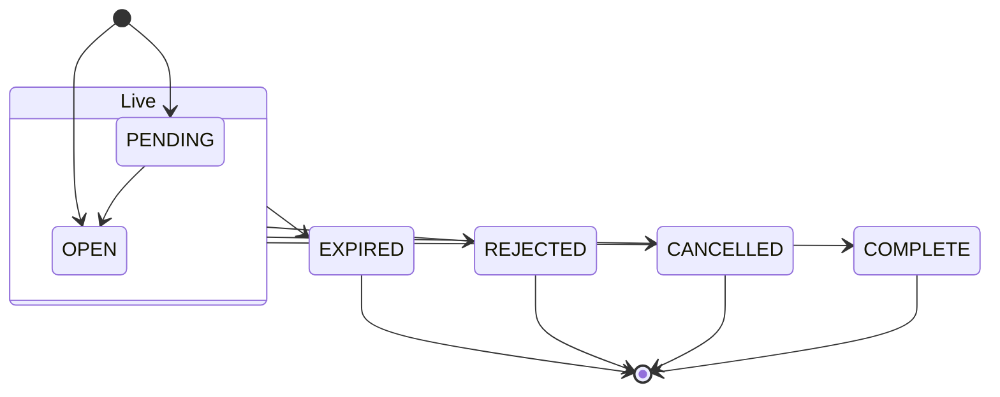

# Constants

This page is the glossary of every enumerated value the API accepts or returns. Each section says whether the value is something you **send**, something you **receive**, or both, because in a few places the two sets differ. The order book, for example, can report products that you cannot place.

Values you send are matched without regard to case, so `buy`, `Buy` and `BUY` all work. Values you receive are always spelled exactly as shown here.

The table below is an index of the sections on this page.

| Section | Where it appears |
|---|---|
| [Transaction type](#transaction-type) | Orders |
| [Product](#product) | Orders and positions, with two different vocabularies |
| [Order type](#order-type) | Orders |
| [Validity](#validity) | Orders |
| [Order status](#order-status) | The order book and order updates |
| [Exchanges](#exchanges) | Every instrument |
| [Segments](#segments) | Every instrument |
| [Option type](#option-type) | Option instruments |
| [Outcome](#outcome) | Answers to place, modify and cancel |
| [Placement mode](#placement-mode) | Server configuration |
| [Broker names](#broker-names) | Every `broker` field |
| [Price and quantity reference kinds](#price-and-quantity-reference-kinds) | Order bodies |
| [Synthetic order types](#synthetic-order-types) | Order bodies, in engine mode |
| [Read status](#read-status) | Portfolio and order book documents |
| [Quote and history values](#quote-and-history-values) | Market quotes and historical data |

## Transaction type

The transaction type is the side of an order. You send it in `transaction_type` when placing an order, and it comes back on every order in the order book.

| Value | Meaning |
|---|---|
| `BUY` | Buy |
| `SELL` | Sell |

## Product

The product says how a trade is financed and how long it may be held. The API uses two different vocabularies for it, one for orders and one for positions, because the positions document was designed to read naturally rather than to echo broker codes.

The table below lists the three order products you can send, and how each one appears on a position.

| Order product (send and receive) | Position product (receive) | Meaning |
|---|---|---|
| `CNC` | `delivery` | Cash and carry: a delivery trade in the cash market, held beyond today |
| `MIS` | `intraday` | Intraday: squared off by the end of the day |
| `NRML` | `carry` | Normal: a derivative position carried overnight |

The order book reports every order the account placed, including orders placed from a broker's own app or website. So it can carry products that `POST /api/orders/place` does not accept, listed in the table below.

| Order product (receive only) | Position product (receive) | Meaning |
|---|---|---|
| `CO` | `cover` | Cover order |
| `BO` | `bracket` | Bracket order |
| `MTF` | `margin_trading` | Margin trading facility |
| `ARB` | | A broker's `ARB` product, passed through as reported |

A broker term that the shared vocabulary does not know is passed through upper-cased on orders, and lower-cased on positions, rather than dropped.

## Order type

The order type says how the price is set. You send it in `order_type` when placing or modifying an order, and it comes back on every order.

| Value | Meaning | Needs `price` | Needs `trigger_price` |
|---|---|:---:|:---:|
| `MARKET` | Trade at the best available price | | |
| `LIMIT` | Trade at `price` or better | :material-check: | |
| `SL` | Stop-loss limit: becomes a limit order at `price` once the market reaches `trigger_price` | :material-check: | :material-check: |
| `SL-M` | Stop-loss market: becomes a market order once the market reaches `trigger_price` | | :material-check: |

See [Orders](orders.md#place-an-order) for the exact rules about which prices each type accepts.

## Validity

The validity says how long an order stays at the exchange. You send it in `validity` when placing or modifying an order, and it defaults to `DAY` when you leave it out.

| Value | Send | Receive | Meaning |
|---|:---:|:---:|---|
| `DAY` | :material-check: | :material-check: | Stays until it fills, is cancelled or the day ends |
| `IOC` | :material-check: | :material-check: | Immediate or cancel: whatever does not fill at once is cancelled |
| `GTT` | | :material-check: | Good till triggered, as a broker reports it |
| `GTC` | | :material-check: | Good till cancelled, as a broker reports it |
| `GTD` | | :material-check: | Good till date, as a broker reports it |

## Order status

Every broker spells order statuses its own way, and each broker's order scripts map those spellings onto six shared values. You receive these on every order in [`GET /api/orders/details`](orders.md#order-book). A spelling that the shared vocabulary does not know is passed through upper-cased.

| Value | Finished | Meaning |
|---|:---:|---|
| `PENDING` | | Received but not yet working at the exchange, for example still being validated, waiting for its trigger, or an after-market order waiting for the open |
| `OPEN` | | Working at the exchange, including partly filled and modified orders |
| `COMPLETE` | :material-check: | Filled in full |
| `CANCELLED` | :material-check: | Cancelled, including a partly filled order whose remainder was cancelled |
| `REJECTED` | :material-check: | Refused by the broker or the exchange |
| `EXPIRED` | :material-check: | Ended at the close of its validity without filling in full |

The four finished statuses never change back. That is why a cancel or modification of a finished order is refused without calling the broker. The diagram below shows the two live statuses and the four an order can finish in.

## Exchanges

The exchange is the first part of every instrument's name. You send it in `exchange` and receive it on every instrument, quote, position and holding.

| Value | Meaning | Orders accepted |
|---|---|:---:|
| `nse` | National Stock Exchange | :material-check: |
| `bse` | BSE | :material-check: |
| `mcx` | Multi Commodity Exchange | :material-check: |
| `ncdex` | National Commodity and Derivatives Exchange | :material-check: |
| `unknown` | Holds only the `uncategorised` segment, for instruments the mapping could not place on an exchange | |

The instrument routes also accept `all` for `exchange` in [`master`](instruments.md#master). The order book's own `exchange` field is the broker's own exchange code, such as `NFO` or `NSE_EQ`, not one of these values.

## Segments

A segment is a group of instruments of one kind on one exchange. Stored segment values carry the exchange as a prefix, such as `nse_equities` or `mcx_commodity_futures`, and the instrument routes also accept the bare name, such as `equities`. The shape decides which fields name an instrument in the segment, as described in [Naming an instrument](instruments.md#naming-an-instrument).

The table below lists every bare segment name in the project's fixed order, with its shape and whether orders are accepted for it. Indices cannot be traded, and `uncategorised` does not say whether an instrument is cash or a derivative, so neither takes orders. A segment that accepts orders still needs a broker confirmed for that market.

| Bare segment | Shape | Orders accepted |
|---|---|:---:|
| `fixed_income` | security | :material-check: |
| `fixed_income_futures` | future | :material-check: |
| `fixed_income_options` | option | :material-check: |
| `fixed_income_indices` | security | |
| `fixed_income_index_futures` | future | :material-check: |
| `fixed_income_index_options` | option | :material-check: |
| `equities` | security | :material-check: |
| `equity_futures` | future | :material-check: |
| `equity_options` | option | :material-check: |
| `equity_indices` | security | |
| `equity_index_futures` | future | :material-check: |
| `equity_index_options` | option | :material-check: |
| `currencies` | security | :material-check: |
| `currency_futures` | future | :material-check: |
| `currency_options` | option | :material-check: |
| `currency_indices` | security | |
| `currency_index_futures` | future | :material-check: |
| `currency_index_options` | option | :material-check: |
| `commodities` | security | :material-check: |
| `commodity_futures` | future | :material-check: |
| `commodity_options` | option | :material-check: |
| `commodity_indices` | security | |
| `commodity_index_futures` | future | :material-check: |
| `commodity_index_options` | option | :material-check: |
| `mutual_funds` | security | :material-check: |
| `exchange_traded_funds` | security | :material-check: |
| `investment_trusts` | security | :material-check: |
| `uncategorised` | security | |

Not every exchange has every segment. [`GET /api/instruments/segments`](instruments.md#segments) lists the segments that actually hold instruments today.

## Option type

The option type says whether an option is a call or a put. You send it in `option_type` to name an option, and receive it on every option instrument.

| Value | Meaning |
|---|---|
| `CE` | Call option |
| `PE` | Put option |

## Outcome

Every answer to placing, modifying or cancelling an order that reached a broker says what the broker's answer meant, in `outcome`. The outcome also decides the HTTP status of the answer, as the table below shows.

| Value | HTTP status | Meaning |
|---|---|---|
| `accepted` | 200 | The broker accepted the request |
| `rejected` | 422 | The broker answered and refused the request |
| `unknown` | 504 | The broker's answer did not settle whether the request took effect, most often because no answer came in time. The order may or may not exist. |

!!! warning "`unknown` does not mean the order failed"
    An `unknown` outcome means the request may have reached the broker. Check [`GET /api/orders/details`](orders.md#order-book) before sending it again, or you may place the same order twice.

## Placement mode

The placement mode decides who sends orders to the brokers. It is not a request parameter. It is set on the server with `UNIFIED_BROKER_INTERFACE_API_ORDER_PLACEMENT`.

| Value | Meaning |
|---|---|
| `direct` | The default. The API worker that received the order sends it to the broker itself. |
| `engine` | The API hands the order to the order engine process, which sends it and can run synthetic orders. See [Order engine](order-engine.md). |

## Broker names

Every `broker` field, in every request and response, uses one of the ten codes below. They are also the keys of `broker_profiles` in [user details](details.md#user-details) and the `broker_name` in [broker details](details.md#broker-details).

| Code | Broker |
|---|---|
| `dhan` | Dhan |
| `flattrade` | Flattrade |
| `fyers` | Fyers |
| `groww` | Groww |
| `indmoney` | INDmoney (INDstocks) |
| `kotak` | Kotak Neo (Kotak Securities) |
| `shoonya` | Shoonya (Finvasia) |
| `stoxkart` | Stoxkart |
| `wisdom_capital` | Wisdom Capital |
| `zerodha` | Zerodha |

## Price and quantity reference kinds

An order can describe its price or its quantity instead of stating a number, by sending a `price_reference` or a `quantity_reference` object with a `kind`. The order engine works the number out at the moment the order is sent. [Price and quantity references](price-quantity-references.md) explains each kind with examples.

The table below lists the kinds a `price_reference` accepts, and the fields each kind reads besides `kind`.

| `price_reference.kind` | Also reads |
|---|---|
| `absolute` | `price`, which must be above zero |
| `last` | |
| `mid` | |
| `vwap` | |
| `bid_level` | `level`, a whole number from 1 to 5, defaulting to 1 |
| `offer_level` | `level`, a whole number from 1 to 5, defaulting to 1 |
| `marketable` | |

Every price reference may also carry `buffer_percent` and `offset_percent`, which may be negative, and `offset_ticks`, a whole number that may be negative. The resulting price is always rounded to the instrument's tick size.

The table below lists the kinds a `quantity_reference` accepts. Each may carry a `product`, which names the position product to read, such as `intraday`.

| `quantity_reference.kind` | Meaning |
|---|---|
| `absolute` | Use the `quantity` you sent, which must be at least 1 |
| `add_to_position` | Use the `quantity` you sent, which must be at least 1 |
| `reduce_position` | Close part of the position held, with your `quantity` as a ceiling |
| `liquidate_position` | Close the whole position held, and choose the side that closes it |

## Synthetic order types

In `engine` placement mode, an order body can carry `synthetic: {"type": "<name>"}` to have the order engine run it as one of 42 synthetic order types. The table below lists the names alphabetically. [Synthetic orders](synthetic-orders.md) describes each one.

| | | | | | |
|---|---|---|---|---|---|
| `accumulation` | `atr_trail` | `basket` | `bracket` | `candle_close_stop` | `chaser` |
| `cover` | `cross_instrument` | `daily_stop` | `discretionary` | `exposure_hedge` | `freeze_slicer` |
| `good_till_time` | `grid` | `gtt` | `hidden_stop` | `iceberg` | `implementation_shortfall` |
| `indicator_triggered` | `ladder` | `legged_spread` | `limit_if_touched` | `liquidity_seeking` | `market_if_touched` |
| `oca` | `oco` | `oto` | `participation` | `peg` | `post_only` |
| `scale_out` | `scheduled` | `simple` | `square_off` | `strategy_stop` | `time_stop` |
| `trailing_entry` | `trailing_stop` | `twap` | `two_sided_breakout` | `virtual_limit` | `vwap` |

## Read status

The portfolio documents and the order book document each list every broker with a `status` that says how that broker's stored data was read. You receive it in `brokers[].status`.

| Value | Included | Meaning |
|---|:---:|---|
| `ok` | :material-check: | Read, and recent |
| `stale` | :material-check: | Read, but older than that document's limit, so the broker's script may have stopped |
| `missing` | | Nothing stored, so the broker's scripts have not run |
| `unreadable` | | Something is stored, but it could not be read |

[Portfolio](portfolio.md#how-old-an-answer-can-be) lists each document's staleness limit.

## Quote and history values

The market quote and historical data routes return a few values of their own, listed in the table below.

| Parameter | Values | Meaning |
|---|---|---|
| `source` (quotes) | `cache`, `broker` | Whether the quote came from Redis or from a broker while you waited. See [Market quotes](market-quotes.md#where-a-quote-comes-from). |
| `source` (prices) | `cache`, `database` | Whether candles came from the Redis copy or from TimescaleDB |
| `price_basis`, `X-Price-Basis` | `adjusted`, `unadjusted`, `as_served` | How prices relate to corporate actions. See [Historical data](historical-data.md#adjusted-unadjusted-and-as-served). |
| `interval` | `day`, `1minute`, `2minute`, `3minute`, `4minute`, `5minute`, `10minute`, `15minute`, `20minute`, `25minute`, `30minute`, `45minute`, `60minute`, `120minute`, `180minute`, `240minute` | Candle lengths |
| `shape` | `security`, `future`, `option` | What kind of instrument a segment holds |

??? note "Under the hood"
    - Order fields you send: [`PlaceOrderRequest`][unified_broker_interface.utilities.broker_orders.utilities.place_order_request.PlaceOrderRequest] and [`ModifyOrderRequest`][unified_broker_interface.utilities.broker_orders.utilities.modify_order_request.ModifyOrderRequest].
    - Order vocabulary you receive: the `TRANSACTION_TYPES`, `PRODUCTS`, `ORDER_TYPES`, `VALIDITIES` and `STATUSES` tables at the top of each `bin/<broker>/orders/api_order_details` script. Each script carries its own copy.
    - Position products: the `PRODUCTS` table in `bin/unified/portfolio/positions`.
    - Finished statuses: [`StoredOrder`][unified_broker_interface.utilities.broker_orders.utilities.stored_order.StoredOrder].
    - Outcomes: [`BrokerAnswer`][unified_broker_interface.utilities.broker_orders.utilities.broker_answer.BrokerAnswer].
    - Segments: `CANONICAL_SEGMENTS` in `stock_brokers/instruments/mapping/utilities/segments.py`, and [`TradeableSegments`][unified_broker_interface.utilities.broker_orders.utilities.tradeable_segments.TradeableSegments] for the segments that take orders.
