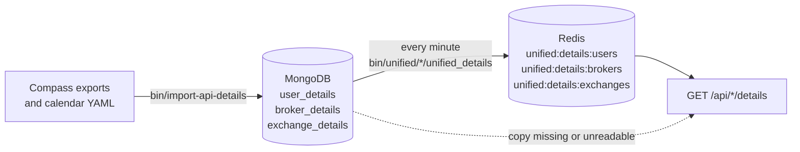

# Users, brokers and exchanges

These three routes serve reference information that changes rarely: the account holder's profile, each broker's registration and contact details, and each exchange's profile with its trading hours and holidays. None of them calls a broker while you wait. They read documents that were loaded into MongoDB by hand and that background scripts copy into Redis once a minute.

The table below lists the three routes on this page.

| Method | Endpoint | Description |
|---|---|---|
| <span class="method get">GET</span> | [`/api/users/details`](#user-details) | The account holder's profile documents, and each broker's own profile of the account |
| <span class="method get">GET</span> | [`/api/brokers/details`](#broker-details) | One document per broker |
| <span class="method get">GET</span> | [`/api/exchanges/details`](#exchange-details) | One document per exchange, with trading hours, holidays and special sessions |

## Where the documents come from

Three MongoDB collections hold these documents, and MongoDB is the store of record for all of them. They are filled by `bin/import-api-details`, which reads MongoDB Compass exports from a directory you name, and they are only ever changed by running that script again.

The diagram below shows how a document travels from an export file to an API response. The Redis copy is only a speed-up: when it is missing or unreadable, the route reads MongoDB directly and serves the same documents.



Each collection has its own copying script, its own Redis key and its own route, as the table below shows.

| Collection | Export file | Keyed by | Copied by | Redis key | Served by |
|---|---|---|---|---|---|
| `user_details` | `unified_broker_interface.user_details.json` | nothing | `bin/unified/user/unified_details` | `unified:details:users` | `GET /api/users/details` |
| `broker_details` | `mongo_backup/unified_broker_interface.brokers.json` | `broker_name` | `bin/unified/brokers/unified_details` | `unified:details:brokers` | `GET /api/brokers/details` |
| `exchange_details` | `unified_broker_interface.exchanges.json` | `exchange` | `bin/unified/exchanges/unified_details` | `unified:details:exchanges` | `GET /api/exchanges/details` |

Because the three copying scripts run separately, one key can already hold a new import while another still holds the copy from the minute before. No route reads more than one of them, so nothing depends on them changing together. A change to MongoDB reaches the API within about a minute.

The import makes two corrections on the way in, which explain some of the field names you will see.

- **Exchanges** get an `exchange` field, the lowercase code used everywhere else in the project (`nse`, `bse`, `mcx`, `ncdex`), taken from the export's display `short_name` such as `NSE`.
- **Brokers** arrive keyed by a misspelled `borker_name` holding a display name such as `Kotak Neo (Kotak Securities Limited)`. The import keeps that display name as `name` and sets `broker_name` to the project's broker code, such as `kotak`. A display name it does not recognize stops the import instead of being guessed.

!!! warning "User details hold personal data"
    The `user_details` export holds identity documents and bank account numbers. The import reads the file where it is and never copies it into the repository, and the route serves it only to a caller holding the access token.

The commands below are the ways to run the import.

```bash
bin/import-api-details /path/to/exports             # upsert exchanges and brokers, load users if empty, copy calendars
bin/import-api-details /path/to/exports --replace   # also reload user_details over what is there
bin/import-api-details --calendars-only             # only re-copy trading hours and holidays
```

## User details

<div class="endpoint" markdown><span class="method get">GET</span> `/api/users/details`<span class="auth">access-token</span></div>

This route returns two things side by side. The first is every document in `user_details`, which is the account holder's profile as it was imported. The second is each broker's own profile of the account, which `bin/unified/user/details` gathers once a minute from the profiles that each broker's scripts keep in Redis.

#### Request parameters

| Name | In | Type | Required | Description |
|---|---|---|---|---|
| `access-token` | header | string | Yes | The token from [`connect`](session.md#connect) |

#### Example

=== "curl"

    ```bash
    curl http://127.0.0.1:8080/api/users/details \
      -H "access-token: $ACCESS_TOKEN"
    ```

=== "Python"

    ```python
    import os

    import requests

    response = requests.get(
        'http://127.0.0.1:8080/api/users/details',
        headers={
            'access-token': os.environ['ACCESS_TOKEN'],
        },
        timeout=10,
    )
    profiles = response.json()['broker_profiles']
    ```

#### Response

The example below is shortened and uses placeholder values. The fields inside `user_details` are whatever the import file held, so they are not listed here. Each broker's profile is that broker's own response body, in that broker's own field names.

```json
{
  "user_details": [
    {"...": "the fields of the imported profile"}
  ],
  "broker_profiles": {
    "dhan": {"dhanClientId": "AB1234", "activeSegment": "...", "...": "..."},
    "zerodha": {"user_id": "AB1234", "...": "..."},
    "flattrade": null,
    "...": "one key for each of the ten brokers"
  }
}
```

#### Response attributes

| Attribute | Type | Description |
|---|---|---|
| `user_details` | array of objects | Every document in the `user_details` collection, without `_id`, in MongoDB's natural order |
| `broker_profiles` | object or null | One key per broker, each holding that broker's profile or `null`. The whole value is `null` when `unified:user:details` is missing or unreadable. |

A broker's profile is `null` when its key is missing or does not hold a profile. The table below shows how often each broker's profile is refreshed, because that decides how fresh this route's copy can be.

| Broker | Kept by | Refreshed |
|---|---|---|
| dhan, zerodha, flattrade, shoonya, fyers, indmoney, groww, stoxkart | `bin/<broker>/user/details` | Every minute |
| wisdom_capital | `bin/wisdom_capital/user/details` | Once a day, as Wisdom Capital allows about one profile call a day |
| kotak | `bin/kotak/session/connect`, from the login response | At each login, because Kotak has no profile endpoint |

#### Status codes

| Status | When |
|---|---|
| <span class="status s2">200</span> | At least one user document or one broker profile exists. |
| <span class="status s4">401</span> | `Access token is required`, `Invalid access token` or `Access token has expired`. |
| <span class="status s4">404</span> | `User profile not found`: there is no user document and no broker profile. |

??? note "Under the hood"
    - Route: `UsersBlueprint.get_user_profile` in `unified_broker_interface/blueprints/users.py`.
    - Documents: `BaseBlueprint.collection_documents` reads `unified:details:users` and falls back to MongoDB `user_details`.
    - Broker profiles: the Redis key `unified:user:details`, written with `SET` every minute by `bin/unified/user/details` from the ten `<broker>:user:details` keys, read in one `MGET`.

## Broker details

<div class="endpoint" markdown><span class="method get">GET</span> `/api/brokers/details`<span class="auth">access-token</span></div>

This route returns every document in `broker_details`, one per broker. Each document carries the project's broker code in `broker_name`, the display name in `name`, and the other registration and contact fields from the import file.

#### Request parameters

| Name | In | Type | Required | Description |
|---|---|---|---|---|
| `access-token` | header | string | Yes | The token from [`connect`](session.md#connect) |

#### Example

=== "curl"

    ```bash
    curl http://127.0.0.1:8080/api/brokers/details \
      -H "access-token: $ACCESS_TOKEN"
    ```

=== "Python"

    ```python
    import os

    import requests

    response = requests.get(
        'http://127.0.0.1:8080/api/brokers/details',
        headers={
            'access-token': os.environ['ACCESS_TOKEN'],
        },
        timeout=10,
    )
    for broker in response.json():
        print(broker['broker_name'], broker['name'])
    ```

#### Response

The example below is shortened to two brokers and shows only the two fields the import guarantees.

```json
[
  {"broker_name": "kotak", "name": "Kotak Neo (Kotak Securities Limited)"},
  {"broker_name": "shoonya", "name": "Shoonya (Finvasia)"}
]
```

#### Response attributes

The table below lists the fields the import sets. The rest of each document is copied from the export as it stands.

| Attribute | Type | Description |
|---|---|---|
| `broker_name` | string | The project's broker code, one of the ten listed in [Constants](constants.md#broker-names) |
| `name` | string | The broker's display name, as the export spelled it |

The import maps display names to broker codes with the fixed table below.

| Display name in the export | `broker_name` |
|---|---|
| `dhan` | `dhan` |
| `flattrade` | `flattrade` |
| `fyers` | `fyers` |
| `Groww` | `groww` |
| `INDstocks` | `indmoney` |
| `Kotak Neo (Kotak Securities Limited)` | `kotak` |
| `Shoonya (Finvasia)` | `shoonya` |
| `Stoxkart` | `stoxkart` |
| `Wisdom Capital` | `wisdom_capital` |
| `Zerodha` | `zerodha` |

#### Status codes

| Status | When |
|---|---|
| <span class="status s2">200</span> | The collection holds at least one document. |
| <span class="status s4">401</span> | `Access token is required`, `Invalid access token` or `Access token has expired`. |
| <span class="status s4">404</span> | `Broker details not found`: the collection is empty. |

??? note "Under the hood"
    - Route: `BrokersBlueprint.get_broker_details` in `unified_broker_interface/blueprints/brokers.py`, which calls `BaseBlueprint.list_collection`.
    - Import: `normalise_broker` in `unified_broker_interface/utilities/import_details.py`. Documents are upserted on `broker_name` under a unique index, and fields are set rather than documents replaced.

## Exchange details

<div class="endpoint" markdown><span class="method get">GET</span> `/api/exchanges/details`<span class="auth">access-token</span></div>

This route returns every document in `exchange_details`, one per exchange. Besides the profile fields from the import file, each document carries the exchange's trading hours, its holidays and its special sessions, which the import copies in from the project's yearly calendar files.

#### Request parameters

| Name | In | Type | Required | Description |
|---|---|---|---|---|
| `access-token` | header | string | Yes | The token from [`connect`](session.md#connect) |

#### Example

=== "curl"

    ```bash
    curl http://127.0.0.1:8080/api/exchanges/details \
      -H "access-token: $ACCESS_TOKEN"
    ```

=== "Python"

    ```python
    import os

    import requests

    response = requests.get(
        'http://127.0.0.1:8080/api/exchanges/details',
        headers={
            'access-token': os.environ['ACCESS_TOKEN'],
        },
        timeout=10,
    )
    exchanges = {document['exchange']: document for document in response.json()}
    print(exchanges['nse']['trading_hours']['equity'])
    ```

#### Response

The example below shows one exchange, shortened to one holiday per calendar and without the profile fields beyond `exchange` and `short_name`. The holidays and the special session are real entries from `stock_brokers/instruments/ticks/utilities/calendars/2026.yaml`.

```json
[
  {
    "exchange": "nse",
    "short_name": "NSE",
    "trading_hours": {
      "timezone": "Asia/Kolkata",
      "equity": {
        "pre_open": {"opens": "09:00", "closes": "09:15"},
        "sessions": [{"name": "normal", "opens": "09:15", "closes": "15:30"}]
      },
      "currency": {
        "sessions": [{"name": "normal", "opens": "09:00", "closes": "17:00"}]
      },
      "commodity": {
        "sessions": [
          {"name": "morning", "opens": "09:00", "closes": "17:00"},
          {"name": "evening", "opens": "17:00", "closes": "23:30", "closes_during_us_standard_time": "23:55"}
        ]
      }
    },
    "holidays": {
      "equity": [{"date": "2026-01-26", "closed": "all", "name": "Republic Day"}],
      "currency": [{"date": "2026-01-26", "closed": "all", "name": "Republic Day"}],
      "commodity": [{"date": "2026-01-26", "closed": "all", "name": "Republic Day"}]
    },
    "special_sessions": [
      {"date": "2026-11-08", "name": "Muhurat trading (timings to be notified)",
       "calendars": ["equity", "currency", "commodity"], "opens": "09:00", "closes": "23:59:59"}
    ],
    "calendar_years": [2026],
    "calendar_copied_at": "2026-09-13 19:50:02.114210"
  }
]
```

#### Response attributes

The table below lists the fields the import adds. The other profile fields are copied from the export as it stands.

| Attribute | Type | Description |
|---|---|---|
| `exchange` | string | The lowercase exchange code: `nse`, `bse`, `mcx` or `ncdex` |
| `short_name` | string | The display code the export carried, such as `NSE` |
| `trading_hours` | object | `timezone` (always `Asia/Kolkata`) and one entry per calendar the exchange trades |
| `trading_hours.<calendar>.pre_open` | object | `opens` and `closes` of the pre-open, present only for `equity` |
| `trading_hours.<calendar>.sessions` | array | Each session's `name`, `opens` and `closes`, as `HH:MM` |
| `holidays` | object | One list per calendar, each entry `date` (`YYYY-MM-DD`), `closed` and `name`, sorted by date |
| `special_sessions` | array | Extra sessions such as Muhurat trading: `date`, `name`, `calendars`, `opens`, `closes` |
| `calendar_years` | array of integers | The years whose calendar files were read |
| `calendar_copied_at` | string | When the calendars were last copied in |

A calendar is a set of segments that open and close together. The table below lists the calendars and which exchanges have them.

| Calendar | What it covers | Exchanges |
|---|---|---|
| `equity` | Cash, indices and equity derivatives | nse, bse |
| `currency` | Currency derivatives | nse, bse |
| `commodity` | Commodity derivatives | nse, bse, mcx, ncdex |

A holiday's `closed` is `all` when the whole day is shut. On the commodity calendars it can also be `morning` or `evening`, because their trading day splits into two sessions at 17:00.

The chart below draws each calendar's sessions on one 24-hour axis, so you can see at a glance when each market is open. The hours come from `TRADING_HOURS` in `unified_broker_interface/utilities/exchange_calendar.py`.

```mermaid
gantt
    title Regular trading hours (IST)
    dateFormat HH:mm
    axisFormat %H:%M
    section NSE, BSE equity
    Pre-open           :09:00, 15m
    Normal             :09:15, 375m
    section NSE, BSE currency
    Normal             :09:00, 480m
    section NSE, BSE, MCX commodity
    Morning            :09:00, 480m
    Evening            :17:00, 390m
    section NCDEX commodity
    Morning            :10:00, 420m
    Evening            :17:00, 240m
```



The commodity evening session on NSE, BSE and MCX closes at 23:30, and at 23:55 while the United States is on standard time. That later close appears in the document as `closes_during_us_standard_time`.

!!! tip "Re-copy after a calendar change"
    The API serves the copy in MongoDB, not the YAML file. After a calendar file changes, run `bin/import-api-details --calendars-only`, and the change reaches the API within a minute.

#### Status codes

| Status | When |
|---|---|
| <span class="status s2">200</span> | The collection holds at least one document. |
| <span class="status s4">401</span> | `Access token is required`, `Invalid access token` or `Access token has expired`. |
| <span class="status s4">404</span> | `Exchange details not found`: the collection is empty. |

??? note "Under the hood"
    - Route: `ExchangesBlueprint.get_exchange_details` in `unified_broker_interface/blueprints/exchanges.py`, which calls `BaseBlueprint.list_collection`.
    - Import: `normalise_exchange` in `unified_broker_interface/utilities/import_details.py` adds `exchange`.
    - Calendars: [`copy_exchange_calendars`][unified_broker_interface.utilities.exchange_calendar.copy_exchange_calendars] merges every `<year>.yaml` under `stock_brokers/instruments/ticks/utilities/calendars/` and sets only its own fields, so a re-import of the profiles leaves them in place. It refuses to run until every exchange in `TRADING_HOURS` has a document.
    - The hours here are the sessions' real hours. They are not the wider windows the tick pipeline accepts ticks in.
