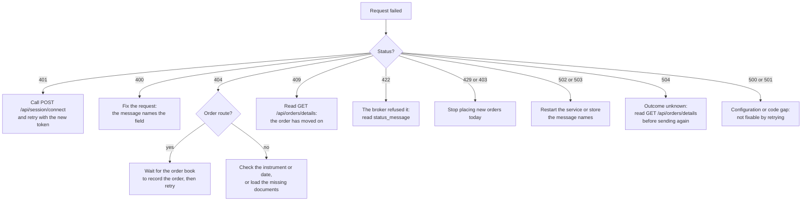

# Errors and status codes

Every route of the UBI API answers a failure with an HTTP status code and a JSON body that says what went wrong. This page lists which route can return which status, quotes the exact error messages from the code, and says what to do about each one.

## The error body

A failed request returns a JSON object with an `error` key. The value is a plain English sentence written for a person to read, and it is the same text the code produces, so you can search for it in the source.

```json
{
  "error": "no broker order book in Redis holds this order_id",
  "order_id": "NOSUCHORDER"
}
```

Some errors carry extra keys beside `error`, so that your program can act on the failure without parsing the sentence. The table below lists the extra keys that appear and what they hold.

| Extra key | Appears on | What it holds |
|---|---|---|
| `broker` | Order routes | The broker the request was going to, or the broker that holds the order |
| `order_id` | `modify`, `cancel` | The order id the request named |
| `brokers` | `modify`, `cancel` (two brokers hold the id); portfolio and order books (stale or unreadable) | Either the broker names that hold the id, or each broker's read status |
| `instrument_id` | `place`, `modify` | The instrument the order was for |
| `skipped` | `place` | Each broker that was passed over, with a `reason` |
| `contract_size_status` | `place`, `modify` | Why a currency or commodity contract's size is not trusted today, such as `conflict` or `undecided` |
| `as_of` | Portfolio and order books | When the stored document was last written |
| `intent_id` | `place` in engine mode | The id of the order intent handed to the order engine |
| `expired_seconds` | `place` in engine mode | How long past its deadline the engine read the intent |

### Order answers are not error bodies

The order routes `place`, `modify` and `cancel` have a second body shape. When a request actually reached a broker, the answer describes what the broker said, and it has no `error` key. Its `outcome` is `accepted`, `rejected` or `unknown`, and the HTTP status follows from the outcome, as the table below shows.

| `outcome` | Status | Meaning |
|---|---|---|
| `accepted` | <span class="status s2">200</span> | The broker took the request |
| `rejected` | <span class="status s4">422</span> | The broker refused it, or the connection could not be opened so nothing was sent |
| `unknown` | <span class="status s5">504</span> | The broker may or may not have acted on it |

This is a real `422` body from the recorded order route tests, which run against stubbed brokers rather than live ones. The fixture stores only the keys of `timing_ms`, because the times change on every run, so the numbers here are illustrative.

```json
{
  "broker": "dhan",
  "broker_response": {"message": "bad request"},
  "instrument_id": "11111111-1111-5111-8111-000000000001",
  "order_id": null,
  "outcome": "rejected",
  "skipped": [],
  "status_message": "bad request",
  "tag": null,
  "timing_ms": {"preparation": 0.412, "broker": 38.107}
}
```

`status_message` carries the broker's own reason, and `broker_response` carries the broker's body, decoded as JSON when possible and otherwise its first 300 characters.

### Errors that do not come from the API's own code

The API registers no error handlers of its own. A path that matches no route therefore gets Flask's standard HTML `404` page, a known path called with the wrong method gets an HTML `405`, and an exception the code does not catch becomes an HTML `500`. None of these has a JSON body.

## Which route returns which status

The matrix below has one row for each of the 26 routes and one column for each status code the API returns. A :material-check: means the route can return that status in either placement mode. A :material-cog: means the route returns it only when `UNIFIED_BROKER_INTERFACE_API_ORDER_PLACEMENT` is `engine` (see [Order engine](order-engine.md)).

| Route | 200 | 202 | 207 | 400 | 401 | 403 | 404 | 409 | 422 | 429 | 500 | 501 | 502 | 503 | 504 |
|---|:-:|:-:|:-:|:-:|:-:|:-:|:-:|:-:|:-:|:-:|:-:|:-:|:-:|:-:|:-:|
| `GET /api/` | :material-check: | | | | | | | | | | | | | | |
| `POST /api/session/connect` | :material-check: | | | | :material-check: | | | | | | :material-check: | | | | |
| `DELETE /api/session/disconnect` | :material-check: | | | | :material-check: | | | | | | | | | | |
| `GET /api/session/status` | :material-check: | | | | :material-check: | | | | | | | | | | |
| `GET /api/users/details` | :material-check: | | | | :material-check: | | :material-check: | | | | | | | | |
| `GET /api/brokers/details` | :material-check: | | | | :material-check: | | :material-check: | | | | | | | | |
| `GET /api/exchanges/details` | :material-check: | | | | :material-check: | | :material-check: | | | | | | | | |
| `GET /api/instruments/segments` | :material-check: | | | | :material-check: | | | | | | | | | :material-check: | |
| `GET /api/instruments/master` | :material-check: | | | :material-check: | :material-check: | | :material-check: | | | | | | | :material-check: | |
| `GET /api/instruments/search` | :material-check: | | | :material-check: | :material-check: | | :material-check: | | | | | | | :material-check: | |
| `GET /api/instruments/details` | :material-check: | | | :material-check: | :material-check: | | :material-check: | | | | | | | :material-check: | |
| `GET /api/instruments/additional_details` | :material-check: | | | :material-check: | :material-check: | | :material-check: | | | | | | | :material-check: | |
| `GET /api/instruments/ltp` | :material-check: | | | :material-check: | :material-check: | | :material-check: | | | | | | | :material-check: | |
| `GET /api/instruments/ohlc` | :material-check: | | | :material-check: | :material-check: | | :material-check: | | | | | | | :material-check: | |
| `GET /api/instruments/quote` | :material-check: | | | :material-check: | :material-check: | | :material-check: | | | | | | | :material-check: | |
| `GET /api/instruments/prices` | :material-check: | | | :material-check: | :material-check: | | :material-check: | | | | | | | :material-check: | |
| `GET /api/instruments/ticks` | :material-check: | | | :material-check: | :material-check: | | :material-check: | | | | | | | :material-check: | |
| `GET /api/portfolio/funds` | :material-check: | | | | :material-check: | | | | | | | | :material-check: | :material-check: | |
| `GET /api/portfolio/holdings` | :material-check: | | | | :material-check: | | | | | | | | :material-check: | :material-check: | |
| `GET /api/portfolio/positions` | :material-check: | | | | :material-check: | | | | | | | | :material-check: | :material-check: | |
| `GET /api/orders/details` | :material-check: | | | | :material-check: | | | | | | | | :material-check: | :material-check: | |
| `GET /api/orders/trades` | :material-check: | | | | :material-check: | | | | | | | | :material-check: | :material-check: | |
| `POST /api/orders/place` | :material-check: | :material-cog: | | :material-check: | :material-check: | :material-cog: | :material-check: | :material-cog: | :material-check: | :material-cog: | | | | :material-check: | :material-check: |
| `PUT /api/orders/modify` | :material-check: | | | :material-check: | :material-check: | | :material-check: | :material-check: | :material-check: | | | :material-check: | | :material-check: | :material-check: |
| `DELETE /api/orders/cancel` | :material-check: | | | :material-check: | :material-check: | | :material-check: | :material-check: | :material-check: | | | | | :material-check: | :material-check: |
| `POST /api/orders/flatten` | :material-check: | | :material-check: | :material-check: | :material-check: | | | | | | | | | :material-check: | |

Only `place` changes behavior between the two placement modes. `modify`, `cancel` and `flatten` always talk to the broker directly.

## I got an error: what now?

The flowchart below is a quick way to decide what to do with a failed request. The sections after it give the detail for each status.



## 200, 202 and 207: success

These three are not errors, but they are listed here so that the set is complete.

| Status | Route | Meaning |
|---|---|---|
| <span class="status s2">200</span> | Every route | Done. For the order routes, the broker accepted the request, or the request was a dry run. |
| <span class="status s2">202</span> | `place`, engine mode | A synthetic order is armed and waiting for its trigger. Nothing has been sent to a broker yet. See [Order engine](order-engine.md). |
| <span class="status s2">207</span> | `flatten` | At least one cancel was not sent, an order was still open after the wait, or a close was not sent or not accepted. The body lists each part. See [Flatten everything](flatten.md). |

## 400 Bad Request

A `400` means the request itself is wrong. Nothing was sent to a broker, and sending the same request again will fail again, so fix it first.

### Instrument and history routes

The instrument routes check their query parameters before doing any work. The table below lists every message they return with `400`, with the placeholder in braces filled in from your request.

| Message | Cause |
|---|---|
| `exchange is required` | `exchange` is missing |
| `exchange must be one of {choices}` | `exchange` is not a known exchange (`master` also accepts `all`) |
| `segment is required` | `segment` is missing |
| `a single segment needs a single exchange` | `master` was asked for `exchange=all` with one named segment |
| `segment {raw!r} is not a segment of {exchange}; see /api/instruments/segments` | The segment does not belong to that exchange |
| `instrument_id must be a UUID` | `instrument_id` is not a valid UUID |
| `give instrument_id, or exchange, segment and the identity fields` | Neither way of naming an instrument was given |
| `a {shape} segment needs {fields}` | An identity field for that kind of segment is missing, for example `a future segment needs underlying_symbol, expiry_date` |
| `strike_price must be a number` | `strike_price` could not be read as a number |
| `option_type must be CE or PE` | `option_type` is something else |
| `{name} must be a date in YYYY-MM-DD format` | A date parameter such as `date`, `from`, `to`, `known_as_of` or `expiry_date` is malformed |
| `{name} is required` | `start` or `end` is missing on `ticks` |
| `{name} must be a date or date and time, such as 2026-09-11 or 2026-09-11 09:15:00` | `start` or `end` is malformed |
| `{name} must be true or false` | `adjusted` is not `true`, `false`, `1`, `0`, `yes` or `no` |
| `{name} must be a whole number` | `limit` or `days` is not a whole number |
| `{name} must be between {minimum} and {maximum}` | `limit` is outside 1 to 200, or `days` is outside 1 to 36500 |
| `interval is required` | `prices` was called without `interval` |
| `interval must be one of {intervals}` | `interval` is not one of the loaded intervals |
| `give either from and to, or days` | `prices` was given both `days` and a date |
| `from and to are required, or days` | `prices` was given only one of `from` and `to` |
| `to must not be before from` | The date range is backwards |
| `an intraday range may span at most 366 days` | An intraday `interval` was asked for over more than 366 days |
| `end must be after start` | The `ticks` period is empty or backwards |

### Placing an order

`POST /api/orders/place` validates the body before it looks at any broker. The recorded route tests include most of these messages exactly as they appear here.

| Message | Cause |
|---|---|
| `the request body must be a JSON object` | The body is missing, is not JSON, or is a JSON array |
| `transaction_type must be one of BUY, SELL` | `transaction_type` is missing or wrong |
| `product must be one of CNC, MIS, NRML` | `product` is missing or wrong |
| `order_type must be one of MARKET, LIMIT, SL, SL-M` | `order_type` is missing or wrong |
| `validity must be one of DAY, IOC` | `validity` is wrong |
| `quantity is required` | `quantity` is missing and there is no `quantity_reference` |
| `quantity must be a whole number of at least 1` | `quantity` is zero, a fraction or text |
| `disclosed_quantity must be a whole number of at least 0` | `disclosed_quantity` is negative or not a whole number |
| `disclosed_quantity cannot be more than quantity` | `disclosed_quantity` is larger than `quantity` |
| `price must be a number of at least 0` | `price` is negative or not a number (the same message is used for `trigger_price`) |
| `a {order_type} order needs a price` | A `LIMIT` or `SL` order has no `price` and no `price_reference` |
| `a {order_type} order takes no price` | A `MARKET` or `SL-M` order carries a `price` |
| `a {order_type} order needs a trigger_price` | An `SL` or `SL-M` order has no `trigger_price` |
| `a {order_type} order takes no trigger_price` | A `MARKET` or `LIMIT` order carries a `trigger_price` |
| `after_market must be true or false` | `after_market` is not a true or false value |
| `dry_run must be true or false` | `dry_run` is not a true or false value |
| `tag must be 1 to 20 letters and digits` | `tag` has other characters or is too long |
| `instrument_id must be a UUID` | `instrument_id` is malformed |
| `give instrument_id, or an exchange of nse, bse, mcx or ncdex with a segment and its identity fields` | Neither way of naming an instrument was given |
| `orders are not sent for the segment {segment!r}` | The segment is not one orders can be sent for, such as an index |
| `a security segment needs symbol` | `symbol` is missing for an equity |
| `a {shape} segment needs underlying_symbol and expiry_date` | A future or option is missing its underlying or expiry |
| `expiry_date must be a date in YYYY-MM-DD format` | `expiry_date` is malformed |
| `an option segment needs a numeric strike_price` | `strike_price` is missing or not a number |
| `option_type must be CE or PE` | `option_type` is something else |
| `the identity fields match more than one instrument, so give instrument_id` | The identity fields are ambiguous |
| `orders are not sent for {segment} instruments` | The instrument named by id is in a segment orders are not sent for, such as `nse_equity_indices` |
| `quantity must be a whole number of lots of {lot}` | The quantity does not fit the chosen broker's lot size, or a currency or commodity contract's trusted size |
| `disclosed_quantity must be a whole number of lots of {lot}` | The same check for `disclosed_quantity` on a currency or commodity contract |
| `{field} must be a whole number of ticks of {tick}` | `price` or `trigger_price` is not a multiple of the tick size most brokers agree on |

The optional `price_reference` and `quantity_reference` objects have messages of their own. These references are resolved only by the order engine (see [Price and quantity references](price-quantity-references.md)).

| Message | Cause |
|---|---|
| `price_reference must be a JSON object` | `price_reference` is not an object (the same message is used for `quantity_reference`) |
| `price_reference kind must be one of {kinds}` | The `kind` is unknown (the same message is used for `quantity_reference`) |
| `an absolute price_reference needs a price above zero` | An `absolute` reference has no positive `price` |
| `level must be a whole number from 1 to 5, which is as deep as the unified quote carries` | A `bid_level` or `offer_level` reference asks for a level deeper than 5 |
| `{field} must be a number` | `buffer_percent`, `offset_percent` or `offset_ticks` is not a number |
| `{field} must be a whole number` | `offset_ticks` is a fraction |
| `a {kind} quantity_reference needs a quantity of at least 1` | An `absolute` or `add_to_position` reference was given no quantity (engine mode) |
| `the {kind} price reference worked out at {price}, which is not a price an order can carry` | The resolved price came out at zero or below (engine mode) |

In engine mode, two more `400` messages come from the engine itself. `the order engine does not run {type!r} orders; it runs {types}` means the `synthetic` type is not one the engine knows. Each synthetic order type also checks its own fields and answers `400` with a message naming the field, for example `a twap needs over_minutes above zero, the time to spread the order across`. [Synthetic orders](synthetic-orders.md) lists each type's fields.

### Modifying and cancelling an order

`PUT /api/orders/modify` and `DELETE /api/orders/cancel` share the checks on how the order is named. The messages below come from those checks and from the modification itself.

| Message | Route | Cause |
|---|---|---|
| `the request body must be a JSON object` | both | The body is present but is not a JSON object |
| `order_id is required` | both | No `order_id` in the body or the query string |
| `order_id must be 1 to 64 letters, digits, hyphens or underscores` | both | `order_id` has other characters |
| `broker must be one of dhan, flattrade, fyers, groww, indmoney, kotak, shoonya, stoxkart, wisdom_capital, zerodha` | both | `broker` names an unknown broker |
| `dry_run must be true or false` | both | `dry_run` is not a true or false value |
| `give at least one of quantity, disclosed_quantity, price, trigger_price, order_type or validity to change` | modify | Nothing to change was given |
| `quantity must be a whole number of at least 1` | modify | `quantity` is zero, a fraction or text |
| `disclosed_quantity cannot be more than quantity` | modify | The new disclosed quantity is larger than the quantity |
| `order_type must be one of MARKET, LIMIT, SL, SL-M` | modify | `order_type` is not one of the allowed words |
| `validity must be one of DAY, IOC` | modify | `validity` is not one of the allowed words |
| `{broker} cannot change {field} on an order` | modify | That broker's modify request cannot change the field, for example `fyers cannot change validity on an order` |
| `{broker} takes no {order_type} orders` | modify | The broker does not take stop-loss orders |
| `{broker} cannot change an order to {order_type}` | modify | The broker cannot switch an order to that type, for example `shoonya cannot change an order to MARKET` |
| `a {order_type} order needs a {field}` | modify | The new order type needs a price or trigger price that was not given |
| `a {order_type} order takes no {field}` | modify | A price or trigger price was given that the order type does not take |
| `quantity must be a whole number of lots of {lot}` | modify | The new quantity does not fit the lot size |
| `{field} must be a whole number of ticks of {tick}` | modify | A new price does not fit the tick size |

### Flattening

`POST /api/orders/flatten` has exactly one `400`, and it protects you from unwinding the account by accident. Send `"confirm": "FLATTEN"` in the body to get past it.

```json
{"error": "flattening cancels every order and closes every position, so it needs confirm set to FLATTEN"}
```

## 401 Unauthorized

A `401` means the token or the key and secret were not accepted. Get a new token with [`POST /api/session/connect`](session.md#connect) and retry.

| Message | Route | Cause |
|---|---|---|
| `Invalid API key or secret` | `connect` | The `api-key` or `api-secret` header is missing or does not match |
| `Access token is required` | every route with a token | The `access-token` header is missing |
| `Invalid access token` | every route with a token | The token is not the one in force, or the session was disconnected |
| `Access token has expired` | every route with a token | The token is past its `expires_at`, or the stored token has no readable expiry |

There is one token for the whole application, and the first `connect` after 07:00 IST each day replaces it. A second client that calls `connect` also replaces it, so a program that suddenly starts getting `Invalid access token` may have had its token replaced by another program.

## 403 Forbidden

A `403` comes only from `place` in engine mode, when the day's loss has reached the configured limit. The engine refuses every new order until the next trading day.

```text
the day is down {loss}, which is past the {limit} limit, so no new order is being placed
```

The body also carries `intent_id`. Do not retry; the refusal will not change until the day resets.

## 404 Not Found

A `404` means the thing you named does not exist in the stores the API reads. The table below lists the messages.

| Message | Route | What to do |
|---|---|---|
| `User profile not found` | `users/details` | Load the user details documents (see [User details](details.md#user-details)) |
| `Broker details not found` | `brokers/details` | Load the broker details documents |
| `Exchange details not found` | `exchanges/details` | Load the exchange details documents |
| `nothing had been mapped on or before {date}` | instrument routes with `date` | Ask for a later date |
| `no instrument {described} is mapped on {date}` | instrument routes | Check the id or identity fields against [`search`](instruments.md#search) |
| `no instrument {described}` | `prices`, `ticks` | The instrument has never been in the instrument table |
| `the instrument is not mapped` | `place` | The instrument id or identity fields are not in today's catalogue |
| `no broker order book in Redis holds this order_id` | `modify`, `cancel` | See below |

The last message needs a word of explanation. `modify` and `cancel` find an order's broker by looking the id up in every broker's order book in Redis, and those books are filled by each broker's order poller and order update websocket. An order placed a moment ago may not be there yet, so wait for the next poll and try again. If it never appears, check that the broker's order scripts are running.

## 409 Conflict

A `409` means the request made sense when it was written but no longer matches the state of the order or account. Read [`GET /api/orders/details`](orders.md#order-book) to see where things stand.

| Message | Route | Cause |
|---|---|---|
| `the order is already {status}` | `modify`, `cancel` | The stored order is `COMPLETE`, `CANCELLED`, `REJECTED` or `EXPIRED` |
| `more than one broker holds an order with this order_id, so give broker` | `modify`, `cancel` | Two brokers use the same id; the body lists them in `brokers`, so send the request again with `broker` |
| `the order has {field} {value}, which the modify route does not handle` | `modify` | The stored order has a product or validity outside the route's words, for example `the order has product BO, which the modify route does not handle` |
| `the order engine read this order after the caller had stopped waiting for it, so it was not placed` | `place`, engine mode | The engine was behind and the intent passed its deadline; nothing was sent |
| `a {kind} quantity_reference found no open position in this instrument, so there is nothing to close` | `place`, engine mode | A `reduce_position` or `liquidate_position` reference found nothing to close |

Some synthetic order types also answer `409` for a state they refuse to act on. For example, a post-only order whose price would cross the book answers `a post-only {side} at {price} would take liquidity against a book of {bid} bid and {offer} offered, so nothing was sent`.

## 422 Unprocessable Entity

A `422` means the order request reached the broker, or tried to, and the answer is `rejected`. The body is an order answer rather than an error body, as shown in [Order answers are not error bodies](#order-answers-are-not-error-bodies). Read `status_message` for the broker's own reason, such as `Insufficient funds` or `Invalid symbol` in the recorded tests.

One `422` never reached the broker at all. When the connection could not be opened in time, the outcome is `rejected` with the message `could not connect to the broker, so nothing was sent: {error}`. It is safe to retry that one.

## 429 Too Many Requests

A `429` comes only from `place` in engine mode. It means the chosen broker has been sent so many order messages today that its daily cap, set by `UNIFIED_BROKER_INTERFACE_API_ORDER_DAILY_CAPS`, has no room left for this kind of order. Every placement, modification and cancellation counts as one message, whichever process sent it. The last part of each cap is kept back for orders that close a position, so a new entry is refused before a closing order is. That share is set by `UNIFIED_BROKER_INTERFACE_API_ORDER_DAILY_CAP_EXIT_RESERVE` and is 0.05 by default.

| Message | Cause |
|---|---|
| `{broker} has been sent {sent} order messages today, and the last {reserve} of its daily cap of {cap} are kept for closing positions, so this was not sent` | A new entry hit the part of the cap kept for exits |
| `{broker} has been sent {sent} order messages today, which is its daily cap of {cap}, so this was not sent` | A closing order hit the whole cap |

The body carries `broker`. The count resets at 06:00 IST, so nothing more can be sent to that broker until then.

## 500 Internal Server Error

The API returns a JSON `500` in one place. `POST /api/session/connect` answers `unified_broker_interface settings are not configured` when MongoDB `settings` has no document whose `broker_name` is `unified_broker_interface`. Add that document with the `api_key` and `api_secret` your clients will use (see [Configuration](../get-started/configuration.md)).

Any other `500` is an HTML page from Flask for an exception the code did not catch. Look in the API's log for the traceback.

## 501 Not Implemented

A `501` comes from `modify` when the broker holding the order has no modify request built. The message is `modifying orders is not implemented for {broker}`. Every broker currently lists at least one field it can modify, so this status is reserved for a broker added without one. Cancel the order and place a new one instead.

## 502 Bad Gateway

A `502` comes from the routes that read a combined document from Redis: the three portfolio routes and the order and trade books. It means the document is fresh but no broker's data in it could be read, because every broker is `missing` or `unreadable`. The body lists each broker's status in `brokers`.

```text
Unable to retrieve {subject} information
```

The subject is `funds`, `holdings`, `positions`, `orders` or `trades`. Check the broker scripts that feed the document and the brokers' own logins.

## 503 Service Unavailable

A `503` means something the route depends on is missing, stale or unreachable. Retrying will not help until that thing is fixed, and the message says what it is.

### Stores and background scripts

The messages below point at a store or a script that has stopped.

| Message | Route | What to do |
|---|---|---|
| `{Subject} are not available: nothing is keeping {key}` | portfolio routes, order and trade books | Start the `bin/unified/` script that writes that key |
| `{Subject} are out of date: {key} was last written at {as_of}` | portfolio routes, order and trade books | The script has stopped; restart it. The body carries `as_of` and `brokers`. |
| `no instruments have been mapped yet` | instrument routes, `place` | Run the daily instrument download and mapping |
| `today's instrument catalogue is not published yet: the catalogue for {date} has expired, and the daily mapping has not published a new one` | `place` | Wait for `unified-mapping.service` to finish, or run `bin/unified/instruments/map` |
| `the instrument cache is unreachable` | `search` | Check Redis |
| `no recent quote is cached, and no broker that serves quotes carries this instrument` | `ltp`, `ohlc`, `quote` | Start the websocket quote feeds |
| `no recent quote is cached, and every broker failed - {failures}` | `ltp`, `ohlc`, `quote` | The failures list each broker's error |
| `Redis could not be read: {error}` | order routes | Check Redis |

The portfolio and order books are refused when they are older than the route allows. That limit is 30 seconds for funds, positions, orders and trades, and 300 seconds for holdings.

### Placing an order

These messages come from `place` when no broker can take the order as it stands.

| Message | Cause |
|---|---|
| `every broker is excluded from order placement` | `UNIFIED_BROKER_INTERFACE_API_ORDER_EXCLUDED_BROKERS` lists every broker |
| `no broker can take this order` | Every broker was passed over; the body's `skipped` list says why for each one |
| `the contract size of this {segment} instrument is not trusted today ({status}), so no order is sent` | A currency or commodity contract's size was not decided this morning |

This is a real body from the recorded tests, shortened to two brokers.

```json
{
  "error": "no broker can take this order",
  "instrument_id": "11111111-1111-5111-8111-000000000001",
  "skipped": [
    {"broker": "dhan", "reason": "has no login in Redis"},
    {"broker": "flattrade", "reason": "has no login in Redis"}
  ]
}
```

The `reason` for each skipped broker is one of the sentences in the table below.

| Reason | What it means |
|---|---|
| `does not take {market} orders` | The broker does not trade that exchange and segment |
| `does not know how it counts quantity in {market} orders` | The broker has no quantity rule for that currency or commodity market |
| `has no mapping for the instrument` | The broker's instrument master has no row for it |
| `its mapping carries no {field}` | The broker's row lacks the identifier the order needs |
| `its mapping carries no whole lot size` | The broker's row lacks a lot size it needs to convert quantity |
| `its mapping carries no numeric instrument id` | Wisdom Capital only: the row's instrument id is not a number |
| `has no login in Redis` | The broker is not logged in today |
| `its login in Redis carries no sid` | Kotak only: the login is incomplete |
| `has no {fields} in its Redis settings` | A setting the broker needs is missing |
| `takes no {order_type} orders` | The broker does not take stop-loss orders |
| `takes no after-market orders` | The broker does not take `after_market` orders |

### Modifying and cancelling an order

These messages mean Redis does not yet hold something the broker needs to identify or change the order. Most of them clear after the broker's next order book poll.

| Message | Route |
|---|---|
| `{broker} has no login in Redis` | both |
| `kotak has no sid in its login in Redis` | both |
| `{broker} has no {fields} in its Redis settings` | both |
| `Redis does not hold this order's {field} yet, so try again after the broker's next order book poll` | modify |
| `Redis does not hold this order's {field} as a whole number, so try again after the broker's next order book poll` | modify |
| `Redis does not hold this {order_type} order's {field}, so give {field}` | modify |
| `Redis does not hold this {broker} order's {field} yet, so try again after the broker's next order book poll` | modify |
| `Redis does not hold this order's exchange and trading symbol yet, so try again after the broker's next order book poll` | modify, Flattrade and Shoonya |
| `Redis does not hold this Groww order's segment yet, so try again after Groww's next order book poll` | both, Groww |
| `Redis does not hold this Kotak order's token, exchange segment and trading symbol yet, so try again after Kotak's next order book poll` | modify, Kotak |
| `Redis does not hold this Stoxkart order's exchange and token yet, so try again after Stoxkart's next order book poll` | modify, Stoxkart |
| `the order's instrument could not be found in today's catalogue, so a changed quantity cannot be converted into the broker's terms` | modify |
| `{broker} does not know how it counts quantity in {market} orders` | modify |
| `the contract size of this {segment} instrument is not trusted today ({status}), so its quantity cannot be changed` | modify |

A price-only change does not need the instrument, so when a quantity change is refused for one of the last three reasons, a change to `price` or `trigger_price` alone may still go through.

### Engine mode

In engine mode, `place` has a few more `503` messages. The table below lists the general ones; some synthetic order types add their own, such as a missing side of the book.

| Message | Cause |
|---|---|
| `the order engine is not running, so the order was not placed; start unified-orders@order_engine.service` | No engine holds its lock; nothing was queued. Start the engine, and enable it so it comes back after a reboot. |
| `the order could not be written for the order engine: {error}` | Redis refused the intent; nothing was queued |
| `the order rate budget is full, so this order was not sent; try again in a moment` | The per-broker rate budget had no room; this one is worth retrying |
| `a price reference needs a tick size the brokers agree on and there is none for this instrument` | A `price_reference` cannot be rounded to a tick |
| `a {kind} price reference needs a live quote for this instrument and there is none` | No live quote to resolve the reference from |
| `a {kind} price reference needs {level} level(s) on the {side} side of the book and the quote carries {count}` | The book is too shallow |
| `a {kind} quantity_reference needs the unified positions and they could not be read` | The positions document is missing |

## 504 Gateway Timeout

A `504` means the outcome is **unknown**. The request may well have reached the broker and been acted on.

!!! danger "Never resend an order after a 504 without checking first"
    A `504` from `place`, `modify` or `cancel` does not mean the request failed. Read [`GET /api/orders/details`](orders.md#order-book) and look for the order before you send anything again, or you may end up with two orders.

In direct mode, a `504` is an order answer with `outcome` set to `unknown`. The recorded tests show these `status_message` values, among others.

| `status_message` | What happened |
|---|---|
| `ReadTimeout: {error}` | The broker did not answer in time |
| `ConnectionError: {error}` | The connection broke after the request was sent |
| `the broker answered without an order id: {body}` | The broker answered success but gave no order id |
| The broker's own message | The broker answered with a server error that its rules do not settle as a refusal |

In engine mode, `place` has its own `504` answers from the handoff between the API worker and the order engine. The table below lists them.

| Message | Where it appears |
|---|---|
| `the order engine did not answer within {seconds} seconds, so this order may still be placed` | `status_message` of an order answer |
| `the order was written for the order engine but its answer could not be read ({error}), so this order may still be placed` | `status_message` of an order answer |
| `the order engine answered with something that could not be read, so the outcome of this order is unknown` | `error` |
| `the order engine failed while placing this order ({exception}), so its outcome is unknown` | `error` |

An engine answer that carries no status is also passed on with `504`. Each of these bodies carries `intent_id`, which you can use to find the order in the engine's records (see [Order engine](order-engine.md)).
