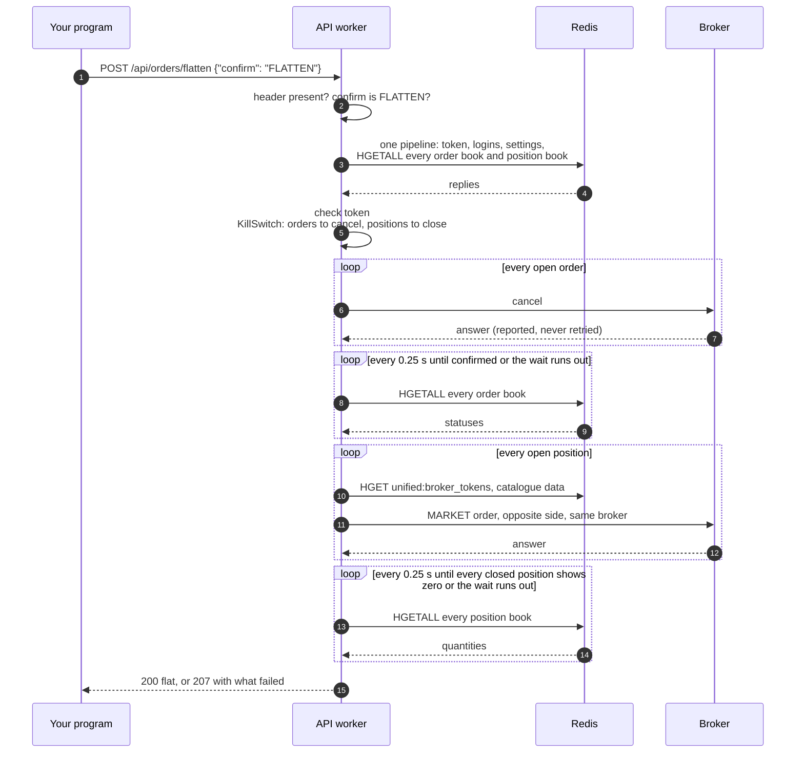

# Flatten everything

`POST /api/orders/flatten` is the panic button. It cancels every open order at every broker, waits until the brokers confirm the cancels, and then closes every open position with a market order at the broker that holds it. It answers that the account is flat only after the brokers' own positions show zero. It exists for the moment when you want the whole account flat now and have no time to work out what is open where.

!!! danger "This unwinds the whole account"
    Without `dry_run`, this route cancels every open order at all ten brokers and sends a real `MARKET` order for every open position. Market orders fill at whatever price is available, and nothing is retried or undone. Always look at a dry run first, and send the real request only when you mean it.

The table below lists the one route on this page.

| Method | Endpoint | Description |
|---|---|---|
| <span class="method post">POST</span> | [`/api/orders/flatten`](#flatten) | Cancels every open order, waits, closes every position, then waits for the positions to show zero |

## Why the cancels go first

The order of the two halves is the whole point of this route. Suppose you hold a long position with a stop-loss order resting below it. If the position were closed first, the stop would still be live at the exchange. When the price later fell to the stop, it would sell again and leave you short, which is a new trade that nobody chose. So the route cancels every open order first, then re-reads the brokers' order books until they agree the orders are gone, and only then sends closing orders.

<figure class="diagram">
--8<-- "docs/assets/diagrams/flatten.svg"
<figcaption>Orange dots are cancels, which leave first; blue dots are the re-reads of the order books while the route waits; green dots are the closing market orders, which leave only after the wait.</figcaption>
</figure>

## Flatten

<div class="endpoint" markdown><span class="method post">POST</span> `/api/orders/flatten`<span class="auth">access-token</span></div>

This route decides what to cancel and what to close from Redis alone. Open orders come from each broker's `<broker>:orders:orders` hash, and positions come from each broker's own `<broker>:portfolio:positions` hash rather than from the merged portfolio document, because a closing order has to go to the broker that actually holds the position.

### Request parameters

The body is a JSON object with a confirmation word, so that a stray or mistyped request cannot unwind an account.

| Name | In | Type | Required | Description |
|---|---|---|:---:|---|
| `access-token` | header | string | yes | The day's token. |
| `confirm` | body | string | yes | Must be exactly `FLATTEN`, in capitals. Anything else is refused with <span class="status s4">400</span>. |
| `dry_run` | body | boolean | no | Reports what would be cancelled and closed, and sends nothing. Unlike the other order routes, this one reads the value with Python's `bool()`, so any non-empty value, including the string `"false"`, counts as a dry run. Send JSON `true` or leave the field out. |

=== "curl"

    ```bash
    curl -X POST http://127.0.0.1:8080/api/orders/flatten \
      -H "access-token: $ACCESS_TOKEN" \
      -H "Content-Type: application/json" \
      -d '{"confirm": "FLATTEN", "dry_run": true}'
    ```

=== "Python"

    ```python
    import os

    import requests

    response = requests.post(
        'http://127.0.0.1:8080/api/orders/flatten',
        headers={'access-token': os.environ['ACCESS_TOKEN']},
        json={'confirm': 'FLATTEN', 'dry_run': True},
        timeout=60,
    )
    print(response.status_code, response.json())
    ```

Give the client a generous timeout. The route sends its requests one after another, and it waits twice: up to `UNIFIED_BROKER_INTERFACE_API_ORDER_FLATTEN_WAIT_SECONDS` (5 seconds by default) for the cancels to be confirmed, and up to the same again for the closed positions to show zero.

### Response

The bodies below are real answers recorded by the offline suite `python -m test_runs.order_flatten`, which runs the route against an in-memory Redis and stubbed brokers, so no real order was involved. The suite records only the names of the `timing_ms` keys, so the numbers here are illustrative.

=== "Dry run"

    ```json
    {
      "dry_run": true,
      "would_cancel": [
        {"broker": "flattrade", "order_id": "26091500000021", "status": "OPEN"}
      ],
      "would_close": [
        {
          "broker": "flattrade",
          "position_key": "RELIANCE-MIS",
          "instrument_token": "1",
          "tradingsymbol": "RELIANCE-flattrade",
          "exchange": "NSE",
          "segment": null,
          "product": "intraday",
          "quantity": 10,
          "transaction_type": "SELL",
          "close_quantity": 10
        }
      ],
      "timing_ms": {"preparation": 0.9}
    }
    ```

=== "Flat (200)"

    ```json
    {
      "cancelled": [
        {
          "broker": "flattrade",
          "order_id": "26091500000021",
          "sent": true,
          "outcome": "accepted",
          "status_message": null
        }
      ],
      "still_open_after_waiting": [],
      "closed": [
        {
          "broker": "flattrade",
          "position_key": "RELIANCE-MIS",
          "instrument_token": "1",
          "tradingsymbol": "RELIANCE-flattrade",
          "exchange": "NSE",
          "segment": null,
          "product": "intraday",
          "quantity": 10,
          "transaction_type": "SELL",
          "close_quantity": 10,
          "sent": true,
          "outcome": "accepted",
          "order_id": "26091500000099",
          "status_message": null,
          "http_status": 200
        }
      ],
      "positions_still_open_after_waiting": [],
      "flat": true,
      "timing_ms": {"preparation": 262.4}
    }
    ```

=== "Cancel never confirmed (207)"

    ```json
    {
      "cancelled": [
        {
          "broker": "flattrade",
          "order_id": "26091500000021",
          "sent": true,
          "outcome": "accepted",
          "status_message": null
        }
      ],
      "still_open_after_waiting": ["flattrade:26091500000021"],
      "closed": [
        {
          "broker": "flattrade",
          "position_key": "RELIANCE-MIS",
          "close_quantity": 10,
          "transaction_type": "SELL",
          "sent": true,
          "outcome": "accepted",
          "order_id": "26091500000099",
          "http_status": 200
        }
      ],
      "positions_still_open_after_waiting": [],
      "flat": false,
      "timing_ms": {"preparation": 5004.1}
    }
    ```

=== "Position still held (207)"

    ```json
    {
      "cancelled": [],
      "still_open_after_waiting": [],
      "closed": [
        {
          "broker": "flattrade",
          "position_key": "RELIANCE-MIS",
          "close_quantity": 10,
          "transaction_type": "SELL",
          "sent": true,
          "outcome": "accepted",
          "order_id": "26091500000099",
          "http_status": 200
        }
      ],
      "positions_still_open_after_waiting": ["flattrade:RELIANCE-MIS"],
      "flat": false,
      "timing_ms": {"preparation": 5003.2}
    }
    ```

=== "Position not mapped (207)"

    ```json
    {
      "cancelled": [],
      "still_open_after_waiting": [],
      "closed": [
        {
          "broker": "flattrade",
          "position_key": "RELIANCE-MIS",
          "instrument_token": "999999",
          "tradingsymbol": "RELIANCE-flattrade",
          "exchange": "NSE",
          "segment": null,
          "product": "intraday",
          "quantity": 10,
          "transaction_type": "SELL",
          "close_quantity": 10,
          "sent": false,
          "outcome": null,
          "status_message": "the broker's token does not name exactly one mapped instrument, so this position was not closed"
        }
      ],
      "positions_still_open_after_waiting": [],
      "flat": false,
      "timing_ms": {"preparation": 1.3}
    }
    ```

The "cancel never confirmed" and "position still held" examples are shortened: their `closed` entries also carry the position fields shown in the "Flat" example. In the "position still held" example the broker accepted the close, but the position still showed 10 when the wait ended. That can mean the exchange rejected the order after the broker accepted it, or only that the broker's positions had not been refreshed yet, so look at the broker before sending anything else.

### Response attributes

A dry run answers with `would_cancel` and `would_close`. A real run answers with `cancelled`, `still_open_after_waiting`, `closed`, `positions_still_open_after_waiting` and `flat`.

| Attribute | Type | Description |
|---|---|---|
| `dry_run` | boolean | `true`, on a dry run only. |
| `would_cancel[]` | array | Each order that would be cancelled, with `broker`, `order_id` and `status`. |
| `would_close[]` | array | Each position that would be closed, in the same shape as a `closed` entry before sending. |
| `cancelled[]` | array | One entry per cancel attempted, with `broker`, `order_id`, `sent`, `outcome` and `status_message`. |
| `cancelled[].sent` | boolean | Whether the cancel request left the machine. `false` means it could not be built or sent, and `status_message` says why. |
| `still_open_after_waiting[]` | array of strings | The orders a broker still reported as live when the wait ended, written as `broker:order_id`. |
| `closed[]` | array | One entry per position, with the position's fields plus what happened. |
| `closed[].position_key` | string | The field of the position in `<broker>:portfolio:positions`. |
| `closed[].quantity` | number | The signed net quantity held: positive for long, negative for short. |
| `closed[].transaction_type` | string | `SELL` to close a long position, `BUY` to close a short one. |
| `closed[].close_quantity` | number | The size of the closing order, which is the absolute quantity. |
| `closed[].product` | string or null | The position's product, on the shared vocabulary (such as `intraday`). |
| `closed[].sent` | boolean | Whether the closing order was sent. |
| `closed[].outcome` | string or null | `accepted`, `rejected` or `unknown`, from the broker's answer. |
| `closed[].order_id` | string or null | The closing order's broker id, when sent. |
| `closed[].http_status` | number | The status `POST /api/orders/place` would have answered with for this close, when sent. |
| `closed[].status_message` | string or null | Why the close failed or was not sent. |
| `positions_still_open_after_waiting[]` | array of strings | The positions whose close was accepted but which a broker still reported with a quantity other than zero when the wait ended, written as `broker:position_key`. |
| `flat` | boolean | `true` only when every cancel was sent, no order was still open after the wait, every close was sent and accepted, and every closed position showed zero before the second wait ended. |
| `timing_ms.preparation` | number | Milliseconds from the request's arrival to the answer, including every broker call and the wait. |

### Status codes

The route checks the header and the confirmation before it reads Redis, so a request without `confirm` is refused even before its token is compared.

| Status | When |
|---|---|
| <span class="status s2">200</span> | Everything asked for was done, or this was a dry run. `flat` is `true`. Nothing open and nothing held is also a 200. |
| <span class="status s2">207</span> | Some part failed: a cancel could not be sent, an order was still live after the wait, a close was not sent or not accepted, or a closed position was still held after the wait. `flat` is `false`. Read every entry. |
| <span class="status s4">400</span> | `flattening cancels every order and closes every position, so it needs confirm set to FLATTEN`. |
| <span class="status s4">401</span> | `Access token is required`, `Invalid access token` or `Access token has expired`. |
| <span class="status s5">503</span> | `Redis could not be read: <error>`, when the first read of everything fails. Nothing was sent. |

A failure after the first read never changes the status to anything but 207; it is reported in the entry instead. These are the messages an entry can carry.

| Entry | `status_message` | What it means |
|---|---|---|
| cancel | `<broker> has no login in Redis` or `<broker> has no <settings> in its Redis settings` | The broker cannot take a cancel right now, so none was sent. |
| cancel | `the cancel could not be built: <error>` | Redis did not hold a value the broker's cancel needs. |
| cancel | `the cancel could not be sent: <error>` | The request raised before an answer came back. |
| close | `the broker's token does not name exactly one mapped instrument, so this position was not closed` | `unified:broker_tokens` has no entry, or more than one instrument, for the position's token. |
| close | any refusal message from `POST /api/orders/place` | For example a lot-size problem, or `<broker> cannot take this order: <reason>`. |
| close | `the close could not be sent: <error>` | Anything else that went wrong while sending. |

## What it does, step by step

The sequence below follows a real run with one open order and one position, in direct placement mode.



### What is cancelled

Every order whose status is not `COMPLETE`, `CANCELLED`, `REJECTED` or `EXPIRED` is cancelled. An order with a status nobody has mapped is cancelled too, because an unknown status is far more likely to be a live order with a new spelling than a finished one. Cancelling a finished order costs a refusal, while leaving a live one costs a position.

The wait treats an order as gone once its status is finished, or once its entry has disappeared from the broker's hash. It stops early when every cancelled order is gone.

### What is closed

Only positions reported on the `NET` basis are closed. A broker that reports both a day row and a net row reports the same holding twice, and closing both would double the trade. A position with no `day_or_net` field counts as `NET`, and a position whose quantity is zero is left alone.

Each closing order is an ordinary placement with these fields.

| Field | Value |
|---|---|
| `instrument_id` | The one instrument `unified:broker_tokens` lists for `<broker>:<instrument_token>` |
| `transaction_type` | `SELL` for a long position, `BUY` for a short one |
| `product` | `CNC` when the position's product is `delivery`, `MIS` when it is `intraday`, and `NRML` otherwise |
| `order_type` | `MARKET` |
| `quantity` | The absolute net quantity |
| broker | The broker that holds the position, never the selector's choice |

In direct mode the close goes through the same checks as `POST /api/orders/place`, with the broker named: the broker must still be able to take the order, and the quantity must fit the lot size. The broker exclusion list does not stop a close, because a position can only be closed where it is held.

### Flatten in engine mode

When `UNIFIED_BROKER_INTERFACE_API_ORDER_PLACEMENT` is `engine`, the cancels are still sent straight from the API worker, but each close is written to the order engine as an intent and waits up to `UNIFIED_BROKER_INTERFACE_API_ORDER_ENGINE_TIMEOUT_SECONDS` for its answer, one close after another. The intent's body carries two additions, shown below as the offline suite recorded them.

```json
{
  "instrument_id": "11111111-1111-5111-8111-000000000001",
  "transaction_type": "SELL",
  "product": "MIS",
  "order_type": "MARKET",
  "quantity": 10,
  "broker": "flattrade",
  "synthetic": {"type": "simple", "closes_position": true}
}
```

The engine runs the close as a plain `simple` order, which sends it to the broker named in `broker` rather than the one the broker selector would choose. `closes_position` lets the close use the part of the broker's daily order cap kept for exits, as described in [Daily order caps](orders.md#daily-order-caps).

Only this route can name the broker. `POST /api/orders/place` removes a `broker` field from the caller's body before handing it to the engine, so a caller of that route never chooses where an order goes.

??? note "Under the hood"
    - **Redis keys read:** `last_login`, `settings`, every `<broker>:orders:orders` and `<broker>:portfolio:positions`, then `unified:broker_tokens` and today's catalogue for each close.
    - **Timing:** each of the two waits lasts up to `UNIFIED_BROKER_INTERFACE_API_ORDER_FLATTEN_WAIT_SECONDS` (default `5`), re-reading every 0.25 seconds. A Redis error during a re-read is skipped and the wait goes on. The positions pollers refresh every 0.5 to 1 second at most brokers, but Fyers's refreshes every 5 seconds, so a Fyers position can be reported as still held when it closed near the end of the wait.
    - **What counts as closed:** a position's entry showing a quantity of zero, or the entry having disappeared from `<broker>:portfolio:positions`. Only positions whose close was accepted are waited for, because every other close is already reported as a failure.
    - **Nothing is retried.** A panic button that retries takes longer to finish, so a failed cancel or close is reported and the route moves on.
    - **Classes:** [`KillSwitch`][unified_broker_interface.utilities.broker_orders.utilities.kill_switch.KillSwitch] decides what to cancel and close and never acts; `OrdersBlueprint.flatten_everything` in `unified_broker_interface/blueprints/orders.py` reads Redis and sends.
    - **Offline check:** `python -m test_runs.order_flatten` pins that every cancel is sent before any close, by recording every broker request in the order it left.
