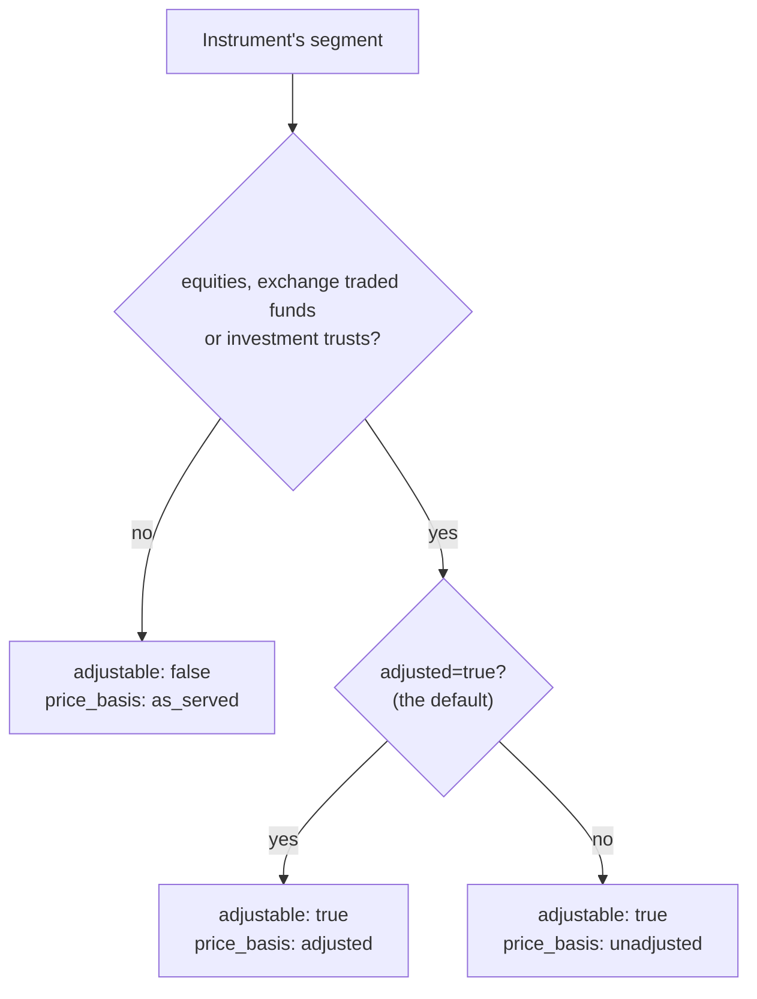
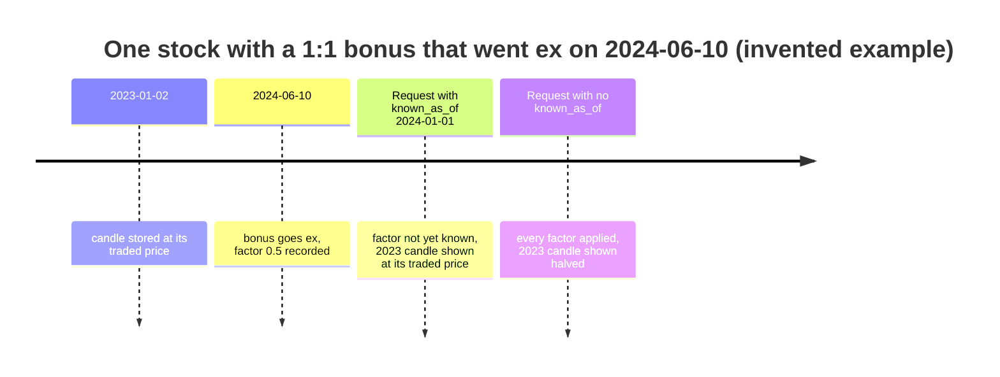
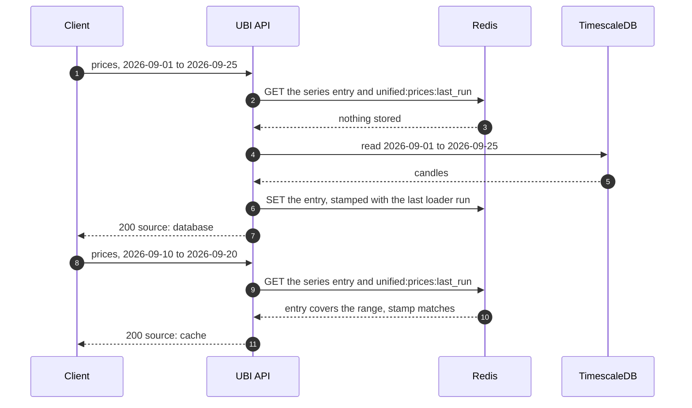

# Historical data

The historical data routes return what has already been stored about one instrument: its candles from the unified price history, and every tick the live feed recorded. Neither route calls a broker. Both read TimescaleDB, and the candle route keeps a copy of each answer in Redis so that a repeated request costs no database query.

The table below lists the two routes on this page.

| Method | Endpoint | Description |
|---|---|---|
| <span class="method get">GET</span> | [`/api/instruments/prices`](#prices) | Candles between two dates, or for the last so many days, adjusted for corporate actions where that applies |
| <span class="method get">GET</span> | [`/api/instruments/ticks`](#ticks) | Every recorded tick between two instants, streamed as one JSON array |

Both take the instrument the same way as the [instrument routes](instruments.md#naming-an-instrument). Unlike those routes, they also find an instrument that is no longer listed today, such as an expired future or a delisted stock, because such an instrument still has history.

## Glossary of constants

The table below lists the enumerated values these routes take and return.

| Parameter | Values | Meaning |
|---|---|---|
| `interval` | `day`, `1minute`, `2minute`, `3minute`, `4minute`, `5minute`, `10minute`, `15minute`, `20minute`, `25minute`, `30minute`, `45minute`, `60minute`, `120minute`, `180minute`, `240minute` | The candle length. These are the intervals the price history loader accepts. |
| `price_basis` | `adjusted` | Prices corrected for splits, bonuses and demergers |
| `price_basis` | `unadjusted` | Prices as they traded, for an instrument that could be adjusted but was not asked to be |
| `price_basis` | `as_served` | Prices exactly as the broker served them, for an instrument that is never adjusted |
| `source` | `cache`, `database` | Whether the candles were sliced from the Redis copy or read from TimescaleDB |

!!! note "Which intervals hold data"
    The daily timer loads only `day` candles. Intraday intervals are loaded by hand with `bin/unified/instruments/price_history`, so an intraday request can return an empty `candles` array for an instrument nobody has loaded. See [Price history](../pipelines/price-history.md).

## Adjusted, unadjusted and as served

A stock split or a bonus issue changes a share's price overnight without anyone losing money, so a chart that ignores it shows a false crash. The project corrects for these events only where they apply, which is to the cash segments `equities`, `exchange_traded_funds` and `investment_trusts` on any exchange. Those are stored unadjusted, with adjustment factors kept beside them, and adjusted when they are read.

Every other instrument is stored exactly as the broker served it and is read that way whatever `adjusted` says. That includes futures and options, even on an adjustable stock, and indices, bonds, currencies, commodities, mutual funds and the `uncategorised` segment. The flowchart below shows how the basis of an answer is decided.



### Seeing prices as they looked on a past day

With `known_as_of`, only the adjustment factors whose ex-date is on or before that date are applied. That is what a chart showed on that day, and it is what a backtest standing on that day may use. Without it, a backtest of 2023 would see prices already halved for a bonus that went ex in 2024.

The timeline below illustrates the idea with an invented bonus issue. It shows which factors each request applies.



`known_as_of` only matters when the basis is `adjusted`. For any other basis it is ignored, and the answer's `known_as_of` is `null`.

## Prices

<div class="endpoint" markdown><span class="method get">GET</span> `/api/instruments/prices`<span class="auth">access-token</span></div>

This route returns one instrument's candles for one interval, either between two dates or for the last so many days. It answers from the Redis copy of the series when that copy covers the range, and from TimescaleDB otherwise, and `source` says which happened.

#### Request parameters

| Name | In | Type | Required | Description |
|---|---|---|---|---|
| `access-token` | header | string | Yes | The token from [`connect`](session.md#connect) |
| `instrument_id` | query | string | One spelling | The instrument's UUID |
| `exchange`, `segment` and the identity fields | query | string | The other spelling | See [Naming an instrument](instruments.md#naming-an-instrument) |
| `interval` | query | string | Yes | One of the intervals in the glossary above |
| `from` | query | string | With `to` | The first day, `YYYY-MM-DD`, inclusive, as an India calendar day |
| `to` | query | string | With `from` | The last day, `YYYY-MM-DD`, inclusive |
| `days` | query | integer | Instead of `from` and `to` | From `1` to `36500`. The range becomes today back to `days` days ago, both ends inclusive, so `days=30` covers 31 calendar days. |
| `adjusted` | query | boolean | No | `true` (the default) or `false`. `1`, `yes`, `0` and `no` are accepted too. Only an adjustable instrument is affected. |
| `known_as_of` | query | string | No | `YYYY-MM-DD`. Apply only the adjustment factors known by that date. |

An intraday range may span at most 366 days, measured as `to` minus `from`. A `day` range has no limit.

#### Example

=== "curl"

    ```bash
    curl "http://127.0.0.1:8080/api/instruments/prices?exchange=nse&segment=equities&symbol=INFY&interval=day&days=30" \
      -H "access-token: $ACCESS_TOKEN"
    ```

=== "Python"

    ```python
    import os

    import requests

    response = requests.get(
        'http://127.0.0.1:8080/api/instruments/prices',
        headers={
            'access-token': os.environ['ACCESS_TOKEN'],
        },
        params={
            'exchange': 'nse',
            'segment': 'equities',
            'symbol': 'INFY',
            'interval': 'day',
            'from': '2026-09-01',
            'to': '2026-09-25',
        },
        timeout=30,
    )
    answer = response.json()
    for candle in answer['candles']:
        row = dict(zip(answer['columns'], candle))
        print(row['time'], row['close'])
    ```

#### Response

Each candle is an array whose positions are named by `columns`, which keeps a long series compact. The example below is shortened to two candles. The id is a placeholder, and the prices, volumes and times are illustrative.

```json
{
  "instrument_id": "11111111-1111-5111-8111-000000000002",
  "exchange": "nse",
  "segment": "nse_equities",
  "shape": "security",
  "symbol": "INFY",
  "underlying_symbol": null,
  "expiry_date": null,
  "strike_price": null,
  "option_type": null,
  "interval": "day",
  "from": "2026-09-01",
  "to": "2026-09-25",
  "adjustable": true,
  "price_basis": "adjusted",
  "known_as_of": null,
  "source": "database",
  "columns": ["time", "open", "high", "low", "close", "volume", "oi", "price_factor"],
  "candles": [
    ["2026-09-01T00:00:00+05:30", 1498.0, 1512.5, 1490.1, 1508.3, 5123400, null, 1.0],
    ["2026-09-02T00:00:00+05:30", 1508.3, 1519.9, 1501.0, 1515.6, 4876100, null, 1.0]
  ]
}
```

#### Response attributes

The answer starts with the nine identity fields described under [instrument master](instruments.md#master), followed by the fields below.

| Attribute | Type | Description |
|---|---|---|
| `interval` | string | The interval asked for |
| `from` | string | The first day of the range, `YYYY-MM-DD` |
| `to` | string | The last day of the range, `YYYY-MM-DD` |
| `adjustable` | boolean | Whether this instrument's prices can be adjusted at all |
| `price_basis` | string | `adjusted`, `unadjusted` or `as_served` |
| `known_as_of` | string or null | The cut-off date applied, only when `price_basis` is `adjusted` and one was asked for |
| `source` | string | `cache` when the candles were sliced from the Redis copy, `database` when they were read from TimescaleDB |
| `columns` | array of strings | The name of each position in a candle |
| `candles` | array of arrays | The candles, oldest first |

The table below describes each column a candle can carry.

| Column | Type | Description |
|---|---|---|
| `time` | string | The candle's start, ISO 8601 with its offset |
| `open`, `high`, `low`, `close` | number | The prices, adjusted when `price_basis` is `adjusted` |
| `volume` | integer or null | The traded volume, adjusted by the volume factor when `price_basis` is `adjusted` |
| `oi` | integer or null | Open interest, for a derivative |
| `price_factor` | number | Only when `price_basis` is `adjusted`: the factor the stored prices were multiplied by, `1` when no corporate action applies |

#### Status codes

| Status | When |
|---|---|
| <span class="status s2">200</span> | The range was read. An empty `candles` array means nothing is stored for it. |
| <span class="status s4">400</span> | `interval is required`, `interval must be one of day, 1minute, ...`, `give either from and to, or days`, `from and to are required, or days`, `days must be a whole number`, `days must be between 1 and 36500`, `from must be a date in YYYY-MM-DD format`, `to must not be before from`, `an intraday range may span at most 366 days`, `adjusted must be true or false`, `known_as_of must be a date in YYYY-MM-DD format`, or any instrument parameter message listed under [instrument details](instruments.md#details). |
| <span class="status s4">401</span> | `Access token is required`, `Invalid access token` or `Access token has expired`. |
| <span class="status s4">404</span> | `no instrument <id or fields>`: the instrument is neither mapped today nor anywhere in `unified.instruments`. |
| <span class="status s5">503</span> | `no instruments have been mapped yet`. |

### How the Redis copy works

The Redis copy keeps one entry per series, where a series is one instrument, one interval, one price basis and one `known_as_of`. Each entry holds the widest date range read for that series so far, and it grows as callers ask for more.

The sequence below shows two requests for the same series. The first misses and fills the copy, and the second is answered from it without touching the database.



The rules that keep the copy honest are listed below.

- A request reaching outside the stored range reads the union of the two ranges from the database, and that wider answer replaces the entry. The union is not read when it would span more days than the interval allows a caller to ask for.
- Each entry records the finish time of the `bin/unified/instruments/price_history` run that was in force when it was built, read from `unified:prices:last_run`. When the loader has run since, whether for a nightly load, a correction or a rebuilt adjustment factor, the entry is ignored and rebuilt. That is how correcting a factor corrects every later answer.
- Every entry expires after one day as a backstop.
- An entry larger than 2 MB is served but not stored, because a year of one-minute bars is several megabytes and the same Redis holds the live quotes and the instrument catalogue.
- Any Redis failure means the request is answered from the database, and the failure is logged rather than returned.

??? note "Under the hood"
    - Route: `InstrumentsBlueprint.prices` in `unified_broker_interface/blueprints/instruments.py`.
    - Candles: `candles` in `unified_broker_interface/utilities/instrument_history.py`. `MAX_INTRADAY_DAYS` is 366.
    - Cache: [`PriceCache`][unified_broker_interface.utilities.price_cache.PriceCache] in `unified_broker_interface/utilities/price_cache.py`. The key is `unified:prices:cache:<instrument id>:<interval>:<basis>:<known_as_of or latest>`.
    - Database: the function `unified.adjusted_bars(instrument_id, interval, from, to, known_as_of)` for `adjusted`, and the table `unified.price_history` otherwise.
    - Intervals: `LOADED_INTERVALS` in `stock_brokers/instruments/historical/utilities/unified/sources.py`.
    - Which broker supplies which series is described in [Price history](../pipelines/price-history.md).

## Ticks

<div class="endpoint" markdown><span class="method get">GET</span> `/api/instruments/ticks`<span class="auth">access-token</span></div>

This route returns every tick the unified live feed recorded for one instrument between two instants. A period of ticks is far too large to keep in Redis, so this route is never cached. It streams straight from the database with a server-side cursor, in chunks of about 64 KB.

#### Request parameters

| Name | In | Type | Required | Description |
|---|---|---|---|---|
| `access-token` | header | string | Yes | The token from [`connect`](session.md#connect) |
| `instrument_id` | query | string | One spelling | The instrument's UUID |
| `exchange`, `segment` and the identity fields | query | string | The other spelling | See [Naming an instrument](instruments.md#naming-an-instrument) |
| `start` | query | string | Yes | The first instant to include |
| `end` | query | string | Yes | The first instant to leave out, so the period is `start <= time < end` |
| `adjusted` | query | boolean | No | `true` (the default) or `false`. Only an adjustable instrument is affected. |

`start` and `end` accept `YYYY-MM-DD`, `YYYY-MM-DD HH:MM`, `YYYY-MM-DD HH:MM:SS`, and ISO 8601 with a `T`, a `Z` or an offset. A value without an offset is read as India time, and a bare date means midnight at the start of that day.

#### Example

=== "curl"

    ```bash
    curl -i "http://127.0.0.1:8080/api/instruments/ticks?instrument_id=11111111-1111-5111-8111-000000000001&start=2026-09-11%2022:30&end=2026-09-11%2022:40" \
      -H "access-token: $ACCESS_TOKEN"
    ```

=== "Python"

    ```python
    import os

    import requests

    response = requests.get(
        'http://127.0.0.1:8080/api/instruments/ticks',
        headers={
            'access-token': os.environ['ACCESS_TOKEN'],
        },
        params={
            'instrument_id': '11111111-1111-5111-8111-000000000001',
            'start': '2026-09-11 22:30',
            'end': '2026-09-11 22:40',
        },
        timeout=300,
    )
    print(response.headers['X-Price-Basis'], len(response.json()))
    ```

#### Response

The response carries five headers that describe the stream, because the body is a bare array with no room for them. The example below shows the headers and one tick. The id is a placeholder, and the values are illustrative.

```text
HTTP/1.1 200 OK
Content-Type: application/json
X-Instrument-Id: 11111111-1111-5111-8111-000000000001
X-Adjustable: false
X-Price-Basis: as_served
X-Start: 2026-09-11T22:30:00+05:30
X-End: 2026-09-11T22:40:00+05:30
```

```json
[
  {
    "time": "2026-09-11T17:00:00.412000+00:00",
    "broker": "zerodha",
    "last_price": 5712.0,
    "average_price": 5698.35,
    "ohlc": {"open": 5680.0, "high": 5725.0, "low": 5671.0},
    "previous_close": 5690.0,
    "change_percent": 0.3866,
    "last_quantity": 100,
    "volume": 1523400,
    "buy_quantity": 41200,
    "sell_quantity": 39800,
    "oi": 1842300,
    "oi_day_high": 1861000,
    "oi_day_low": 1822100,
    "lot_size": 100,
    "depth": {
      "buy": [{"price": 5711.0, "quantity": 800, "orders": 6}],
      "sell": [{"price": 5712.0, "quantity": 600, "orders": 4}]
    },
    "last_trade_time": "2026-09-11T17:00:00+00:00",
    "exchange_time": "2026-09-11T17:00:00+00:00"
  }
]
```

#### Response headers

| Header | Description |
|---|---|
| `X-Instrument-Id` | The instrument the ticks belong to |
| `X-Adjustable` | `true` or `false`: whether the instrument can be adjusted at all |
| `X-Price-Basis` | `adjusted`, `unadjusted` or `as_served` |
| `X-Start` | The start of the period as the API understood it, ISO 8601 with its offset |
| `X-End` | The end of the period as the API understood it |

#### Response attributes

Each tick uses the field names of the [unified quote document](market-quotes.md#the-unified-quote-document), with the differences listed below.

| Attribute | Type | Description |
|---|---|---|
| `time` | string | When the tick was received, ISO 8601 in UTC |
| `broker` | string | The broker whose tick was recorded |
| `last_price` … `oi_day_low`, `lot_size` | | As in the quote document |
| `depth` | object | Up to five `buy` and five `sell` levels of `price`, `quantity` and `orders`, with empty levels left out |
| `last_trade_time` | string or null | ISO 8601 in UTC, where the quote document uses epoch seconds |
| `exchange_time` | string or null | ISO 8601 in UTC, where the quote document uses epoch seconds |

A tick has no identity fields, no `received_at` and no `stale`, because the headers name the instrument and a recorded tick was never stale when it was written. Ticks come oldest first.

#### Status codes

| Status | When |
|---|---|
| <span class="status s2">200</span> | The stream started. An empty array means no tick was recorded in the period. |
| <span class="status s4">400</span> | `start is required`, `end is required`, `start must be a date or date and time, such as 2026-09-11 or 2026-09-11 09:15:00` (or the same for `end`), `end must be after start`, `adjusted must be true or false`, or any instrument parameter message listed under [instrument details](instruments.md#details). |
| <span class="status s4">401</span> | `Access token is required`, `Invalid access token` or `Access token has expired`. |
| <span class="status s4">404</span> | `no instrument <id or fields>`. |
| <span class="status s5">503</span> | `no instruments have been mapped yet`. |

!!! warning "Ask for short periods"
    There is no limit on the length of the period, and a busy instrument records many ticks a second during market hours. A stream that fails part way through ends the array early with the status still <span class="status s2">200</span>, as described in the [REST API overview](index.md#response-format).

??? note "Under the hood"
    - Route: `InstrumentsBlueprint.ticks` in `unified_broker_interface/blueprints/instruments.py`.
    - Stream: `tick_stream` in `unified_broker_interface/utilities/instrument_history.py`, reading 5,000 rows at a time.
    - Database: the view `unified.ticks_adjusted` when the basis is `adjusted`, and the table `unified.ticks` otherwise. The book is stored flat, as `bid1_price` to `ask5_orders`, and nested into `depth` on the way out.
    - How ticks reach `unified.ticks` is described in [Market data](../pipelines/market-data.md).
