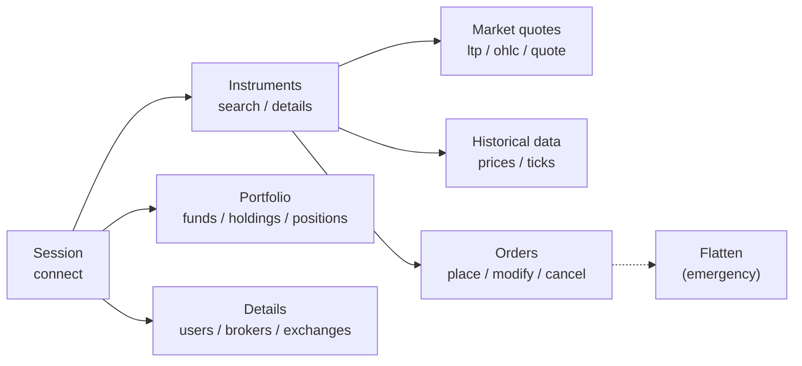
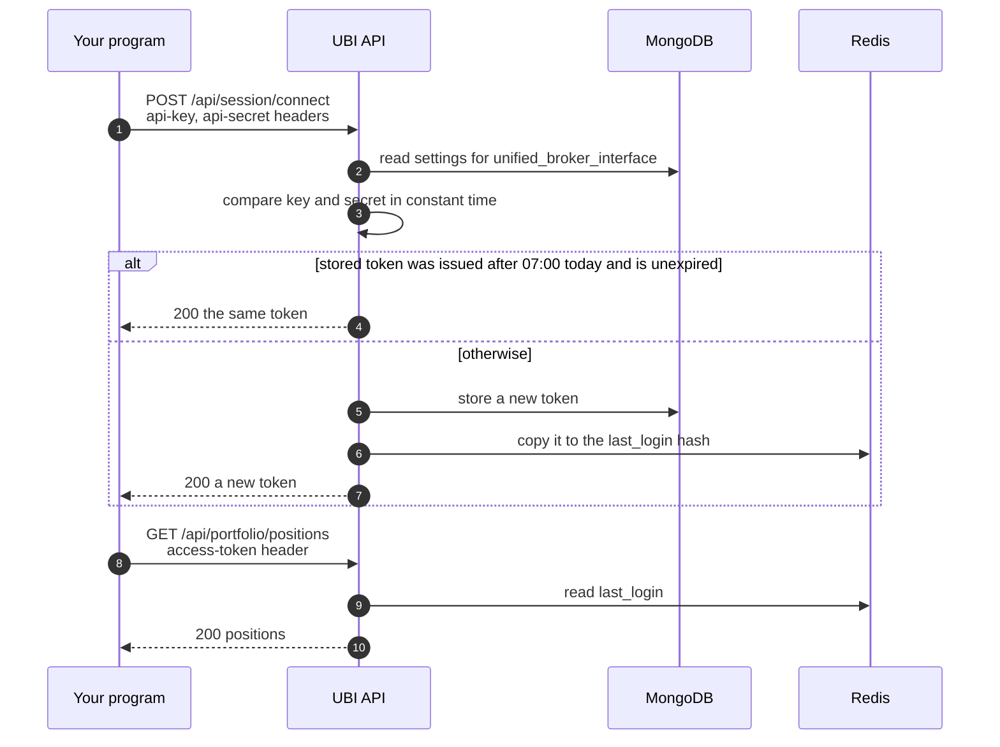

# REST API

The UBI REST API is the whole point of this project. It is a Flask application that serves one combined view of ten broker accounts. You log in to it once a day with an API key and secret. After that, every request carries one `access-token` header, whichever broker ends up doing the work.

This page is the map. It lists every route, explains the conventions that all of them share, and links to one page per group.

## All endpoints

The table below lists all 26 routes. The badge shows the HTTP method, and the lock column shows which routes need the `access-token` header.

| Method | Endpoint | What it does | Token |
|---|---|---|:---:|
| <span class="method get">GET</span> | [`/api/`](#checking-the-api-is-up) | Says hello, so a client can tell the API is up | |
| <span class="method post">POST</span> | [`/api/session/connect`](session.md#connect) | Exchanges the API key and secret for the day's access token | |
| <span class="method delete">DELETE</span> | [`/api/session/disconnect`](session.md#disconnect) | Revokes the access token | :material-lock: |
| <span class="method get">GET</span> | [`/api/session/status`](session.md#status) | Says whether the token is valid and when it expires | :material-lock: |
| <span class="method get">GET</span> | [`/api/users/details`](details.md#user-details) | The account holder's profile and each broker's profile | :material-lock: |
| <span class="method get">GET</span> | [`/api/brokers/details`](details.md#broker-details) | Reference details for every broker | :material-lock: |
| <span class="method get">GET</span> | [`/api/exchanges/details`](details.md#exchange-details) | Exchanges, trading hours and holidays | :material-lock: |
| <span class="method get">GET</span> | [`/api/instruments/segments`](instruments.md#segments) | Every exchange segment and the fields that name an instrument in it | :material-lock: |
| <span class="method get">GET</span> | [`/api/instruments/master`](instruments.md#master) | The whole instrument list of a segment, streamed | :material-lock: |
| <span class="method get">GET</span> | [`/api/instruments/search`](instruments.md#search) | Searches one segment by symbol or name | :material-lock: |
| <span class="method get">GET</span> | [`/api/instruments/details`](instruments.md#details) | One instrument and how each broker names it | :material-lock: |
| <span class="method get">GET</span> | [`/api/instruments/additional_details`](instruments.md#additional-details) | Extra broker-specific attributes of one instrument | :material-lock: |
| <span class="method get">GET</span> | [`/api/instruments/ltp`](market-quotes.md#ltp) | Last traded price | :material-lock: |
| <span class="method get">GET</span> | [`/api/instruments/ohlc`](market-quotes.md#ohlc) | Last price plus the day's open, high, low and close | :material-lock: |
| <span class="method get">GET</span> | [`/api/instruments/quote`](market-quotes.md#quote) | The full quote, including market depth | :material-lock: |
| <span class="method get">GET</span> | [`/api/instruments/prices`](historical-data.md#prices) | Historical candles, adjusted for corporate actions if asked | :material-lock: |
| <span class="method get">GET</span> | [`/api/instruments/ticks`](historical-data.md#ticks) | Every recorded tick between two times, streamed | :material-lock: |
| <span class="method get">GET</span> | [`/api/portfolio/funds`](portfolio.md#funds) | Cash and margin, summed across brokers | :material-lock: |
| <span class="method get">GET</span> | [`/api/portfolio/holdings`](portfolio.md#holdings) | Long-term holdings, combined and priced | :material-lock: |
| <span class="method get">GET</span> | [`/api/portfolio/positions`](portfolio.md#positions) | Open positions, combined | :material-lock: |
| <span class="method get">GET</span> | [`/api/orders/details`](orders.md#order-book) | Today's orders at every broker | :material-lock: |
| <span class="method get">GET</span> | [`/api/orders/trades`](orders.md#trade-book) | Today's trades at every broker | :material-lock: |
| <span class="method post">POST</span> | [`/api/orders/place`](orders.md#place-an-order) | Places an order at a broker the API chooses | :material-lock: |
| <span class="method put">PUT</span> | [`/api/orders/modify`](orders.md#modify-an-order) | Changes an open order | :material-lock: |
| <span class="method delete">DELETE</span> | [`/api/orders/cancel`](orders.md#cancel-an-order) | Cancels an open order | :material-lock: |
| <span class="method post">POST</span> | [`/api/orders/flatten`](flatten.md) | Cancels every open order and closes every position, everywhere | :material-lock: |

!!! danger "Four routes move real money"
    `place`, `modify`, `cancel` and `flatten` send real requests to real broker accounts. Every one of them accepts `"dry_run": true`, which builds and returns the broker request without sending it. Use that first.

## How the groups relate

The diagram below shows the order in which a client normally uses the groups. It logs in first, looks an instrument up, and only then reads prices or places orders.



## Base URL

The API listens on `127.0.0.1:8080` by default, and every route lives under `/api`. The host and port come from `UNIFIED_BROKER_INTERFACE_API_HOST` and `UNIFIED_BROKER_INTERFACE_API_PORT` (see [Configuration](../get-started/configuration.md)).

```text
http://127.0.0.1:8080/api
```

Start it with `bin/rest-api`, which runs gunicorn with two worker processes and four threads each. `bin/rest-api --dev` runs Flask's development server instead.

## Authentication

Authentication happens in two steps. The key and secret are exchanged for a token once a day, and the token goes on every other request.



| Header | Sent to | Value |
|---|---|---|
| `api-key` | `POST /api/session/connect` only | The key stored in MongoDB `settings` for `unified_broker_interface` |
| `api-secret` | `POST /api/session/connect` only | The matching secret |
| `access-token` | Every other route except `GET /api/` | The token returned by `connect` |

There is only one token for the whole application. Issuing a new one replaces the old one, so any other client using the old token starts getting `401`. A token issued before 07:00 IST is replaced by the first `connect` after 07:00.

## Request format

GET and DELETE routes take their parameters in the query string. POST and PUT routes take a JSON body with `Content-Type: application/json`. The order routes `modify` and `cancel` also accept `order_id`, `broker` and `dry_run` in the query string, as a convenience.

## Response format

Every response is JSON. A successful call returns the data directly, with no envelope around it. A failed call returns an object with an `error` key, sometimes with extra fields that help you act on the failure.

=== "Success"

    ```json
    {
      "status": "connected",
      "expires_at": "2026-09-27 07:00:00.000000"
    }
    ```

=== "Failure"

    ```json
    {
      "error": "Access token has expired"
    }
    ```

=== "Failure with context"

    ```json
    {
      "error": "no broker can take this order",
      "instrument_id": "11111111-1111-5111-8111-000000000001",
      "skipped": [
        {"broker": "groww", "reason": "has no mapping for the instrument"}
      ]
    }
    ```

Two routes, `/api/instruments/master` and `/api/instruments/ticks`, can return very large arrays. They stream the JSON array in chunks of about 64 KB rather than building it in memory. If something fails after streaming has started, the array simply ends early and the status stays `200`, so check the count you received.

## Status codes

The API uses a small set of HTTP status codes, and each one means the same thing on every route. [Errors and status codes](errors.md) lists which route returns which.

| Status | Meaning |
|---|---|
| <span class="status s2">200</span> | Done. For orders, the broker accepted the request. |
| <span class="status s2">202</span> | Order engine only: a synthetic order is armed and waiting for its trigger. |
| <span class="status s2">207</span> | Flatten only: some cancels or closes failed. |
| <span class="status s4">400</span> | The request is malformed or breaks a rule, such as a quantity that is not a multiple of the lot size. |
| <span class="status s4">401</span> | The token or the key and secret are missing, wrong or expired. |
| <span class="status s4">403</span> | Order engine only: the daily loss limit is reached. |
| <span class="status s4">404</span> | The instrument, order or document does not exist. |
| <span class="status s4">409</span> | The request conflicts with the current state, for example the order is already complete. |
| <span class="status s4">422</span> | The broker rejected the order. |
| <span class="status s4">429</span> | Order engine only: the broker's daily order cap, set by `UNIFIED_BROKER_INTERFACE_API_ORDER_DAILY_CAPS`, has no room left for this kind of order. |
| <span class="status s5">500</span> | The API itself is not configured. |
| <span class="status s5">501</span> | The broker cannot modify that field. |
| <span class="status s5">502</span> | The stored order book, trade book or portfolio document exists, but no broker in it has usable data. |
| <span class="status s5">503</span> | A store or a background process that the route depends on is missing or stale. |
| <span class="status s5">504</span> | The broker or the order engine did not answer in time, so the outcome is unknown. |

!!! warning "504 on an order means *unknown*, not *failed*"
    When an order route returns `504`, the order may well have reached the broker. Read [`GET /api/orders/details`](orders.md#order-book) before sending it again, or you may end up with two orders.

## Where the answers come from

Most routes never call a broker. They read a document that a background script keeps up to date in Redis. The table below shows which routes read stored data and which ones talk to a broker while you wait.

| Route group | Reads | Calls a broker while you wait? |
|---|---|:---:|
| Session | MongoDB `settings`, `last_login` | No |
| Details | Redis `unified:details:*`, falling back to MongoDB | No |
| Instruments | Redis instrument cache, falling back to TimescaleDB | No |
| Market quotes | Redis live quotes | Only when no live quote is fresh |
| Historical data | Redis candle cache and TimescaleDB | No |
| Portfolio | Redis `unified:portfolio:*` | No |
| Orders (read) | Redis `unified:orders:*` | No |
| Orders (place, modify, cancel, flatten) | Redis, then the broker | **Yes** |

Because of this, a read route can fail with `503` if the script that fills its Redis key has stopped. The message names the key, so you know which service to restart.

## Checking the API is up

<div class="endpoint" markdown><span class="method get">GET</span> `/api/`<span class="auth">no token needed</span></div>

This route needs no token, so it is the quickest way to see whether the API is running.

```bash
curl http://127.0.0.1:8080/api/
```

```json
{"message": "Welcome to the Unified Broker Interface API"}
```

## Trying it by hand

`bin/rest-api-app` opens a Streamlit page that calls every read route with a click. See [Test page](test-page.md).
