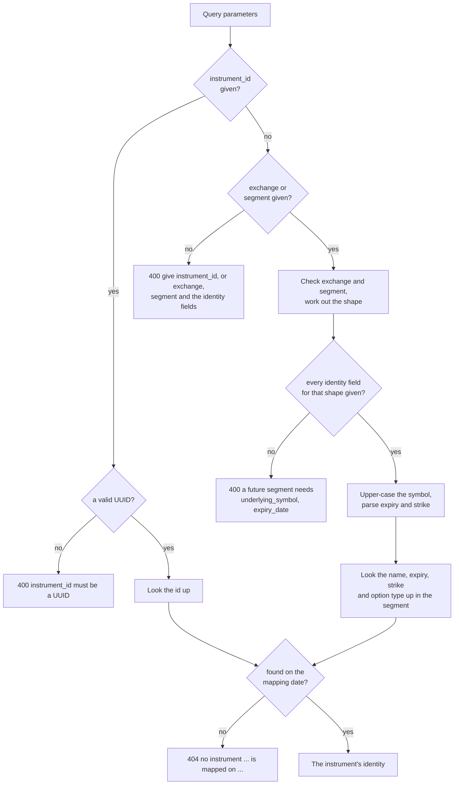
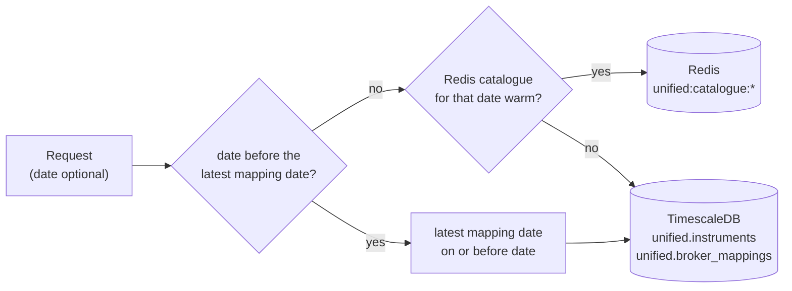

# Instruments

The instrument routes let you browse and look up every instrument the ten brokers carry, merged into one list. Each real-world instrument appears once, however many brokers list it, and each one has a single `instrument_id` that the quote, history and order routes accept.

The table below lists the five routes on this page.

| Method | Endpoint | Description |
|---|---|---|
| <span class="method get">GET</span> | [`/api/instruments/segments`](#segments) | Every exchange segment, its shape, the fields that name an instrument in it, and how many instruments it holds |
| <span class="method get">GET</span> | [`/api/instruments/master`](#master) | Every instrument in a segment, an exchange or everywhere, streamed as one JSON array |
| <span class="method get">GET</span> | [`/api/instruments/search`](#search) | Instruments in one segment whose symbol or underlying contains a search term |
| <span class="method get">GET</span> | [`/api/instruments/details`](#details) | One instrument, its lot and tick size, and how each broker names it |
| <span class="method get">GET</span> | [`/api/instruments/additional_details`](#additional-details) | One instrument and the extra attributes each broker's instrument file carries |

## Glossary of constants

The routes on this page share a small vocabulary, listed in the table below. [Constants](constants.md) has the full list of segment names.

| Parameter | Values | Meaning |
|---|---|---|
| `exchange` | `nse`, `bse`, `mcx`, `ncdex`, and `unknown` | The exchange. `unknown` holds only the `uncategorised` segment. `master` also accepts `all`. |
| `segment` | An exchange-prefixed name such as `nse_equities`, or the bare name such as `equities` | The exchange segment. A bare name is prefixed with the exchange for you. `master` also accepts `all`. |
| `shape` | `security`, `future`, `option` | What kind of instrument the segment holds, which decides the identity fields |
| `option_type` | `CE`, `PE` | Call or put |

## Naming an instrument

Every route that acts on one instrument, which is `details`, `additional_details`, the [market quote](market-quotes.md) routes and the [historical data](historical-data.md) routes, accepts the instrument in either of two spellings. You can send its `instrument_id`, or you can send its exchange, its segment and the identity fields that segment's shape calls for.

The table below shows the identity fields for each shape. The field names are the same ones every response uses.

| Shape | Segments with this shape (bare names) | Identity fields | Example |
|---|---|---|---|
| `security` | `equities`, `equity_indices`, `fixed_income`, `currencies`, `commodities`, `mutual_funds`, `exchange_traded_funds`, `investment_trusts`, the other `*_indices`, and `uncategorised` | `symbol` | `exchange=nse&segment=equities&symbol=INFY` |
| `future` | Every `*_futures` segment | `underlying_symbol`, `expiry_date` | `exchange=mcx&segment=commodity_futures&underlying_symbol=CRUDEOIL&expiry_date=2026-10-19` |
| `option` | Every `*_options` segment | `underlying_symbol`, `expiry_date`, `strike_price`, `option_type` | `exchange=nse&segment=equity_index_options&underlying_symbol=NIFTY&expiry_date=2026-09-29&strike_price=25000&option_type=CE` |

The example dates and strikes above are illustrative, so check them against [`search`](#search) before you use them.

### What the `instrument_id` is

The `instrument_id` is a UUID version 5, computed from the instrument's natural key: its exchange, its segment, its shape and its identity field values, joined with `|` and hashed under a fixed project namespace. Because the id is computed rather than handed out, two brokers that list the same instrument arrive at the same id independently, and that is the whole mechanism that merges ten brokers' lists into one. It also means the same instrument keeps the same id from one day to the next.

!!! tip "Which spelling to use"
    Send `instrument_id` whenever you have it. It is one parameter, it cannot be misspelled, and it is what every response hands back. The identity spelling is for the first lookup, when all you know is a symbol.

### How a request is turned into one instrument

The flowchart below shows how the API reads the parameters and finds the instrument. Every check that fails returns <span class="status s4">400</span> with the message shown, before anything is read from Redis or the database.



The symbol and underlying are upper-cased before the lookup, so `infy` finds `INFY`. The option type is upper-cased as well, so `ce` is accepted.

## Mapping dates

The merged instrument list is rebuilt every morning by `bin/unified/instruments/map`, and each rebuild is stored under its **mapping date**. Most routes answer for the latest mapping date. The listing and lookup routes also take a `date` parameter, which asks what the list looked like on an earlier day.

The diagram below shows where an answer comes from. The fast path is Redis, which holds only the latest mapping date. TimescaleDB is read for an earlier date, or when the Redis copy has not been built yet.



A `date` that falls between two mapping dates is answered from the latest mapping date on or before it, and every response says which mapping date it used, in `mapping_date` or in the `X-Mapping-Date` header. A `date` on or after the latest mapping date is treated as today.

## Segments

<div class="endpoint" markdown><span class="method get">GET</span> `/api/instruments/segments`<span class="auth">access-token</span></div>

This route lists every segment that has instruments on the latest mapping date, in the project's fixed segment order, with the fields you need to name an instrument in each one. It is the place to start when you do not know what a segment is called. It reads the per-segment counts from Redis, or counts them in TimescaleDB when the Redis copy is cold.

#### Request parameters

| Name | In | Type | Required | Description |
|---|---|---|---|---|
| `access-token` | header | string | Yes | The token from [`connect`](session.md#connect) |

#### Example

=== "curl"

    ```bash
    curl http://127.0.0.1:8080/api/instruments/segments \
      -H "access-token: $ACCESS_TOKEN"
    ```

=== "Python"

    ```python
    import os

    import requests

    response = requests.get(
        'http://127.0.0.1:8080/api/instruments/segments',
        headers={
            'access-token': os.environ['ACCESS_TOKEN'],
        },
        timeout=10,
    )
    for segment in response.json()['segments']:
        print(segment['segment'], segment['identity_fields'])
    ```

#### Response

The example below is shortened to three segments, and the counts are illustrative.

```json
{
  "mapping_date": "2026-09-26",
  "exchanges": ["bse", "mcx", "ncdex", "nse", "unknown"],
  "segments": [
    {
      "exchange": "nse",
      "segment": "nse_equities",
      "bare_segment": "equities",
      "shape": "security",
      "identity_fields": ["symbol"],
      "instruments": 2400
    },
    {
      "exchange": "mcx",
      "segment": "mcx_commodity_futures",
      "bare_segment": "commodity_futures",
      "shape": "future",
      "identity_fields": ["underlying_symbol", "expiry_date"],
      "instruments": 300
    },
    {
      "exchange": "unknown",
      "segment": "uncategorised",
      "bare_segment": "uncategorised",
      "shape": "security",
      "identity_fields": ["symbol"],
      "instruments": 50
    }
  ]
}
```

#### Response attributes

| Attribute | Type | Description |
|---|---|---|
| `mapping_date` | string | The mapping date answered, `YYYY-MM-DD` |
| `exchanges` | array of strings | Every exchange that has a segment, sorted, with `unknown` last |
| `segments[].exchange` | string | The segment's exchange |
| `segments[].segment` | string | The exchange-prefixed segment, as every other route returns it |
| `segments[].bare_segment` | string | The segment name without the exchange |
| `segments[].shape` | string | `security`, `future` or `option` |
| `segments[].identity_fields` | array of strings | The fields that name an instrument in this segment |
| `segments[].instruments` | integer | How many instruments the segment holds on the mapping date |

#### Status codes

| Status | When |
|---|---|
| <span class="status s2">200</span> | The segments were listed. |
| <span class="status s4">401</span> | `Access token is required`, `Invalid access token` or `Access token has expired`. |
| <span class="status s5">503</span> | `no instruments have been mapped yet`. |

??? note "Under the hood"
    - Route: `InstrumentsBlueprint.segments` in `unified_broker_interface/blueprints/instruments.py`, which calls [`InstrumentCatalogue.segments`][unified_broker_interface.utilities.instrument_catalogue.InstrumentCatalogue.segments].
    - Redis: the hash `unified:catalogue:<mapping date>:segments` holds the count per segment.
    - Fallback: a `count(*)` over `unified.instruments`, limited to instruments with a row in `unified.broker_mappings` on the mapping date. Each fallback is logged.
    - The segment order is `CANONICAL_SEGMENTS` in `stock_brokers/instruments/mapping/utilities/segments.py`.

## Master

<div class="endpoint" markdown><span class="method get">GET</span> `/api/instruments/master`<span class="auth">access-token</span></div>

This route returns every instrument in the scope you ask for, which can be one segment, every segment of one exchange, or the whole list. The whole list runs to over a hundred megabytes, so the answer is streamed as one JSON array in chunks of about 64 KB rather than built in memory first.

#### Request parameters

| Name | In | Type | Required | Description |
|---|---|---|---|---|
| `access-token` | header | string | Yes | The token from [`connect`](session.md#connect) |
| `exchange` | query | string | Yes | An exchange, or `all` |
| `segment` | query | string | Yes | A segment of that exchange, or `all`. With `exchange=all`, only `all` or `uncategorised` is accepted. |
| `date` | query | string | No | `YYYY-MM-DD`, to list what was mapped on an earlier day |

The table below shows which combinations of `exchange` and `segment` are accepted.

| `exchange` | `segment` | What you get |
|---|---|---|
| `nse` | `nse_equities` or `equities` | One segment |
| `nse` | `all` | Every segment of NSE |
| `all` | `all` | Every instrument everywhere |
| `all` | `nse_equities` | <span class="status s4">400</span> `a single segment needs a single exchange` |

#### Example

=== "curl"

    ```bash
    curl -i "http://127.0.0.1:8080/api/instruments/master?exchange=mcx&segment=commodity_futures" \
      -H "access-token: $ACCESS_TOKEN"
    ```

=== "Python"

    ```python
    import os

    import requests

    response = requests.get(
        'http://127.0.0.1:8080/api/instruments/master',
        headers={
            'access-token': os.environ['ACCESS_TOKEN'],
        },
        params={
            'exchange': 'mcx',
            'segment': 'commodity_futures',
        },
        timeout=300,
    )
    print(response.headers['X-Mapping-Date'], len(response.json()))
    ```

#### Response

The response carries an `X-Mapping-Date` header, and its body is an array of instrument identities. The example below is shortened to one element, and its values are illustrative.

```text
HTTP/1.1 200 OK
Content-Type: application/json
X-Mapping-Date: 2026-09-26
```

```json
[
  {
    "instrument_id": "11111111-1111-5111-8111-000000000001",
    "exchange": "mcx",
    "segment": "mcx_commodity_futures",
    "shape": "future",
    "symbol": null,
    "underlying_symbol": "CRUDEOIL",
    "expiry_date": "2026-10-19",
    "strike_price": null,
    "option_type": null
  }
]
```

#### Response attributes

Every element of the array is an instrument identity, which has the fields below. The same nine fields open the answers of `search`, `details`, `additional_details`, the quote routes and `prices`.

| Attribute | Type | Description |
|---|---|---|
| `instrument_id` | string | The UUID that names the instrument everywhere |
| `exchange` | string | The exchange |
| `segment` | string | The exchange-prefixed segment |
| `shape` | string | `security`, `future` or `option` |
| `symbol` | string or null | The symbol, for a security |
| `underlying_symbol` | string or null | The underlying, for a future or option |
| `expiry_date` | string or null | The expiry, `YYYY-MM-DD`, for a future or option |
| `strike_price` | number or null | The strike, for an option |
| `option_type` | string or null | `CE` or `PE`, for an option |

Instruments come in segment order, and within a segment by name, expiry, strike and option type.

#### Status codes

| Status | When |
|---|---|
| <span class="status s2">200</span> | The stream started. |
| <span class="status s4">400</span> | `exchange is required`, `exchange must be one of nse, bse, mcx, ncdex, all`, `segment is required`, `a single segment needs a single exchange`, `segment '<value>' is not a segment of <exchange>; see /api/instruments/segments`, or `date must be a date in YYYY-MM-DD format`. |
| <span class="status s4">401</span> | `Access token is required`, `Invalid access token` or `Access token has expired`. |
| <span class="status s4">404</span> | `nothing had been mapped on or before <date>`. |
| <span class="status s5">503</span> | `no instruments have been mapped yet`. |

!!! warning "A stream that breaks still says 200"
    Every check above happens before the first byte is sent. If Redis or the database fails part way through, the array is closed early and the status stays <span class="status s2">200</span>. Compare the number of elements you received with the segment's `instruments` count from [`segments`](#segments) if completeness matters.

??? note "Under the hood"
    - Route: `InstrumentsBlueprint.master`, which calls [`InstrumentCatalogue.master`][unified_broker_interface.utilities.instrument_catalogue.InstrumentCatalogue.master] and streams through [`json_array_response`][unified_broker_interface.utilities.json_stream.json_array_response].
    - Redis: reads the sorted set `unified:catalogue:<date>:catalogue:<segment>` 5,000 members at a time, and the identities for each batch from the hash `unified:catalogue:<date>:identity`.
    - Fallback: a server-side cursor over `unified.instruments`, for a past date or a cold cache.

## Search

<div class="endpoint" markdown><span class="method get">GET</span> `/api/instruments/search`<span class="auth">access-token</span></div>

This route finds instruments in one segment whose symbol, or underlying for a derivative, contains the search term. It is the usual way to get an `instrument_id` from a name you already know.

#### Request parameters

| Name | In | Type | Required | Description |
|---|---|---|---|---|
| `access-token` | header | string | Yes | The token from [`connect`](session.md#connect) |
| `exchange` | query | string | Yes | One exchange. `all` is not accepted. |
| `segment` | query | string | Yes | One segment of that exchange, prefixed or bare |
| `q` | query | string | No | The search term, matched anywhere in the name without regard to case. Empty returns the segment's first instruments. |
| `limit` | query | integer | No | How many instruments to return, from `1` to `200`. The default is `50`. |
| `date` | query | string | No | `YYYY-MM-DD`, to search what was mapped on an earlier day |

The results come in a fixed order, listed below.

1. Names that equal the term exactly.
2. Names that start with the term.
3. Names that contain the term anywhere.

Within one name, contracts follow in expiry, strike and option type order. The `limit` counts contracts, so a search for `NIFTY` in an options segment can fill the whole limit with one underlying's strikes.

#### Example

=== "curl"

    ```bash
    curl "http://127.0.0.1:8080/api/instruments/search?exchange=nse&segment=equities&q=infy&limit=5" \
      -H "access-token: $ACCESS_TOKEN"
    ```

=== "Python"

    ```python
    import os

    import requests

    response = requests.get(
        'http://127.0.0.1:8080/api/instruments/search',
        headers={
            'access-token': os.environ['ACCESS_TOKEN'],
        },
        params={
            'exchange': 'nse',
            'segment': 'equities',
            'q': 'infy',
            'limit': 5,
        },
        timeout=10,
    )
    instrument_id = response.json()['instruments'][0]['instrument_id']
    ```

#### Response

The example below is shortened to one match, and its id is a placeholder.

```json
{
  "mapping_date": "2026-09-26",
  "instruments": [
    {
      "instrument_id": "11111111-1111-5111-8111-000000000002",
      "exchange": "nse",
      "segment": "nse_equities",
      "shape": "security",
      "symbol": "INFY",
      "underlying_symbol": null,
      "expiry_date": null,
      "strike_price": null,
      "option_type": null
    }
  ]
}
```

#### Response attributes

| Attribute | Type | Description |
|---|---|---|
| `mapping_date` | string | The mapping date answered |
| `instruments` | array of objects | The matches, each an instrument identity as described under [`master`](#master) |

#### Status codes

| Status | When |
|---|---|
| <span class="status s2">200</span> | The search ran. An empty `instruments` array means nothing matched. |
| <span class="status s4">400</span> | `exchange is required`, `exchange must be one of nse, bse, mcx, ncdex`, `segment is required`, `segment '<value>' is not a segment of <exchange>; see /api/instruments/segments`, `limit must be a whole number`, `limit must be between 1 and 200`, or `date must be a date in YYYY-MM-DD format`. |
| <span class="status s4">401</span> | `Access token is required`, `Invalid access token` or `Access token has expired`. |
| <span class="status s4">404</span> | `nothing had been mapped on or before <date>`. |
| <span class="status s5">503</span> | `no instruments have been mapped yet`, or `the instrument cache is unreachable`. |

??? note "Under the hood"
    - Route: `InstrumentsBlueprint.search`, which calls [`InstrumentCatalogue.search`][unified_broker_interface.utilities.instrument_catalogue.InstrumentCatalogue.search]. `SEARCH_LIMIT_DEFAULT` is 50 and `SEARCH_LIMIT_MAXIMUM` is 200.
    - Redis: the sorted set `unified:catalogue:<date>:names:<segment>` holds each distinct name, and each matching name's contracts are read from the segment's catalogue by prefix.
    - Fallback: a `LIKE` query over `unified.instruments` with the same ordering, for a past date or a cold cache.

## Details

<div class="endpoint" markdown><span class="method get">GET</span> `/api/instruments/details`<span class="auth">access-token</span></div>

This route returns one instrument's identity together with what you need to trade it: the dates it has been seen, its lot size, its tick size and every broker's own name for it. The lot size and tick size are the brokers' consensus, and the per-broker handles keep each broker's own figures, because an order's quantity is checked against the broker it goes to.

#### Request parameters

| Name | In | Type | Required | Description |
|---|---|---|---|---|
| `access-token` | header | string | Yes | The token from [`connect`](session.md#connect) |
| `instrument_id` | query | string | One spelling | The instrument's UUID |
| `exchange`, `segment` and the identity fields | query | string | The other spelling | See [Naming an instrument](#naming-an-instrument) |
| `date` | query | string | No | `YYYY-MM-DD`, to read the instrument as it was mapped on an earlier day |

#### Example

=== "curl"

    ```bash
    curl "http://127.0.0.1:8080/api/instruments/details?exchange=nse&segment=equities&symbol=RELIANCE" \
      -H "access-token: $ACCESS_TOKEN"
    ```

=== "Python"

    ```python
    import os

    import requests

    response = requests.get(
        'http://127.0.0.1:8080/api/instruments/details',
        headers={
            'access-token': os.environ['ACCESS_TOKEN'],
        },
        params={
            'exchange': 'nse',
            'segment': 'equities',
            'symbol': 'RELIANCE',
        },
        timeout=10,
    )
    for handle in response.json()['carried_by']:
        print(handle['broker'], handle['broker_token'], handle['order_symbol'])
    ```

#### Response

The example below is shortened to two brokers. The id is a placeholder, and the tokens, symbols, dates and tick size are illustrative.

```json
{
  "instrument_id": "11111111-1111-5111-8111-000000000003",
  "exchange": "nse",
  "segment": "nse_equities",
  "shape": "security",
  "symbol": "RELIANCE",
  "underlying_symbol": null,
  "expiry_date": null,
  "strike_price": null,
  "option_type": null,
  "mapping_date": "2026-09-26",
  "first_seen_date": "2026-06-01",
  "last_seen_date": "2026-09-26",
  "lot_size": 1,
  "tick_size": "0.1",
  "carried_by": [
    {"broker": "dhan", "broker_token": "2885", "order_symbol": "RELIANCE", "lot_size": "1", "tick_size": "0.1"},
    {"broker": "flattrade", "broker_token": "2885", "order_symbol": "RELIANCE-EQ", "lot_size": "1", "tick_size": "0.1"}
  ]
}
```

#### Response attributes

The answer starts with the nine identity fields described under [`master`](#master), followed by the fields below.

| Attribute | Type | Description |
|---|---|---|
| `mapping_date` | string | The mapping date answered |
| `first_seen_date` | string or null | The first mapping date the instrument appeared on |
| `last_seen_date` | string or null | The last mapping date the instrument appeared on |
| `lot_size` | integer or null | Units of the underlying in one lot, decided as described below. `null` when the brokers tie or none sends one. |
| `tick_size` | string or null | The smallest price step in rupees, as text, that most brokers agree on. `null` when the two most common values tie or no broker sends one. |
| `carried_by` | array of objects | One handle per broker that lists the instrument, sorted by broker |
| `carried_by[].broker` | string | The broker's code |
| `carried_by[].broker_token` | string | The broker's own token for the instrument |
| `carried_by[].order_symbol` | string | The trading symbol the broker expects in an order |
| `carried_by[].lot_size` | string or null | That broker's own lot size, as text |
| `carried_by[].tick_size` | string or null | That broker's own tick size, as text |

The consensus `lot_size` is decided by the rules below, which are the same rules the live quote uses.

| Instrument | `lot_size` |
|---|---|
| A security (shape `security`) | Always `1` |
| A derivative on MCX | Groww's lot size, because Groww is the lot size authority on MCX |
| Any other derivative | The lot size most brokers agree on |

The sizes are sent as text in `carried_by` on purpose. A lot size or tick size that went through a floating-point number could come back with a rounding error, and in a quantity that error matters.

#### Status codes

| Status | When |
|---|---|
| <span class="status s2">200</span> | The instrument was found. |
| <span class="status s4">400</span> | Any of the parameter messages under [How a request is turned into one instrument](#how-a-request-is-turned-into-one-instrument), such as `instrument_id must be a UUID`, `a option segment needs underlying_symbol, expiry_date, strike_price, option_type`, `expiry_date must be a date in YYYY-MM-DD format`, `strike_price must be a number` or `option_type must be CE or PE`. |
| <span class="status s4">401</span> | `Access token is required`, `Invalid access token` or `Access token has expired`. |
| <span class="status s4">404</span> | `no instrument <id or fields> is mapped on <mapping date>`, or `nothing had been mapped on or before <date>`. |
| <span class="status s5">503</span> | `no instruments have been mapped yet`. |

??? note "Under the hood"
    - Route: `InstrumentsBlueprint.details`, which calls [`InstrumentCatalogue.details`][unified_broker_interface.utilities.instrument_catalogue.InstrumentCatalogue.details].
    - Parameter parsing: [`parse_instrument`][unified_broker_interface.utilities.instrument_identity.parse_instrument] in `unified_broker_interface/utilities/instrument_identity.py`.
    - Redis: `unified:catalogue:<date>:identity`, `unified:catalogue:<date>:order_handles` and `unified:catalogue:<date>:seen`.
    - Fallback: `unified.instruments` for the identity and seen dates, and `unified.broker_mappings` for the handles.
    - Consensus: `units_per_lot` in `stock_brokers/instruments/ticks/utilities/resolution.py` and [`InstrumentCatalogue.agreed_tick_size`][unified_broker_interface.utilities.instrument_catalogue.InstrumentCatalogue.agreed_tick_size].

## Additional details

<div class="endpoint" markdown><span class="method get">GET</span> `/api/instruments/additional_details`<span class="auth">access-token</span></div>

This route returns the extra columns each broker publishes about an instrument beyond what an order needs, such as the ISIN, the series, the freeze quantity and the price band. Every broker spells these columns differently, so the project maps them onto one shared set of 16 names. Every name is present for every broker, with `null` where that broker publishes nothing.

#### Request parameters

| Name | In | Type | Required | Description |
|---|---|---|---|---|
| `access-token` | header | string | Yes | The token from [`connect`](session.md#connect) |
| `instrument_id` | query | string | One spelling | The instrument's UUID |
| `exchange`, `segment` and the identity fields | query | string | The other spelling | See [Naming an instrument](#naming-an-instrument) |
| `date` | query | string | No | `YYYY-MM-DD`, to read the attributes as they were on an earlier mapping day |

#### Example

=== "curl"

    ```bash
    curl "http://127.0.0.1:8080/api/instruments/additional_details?instrument_id=11111111-1111-5111-8111-000000000003" \
      -H "access-token: $ACCESS_TOKEN"
    ```

=== "Python"

    ```python
    import os

    import requests

    response = requests.get(
        'http://127.0.0.1:8080/api/instruments/additional_details',
        headers={
            'access-token': os.environ['ACCESS_TOKEN'],
        },
        params={
            'instrument_id': '11111111-1111-5111-8111-000000000003',
        },
        timeout=10,
    )
    for entry in response.json()['carried_by']:
        print(entry['broker'], entry['isin'], entry['freeze_quantity'])
    ```

#### Response

The example below is shortened to one broker, and the attribute values are illustrative.

```json
{
  "instrument_id": "11111111-1111-5111-8111-000000000003",
  "exchange": "nse",
  "segment": "nse_equities",
  "shape": "security",
  "symbol": "RELIANCE",
  "underlying_symbol": null,
  "expiry_date": null,
  "strike_price": null,
  "option_type": null,
  "mapping_date": "2026-09-26",
  "attribute_names": [
    "isin", "display_name", "instrument_type", "series", "freeze_quantity",
    "price_band_high", "price_band_low", "multiplier", "underlying_token",
    "surveillance_category", "permitted_to_trade", "buy_allowed", "sell_allowed",
    "intraday_leverage", "margin_trading_leverage", "pledge_eligible"
  ],
  "carried_by": [
    {
      "broker": "dhan",
      "isin": "INE002A01018",
      "display_name": "Reliance Industries",
      "instrument_type": "EQUITY",
      "series": "EQ",
      "freeze_quantity": null,
      "price_band_high": null,
      "price_band_low": null,
      "multiplier": null,
      "underlying_token": null,
      "surveillance_category": null,
      "permitted_to_trade": null,
      "buy_allowed": null,
      "sell_allowed": null,
      "intraday_leverage": null,
      "margin_trading_leverage": null,
      "pledge_eligible": null
    }
  ]
}
```

#### Response attributes

The answer starts with the nine identity fields described under [`master`](#master), followed by the fields below.

| Attribute | Type | Description |
|---|---|---|
| `mapping_date` | string | The mapping date answered |
| `attribute_names` | array of strings | The 16 shared attribute names, in a fixed order |
| `carried_by` | array of objects | One entry per broker that published attributes, sorted by broker |
| `carried_by[].broker` | string | The broker's code |
| `carried_by[].<attribute name>` | string or null | The broker's value as text, stripped of surrounding spaces, or `null` when the broker does not publish it |

Values are always text, exactly as the broker's file held them, because the raw instrument tables store every column as text. Nothing here is converted into a number.

#### Status codes

| Status | When |
|---|---|
| <span class="status s2">200</span> | The instrument was found. `carried_by` is empty when no broker publishes any of the attributes. |
| <span class="status s4">400</span> | Any of the parameter messages listed under [`details`](#details). |
| <span class="status s4">401</span> | `Access token is required`, `Invalid access token` or `Access token has expired`. |
| <span class="status s4">404</span> | `no instrument <id or fields> is mapped on <mapping date>`, or `nothing had been mapped on or before <date>`. |
| <span class="status s5">503</span> | `no instruments have been mapped yet`. |

??? note "Under the hood"
    - Route: `InstrumentsBlueprint.additional_details`, which calls [`InstrumentCatalogue.additional_details`][unified_broker_interface.utilities.instrument_catalogue.InstrumentCatalogue.additional_details].
    - Vocabulary: [`RawAttributes`][stock_brokers.instruments.mapping.utilities.raw_attributes.RawAttributes] in `stock_brokers/instruments/mapping/utilities/raw_attributes.py` maps each broker's column names onto the shared names. Storage keeps only what a broker published, and `RawAttributes.fill` adds the missing names back as `null` for the answer.
    - Redis: `unified:catalogue:<date>:additional_attributes`, warmed by the same daily run as the rest of the catalogue.
    - Fallback: the mapping table in TimescaleDB, for a past date or when that hash is missing. Each fallback is logged.
