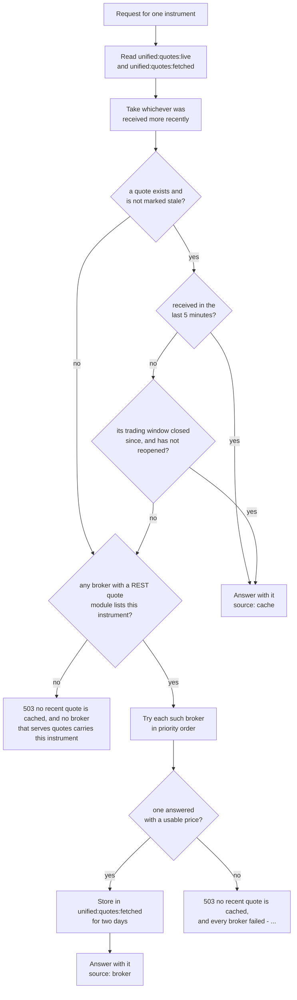

# Market quotes

The market quote routes return the live price of one instrument, at three levels of detail. All three read the same unified quote document, which is built from whichever broker is currently streaming that instrument, so the answer looks the same whichever broker it came from.

The table below lists the three routes on this page.

| Method | Endpoint | Description |
|---|---|---|
| <span class="method get">GET</span> | [`/api/instruments/ltp`](#ltp) | The last traded price, with the instrument's identity and when the price was received |
| <span class="method get">GET</span> | [`/api/instruments/ohlc`](#ohlc) | The last traded price plus the day's open, high and low, the previous close and the change |
| <span class="method get">GET</span> | [`/api/instruments/quote`](#quote) | The whole unified quote document, including volume, open interest and five levels of market depth |

All three take the instrument the same way as the [instrument routes](instruments.md#naming-an-instrument): either `instrument_id`, or `exchange`, `segment` and the identity fields.

## Glossary of constants

The routes on this page return one enumerated value of their own, listed in the table below.

| Parameter | Values | Meaning |
|---|---|---|
| `source` | `cache` | The quote came from Redis: the live feed, or a quote fetched from a broker a little earlier |
| `source` | `broker` | No cached quote was good enough, so a broker's REST API was asked while you waited |

## Where a quote comes from

Most of the time a quote comes straight from Redis, where `bin/unified/instruments/websocket_quotes` keeps one live quote per instrument from the ten brokers' websocket feeds. Only when that copy is too old does the API ask a broker directly.

The flowchart below shows the decision, step by step. "The trading window" is the instrument's session as the tick pipeline defines it, on the exchanges' trading days.



The two freshness rules exist because most instruments trade thinly. A quote that is five minutes old is usually still the market, and once a session is over the last quote stays right until the next session opens, so nothing is fetched after hours for an instrument that was quoted during the day.

### Which brokers can answer while you wait

Six brokers have a REST quote module in service. The table below lists every broker and whether it can be asked for a quote while you wait. The live websocket feed is a separate matter, covered in [Market data](../pipelines/market-data.md).

| Broker | REST quote fallback | Why |
|---|:---:|---|
| zerodha | :material-check: | In service |
| dhan | :material-check: | In service |
| kotak | :material-check: | In service |
| flattrade | :material-check: | In service |
| shoonya | :material-check: | In service |
| indmoney | :material-check: | In service |
| fyers | :material-close: | A module exists but is held back. Its field mapping is unverified, because every probe met Fyers' request limit. |
| groww | :material-close: | A module exists but is held back. The account is not entitled to live data, and every quote request is refused with 403. |
| stoxkart | :material-close: | No REST quote module |
| wisdom_capital | :material-close: | No REST quote module |

The brokers that list the instrument and are in service are tried in the unified tick layer's priority order, with verified brokers first. Zerodha is the only verified broker today. After it, the order is Dhan, Kotak, Flattrade, Shoonya and INDmoney on NSE, BSE and MCX. On NCDEX the priority list names only Shoonya and Wisdom Capital, so Shoonya is tried first there and the others follow in no preferred order. The first broker that returns a usable last price wins. If a broker's session has died, the API logs that broker in again once and retries.

A fetched quote is normalized by the same code that normalizes the live feed, so it has exactly the same fields. It is stored in `unified:quotes:fetched`, never in `unified:quotes:live`, and each entry expires after two days.

!!! note "A broker fallback costs time"
    A `source: broker` answer includes a round trip to a broker, and possibly a login. A client that polls prices for many instruments should rely on the live feed covering them, and treat `source: broker` as the exception.

## The unified quote document

All three routes answer from one document shape, which the `quote` route returns whole. The table below lists every field, in the order the document holds them. `ltp` and `ohlc` return a subset, marked in the last two columns.

| Field | Type | Description | `ltp` | `ohlc` |
|---|---|---|:---:|:---:|
| `instrument_id` | string | The instrument's UUID | :material-check: | :material-check: |
| `broker` | string | The broker this quote came from | | |
| `broker_token` | string | That broker's token for the instrument | | |
| `exchange` | string | The exchange | :material-check: | :material-check: |
| `segment` | string | The exchange-prefixed segment | :material-check: | :material-check: |
| `shape` | string | `security`, `future` or `option` | :material-check: | :material-check: |
| `symbol` | string or null | The symbol, for a security | :material-check: | :material-check: |
| `underlying_symbol` | string or null | The underlying, for a derivative | :material-check: | :material-check: |
| `expiry_date` | string or null | The expiry, `YYYY-MM-DD` | :material-check: | :material-check: |
| `strike_price` | number or null | The strike, for an option | :material-check: | :material-check: |
| `option_type` | string or null | `CE` or `PE` | :material-check: | :material-check: |
| `lot_size` | integer or null | Units of the underlying in one lot | | |
| `last_price` | number | The last traded price | :material-check: | :material-check: |
| `average_price` | number or null | The day's volume-weighted average price, as the broker reports it | | |
| `ohlc` | object | The day's `open`, `high` and `low`. There is no `close` in it. | | :material-check: |
| `previous_close` | number or null | The previous session's close | | :material-check: |
| `change_percent` | number or null | The change from `previous_close`, as a percentage rounded to four places, recomputed by the project rather than taken from the broker | | :material-check: |
| `last_quantity` | integer or null | The size of the last trade, in units | | |
| `volume` | integer or null | The day's traded volume, in units | | |
| `buy_quantity` | integer or null | Total quantity bid, in units | | |
| `sell_quantity` | integer or null | Total quantity offered, in units | | |
| `oi` | integer or null | Open interest, for a derivative | | |
| `oi_day_high` | integer or null | The day's highest open interest | | |
| `oi_day_low` | integer or null | The day's lowest open interest | | |
| `depth` | object | `buy` and `sell`, each a list of up to five levels of `price`, `quantity` and `orders`, with empty levels dropped | | |
| `last_trade_time` | number or null | When the last trade happened, in epoch seconds | :material-check: | :material-check: |
| `exchange_time` | number or null | The exchange's timestamp on the update, in epoch seconds | | |
| `received_at` | number | When the project received the tick, in epoch seconds | :material-check: | :material-check: |
| `unified_at` | number | When the quote document was built, in epoch seconds | | |
| `stale` | boolean | `true` when the owning broker's feed went silent and no healthy backup took over | | |
| `stale_since` | number or null | When the quote became stale, in epoch seconds | | |
| `source` | string | `cache` or `broker`, added by the API | :material-check: | :material-check: |

Quantities are always in units, not lots. A broker that reports quantities in lots has them multiplied up to units before they are stored. Prices are rounded to four decimal places for currency instruments and two for everything else.

A cached quote marked `stale` is never served. The API goes to a broker instead, so a `stale` field you receive is always `false`.

## LTP

<div class="endpoint" markdown><span class="method get">GET</span> `/api/instruments/ltp`<span class="auth">access-token</span></div>

This route returns the last traded price with the instrument's identity and the two timestamps that say how fresh it is. Use it when the price is all you need.

#### Request parameters

| Name | In | Type | Required | Description |
|---|---|---|---|---|
| `access-token` | header | string | Yes | The token from [`connect`](session.md#connect) |
| `instrument_id` | query | string | One spelling | The instrument's UUID |
| `exchange`, `segment` and the identity fields | query | string | The other spelling | See [Naming an instrument](instruments.md#naming-an-instrument) |

#### Example

=== "curl"

    ```bash
    curl "http://127.0.0.1:8080/api/instruments/ltp?exchange=nse&segment=equities&symbol=INFY" \
      -H "access-token: $ACCESS_TOKEN"
    ```

=== "Python"

    ```python
    import os

    import requests

    response = requests.get(
        'http://127.0.0.1:8080/api/instruments/ltp',
        headers={
            'access-token': os.environ['ACCESS_TOKEN'],
        },
        params={
            'exchange': 'nse',
            'segment': 'equities',
            'symbol': 'INFY',
        },
        timeout=10,
    )
    print(response.json()['last_price'])
    ```

#### Response

The id below is a placeholder, and the price and times are illustrative.

```json
{
  "instrument_id": "11111111-1111-5111-8111-000000000002",
  "exchange": "nse",
  "segment": "nse_equities",
  "shape": "security",
  "symbol": "INFY",
  "underlying_symbol": null,
  "expiry_date": null,
  "strike_price": null,
  "option_type": null,
  "last_price": 1521.4,
  "last_trade_time": 1790410198.0,
  "received_at": 1790410198.412,
  "source": "cache"
}
```

#### Response attributes

Every field is described in [The unified quote document](#the-unified-quote-document). The route returns exactly the fields marked in its `ltp` column.

#### Status codes

| Status | When |
|---|---|
| <span class="status s2">200</span> | A quote was found, in Redis or at a broker. |
| <span class="status s4">400</span> | A parameter could not be used, with the messages listed under [instrument details](instruments.md#details). |
| <span class="status s4">401</span> | `Access token is required`, `Invalid access token` or `Access token has expired`. |
| <span class="status s4">404</span> | `no instrument <id or fields> is mapped on <mapping date>`. |
| <span class="status s5">503</span> | `no recent quote is cached, and no broker that serves quotes carries this instrument`, `no recent quote is cached, and every broker failed - <broker>: <reason>; ...`, or `no instruments have been mapped yet`. |

??? note "Under the hood"
    - Route: `InstrumentsBlueprint.ltp` in `unified_broker_interface/blueprints/instruments.py`, which keeps only the keys in `_LTP_KEYS`.
    - Quote: [`QuoteService.quote`][unified_broker_interface.utilities.broker_quotes.utilities.service.QuoteService.quote] in `unified_broker_interface/utilities/broker_quotes/utilities/service.py`.
    - Redis: reads `unified:quotes:live` and `unified:quotes:fetched` in one pipeline, and writes `unified:quotes:fetched` with a per-field expiry of two days after a broker fetch.
    - Broker modules: `unified_broker_interface/utilities/broker_quotes/<broker>.py`, one per broker that has one, each subclassing [`BrokerQuoteSource`][unified_broker_interface.utilities.broker_quotes.base.BrokerQuoteSource].

## OHLC

<div class="endpoint" markdown><span class="method get">GET</span> `/api/instruments/ohlc`<span class="auth">access-token</span></div>

This route returns everything `ltp` returns, plus the day's open, high and low, the previous session's close and the percentage change from it. The quote document has no field for the day's close, so `ohlc` holds only `open`, `high` and `low`.

#### Request parameters

| Name | In | Type | Required | Description |
|---|---|---|---|---|
| `access-token` | header | string | Yes | The token from [`connect`](session.md#connect) |
| `instrument_id` | query | string | One spelling | The instrument's UUID |
| `exchange`, `segment` and the identity fields | query | string | The other spelling | See [Naming an instrument](instruments.md#naming-an-instrument) |

#### Example

=== "curl"

    ```bash
    curl "http://127.0.0.1:8080/api/instruments/ohlc?instrument_id=11111111-1111-5111-8111-000000000002" \
      -H "access-token: $ACCESS_TOKEN"
    ```

=== "Python"

    ```python
    import os

    import requests

    response = requests.get(
        'http://127.0.0.1:8080/api/instruments/ohlc',
        headers={
            'access-token': os.environ['ACCESS_TOKEN'],
        },
        params={
            'instrument_id': '11111111-1111-5111-8111-000000000002',
        },
        timeout=10,
    )
    quote = response.json()
    print(quote['ohlc'], quote['previous_close'], quote['change_percent'])
    ```

#### Response

The id below is a placeholder, and the prices and times are illustrative.

```json
{
  "instrument_id": "11111111-1111-5111-8111-000000000002",
  "exchange": "nse",
  "segment": "nse_equities",
  "shape": "security",
  "symbol": "INFY",
  "underlying_symbol": null,
  "expiry_date": null,
  "strike_price": null,
  "option_type": null,
  "last_price": 1521.4,
  "last_trade_time": 1790410198.0,
  "received_at": 1790410198.412,
  "source": "cache",
  "ohlc": {"open": 1510.0, "high": 1528.9, "low": 1505.2},
  "previous_close": 1508.15,
  "change_percent": 0.8786
}
```

#### Response attributes

Every field is described in [The unified quote document](#the-unified-quote-document). The route returns exactly the fields marked in its `ohlc` column.

#### Status codes

The status codes are the same as for [`ltp`](#ltp).

??? note "Under the hood"
    - Route: `InstrumentsBlueprint.ohlc`, which keeps only the keys in `_OHLC_KEYS`, the `ltp` keys plus `ohlc`, `previous_close` and `change_percent`.
    - When a broker's own previous close is missing, a fetched quote keeps the previous close of the cached quote it replaces, as long as both are from the same India day.

## Quote

<div class="endpoint" markdown><span class="method get">GET</span> `/api/instruments/quote`<span class="auth">access-token</span></div>

This route returns the whole unified quote document: every field in the table above, including which broker supplied it, volume, open interest and five levels of market depth.

#### Request parameters

| Name | In | Type | Required | Description |
|---|---|---|---|---|
| `access-token` | header | string | Yes | The token from [`connect`](session.md#connect) |
| `instrument_id` | query | string | One spelling | The instrument's UUID |
| `exchange`, `segment` and the identity fields | query | string | The other spelling | See [Naming an instrument](instruments.md#naming-an-instrument) |

#### Example

=== "curl"

    ```bash
    curl "http://127.0.0.1:8080/api/instruments/quote?exchange=mcx&segment=commodity_futures&underlying_symbol=CRUDEOIL&expiry_date=2026-10-19" \
      -H "access-token: $ACCESS_TOKEN"
    ```

=== "Python"

    ```python
    import os

    import requests

    response = requests.get(
        'http://127.0.0.1:8080/api/instruments/quote',
        headers={
            'access-token': os.environ['ACCESS_TOKEN'],
        },
        params={
            'exchange': 'mcx',
            'segment': 'commodity_futures',
            'underlying_symbol': 'CRUDEOIL',
            'expiry_date': '2026-10-19',
        },
        timeout=10,
    )
    depth = response.json()['depth']
    print(depth['buy'][0], depth['sell'][0])
    ```

#### Response

The example below is shortened to two depth levels a side. The id and token are placeholders, and the prices, quantities and times are illustrative.

```json
{
  "instrument_id": "11111111-1111-5111-8111-000000000001",
  "broker": "zerodha",
  "broker_token": "123456",
  "exchange": "mcx",
  "segment": "mcx_commodity_futures",
  "shape": "future",
  "symbol": null,
  "underlying_symbol": "CRUDEOIL",
  "expiry_date": "2026-10-19",
  "strike_price": null,
  "option_type": null,
  "lot_size": 100,
  "last_price": 5712.0,
  "average_price": 5698.35,
  "ohlc": {"open": 5680.0, "high": 5725.0, "low": 5671.0},
  "previous_close": 5690.0,
  "change_percent": 0.3866,
  "last_quantity": 100,
  "volume": 1523400,
  "buy_quantity": 41200,
  "sell_quantity": 39800,
  "oi": 1842300,
  "oi_day_high": 1861000,
  "oi_day_low": 1822100,
  "depth": {
    "buy": [
      {"price": 5711.0, "quantity": 800, "orders": 6},
      {"price": 5710.0, "quantity": 1500, "orders": 11}
    ],
    "sell": [
      {"price": 5712.0, "quantity": 600, "orders": 4},
      {"price": 5713.0, "quantity": 1300, "orders": 9}
    ]
  },
  "last_trade_time": 1790436598.0,
  "exchange_time": 1790436598.0,
  "received_at": 1790436598.231,
  "unified_at": 1790436598.233,
  "stale": false,
  "stale_since": null,
  "source": "cache"
}
```

#### Response attributes

Every field is described in [The unified quote document](#the-unified-quote-document).

#### Status codes

The status codes are the same as for [`ltp`](#ltp).

??? note "Under the hood"
    - Route: `InstrumentsBlueprint.quote`, which returns the document from [`QuoteService.quote`][unified_broker_interface.utilities.broker_quotes.utilities.service.QuoteService.quote] unchanged apart from `source`.
    - The document layout is written in one place, `quote_document` in `stock_brokers/instruments/ticks/utilities/pipeline.py`, which both the live feed and the broker fallback call. That is why a fetched quote and a streamed one differ only in `source`.
    - Which broker owns a streamed instrument, and when a backup takes over, is described in [Market data](../pipelines/market-data.md).
