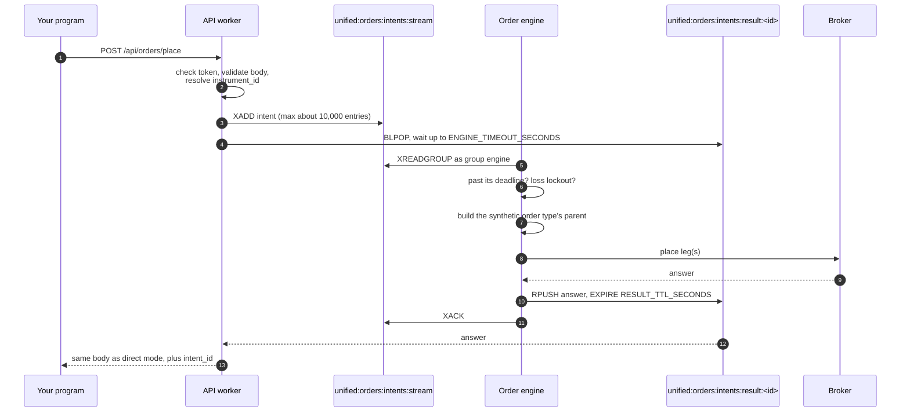
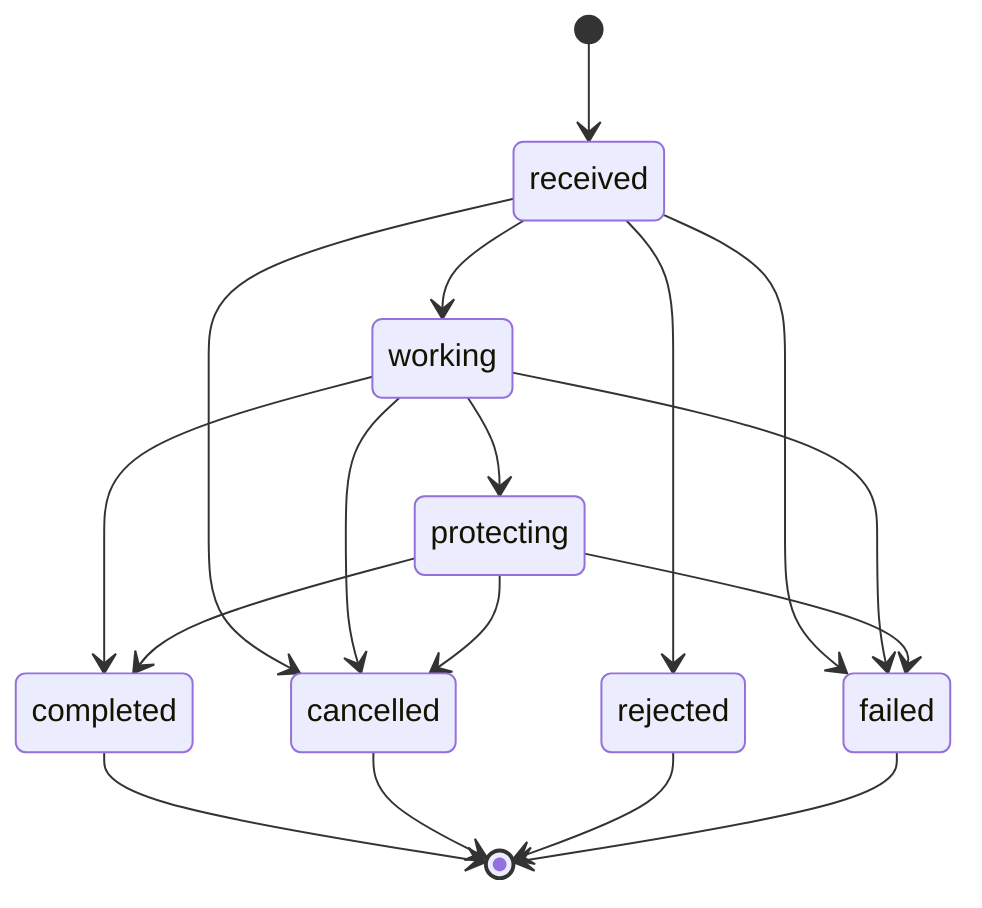

# Order engine

The order engine is an optional background process that places orders on the REST API's behalf. By default, each API worker sends an order to the broker itself while your request waits. In engine mode, the worker instead hands the order to one long-running process, which places it, applies the risk limits, and can keep working an order after your request has been answered. That last ability is what makes brackets, trailing stops, time-sliced orders and every other [synthetic order type](synthetic-orders.md) possible.

!!! danger "The engine places real orders, and can place them later"
    In engine mode, an order can reach a broker after `POST /api/orders/place` has answered: an armed trigger fires when the price arrives, a scheduled order is sent at its time, and a bracket places its stop and target when the entry fills. Each of those is a real order. Stopping the API does not stop the engine; stop `unified-orders@order_engine.service` as well.

## Direct mode and engine mode

`UNIFIED_BROKER_INTERFACE_API_ORDER_PLACEMENT` chooses between the two modes. It is `direct` unless set, and an unknown value stops the API worker from starting with `unknown order placement '<value>'; known modes are direct, engine`.

<figure class="diagram">
--8<-- "docs/assets/diagrams/direct-vs-engine.svg"
<figcaption>The blue dot is a direct-mode order, which goes from the API worker straight to the broker. The orange dots are an engine-mode order travelling through the intent stream and the order engine, and the green dots are the engine's answer coming back through a per-intent list to the waiting worker.</figcaption>
</figure>

The table below compares what each mode does and does not do.

| | `direct` (default) | `engine` |
|---|---|---|
| Who sends the placement | The API worker handling the request | The single `bin/unified/orders/order_engine` process |
| Plain orders | :material-check: | :material-check:, as the `simple` type |
| `synthetic` order types | :material-close: ignored, placed as a plain order | :material-check: all 42 types |
| `price_reference`, `quantity_reference` | :material-close: shape-checked, never resolved | :material-check: resolved from the live quote and positions |
| Rate budget, loss lockout | :material-close: | :material-check: on placements |
| Daily order caps | counted only | counted and enforced with <span class="status s4">429</span> |
| Extra Redis round trips per order | none | an `XADD` and a `BLPOP` |
| `modify` and `cancel` routes | straight to the broker | still straight to the broker |
| Extra keys in the answer | none | `intent_id`, and `parent_id` for an order the engine recorded |

!!! warning "Engine-only fields in direct mode"
    In direct mode `POST /api/orders/place` does not read `synthetic`, so a bracket or an iceberg is silently placed as one plain order. It also does not resolve `price_reference` or `quantity_reference`: a `LIMIT` or `SL` order carrying only a `price_reference` is built with a price of `0`, and an order carrying only a `quantity_reference` is built with a quantity of `0`. The route refuses none of these, so do not send them unless the API runs in engine mode.

## The life of an intent

An intent is one accepted order on its way from an API worker to the engine. The worker checks everything it can check without a broker, writes the intent to a Redis stream, and blocks on a Redis list named after the intent until the engine pushes an answer onto it.



The intent written to the stream carries these fields.

| Field | Meaning |
|---|---|
| `intent_id` | A random 32-character hex id, which names the answer list |
| `created_at` | The Unix time the worker wrote the intent |
| `deadline_at` | `created_at` plus the worker's wait, after which the worker has given up |
| `reply_key` | `unified:orders:intents:result:<intent_id>` |
| `api_worker` | The host and process id of the worker, for diagnosis |
| `synthetic_type` | `synthetic.type` from the body, or `simple` when there is none |
| `instrument_id` | The instrument the worker resolved, so the lookup rule lives in one place |
| `body` | Your JSON body, exactly as it arrived |

The worker validates the body before writing the intent, so a malformed order is refused with <span class="status s4">400</span> without a queue hop. It does not check the synthetic type's own fields; the engine checks those when it builds the order, and answers with <span class="status s4">400</span> if they are wrong.

### When the engine does not answer in time

The worker waits `UNIFIED_BROKER_INTERFACE_API_ORDER_ENGINE_TIMEOUT_SECONDS` (5 by default). Every failure after the intent has been written ends with <span class="status s5">504</span> and `outcome: unknown`, because the order is already on the stream and may still be placed. The body below is a real recording from `python -m test_runs.order_engine_routes`, against a stubbed engine; the timing is illustrative.

```json
{
  "broker": null,
  "instrument_id": "11111111-1111-5111-8111-000000000001",
  "tag": "lostTag",
  "outcome": "unknown",
  "order_id": null,
  "status_message": "the order engine did not answer within 5.0 seconds, so this order may still be placed",
  "broker_response": null,
  "skipped": [],
  "intent_id": "0000000000004000800000000000abcd",
  "timing_ms": {"preparation": 5001.7}
}
```

The engine keeps the other half of that promise. When it reads an intent more than `UNIFIED_BROKER_INTERFACE_API_ORDER_ENGINE_STALE_INTENT_SECONDS` (30 by default) past its deadline, it does not place it. It answers <span class="status s4">409</span> `the order engine read this order after the caller had stopped waiting for it, so it was not placed`, with `intent_id` and `expired_seconds`, so a restart cannot fire an abandoned order into a market that has moved. The answer stays in the list for `UNIFIED_BROKER_INTERFACE_API_ORDER_ENGINE_RESULT_TTL_SECONDS` (300 by default).

The table below lists every engine-mode answer that direct mode never gives.

| Status | Message | Meaning |
|---|---|---|
| <span class="status s2">202</span> | `outcome` is `armed` or `scheduled` | A synthetic order is recorded and waiting for a price, a time or a fill. Nothing may have reached a broker yet. |
| <span class="status s4">400</span> | `the order engine does not run '<type>' orders; it runs ...` | `synthetic.type` is not one of the registered types. |
| <span class="status s4">400</span> | a type's own field message | The `synthetic` object is missing or has a wrong field for its type. |
| <span class="status s4">403</span> | `the day is down <loss>, which is past the <limit> limit, so no new order is being placed` | The daily loss lockout is on. |
| <span class="status s4">409</span> | `the order engine read this order after the caller had stopped waiting for it, so it was not placed` | The intent went stale. |
| <span class="status s4">409</span> | a quantity reference message | A `quantity_reference` asked to reduce or close a position that is not there. |
| <span class="status s4">429</span> | `<broker> has been sent <n> order messages today, ...` | The broker's daily order cap has no room for this kind of order. |
| <span class="status s5">503</span> | `the order engine is not running, so the order was not placed; start unified-orders@order_engine.service` | No engine holds `unified:orders:engine:lock`, which a running engine refreshes every ten seconds and which expires thirty seconds after it stops. The API reads the key before it writes the intent, so nothing was queued. |
| <span class="status s5">503</span> | `the order could not be written for the order engine: <error>` | The `XADD` failed; nothing was queued. |
| <span class="status s5">503</span> | `today's instrument catalogue is not published yet: the catalogue for <date> has expired, and the daily mapping has not published a new one` | The engine refused the instrument as not mapped and found that the date's whole catalogue has expired. |
| <span class="status s5">503</span> | `the order rate budget is full, so this order was not sent; try again in a moment` | No rate token arrived within the wait. |
| <span class="status s5">503</span> | `a price reference needs a tick size the brokers agree on and there is none for this instrument` | A price reference cannot be snapped to a tick. |
| <span class="status s5">504</span> | `the order engine did not answer within <n> seconds, so this order may still be placed` | The wait ran out. |
| <span class="status s5">504</span> | `the order was written for the order engine but its answer could not be read (<error>), so this order may still be placed` | Redis failed during the wait. |
| <span class="status s5">504</span> | `the order engine answered with something that could not be read, so the outcome of this order is unknown` | The answer was not a JSON object with a `body`. |
| <span class="status s5">504</span> | `the order engine failed while placing this order (<exception>), so its outcome is unknown` | The engine raised while placing. |

## The engine process

`bin/unified/orders/order_engine` runs as the systemd unit `unified-orders@order_engine.service`. Only one engine may run against one Redis, because two engines reading the same consumer group could place the same order twice.

1. **It takes a lock.** `unified:orders:engine:lock` holds the engine's process id for 30 seconds and is refreshed every 10. A second engine cannot take it and exits with code 1, and an engine that finds the lock taken over by another process stops placing and exits 1.
2. **It prepares the event table.** It applies the DDL for `unified.synthetic_order_events`, and exits 1 if it cannot.
3. **It builds its placement code.** A misspelt broker selector or unreadable daily caps exit with code 2, which systemd does not restart.
4. **It recovers.** It replays today's events (and up to 30 days of events for the types that carry a parent overnight) through the same state machine the live path uses, rebuilds every parent that had not finished, and brings each leg up to date from the broker's own order book. A failure here exits 1, because placing new orders without knowing what is already at a broker is worse than not starting.
5. **It loops.** It reads both `unified:orders:intents:stream` and `unified:order-updates:stream` in one `XREADGROUP` call as the group `engine`, up to 10 entries at a time, blocking for one second. After each read it gives a clock tick and a price tick to the types that asked for them, and rebuilds its caches when the day rolls over at 06:00 IST.

The consumer group starts at the beginning of the intent stream, because an intent written while the engine was down is an order somebody is still owed an answer for. It starts at the end of the order-update stream, because older updates are about orders the engine never placed. An intent is acknowledged only after its answer has been pushed, so an engine that dies in between redelivers the intent at its next start, where the stale-intent check almost always refuses it. An intent that cannot be read at all is acknowledged unplaced, so that one bad entry cannot block every order behind it.

### Recovery and orphans

The engine writes each transition to the database and commits it before acting on it. A leg is recorded in the state `sending` before its request leaves, so a crash between the two leaves evidence that an order may exist at the broker. On restart the orphan matcher looks for that order in the broker's book. It attributes the order only when exactly one unclaimed order matches every field that was sent, within 2 seconds of when it was sent. With zero matches or several, the parent is parked in `failed` for a person to look at, because hanging a stop and a target on the wrong position is worse than admitting the engine does not know.

## Risk gates

Every order the engine sends passes the same set of limits, held together in one object. They are real limits only because exactly one engine runs; the same limits inside each gunicorn worker would each be enforced once per worker.

| Gate | When it is checked | What it does | Refusal |
|---|---|---|---|
| Daily loss lockout | Before the order is even understood | Adds `pnl.realized` and `pnl.unrealized` from `unified:portfolio:funds`. When the sum is at or below minus the limit, the order is refused. Off unless `ORDER_DAILY_LOSS_LIMIT` is above zero. An unreadable funds document does not lock trading out. | <span class="status s4">403</span> |
| Daily order cap | After the broker is chosen, before anything is recorded | Refuses new entries once the broker's count reaches the entry limit, and every message at the cap itself. See [Daily order caps](orders.md#daily-order-caps). | <span class="status s4">429</span> |
| Rate budget | After the leg is recorded, before it is sent | Two token buckets, one global and one per broker. An order waits up to `ORDER_RATE_WAIT_SECONDS` for a token from both, and is refused only if none arrives. | <span class="status s5">503</span> |
| Re-pricing throttle | Before a resting leg is moved | Refuses to move one leg again sooner than `ORDER_REPRICE_MINIMUM_SECONDS` after its last move. The move is dropped and the next tick works out a fresh price. | recorded against the leg |
| Order-to-trade ratio | After each send and fill | Counts orders sent and orders filled per broker, and reports them when the engine stops. It refuses nothing. | none |

The loss lockout and the rate budget cover placements and the engine's own changes to its legs. `PUT /api/orders/modify` and `DELETE /api/orders/cancel` still go straight from an API worker to a broker, so they are held by neither, though they are counted against a daily cap.

## Parents, legs and where they are kept

The engine thinks in parents and legs. A parent is one order you asked for; a leg is one real broker order the engine sends on its behalf. A plain order has one leg, while a bracket has an entry, a stop and a target.



A parent's state moves only along the arrows above. `failed` means a person has to look: the engine never retries out of it and never arms protective legs for a parent in it. A leg has its own states: `planned`, `sending`, `sent`, `acknowledged`, `partially_filled`, `filled`, `rejected`, `cancelled` and `unknown`.

The engine keeps the same state in two places, and they have different jobs.

| Store | Keys or table | Job |
|---|---|---|
| PostgreSQL | `unified.synthetic_order_events` | The record. One row per transition, committed before it is acted on, and read back at every start. |
| Redis | `unified:orders:parents` | A cache of every parent, by parent id |
| Redis | `unified:orders:parents:open` | The set of parents that are not finished |
| Redis | `unified:orders:children` | Each leg's `<broker>:<broker order id>` to its parent id, which is how an order update is matched to a leg |

The three Redis keys expire at the next 06:00 IST, and every write moves that expiry forward. A flushed Redis costs a slower start, not a lost position, because recovery rebuilds all three from the table.

The `unified.synthetic_order_events` table is a TimescaleDB hypertable with one-day chunks, compressed after seven days. Its columns are listed below.

| Columns | Meaning |
|---|---|
| `time`, `parent_order_id`, `sequence`, `event` | When, which parent, the parent's own counter, and what happened (`parent_received`, `parent_state_changed`, `leg_requested`, `leg_answered`, `leg_update` and others) |
| `synthetic_type`, `parent_state` | The type, and the parent's state after the event |
| `leg_id`, `leg_role`, `leg_state` | The leg the event is about, its role (such as `entry`, `stop`, `target`, `slice`, `chase`) and its state |
| `broker`, `broker_order_id`, `exchange_order_id` | Where the leg went and the ids it got |
| `tag_sent`, `identifier_sent` | The tag and the broker token or symbol the request carried, which the orphan matcher compares |
| `intent_id`, `instrument_id` | The intent that started the parent, and the leg's instrument |
| `transaction_type`, `product`, `order_type`, `validity`, `quantity`, `filled_quantity`, `price`, `trigger_price`, `average_price` | The leg's order |
| `outcome`, `status_message` | The broker's answer |
| `engine_instance` | The host and process id that wrote the row |
| `detail` | JSON: the caller's body, the request as it actually went out, or the broker's response |

## The synthetic limit order book

A `virtual_limit` order is held by the engine instead of being sent, and a real limit order is placed only when the other side of the book reaches your price. The engine reads one quote a second, which cannot tell it how the order would have fared resting at the exchange, so a separate process works that out.

`bin/unified/orders/virtual_book` runs as `unified-orders@virtual_book.service`. Every two seconds it reads the engine's open `virtual_limit` parents whose trigger has not fired. It follows `unified:quotes:stream` with a plain `XREAD` from the moment it starts, 1,000 entries at a time, and keeps one queue estimate per held order in the hash `unified:orders:virtual_queue`, keyed by parent id. The engine reads that hash; **no API route exposes it**, so read it with `redis-cli HGET unified:orders:virtual_queue <parent id>`.

| Estimate field | Meaning |
|---|---|
| `parent_order_id`, `instrument_id`, `side`, `quantity` | Which held order this is |
| `ahead` | How much is queued ahead of the order at its price |
| `queue_filled` | How much a resting order at that price would have filled |
| `filled`, `remaining` | What the order itself would have filled, and what is left |
| `touched_at` | When the other side of the book reached the price |
| `last_volume`, `last_broker`, `last_visible`, `updated_at`, `updates` | Bookkeeping for the next quote |

The arithmetic lives in `unified_broker_interface/utilities/order_engine/utilities/virtual_queue.py`. Trades at the price serve the queue ahead first, a trade through the price fills everything, and cancellations come off the queue ahead in proportion to its share of the level. A price beyond the five visible levels has no place until it comes into view. A stale quote, a change of the broker supplying the quote, or a new session is not read as trading. After a restart, each estimate takes its next quote as a new baseline, so the trading it missed is not counted.

## Settings that tune the engine

The table below lists every environment variable the engine reads, with its default from `utilities/configurations.py`. The selector, exclusion and warming settings on the [Orders](orders.md#how-the-broker-is-chosen) page apply to the engine too.

| Variable | Default | Effect |
|---|---|---|
| `UNIFIED_BROKER_INTERFACE_API_ORDER_PLACEMENT` | `direct` | `engine` turns engine mode on in the API workers |
| `UNIFIED_BROKER_INTERFACE_API_ORDER_ENGINE_TIMEOUT_SECONDS` | `5` | How long a worker waits for the engine's answer |
| `UNIFIED_BROKER_INTERFACE_API_ORDER_ENGINE_RESULT_TTL_SECONDS` | `300` | How long an answer list is kept |
| `UNIFIED_BROKER_INTERFACE_API_ORDER_ENGINE_STALE_INTENT_SECONDS` | `30` | How far past its deadline an intent may be and still be placed |
| `UNIFIED_BROKER_INTERFACE_API_ORDER_RATE_PER_SECOND` | `8` | Orders a second across every broker, also the largest burst |
| `UNIFIED_BROKER_INTERFACE_API_ORDER_RATE_PER_BROKER_PER_SECOND` | `5` | Orders a second to any one broker |
| `UNIFIED_BROKER_INTERFACE_API_ORDER_RATE_WAIT_SECONDS` | `1` | The longest an order waits for a rate token |
| `UNIFIED_BROKER_INTERFACE_API_ORDER_DAILY_LOSS_LIMIT` | `0` (off) | The most the day may lose, as a positive number |
| `UNIFIED_BROKER_INTERFACE_API_ORDER_REPRICE_MINIMUM_SECONDS` | `1` | The shortest gap between two moves of one resting leg |
| `UNIFIED_BROKER_INTERFACE_API_ORDER_DAILY_CAPS` | empty | Daily message caps, as `broker=number,broker=number` |
| `UNIFIED_BROKER_INTERFACE_API_ORDER_DAILY_CAP_EXIT_RESERVE` | `0.05` | The share of each cap kept for closing positions, from 0 up to but not including 1 |

The default rate of 8 orders a second is deliberately under the ten a second at which SEBI's retail algorithmic trading framework treats an account as running an algorithm that needs registration.

??? note "Under the hood"
    - **Files:** `bin/unified/orders/order_engine`, `bin/unified/orders/virtual_book`, and `unified_broker_interface/utilities/order_engine/`, whose `utilities/` folder holds the runner, the handoff, the gates, the stores and the registry.
    - **Classes:** [`IntentHandoff`][unified_broker_interface.utilities.order_engine.utilities.intent_handoff.IntentHandoff] writes an intent and waits; [`OrderIntent`][unified_broker_interface.utilities.order_engine.utilities.order_intent.OrderIntent] is the intent; [`OrderEngine`][unified_broker_interface.utilities.order_engine.utilities.engine_runner.OrderEngine] is the loop; [`RiskGates`][unified_broker_interface.utilities.order_engine.utilities.risk_gates.RiskGates] holds the limits; [`ParentStore`][unified_broker_interface.utilities.order_engine.utilities.parent_store.ParentStore] is the Redis cache; [`VirtualBook`][unified_broker_interface.utilities.order_engine.utilities.virtual_book.VirtualBook] keeps the queue estimates.
    - **Offline checks:** `python -m test_runs.order_engine_routes` records the route in engine mode against a stubbed engine, `python -m test_runs.order_engine` runs the daemon against scripted intents and stubbed brokers, and `python -m test_runs.virtual_queue` checks the queue estimate.
