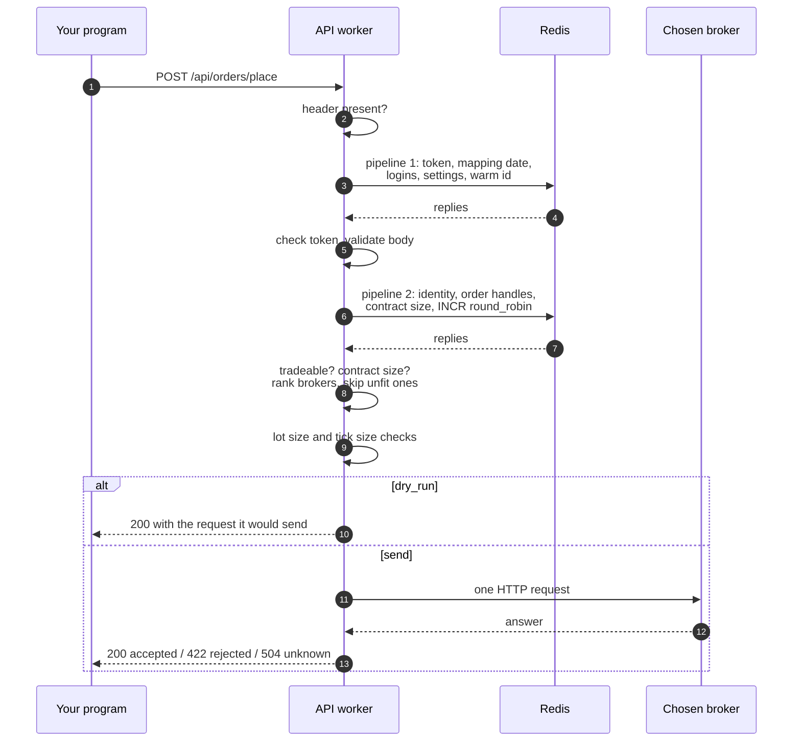
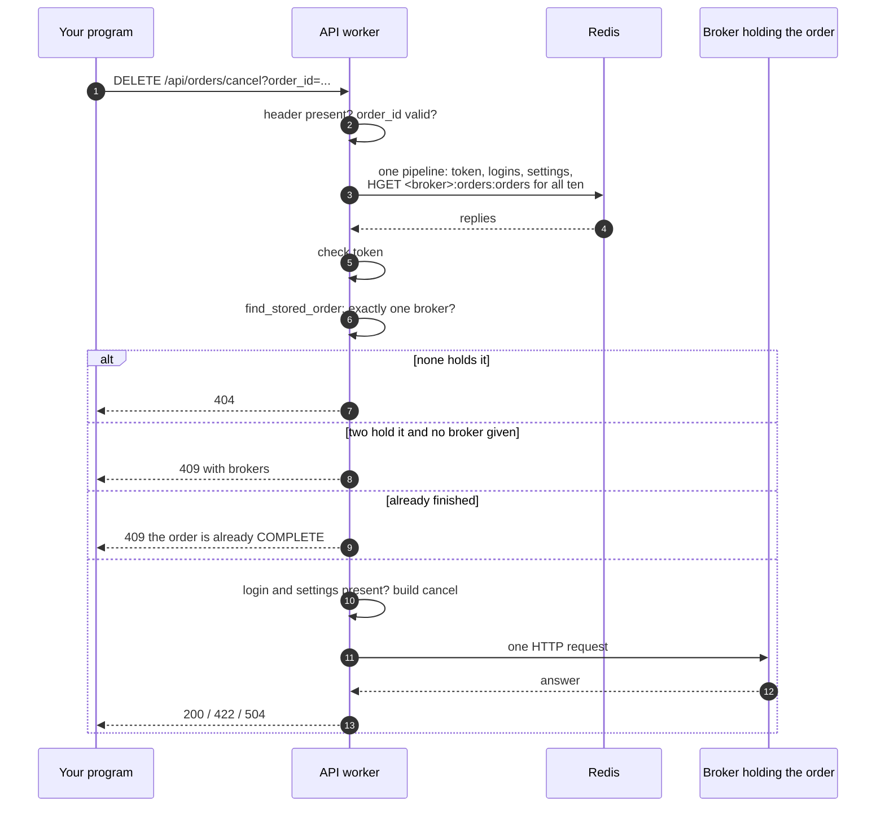
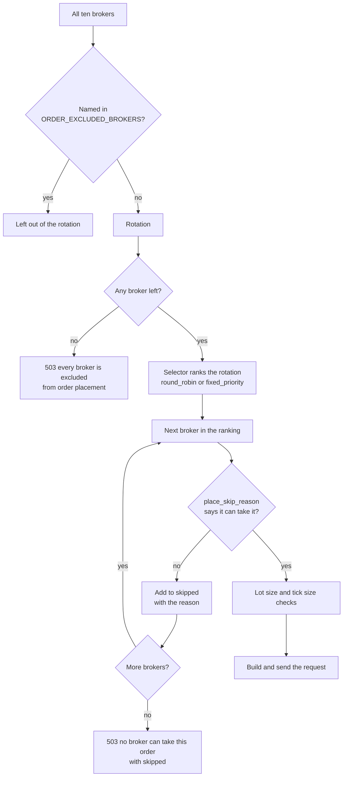
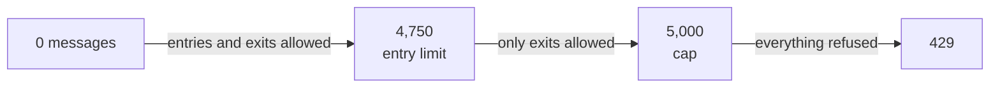

# Orders

The order routes read today's orders and trades across every broker, and place, change and cancel one order at a time. You name an instrument when you place an order, and the API decides which broker receives it. When you change or cancel an order, the API finds the broker that holds it by looking the order id up in every broker's order book.

!!! danger "These routes place, change and cancel real orders"
    `POST /api/orders/place`, `PUT /api/orders/modify` and `DELETE /api/orders/cancel` send real requests to real broker accounts, and nothing is retried or undone for you. Every one of them accepts `"dry_run": true`, which builds the exact broker request and returns it without sending it. Send a dry run first whenever you are unsure.

The table below lists the five routes on this page. The emergency route that cancels and closes everything has a page of its own, [Flatten everything](flatten.md).

| Method | Endpoint | Description |
|---|---|---|
| <span class="method get">GET</span> | [`/api/orders/details`](#order-book) | Today's orders at every broker, from a document kept in Redis |
| <span class="method get">GET</span> | [`/api/orders/trades`](#trade-book) | Today's trades at every broker, from a document kept in Redis |
| <span class="method post">POST</span> | [`/api/orders/place`](#place-an-order) | Places one order at a broker the API chooses |
| <span class="method put">PUT</span> | [`/api/orders/modify`](#modify-an-order) | Changes one open order at the broker that holds it |
| <span class="method delete">DELETE</span> | [`/api/orders/cancel`](#cancel-an-order) | Cancels one open order at the broker that holds it |

## Glossary of constants

The order routes accept a small shared vocabulary. The words are upper-cased before they are checked, so `buy` and `BUY` are both accepted. The table below lists every enumerated value the routes take.

| Parameter | Values | Meaning |
|---|---|---|
| `transaction_type` | `BUY`, `SELL` | The side of the order |
| `product` | `CNC` | Delivery: shares are bought into, or sold out of, the demat account |
| | `MIS` | Intraday: the position is closed the same day |
| | `NRML` | Normal: a derivatives position carried overnight |
| `order_type` | `MARKET` | Trade at the best available price; takes no `price` and no `trigger_price` |
| | `LIMIT` | Trade at `price` or better; needs `price` |
| | `SL` | A stop-loss limit order; needs both `price` and `trigger_price` |
| | `SL-M` | A stop-loss market order; needs `trigger_price` and takes no `price` |
| `validity` | `DAY` | The order lives until the end of the day (the default) |
| | `IOC` | Immediate or cancel: whatever does not fill at once is cancelled |
| `exchange` | `nse`, `bse`, `mcx`, `ncdex` | The exchange, when you name an instrument by its fields rather than by `instrument_id` |
| `option_type` | `CE`, `PE` | Call or put, for an option named by its fields |
| `outcome` (answer) | `accepted` | The broker took the request; answered with <span class="status s2">200</span> |
| | `rejected` | The broker refused it, or the connection could not even be opened; answered with <span class="status s4">422</span> |
| | `unknown` | The broker may or may not have acted; answered with <span class="status s5">504</span> |
| order `status` (book) | `PENDING`, `OPEN`, `COMPLETE`, `CANCELLED`, `REJECTED`, `EXPIRED` | The normalized status every broker's order is converted to |

An order whose status is `COMPLETE`, `CANCELLED`, `REJECTED` or `EXPIRED` is finished. The modify and cancel routes refuse a finished order with <span class="status s4">409</span> and never call the broker.

The segment names below are the ones `POST /api/orders/place` accepts in `segment`. Each one has a shape, which decides the identity fields you must give with it.

| Shape | Segments | Identity fields |
|---|---|---|
| security | `equities`, `fixed_income`, `currencies`, `commodities`, `mutual_funds`, `exchange_traded_funds`, `investment_trusts` | `symbol` |
| future | `equity_futures`, `equity_index_futures`, `fixed_income_futures`, `fixed_income_index_futures`, `currency_futures`, `currency_index_futures`, `commodity_futures`, `commodity_index_futures` | `underlying_symbol`, `expiry_date` |
| option | `equity_options`, `equity_index_options`, `fixed_income_options`, `fixed_income_index_options`, `currency_options`, `currency_index_options`, `commodity_options`, `commodity_index_options` | `underlying_symbol`, `expiry_date`, `strike_price`, `option_type` |

Index segments and the `uncategorised` segment are deliberately missing, because an index cannot be traded and `uncategorised` does not say whether an instrument is a cash instrument or a derivative.

## Order book

<div class="endpoint" markdown><span class="method get">GET</span> `/api/orders/details`<span class="auth">access-token</span></div>

This route answers with today's orders at every broker. It never asks a broker. It reads the document that `bin/unified/orders/api_order_details` rewrites in the Redis key `unified:orders:orders` every half second, so the answer is at most about half a second behind the brokers' own books.

### Request parameters

This route takes only the token header.

| Name | In | Type | Required | Description |
|---|---|---|:---:|---|
| `access-token` | header | string | yes | The token from [`POST /api/session/connect`](session.md#connect) |

=== "curl"

    ```bash
    curl http://127.0.0.1:8080/api/orders/details \
      -H "access-token: $ACCESS_TOKEN"
    ```

=== "Python"

    ```python
    import os

    import requests

    response = requests.get(
        'http://127.0.0.1:8080/api/orders/details',
        headers={'access-token': os.environ['ACCESS_TOKEN']},
        timeout=10,
    )
    print(response.status_code, response.json())
    ```

### Response

The example below shows one order and is shortened to two brokers in `brokers`. The keys are exactly the ones the combining script writes; the values are made up.

```json
{
  "orders": [
    {
      "broker": "zerodha",
      "order_id": "250915000000011",
      "exchange_order_id": "1100000012345678",
      "parent_order_id": null,
      "status": "OPEN",
      "status_message": null,
      "id": "NSE:RELIANCE",
      "instrument_token": "738561",
      "tradingsymbol": "RELIANCE",
      "exchange": "NSE",
      "transaction_type": "BUY",
      "product": "MIS",
      "order_type": "LIMIT",
      "validity": "DAY",
      "quantity": 10,
      "filled_quantity": 0,
      "pending_quantity": 10,
      "cancelled_quantity": 0,
      "disclosed_quantity": 0,
      "price": 2500.0,
      "trigger_price": 0.0,
      "average_price": 0.0,
      "order_timestamp": "2026-09-15T09:20:04+05:30",
      "exchange_timestamp": "2026-09-15T09:20:04+05:30",
      "tag": null,
      "instrument_id": "11111111-1111-5111-8111-000000000001"
    }
  ],
  "summary": {
    "count": 1,
    "by_status": {"OPEN": 1},
    "filled_value": 0.0
  },
  "brokers": [
    {"broker": "dhan", "status": "missing", "as_of": null},
    {"broker": "zerodha", "status": "ok", "as_of": "2026-09-15 09:20:05.120000"}
  ],
  "as_of": "2026-09-15T09:20:05"
}
```

### Response attributes

The document has four top-level keys. Each order in `orders` follows the order contract described in [Data contracts](../architecture/contracts.md).

| Attribute | Type | Description |
|---|---|---|
| `orders` | array | Every order at every broker, sorted by broker, then order time, then order id |
| `orders[].broker` | string | The broker holding the order |
| `orders[].order_id` | string | The broker's own order id, which is what `modify` and `cancel` take |
| `orders[].status` | string | One of the normalized statuses in the glossary |
| `orders[].exchange` | string | The broker's own exchange code, such as `NSE`, `NSE_EQ` or `nse_cm` |
| `orders[].quantity`, `filled_quantity`, `pending_quantity`, `cancelled_quantity`, `disclosed_quantity` | number | Quantities, as the broker reports them |
| `orders[].price`, `trigger_price`, `average_price` | number | Prices, as the broker reports them |
| `orders[].order_timestamp`, `exchange_timestamp` | string | ISO timestamps with the IST offset |
| `orders[].instrument_id` | string or null | The unified instrument id, or null when the order could not be resolved to one |
| `summary.count` | number | How many orders there are |
| `summary.by_status` | object | How many orders there are in each status |
| `summary.filled_value` | number | The sum of filled quantity times average price, rounded to two places |
| `brokers[]` | array | One entry per broker, with `broker`, `status` and `as_of` |
| `brokers[].status` | string | `ok` (seen within a minute), `stale` (older than a minute, still included), `missing` (no data today) or `unreadable` |
| `as_of` | string | When the document was written, in local time |

### Status codes

The status codes below come from the token check and from the shared document reader in `unified_broker_interface/utilities/unified_documents.py`.

| Status | When |
|---|---|
| <span class="status s2">200</span> | The document is fresh and at least one broker's data was read. |
| <span class="status s4">401</span> | `Access token is required`, `Invalid access token` or `Access token has expired`. |
| <span class="status s5">502</span> | `Unable to retrieve orders information`: the document exists, but no broker is `ok` or `stale`. The body still lists `brokers`. |
| <span class="status s5">503</span> | `Orders are not available: nothing is keeping unified:orders:orders`: the key is missing or unreadable, so the combining script is not running. |
| <span class="status s5">503</span> | `Orders are out of date: unified:orders:orders was last written at <as_of>`: the document is more than 30 seconds old. The body carries `as_of` and `brokers`. |

??? note "Under the hood"
    - **Redis keys read:** `unified:orders:orders`, written by `bin/unified/orders/api_order_details` every 0.5 seconds.
    - **Where that script reads from:** each broker's `<broker>:orders:orders` hash, which the broker's `api_order_details` poller and `websocket_order_details` socket both write.
    - **Freshness limit:** 30 seconds, passed to `read_document` in `unified_broker_interface/blueprints/orders.py`.
    - **Class:** [`OrdersBlueprint`][unified_broker_interface.blueprints.orders.OrdersBlueprint].

## Trade book

<div class="endpoint" markdown><span class="method get">GET</span> `/api/orders/trades`<span class="auth">access-token</span></div>

This route answers with today's fills at every broker. Like the order book, it never asks a broker. It reads the document that `bin/unified/orders/api_trade_details` rewrites in `unified:orders:trades` every half second.

### Request parameters

This route takes only the token header.

| Name | In | Type | Required | Description |
|---|---|---|:---:|---|
| `access-token` | header | string | yes | The token from [`POST /api/session/connect`](session.md#connect) |

=== "curl"

    ```bash
    curl http://127.0.0.1:8080/api/orders/trades \
      -H "access-token: $ACCESS_TOKEN"
    ```

=== "Python"

    ```python
    import os

    import requests

    response = requests.get(
        'http://127.0.0.1:8080/api/orders/trades',
        headers={'access-token': os.environ['ACCESS_TOKEN']},
        timeout=10,
    )
    print(response.status_code, response.json())
    ```

### Response

The example below shows one trade, with `brokers` shortened to one entry. The keys are the ones the combining script writes; the values are made up.

```json
{
  "trades": [
    {
      "broker": "zerodha",
      "trade_id": "10000001",
      "order_id": "250915000000011",
      "exchange_order_id": "1100000012345678",
      "exchange_trade_id": "10000001",
      "instrument_id": "11111111-1111-5111-8111-000000000001",
      "instrument_token": "738561",
      "tradingsymbol": "RELIANCE",
      "exchange": "NSE",
      "transaction_type": "BUY",
      "product": "MIS",
      "quantity": 10,
      "price": 2500.0,
      "value": 25000.0,
      "trade_timestamp": "2026-09-15 09:20:06",
      "exchange_timestamp": "2026-09-15 09:20:06"
    }
  ],
  "summary": {
    "count": 1,
    "buy_value": 25000.0,
    "sell_value": 0.0,
    "total_value": 25000.0
  },
  "brokers": [
    {"broker": "zerodha", "status": "ok", "as_of": "2026-09-15 09:20:06.500000"}
  ],
  "as_of": "2026-09-15T09:20:07"
}
```

### Response attributes

Each trade is one fill, in the same shape for every broker.

| Attribute | Type | Description |
|---|---|---|
| `trades` | array | Every fill, sorted by broker, then trade time, then trade id |
| `trades[].trade_id`, `order_id` | string | The broker's own ids for the fill and its order |
| `trades[].exchange_order_id`, `exchange_trade_id` | string or null | The exchange's ids, when the broker reports them |
| `trades[].transaction_type`, `product` | string | On the shared vocabulary |
| `trades[].quantity`, `price` | number | The fill's size and price |
| `trades[].value` | number | Quantity times price, rounded to paise |
| `trades[].trade_timestamp`, `exchange_timestamp` | string or null | Passed through as each broker writes them, so they only sort within one broker |
| `summary.count` | number | How many fills there are |
| `summary.buy_value`, `sell_value`, `total_value` | number | The summed `value` of the buys, of the sells, and of both |
| `brokers[]` | array | One entry per broker, with `broker`, `status` (`ok`, `stale`, `missing` or `unreadable`) and `as_of` |
| `as_of` | string | When the document was written, in local time |

### Status codes

The trade book shares the order book's rules.

| Status | When |
|---|---|
| <span class="status s2">200</span> | The document is fresh and at least one broker's data was read. |
| <span class="status s4">401</span> | `Access token is required`, `Invalid access token` or `Access token has expired`. |
| <span class="status s5">502</span> | `Unable to retrieve trades information`: no broker is `ok` or `stale`. |
| <span class="status s5">503</span> | `Trades are not available: nothing is keeping unified:orders:trades`. |
| <span class="status s5">503</span> | `Trades are out of date: unified:orders:trades was last written at <as_of>`, when it is more than 30 seconds old. |

??? note "Under the hood"
    - **Redis keys read:** `unified:orders:trades`, written by `bin/unified/orders/api_trade_details` every 0.5 seconds from each broker's `<broker>:orders:trades`.
    - **Freshness limit:** 30 seconds.

## Place an order

<div class="endpoint" markdown><span class="method post">POST</span> `/api/orders/place`<span class="auth">access-token</span></div>

This route places one order at one broker. You name the instrument, the side, the product, the order type and the quantity in units, and the API offers the order to the brokers in the order its broker selector ranks them. The first broker that can take the order gets it. The route reads only Redis before it calls the broker, and it never retries a sent order at another broker.

!!! danger "One request, one real order"
    Without `dry_run`, a `200` means a real order now rests at a real broker. A `504` means the order may exist. Check the [order book](#order-book) before you send the same order again.

### Request parameters

The body is a JSON object. You name the instrument in one of two ways: by `instrument_id`, or by `exchange`, `segment` and that segment's identity fields. When `instrument_id` is given, the identity fields are ignored.

| Name | In | Type | Required | Description |
|---|---|---|:---:|---|
| `access-token` | header | string | yes | The day's token. |
| `instrument_id` | body | string (UUID) | one way | The unified instrument id. It must parse as a UUID, and any spelling is normalized to lower case. |
| `exchange` | body | string | other way | `nse`, `bse`, `mcx` or `ncdex`, needed when `instrument_id` is absent. |
| `segment` | body | string | other way | A segment from the table above. It may carry the exchange prefix, as in `nse_equities`. |
| `symbol` | body | string | security | The trading symbol of a security, such as `RELIANCE`. |
| `underlying_symbol` | body | string | future, option | The underlying, such as `NIFTY`. |
| `expiry_date` | body | string | future, option | The expiry as `YYYY-MM-DD`. |
| `strike_price` | body | number or string | option | The strike, as a finite number. |
| `option_type` | body | string | option | `CE` or `PE`. |
| `transaction_type` | body | string | yes | `BUY` or `SELL`. |
| `product` | body | string | yes | `CNC`, `MIS` or `NRML`. |
| `order_type` | body | string | yes | `MARKET`, `LIMIT`, `SL` or `SL-M`. |
| `quantity` | body | integer | yes | The quantity in units, a whole number of at least 1. A numeric string such as `"10"` is accepted. It may be left out only when `quantity_reference` is given. |
| `validity` | body | string | no | `DAY` (default) or `IOC`. |
| `price` | body | number | depends | The limit price, a finite number of at least 0. `LIMIT` and `SL` need it; `MARKET` and `SL-M` refuse it. |
| `trigger_price` | body | number | depends | The trigger, a finite number of at least 0. `SL` and `SL-M` need it; `MARKET` and `LIMIT` refuse it. |
| `disclosed_quantity` | body | integer | no | A whole number of at least 0, and never more than `quantity`. Defaults to 0. |
| `after_market` | body | boolean | no | Places an after-market order. Defaults to false. |
| `tag` | body | string | no | Your own label, 1 to 20 letters and digits, with surrounding spaces removed. |
| `dry_run` | body | boolean | no | Builds and returns the broker request without sending it. Defaults to false. |
| `price_reference` | body | object | no | **Order engine only.** Works the price out from the live quote. See [Price and quantity references](price-quantity-references.md). |
| `quantity_reference` | body | object | no | **Order engine only.** Works the quantity out from the position held. |
| `synthetic` | body | object | no | **Order engine only.** Runs the order as one of the [synthetic order types](synthetic-orders.md). |

The true-or-false fields `after_market` and `dry_run` accept a JSON boolean, or the text `true`, `1`, `yes`, `false`, `0`, `no` or an empty string, in any case. Anything else is refused with <span class="status s4">400</span>.

!!! warning "In direct mode the engine-only fields do nothing useful"
    When `UNIFIED_BROKER_INTERFACE_API_ORDER_PLACEMENT` is `direct` (the default), the route does not read `synthetic` at all, so the order is placed as a plain order and the synthetic behavior you asked for silently does not happen. `price_reference` and `quantity_reference` are checked for shape but never resolved. A `LIMIT` or `SL` order that carries only a `price_reference` passes validation and its request is built with a price of `0`, and an order that carries only a `quantity_reference` is built with a quantity of `0`. Only send these fields when the API runs in [engine mode](order-engine.md).

The API then runs these checks against the instrument and the chosen broker. Each failure is answered without calling a broker.

1. The instrument must be mapped today, or the answer is <span class="status s4">404</span> `the instrument is not mapped`.
2. The instrument's segment must be tradeable, or the answer is <span class="status s4">400</span> `orders are not sent for <segment> instruments`.
3. For a currency or commodity instrument, today's contract size decision must be trusted, and both quantities must be whole lots of it (see [contract sizes](#contract-sizes-lots-and-ticks)).
4. A broker must be able to take the order (see [How the broker is chosen](#how-the-broker-is-chosen)).
5. For a securities instrument, `quantity` must be a whole number of the chosen broker's lot size.
6. `price` and `trigger_price` must be whole numbers of the tick size most brokers agree on.

=== "curl"

    ```bash
    curl -X POST http://127.0.0.1:8080/api/orders/place \
      -H "access-token: $ACCESS_TOKEN" \
      -H "Content-Type: application/json" \
      -d '{
            "exchange": "bse",
            "segment": "equities",
            "symbol": "KWIL",
            "transaction_type": "SELL",
            "product": "CNC",
            "order_type": "LIMIT",
            "quantity": 5,
            "price": "101.25",
            "validity": "ioc",
            "tag": "abc123",
            "disclosed_quantity": 2,
            "dry_run": true
          }'
    ```

=== "Python"

    ```python
    import os

    import requests

    order = {
        'exchange': 'bse',
        'segment': 'equities',
        'symbol': 'KWIL',
        'transaction_type': 'SELL',
        'product': 'CNC',
        'order_type': 'LIMIT',
        'quantity': 5,
        'price': '101.25',
        'validity': 'ioc',
        'tag': 'abc123',
        'disclosed_quantity': 2,
        'dry_run': True,
    }
    response = requests.post(
        'http://127.0.0.1:8080/api/orders/place',
        headers={'access-token': os.environ['ACCESS_TOKEN']},
        json=order,
        timeout=15,
    )
    print(response.status_code, response.json())
    ```

### Response

The bodies below are real answers recorded by the offline suite `python -m test_runs.order_routes`, which runs the route against an in-memory Redis and stubbed brokers, so no real order was involved. The suite records only the names of the `timing_ms` keys, so the numbers shown here are illustrative.

=== "Sent and accepted"

    ```json
    {
      "broker": "zerodha",
      "instrument_id": "11111111-1111-5111-8111-000000000002",
      "tag": "abc123",
      "outcome": "accepted",
      "order_id": "250915000000011",
      "status_message": null,
      "broker_response": {
        "data": {"order_id": "250915000000011"},
        "status": "success"
      },
      "skipped": [],
      "timing_ms": {"preparation": 1.412, "broker": 86.207}
    }
    ```

=== "Dry run"

    ```json
    {
      "broker": "zerodha",
      "instrument_id": "11111111-1111-5111-8111-000000000002",
      "tag": "abc123",
      "dry_run": true,
      "request": {
        "method": "POST",
        "url": "https://api.kite.trade/orders/regular",
        "form": {
          "disclosed_quantity": 2,
          "exchange": "BSE",
          "order_type": "LIMIT",
          "price": "101.25",
          "product": "CNC",
          "quantity": 5,
          "tag": "abc123",
          "tradingsymbol": "KWIL-zerodha",
          "transaction_type": "SELL",
          "trigger_price": "0",
          "validity": "IOC"
        }
      },
      "skipped": [],
      "timing_ms": {"preparation": 1.207}
    }
    ```

=== "Broker refused (422)"

    ```json
    {
      "broker": "zerodha",
      "instrument_id": "11111111-1111-5111-8111-000000000001",
      "tag": null,
      "outcome": "rejected",
      "order_id": null,
      "status_message": "bad request",
      "broker_response": {"message": "bad request"},
      "skipped": [],
      "timing_ms": {"preparation": 1.1, "broker": 40.3}
    }
    ```

=== "No broker can take it (503)"

    ```json
    {
      "error": "no broker can take this order",
      "instrument_id": "11111111-1111-5111-8111-000000000001",
      "skipped": [
        {"broker": "dhan", "reason": "has no login in Redis"},
        {"broker": "flattrade", "reason": "has no login in Redis"},
        {"broker": "fyers", "reason": "has no login in Redis"}
      ]
    }
    ```

The last example is shortened: the recording lists all ten brokers in `skipped`, each with the same reason.

### Response attributes

A sent order and a dry run share most keys. In engine mode every answer also carries `intent_id`, and a synthetic order carries `parent_id`; see [Order engine](order-engine.md).

| Attribute | Type | Description |
|---|---|---|
| `broker` | string | The broker the order went to, or would have gone to. |
| `instrument_id` | string | The resolved instrument id. |
| `tag` | string or null | The tag the broker request carried. |
| `outcome` | string | `accepted`, `rejected` or `unknown`. Absent on a dry run. |
| `order_id` | string or null | The broker's order id, for an accepted order. Keep it: `modify` and `cancel` take it. |
| `status_message` | string or null | Why the outcome is not `accepted`, cut to 300 characters. |
| `broker_response` | object, string or null | The broker's own body, decoded as JSON when possible and otherwise its first 300 characters. |
| `dry_run` | boolean | `true`, on a dry run only. |
| `request` | object | On a dry run only: the method, URL and the form, JSON or query the broker would have received. |
| `skipped` | array | Each broker passed over before the chosen one, with `broker` and `reason`. |
| `timing_ms.preparation` | number | Milliseconds the API spent before the request left the machine. |
| `timing_ms.broker` | number | Milliseconds the broker call took. Absent on a dry run. |

### Status codes

Every failure below is answered without calling a broker, except the three outcomes of a sent order. The messages are the exact strings in the code; `<...>` marks a value filled in.

| Status | When |
|---|---|
| <span class="status s2">200</span> | The broker accepted the order, or this was a dry run. |
| <span class="status s4">400</span> | The body failed validation. The messages include `the request body must be a JSON object`, `transaction_type must be one of BUY, SELL`, `product must be one of CNC, MIS, NRML`, `order_type must be one of MARKET, LIMIT, SL, SL-M`, `validity must be one of DAY, IOC`, `quantity is required`, `quantity must be a whole number of at least 1`, `disclosed_quantity must be a whole number of at least 0`, `disclosed_quantity cannot be more than quantity`, `price must be a number of at least 0`, `trigger_price must be a number of at least 0`, `a <type> order needs a price`, `a <type> order takes no price`, `a <type> order needs a trigger_price`, `a <type> order takes no trigger_price`, `after_market must be true or false`, `dry_run must be true or false` and `tag must be 1 to 20 letters and digits`. |
| <span class="status s4">400</span> | The instrument was named badly: `instrument_id must be a UUID`, `give instrument_id, or an exchange of nse, bse, mcx or ncdex with a segment and its identity fields`, `orders are not sent for the segment '<segment>'`, `a security segment needs symbol`, `a future segment needs underlying_symbol and expiry_date` (or `an option segment ...`), `expiry_date must be a date in YYYY-MM-DD format`, `an option segment needs a numeric strike_price`, `option_type must be CE or PE`, or `the identity fields match more than one instrument, so give instrument_id`. |
| <span class="status s4">400</span> | A reference was malformed: `price_reference must be a JSON object`, `price_reference kind must be one of ...`, `an absolute price_reference needs a price above zero`, `level must be a whole number from 1 to 5, which is as deep as the unified quote carries`, and the same shapes for `quantity_reference`. |
| <span class="status s4">400</span> | The order does not fit the instrument: `orders are not sent for <segment> instruments`, `quantity must be a whole number of lots of <lot>`, `disclosed_quantity must be a whole number of lots of <lot>`, `price must be a whole number of ticks of <tick>` or `trigger_price must be a whole number of ticks of <tick>`. |
| <span class="status s4">401</span> | `Access token is required`, `Invalid access token` or `Access token has expired`. |
| <span class="status s4">404</span> | `the instrument is not mapped`: no instrument matches the id or the identity fields today. |
| <span class="status s4">422</span> | `outcome` is `rejected`: the broker refused the order, or the connection to it could not be opened, so nothing was sent. |
| <span class="status s5">503</span> | `Redis could not be read: <error>`, `no instruments have been mapped yet`, `every broker is excluded from order placement`, `no broker can take this order` (with `skipped`), or `the contract size of this <segment> instrument is not trusted today (<status>), so no order is sent` (with `contract_size_status`). |
| <span class="status s5">504</span> | `outcome` is `unknown`: the broker answered with a server error, answered success without an order id, or the network failed after the request left. **The order may exist.** |

Engine mode adds <span class="status s2">202</span>, <span class="status s4">403</span>, <span class="status s4">409</span>, <span class="status s4">429</span> and more <span class="status s5">503</span> and <span class="status s5">504</span> cases; they are listed on the [Order engine](order-engine.md) page.

### What happens, step by step

The sequence below shows a direct-mode placement by `instrument_id` with the default round-robin selector. It is the path taken when `UNIFIED_BROKER_INTERFACE_API_ORDER_PLACEMENT` is `direct`.



Pipeline 2 is skipped entirely when this worker already holds the instrument's catalogue data for the current warm and the selector queues nothing, which is only possible with `fixed_priority`. An instrument named by its identity fields costs one more round trip, a `ZRANGEBYLEX` on the segment's catalogue, unless the worker has already looked that name up under the current warm.

??? note "Under the hood"
    - **Redis keys read:** `last_login` (the API's token and every broker's login), `settings`, `unified:catalogue:current_date`, `unified:catalogue:warm_identifier`, `unified:catalogue:<date>:identity`, `:order_handles`, `:contract_sizes`, `:catalogue:<segment>` (only for a lookup by fields), and `unified:orders:round_robin` (incremented by the round-robin selector).
    - **Redis keys written:** `unified:orders:round_robin`, and `unified:orders:daily_count:<broker>` when that broker is capped.
    - **Stores never read:** MongoDB and PostgreSQL.
    - **Classes:** [`PlaceOrderRequest`][unified_broker_interface.utilities.broker_orders.utilities.place_order_request.PlaceOrderRequest] validates the body, [`OrderPlacement`][unified_broker_interface.utilities.broker_orders.utilities.placement.OrderPlacement] chooses the broker and builds the request, and each broker's [`BrokerOrders`][unified_broker_interface.utilities.broker_orders.base.BrokerOrders] subclass builds its own request and reads its own answer.
    - **Answer rules:** [`BrokerAnswer`][unified_broker_interface.utilities.broker_orders.utilities.broker_answer.BrokerAnswer] maps `accepted`, `rejected` and `unknown` to 200, 422 and 504.

## Modify an order

<div class="endpoint" markdown><span class="method put">PUT</span> `/api/orders/modify`<span class="auth">access-token</span></div>

This route changes one open order at the broker that holds it. You name the order by the broker's own order id and give at least one field to change. Every field you leave out keeps the stored order's value. The route finds the broker by looking the id up in every broker's order book in Redis, checks the change against the instrument's lot size and tick size, and sends one request to that broker.

!!! danger "A modification changes a live order"
    A changed price or quantity takes effect at the exchange as soon as the broker accepts it. Send it with `dry_run` first to see the exact request.

### Request parameters

`order_id`, `broker` and `dry_run` may come from the body or the query string; the body wins when both are given. The fields to change come from the body only, and a field that is absent or empty is not changed.

| Name | In | Type | Required | Description |
|---|---|---|:---:|---|
| `access-token` | header | string | yes | The day's token. |
| `order_id` | body or query | string | yes | The broker's order id, as `place` and the order book answer it: 1 to 64 letters, digits, hyphens or underscores. A JSON integer is accepted. |
| `broker` | body or query | string | no | One of the ten broker names. Needed only when two brokers hold an order with the same id. |
| `dry_run` | body or query | boolean | no | Returns the request without sending it. |
| `quantity` | body | integer | at least one change | The new **total** quantity in units, a whole number of at least 1. |
| `disclosed_quantity` | body | integer | at least one change | The new disclosed quantity in units, at least 0 and not more than the quantity. |
| `price` | body | number | at least one change | The new limit price, at least 0. |
| `trigger_price` | body | number | at least one change | The new trigger price, at least 0. |
| `order_type` | body | string | at least one change | `MARKET`, `LIMIT`, `SL` or `SL-M`. |
| `validity` | body | string | at least one change | `DAY` or `IOC`. |

Prices are merged with the stored order by these rules, which follow from the order type after the change.

- A price you give is used as it is, but it must fit the new order type: a `LIMIT` needs a price and refuses a trigger price, and so on, exactly as `place` checks.
- A price you leave out is carried over from the stored order only when the new order type needs it and the old one needed it too. So changing `SL` to `LIMIT` drops the trigger price, and changing `LIMIT` to `SL` without a `trigger_price` is refused with `a SL order needs a trigger_price`.
- A carried-over price that Redis does not hold as a positive number is refused with <span class="status s5">503</span> `Redis does not hold this <type> order's <field>, so give <field>`.

Not every broker can change every field. The matrix below comes from each broker's `MODIFIABLE_FIELDS` in `unified_broker_interface/utilities/broker_orders/`. Asking to change a field the broker cannot change is refused with <span class="status s4">400</span> `<broker> cannot change <field> on an order`.

| Broker | `quantity` | `disclosed_quantity` | `price` | `trigger_price` | `order_type` | `validity` | Order types it can change to |
|---|:---:|:---:|:---:|:---:|:---:|:---:|---|
| Dhan | :material-check: | :material-check: | :material-check: | :material-check: | :material-check: | :material-check: | any |
| Flattrade | :material-check: | :material-check: | :material-check: | :material-check: | :material-check: | :material-check: | `LIMIT`, `SL` |
| Fyers | :material-check: | :material-check: | :material-check: | :material-check: | :material-check: | :material-close: | any |
| Groww | :material-check: | :material-close: | :material-check: | :material-check: | :material-check: | :material-close: | any |
| INDmoney | :material-check: | :material-close: | :material-check: | :material-close: | :material-close: | :material-close: | none (no `SL` or `SL-M` at all) |
| Kotak | :material-check: | :material-check: | :material-check: | :material-check: | :material-check: | :material-check: | any |
| Shoonya | :material-check: | :material-check: | :material-check: | :material-check: | :material-check: | :material-check: | `LIMIT`, `SL` |
| Stoxkart | :material-check: | :material-check: | :material-check: | :material-check: | :material-check: | :material-check: | any |
| Wisdom Capital | :material-check: | :material-check: | :material-check: | :material-check: | :material-check: | :material-check: | any |
| Zerodha | :material-check: | :material-check: | :material-check: | :material-check: | :material-check: | :material-check: | any |

Flattrade and Shoonya share the Noren platform, whose modify request can only carry `LIMIT` or `SL`, so changing an order to `MARKET` or `SL-M` there is refused with `<broker> cannot change an order to <type>`. INDmoney takes no stop-loss orders, so asking it for `SL` or `SL-M` is refused with `indmoney takes no <type> orders`.

=== "curl"

    ```bash
    curl -X PUT http://127.0.0.1:8080/api/orders/modify \
      -H "access-token: $ACCESS_TOKEN" \
      -H "Content-Type: application/json" \
      -d '{"order_id": "250915000000011", "quantity": 20, "price": "2501.5", "dry_run": true}'
    ```

=== "Python"

    ```python
    import os

    import requests

    change = {
        'order_id': '250915000000011',
        'quantity': 20,
        'price': '2501.5',
        'dry_run': True,
    }
    response = requests.put(
        'http://127.0.0.1:8080/api/orders/modify',
        headers={'access-token': os.environ['ACCESS_TOKEN']},
        json=change,
        timeout=15,
    )
    print(response.status_code, response.json())
    ```

### Response

These bodies are real recordings from the offline suite, against stubbed brokers. The timing numbers are illustrative.

=== "Sent and accepted"

    ```json
    {
      "broker": "zerodha",
      "order_id": "250915000000011",
      "instrument_id": "11111111-1111-5111-8111-000000000001",
      "status_before_modify": "OPEN",
      "outcome": "accepted",
      "status_message": null,
      "broker_response": {"s": "ok", "stat": "Ok", "status": "success", "type": "success"},
      "timing_ms": {"preparation": 0.912, "broker": 71.44}
    }
    ```

=== "Dry run"

    ```json
    {
      "broker": "zerodha",
      "order_id": "250915000000011",
      "instrument_id": "11111111-1111-5111-8111-000000000001",
      "status_before_modify": "OPEN",
      "dry_run": true,
      "request": {
        "method": "PUT",
        "url": "https://api.kite.trade/orders/amo/250915000000011",
        "form": {"order_type": "LIMIT", "price": "2501.5", "quantity": 20}
      },
      "timing_ms": {"preparation": 0.85}
    }
    ```

=== "Two brokers hold the id (409)"

    ```json
    {
      "error": "more than one broker holds an order with this order_id, so give broker",
      "order_id": "26091500099999",
      "brokers": ["flattrade", "shoonya"]
    }
    ```

=== "Field not changeable (400)"

    ```json
    {
      "error": "indmoney cannot change validity on an order",
      "broker": "indmoney",
      "order_id": "EQ-100072817"
    }
    ```

### Response attributes

The answer names the broker and says what the order's status was before the change.

| Attribute | Type | Description |
|---|---|---|
| `broker` | string | The broker holding the order. |
| `order_id` | string | The order id you gave. |
| `instrument_id` | string or null | The instrument the stored order resolves to, or null when it could not be found in today's catalogue. |
| `status_before_modify` | string | The stored order's status when the request arrived. |
| `outcome` | string | `accepted`, `rejected` or `unknown`. `accepted` means the broker took the instruction, not that the exchange has acted on it. |
| `status_message` | string or null | Why the outcome is not `accepted`. |
| `broker_response` | object, string or null | The broker's own body. |
| `dry_run`, `request` | boolean, object | On a dry run only. |
| `timing_ms` | object | `preparation`, and `broker` when sent. |

### Status codes

Every refusal after the order has been found carries `broker` and `order_id` beside `error`.

| Status | When |
|---|---|
| <span class="status s2">200</span> | The broker accepted the modification, or this was a dry run. |
| <span class="status s4">400</span> | The parameters are invalid: `the request body must be a JSON object`, `order_id is required`, `order_id must be 1 to 64 letters, digits, hyphens or underscores`, `broker must be one of ...`, `dry_run must be true or false`, `give at least one of quantity, disclosed_quantity, price, trigger_price, order_type or validity to change`, or one of the number and choice messages `place` uses. |
| <span class="status s4">400</span> | The broker cannot make the change: `<broker> cannot change <field> on an order`, `<broker> takes no <type> orders` or `<broker> cannot change an order to <type>`. |
| <span class="status s4">400</span> | The order after the change does not fit: `a <type> order needs a <field>`, `a <type> order takes no <field>`, `quantity must be a whole number of lots of <lot>`, `disclosed_quantity must be a whole number of lots of <lot>`, `price must be a whole number of ticks of <tick>`, `trigger_price must be a whole number of ticks of <tick>` or `disclosed_quantity cannot be more than quantity`. |
| <span class="status s4">401</span> | `Access token is required`, `Invalid access token` or `Access token has expired`. |
| <span class="status s4">404</span> | `no broker order book in Redis holds this order_id`. |
| <span class="status s4">409</span> | `the order is already <status>`, `more than one broker holds an order with this order_id, so give broker` (with `brokers`), or `the order has <field> <value>, which the modify route does not handle`, for a stored order whose product, order type, validity or side is outside the route's words. |
| <span class="status s4">422</span> | `outcome` is `rejected`. |
| <span class="status s5">501</span> | `modifying orders is not implemented for <broker>`, for a broker with no modifiable fields. Every broker lists at least one today, so this is not expected. |
| <span class="status s5">503</span> | Redis is missing something the request needs: `Redis could not be read: <error>`, `<broker> has no login in Redis`, `<broker> has no <settings> in its Redis settings`, `Redis does not hold this order's <field> yet, so try again after the broker's next order book poll`, `Redis does not hold this order's <field> as a whole number, ...`, or a broker-specific login problem such as a missing Kotak session id. |
| <span class="status s5">503</span> | A changed quantity cannot be converted: `the order's instrument could not be found in today's catalogue, so a changed quantity cannot be converted into the broker's terms`, `the contract size of this <segment> instrument is not trusted today (<status>), so its quantity cannot be changed`, `<broker> does not know how it counts quantity in <market> orders` or `<broker>'s mapping carries no whole lot size for the instrument`. |
| <span class="status s5">504</span> | `outcome` is `unknown`; the change may have been applied. |

A price-only change never needs the instrument, so it goes ahead even when the instrument cannot be found or its contract size is not trusted; only the tick check is skipped.

??? note "Under the hood"
    - **Redis keys read:** `last_login`, `settings`, `unified:catalogue:current_date`, `unified:catalogue:warm_identifier`, every broker's `<broker>:orders:orders` (one `HGET` each), then `unified:catalogue:<date>:tokens:<broker>` and the candidates' `identity`, `order_handles` and `contract_sizes`.
    - **How the instrument is found:** the stored order's broker token is looked up in `tokens:<broker>`. A candidate is kept only when it is tradeable, its market is one the broker takes, the broker's handle carries the same token, and its market matches the stored exchange code. Exactly one candidate must remain, because several brokers number tokens per exchange.
    - **Classes:** [`ModifyOrderRequest`][unified_broker_interface.utilities.broker_orders.utilities.modify_order_request.ModifyOrderRequest] validates the parameters and [`OrderModification`][unified_broker_interface.utilities.broker_orders.utilities.order_modification.OrderModification] lays the change over the stored order.
    - **Engine mode:** this route still goes straight from the API worker to the broker. The order engine's rate budget and loss lockout do not hold it, though the daily order count does count it.

## Cancel an order

<div class="endpoint" markdown><span class="method delete">DELETE</span> `/api/orders/cancel`<span class="auth">access-token</span></div>

This route cancels one open order at the broker that holds it. It reads Redis once, finds the broker by the order id, and sends one cancel request. An order can be cancelled only after the broker's order poller or order websocket has recorded it in Redis.

!!! danger "A cancel cannot be taken back"
    `outcome: accepted` means the broker took the cancel request. The order may still fill in the moment before the exchange acts on it, so read the [order book](#order-book) to see the final status.

### Request parameters

All three parameters may come from the JSON body or the query string, and the body wins when both are given.

| Name | In | Type | Required | Description |
|---|---|---|:---:|---|
| `access-token` | header | string | yes | The day's token. |
| `order_id` | body or query | string | yes | The broker's order id: 1 to 64 letters, digits, hyphens or underscores. A JSON integer is accepted; a boolean is not. |
| `broker` | body or query | string | no | One of the ten broker names, needed only when two brokers hold the same id. |
| `dry_run` | body or query | boolean | no | Returns the request without sending it. |

=== "curl"

    ```bash
    curl -X DELETE "http://127.0.0.1:8080/api/orders/cancel?order_id=250915000000011&dry_run=true" \
      -H "access-token: $ACCESS_TOKEN"
    ```

=== "Python"

    ```python
    import os

    import requests

    response = requests.delete(
        'http://127.0.0.1:8080/api/orders/cancel',
        headers={'access-token': os.environ['ACCESS_TOKEN']},
        json={'order_id': '250915000000011', 'dry_run': True},
        timeout=15,
    )
    print(response.status_code, response.json())
    ```

### Response

These bodies are real recordings from the offline suite, against stubbed brokers. The timing numbers are illustrative.

=== "Sent and accepted"

    ```json
    {
      "broker": "zerodha",
      "order_id": "250915000000011",
      "status_before_cancel": "OPEN",
      "outcome": "accepted",
      "status_message": null,
      "broker_response": {"s": "ok", "stat": "Ok", "status": "success", "type": "success"},
      "timing_ms": {"preparation": 0.41, "broker": 65.02}
    }
    ```

=== "Dry run"

    ```json
    {
      "broker": "zerodha",
      "order_id": "250915000000011",
      "status_before_cancel": "OPEN",
      "dry_run": true,
      "request": {
        "method": "DELETE",
        "url": "https://api.kite.trade/orders/amo/250915000000011"
      },
      "timing_ms": {"preparation": 0.38}
    }
    ```

=== "Not found (404)"

    ```json
    {
      "error": "no broker order book in Redis holds this order_id",
      "order_id": "NOSUCHORDER"
    }
    ```

### Response attributes

The cancel answer mirrors the modify answer, without an instrument.

| Attribute | Type | Description |
|---|---|---|
| `broker` | string | The broker holding the order. |
| `order_id` | string | The order id you gave. |
| `status_before_cancel` | string | The stored order's status when the request arrived. |
| `outcome` | string | `accepted`, `rejected` or `unknown`. |
| `status_message` | string or null | Why the outcome is not `accepted`. |
| `broker_response` | object, string or null | The broker's own body. |
| `dry_run`, `request` | boolean, object | On a dry run only. |
| `timing_ms` | object | `preparation`, and `broker` when sent. |

### Status codes

The cancel route has fewer failure modes than modify, because it needs no instrument.

| Status | When |
|---|---|
| <span class="status s2">200</span> | The broker accepted the cancel, or this was a dry run. |
| <span class="status s4">400</span> | `the request body must be a JSON object`, `order_id is required`, `order_id must be 1 to 64 letters, digits, hyphens or underscores`, `broker must be one of ...` or `dry_run must be true or false`. |
| <span class="status s4">401</span> | `Access token is required`, `Invalid access token` or `Access token has expired`. |
| <span class="status s4">404</span> | `no broker order book in Redis holds this order_id`. |
| <span class="status s4">409</span> | `the order is already <status>`, or `more than one broker holds an order with this order_id, so give broker`. |
| <span class="status s4">422</span> | `outcome` is `rejected`. |
| <span class="status s5">503</span> | `Redis could not be read: <error>`, `<broker> has no login in Redis`, `<broker> has no <settings> in its Redis settings`, or a message saying Redis does not yet hold a value the broker's cancel needs. |
| <span class="status s5">504</span> | `outcome` is `unknown`; the cancel may have been applied. |

The sequence below shows a cancel from start to finish. Only one Redis round trip happens before the broker call.



??? note "Under the hood"
    - **Redis keys read:** `last_login`, `settings`, and `<broker>:orders:orders` for every broker.
    - **Why the stored order matters:** several brokers' cancel requests need values only their own order book carries, such as Zerodha's variety (the `amo` in the URL above comes from the stored order), Kotak's after-market flag or Wisdom Capital's identifier.
    - **Class:** [`CancelOrderRequest`][unified_broker_interface.utilities.broker_orders.utilities.cancel_order_request.CancelOrderRequest].

## How the broker is chosen

`POST /api/orders/place` names an instrument, not a broker, so the API has to pick one. It does this in three stages. First it drops the brokers that configuration excludes, then the broker selector ranks the rest, and finally each broker in that ranking is asked whether it can take this particular order. The first broker that says yes gets the order.



### Excluded brokers

`UNIFIED_BROKER_INTERFACE_API_ORDER_EXCLUDED_BROKERS` is a comma-separated list of broker names that never receive a placement. When it names every broker, every placement is refused with <span class="status s5">503</span> `every broker is excluded from order placement`. Modify and cancel ignore this setting, because an order already at a broker can only be changed there.

### The two selectors

`UNIFIED_BROKER_INTERFACE_API_ORDER_BROKER_SELECTOR` picks the ranking algorithm, and an unknown name stops the API from starting rather than falling back. The table below compares the two selectors.

| Selector | How it ranks | Redis cost | When to use it |
|---|---|---|---|
| `round_robin` (default) | Starts at `INCR unified:orders:round_robin` modulo the rotation's length and walks the rotation from there. Every gunicorn worker shares the counter. | One `INCR`, queued on the pipeline that reads the instrument | Spreading orders evenly across accounts |
| `fixed_priority` | Puts the brokers named in `UNIFIED_BROKER_INTERFACE_API_ORDER_BROKER_PRIORITY` first, in that order, then the rest of the rotation in turn order | None | Sending everything to one preferred broker, with the others as fallbacks |

With round robin, a skipped broker's turn passes to the next broker in the rotation, so the broker after a skipped one takes two turns in a row.

### Why a broker is skipped

Each broker's `place_skip_reason` answers "can you take this order?" before anything is built. The checks run in the order below, and the first one that fails becomes the `reason` in `skipped`.

| Check | Reason text |
|---|---|
| The instrument's market is in the broker's `MARKETS` | `does not take <exchange> <asset class> <kind> orders` |
| For a currency or commodity market, the broker knows how it counts quantity there | `does not know how it counts quantity in <market> orders` |
| The broker has an order handle for the instrument | `has no mapping for the instrument` |
| The handle carries the field the broker names instruments by | `its mapping carries no broker_token` or `its mapping carries no order_symbol` |
| Where the broker counts in its own lot size, the handle has a whole one | `its mapping carries no whole lot size` |
| Redis holds a login with an access token | `has no login in Redis` |
| Broker-specific login checks, such as Kotak's session id | a broker-specific message |
| The settings the place request needs are present | `has no <fields> in its Redis settings` |
| The broker takes `SL` and `SL-M` orders, when this is one | `takes no <type> orders` |
| The broker takes after-market orders, when this is one | `takes no after-market orders` |

The markets each broker takes are listed below, from the `MARKETS` table of each order class. A market is an exchange, an asset class and a kind of instrument.

| Market | Dhan | Flattrade | Fyers | Groww | INDmoney | Kotak | Shoonya | Stoxkart | Wisdom Capital | Zerodha |
|---|:---:|:---:|:---:|:---:|:---:|:---:|:---:|:---:|:---:|:---:|
| NSE cash | :material-check: | :material-check: | :material-check: | :material-check: | :material-check: | :material-check: | :material-check: | :material-check: | :material-check: | :material-check: |
| BSE cash | :material-check: | :material-check: | :material-check: | :material-check: | :material-check: | :material-check: | :material-check: | :material-check: | :material-check: | :material-check: |
| NSE derivatives | :material-check: | :material-check: | :material-check: | :material-check: | :material-check: | :material-check: | :material-check: | :material-check: | :material-check: | :material-check: |
| BSE derivatives | :material-check: | :material-check: | :material-check: | :material-check: | :material-check: | :material-check: | :material-check: | :material-check: | :material-check: | :material-check: |
| MCX commodity derivatives | :material-check: | :material-check: | :material-check: | | | :material-check: | :material-check: | :material-check: | :material-check: | :material-check: |
| NSE currency derivatives | | :material-check: | :material-check: | | | | :material-check: | :material-check: | :material-check: | :material-check: |
| BSE currency derivatives | | | | | | | | :material-check: | :material-check: | :material-check: |
| NSE commodity derivatives | | | | | | | | | :material-check: | :material-check: |
| NCDEX commodity derivatives | | | | | | | | :material-check: | :material-check: | |
| Takes after-market orders | :material-check: | :material-check: | | | :material-check: | :material-check: | :material-check: | :material-check: | | :material-check: |
| Takes `SL` and `SL-M` | :material-check: | :material-check: | :material-check: | :material-check: | | :material-check: | :material-check: | :material-check: | :material-check: | :material-check: |

### Contract sizes, lots and ticks

The size checks differ between the securities markets and the currency and commodity markets, because the brokers agree on lot sizes in the first and disagree in the second.

- **Securities** (equities, fixed income, funds, trusts and their derivatives): `quantity` must be a whole number of the chosen broker's own `lot_size`. The quantity is sent to the broker unchanged, in units.
- **Currency and commodity**: the lot size comes only from this morning's contract size decision in `unified:catalogue:<date>:contract_sizes`, because brokers count these lots in different units. When the decision is missing, not marked tradeable, or not a positive number, the order is refused with <span class="status s5">503</span> and `contract_size_status` (for example `conflict` or `undecided`). Otherwise `quantity` and `disclosed_quantity` must both be whole lots, and each broker converts them into its own terms, which is `broker_lot_size` (lots times the broker's own lot size) for every broker and market listed today.
- **Ticks**: `price` and `trigger_price` must be whole numbers of the tick size that the most brokers' handles agree on. When two tick sizes tie, the check is skipped.

## Finding the broker that holds an order

Modify and cancel take a broker's order id, and the API has to find which of the ten brokers issued it. It reads the id from every broker's `<broker>:orders:orders` hash in the same pipeline that reads the token, and then `find_stored_order` decides.

1. When you gave `broker`, only that broker's entry is considered.
2. An entry that is missing, not JSON, or not a JSON object counts as not holding the order.
3. When no broker holds it, the answer is <span class="status s4">404</span> `no broker order book in Redis holds this order_id`.
4. When more than one broker holds it, the answer is <span class="status s4">409</span> with `brokers` listing them, and you retry with `broker` set.
5. When the one stored order is finished (`COMPLETE`, `CANCELLED`, `REJECTED` or `EXPIRED`), the answer is <span class="status s4">409</span> `the order is already <status>`.

Because the lookup reads Redis rather than the broker, an order placed a moment ago may not be there yet. The broker's poller records it within about a second, and its order websocket often sooner.

## Daily order caps

Some brokers refuse every order message past a fixed number a day, and a modification or a cancellation counts as a message just like a placement. `UNIFIED_BROKER_INTERFACE_API_ORDER_DAILY_CAPS` sets a cap per broker, written as `broker=number,broker=number`, for example `zerodha=5000,dhan=7000`. It is empty by default, which caps nothing and costs nothing.

When a broker is capped, every request actually sent to it is counted in the Redis key `unified:orders:daily_count:<broker>`. The count expires at the next 06:00 IST, so it starts again each trading day. A request that could not even connect is not counted; one the broker refused is.

| Setting | Default | Effect |
|---|---|---|
| `UNIFIED_BROKER_INTERFACE_API_ORDER_DAILY_CAPS` | empty | The caps, per broker |
| `UNIFIED_BROKER_INTERFACE_API_ORDER_DAILY_CAP_EXIT_RESERVE` | `0.05` | The share of each cap kept back for orders that close a position |

The diagram below shows how a cap of 5,000 with the default reserve is split.



!!! warning "In direct mode the caps are counted, not enforced"
    The refusal with <span class="status s4">429</span> happens only in the [order engine](order-engine.md), which checks the count before it places each leg. In direct mode the API workers count every placement, modification and cancellation, but they never refuse one because of the count. `PUT /api/orders/modify` and `DELETE /api/orders/cancel` are counted in both modes and refused in neither.

When the engine refuses an order, the message says which limit was hit. For a new entry it is `<broker> has been sent <n> order messages today, and the last <m> of its daily cap of <cap> are kept for closing positions, so this was not sent`. For an exit it is `<broker> has been sent <n> order messages today, which is its daily cap of <cap>, so this was not sent`. A count that cannot be read never refuses an order; the failure is logged instead.

## Connection warming

Opening a new TLS connection to a broker costs a noticeable share of an order's time, so the API can keep one connection per broker freshly used. `UNIFIED_BROKER_INTERFACE_API_ORDER_WARM_BROKERS` names the brokers to warm, comma-separated. For each one, a background thread sends a `HEAD` request with no credentials every `WARM_INTERVAL_SECONDS` through the same connection pool the orders use. After the answer, it watches the connection for one second and returns it to the pool only if the server has not closed it.

Each broker's pool also refuses to reuse a connection that has been idle longer than `MAXIMUM_IDLE_SECONDS`, well before the broker's server would drop it. The table below lists both values for each broker.

| Broker | Ping interval (s) | Longest idle reuse (s) | Warmed host |
|---|---:|---:|---|
| Dhan | 60 | 180 | `https://api.dhan.co/` |
| Flattrade | 60 | 300 | `https://piconnect.flattrade.in/` |
| Fyers | 60 | 300 | `https://api-t1.fyers.in/` |
| Groww | 60 | 300 | `https://api.groww.in/` |
| INDmoney | 60 | 300 | `https://api.indstocks.com/` |
| Kotak | 60 | 300 | none until the first Kotak request names its host |
| Shoonya | 15 | 45 | `https://api.shoonya.com/` |
| Stoxkart | 60 | 300 | `https://openapi.stoxkart.com/` |
| Wisdom Capital | 15 | 45 | `https://trade.wisdomcapital.in/` |
| Zerodha | 60 | 300 | `https://api.kite.trade/` |

Warming only saves time, so nothing about it can stop an order. An unknown broker name is logged and ignored, every exception in the warming thread is caught and logged, and a ping never touches the session's cookies or headers. Once a real request has gone to a broker, later pings go to that request's host instead of the default one.

## Redis round trips per route

The order routes were written so that the API's own work adds as little as possible to the time the broker takes. The table below counts the Redis round trips each route makes before its broker call, as the code and the recorded fixtures show them.

| Route | Round trips | What they are |
|---|---|---|
| `GET /api/orders/details`, `/trades` | token check, then 1 | The token check, then one `GET` of the document |
| `POST /place` (direct, `round_robin`) | 2 or 3 | The first pipeline; the instrument data plus the `INCR`; one more `ZRANGEBYLEX` when named by fields and not yet looked up by this worker |
| `POST /place` (direct, `fixed_priority`) | 1 to 3 | As above, but the second pipeline is skipped when this worker already holds the instrument |
| `POST /place` (engine) | 3 or 4 | The first pipeline, an optional lookup by fields, then `XADD` of the intent and `BLPOP` for the answer |
| `PUT /modify` | 1 to 3 | The first pipeline with every broker's order book; the token candidates; their catalogue data, each skipped when held by this worker |
| `DELETE /cancel` | 1 | One pipeline with the token, logins, settings and every broker's order book |
| `POST /flatten` | 1, plus more | One read of everything; one re-read of the order books every 0.25 s while waiting; three per position closed in direct mode |

When a broker is capped by `ORDER_DAILY_CAPS`, each request sent to it costs one more pipeline afterwards, to increment the count.
