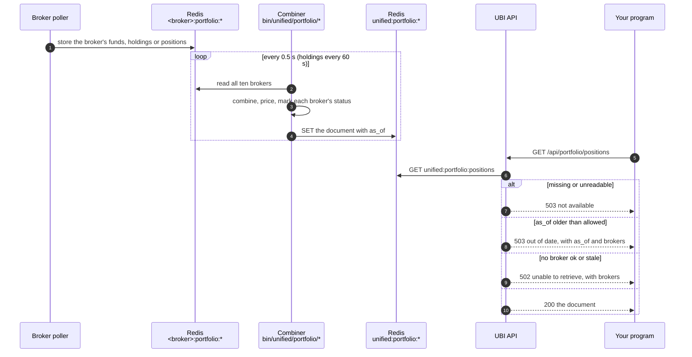

# Portfolio

The portfolio routes return the account's money, long-term holdings and open positions, combined across every broker as if they were one account. None of them asks a broker while you wait. Each one serves a document that a background script rebuilds every half second, or every minute for holdings, and each document says how every broker's data was read.

The table below lists the three routes on this page.

| Method | Endpoint | Description |
|---|---|---|
| <span class="method get">GET</span> | [`/api/portfolio/funds`](#funds) | Cash, margin, profit and cash movements, summed across brokers, with a split by segment |
| <span class="method get">GET</span> | [`/api/portfolio/holdings`](#holdings) | Long-term holdings merged across brokers and priced from the live feed |
| <span class="method get">GET</span> | [`/api/portfolio/positions`](#positions) | Open positions merged across brokers and priced, as a net view and a day view |

## Glossary of constants

The table below lists the enumerated values these routes return.

| Parameter | Values | Meaning |
|---|---|---|
| `brokers[].status` | `ok` | The broker's data was read and is recent |
| `brokers[].status` | `stale` | The broker's data was read but is old, so its script may have stopped. It is still included. |
| `brokers[].status` | `missing` | Nothing is stored for the broker. It contributes nothing. |
| `brokers[].status` | `unreadable` | Something is stored but it could not be read. It contributes nothing. |
| `product` (positions) | `delivery`, `intraday`, `carry`, `margin_trading`, `cover`, `bracket` | The position's product. These are not the order products `CNC`, `MIS` and `NRML`; see [Constants](constants.md#product). |
| `segments` key (funds) | `equity`, `derivatives`, `currency`, `commodity` | The funds split a broker reports, present only when some broker reports it |

## How the documents are kept

Three layers stand between a broker and your program. Each broker's own scripts poll it and store its data in Redis under `<broker>:portfolio:*`. Three combining scripts read every broker's keys, and for holdings and positions the live quotes too, and each writes one finished document under `unified:portfolio:*`. The API only reads that finished document.

<figure class="diagram">
--8<-- "docs/assets/diagrams/portfolio-freshness.svg"
<figcaption>Orange dots are broker data moving into Redis and through the combiners, the blue dot is a live price joining holdings and positions, and green dots are the finished document reaching your program.</figcaption>
</figure>

The sequence below follows one request. The API checks the document's age before anything else, so an old document is never passed off as current.



### How old an answer can be

Each route has a maximum age. A document older than that means its combining script has stopped, and the route answers <span class="status s5">503</span> instead of serving it. Inside the document, each broker also has its own staleness limit, after which that broker is marked `stale` but still counted.

The table below lists the three timings for each route, all in seconds.

| Route | Document rewritten every | Oldest document served | Broker marked `stale` after |
|---|---:|---:|---:|
| `funds` | 0.5 | 30 | 60 |
| `holdings` | 60 | 300 | 180 |
| `positions` | 0.5 | 30 | 60 |

The chart below draws the same numbers on a logarithmic scale, because they range from half a second to five minutes. The gap between the first bar and the second is the slack each route allows before it refuses to answer.

```vegalite
{
  "$schema": "https://vega.github.io/schema/vega-lite/v5.json",
  "description": "Rewrite interval, maximum age served and broker staleness limit for each portfolio route.",
  "width": "container",
  "height": 220,
  "data": {
    "values": [
      {"route": "funds", "measure": "Rewritten every", "seconds": 0.5},
      {"route": "funds", "measure": "Oldest served", "seconds": 30},
      {"route": "funds", "measure": "Broker stale after", "seconds": 60},
      {"route": "holdings", "measure": "Rewritten every", "seconds": 60},
      {"route": "holdings", "measure": "Oldest served", "seconds": 300},
      {"route": "holdings", "measure": "Broker stale after", "seconds": 180},
      {"route": "positions", "measure": "Rewritten every", "seconds": 0.5},
      {"route": "positions", "measure": "Oldest served", "seconds": 30},
      {"route": "positions", "measure": "Broker stale after", "seconds": 60}
    ]
  },
  "mark": {"type": "bar", "cornerRadiusEnd": 4, "tooltip": true},
  "encoding": {
    "y": {"field": "route", "type": "nominal", "title": null, "sort": ["funds", "holdings", "positions"]},
    "yOffset": {"field": "measure", "sort": ["Rewritten every", "Oldest served", "Broker stale after"]},
    "x": {"field": "seconds", "type": "quantitative", "scale": {"type": "log", "domain": [0.1, 1000]}, "title": "Seconds (log scale)"},
    "color": {
      "field": "measure",
      "type": "nominal",
      "sort": ["Rewritten every", "Oldest served", "Broker stale after"],
      "scale": {"range": ["#2a78d6", "#eb6834", "#1baf7a"]},
      "legend": {"orient": "top", "title": null}
    },
    "tooltip": [
      {"field": "route", "type": "nominal"},
      {"field": "measure", "type": "nominal"},
      {"field": "seconds", "type": "quantitative"}
    ]
  }
}
```

### Status codes shared by all three routes

The three routes share one reader, so they fail in the same ways. The table below lists every status; `<Subject>` is `Funds`, `Holdings` or `Positions`, and `<key>` is the route's Redis key.

| Status | When |
|---|---|
| <span class="status s2">200</span> | The document is recent and at least one broker is `ok` or `stale`. |
| <span class="status s4">401</span> | `Access token is required`, `Invalid access token` or `Access token has expired`. |
| <span class="status s5">502</span> | `Unable to retrieve <subject> information`: the document is recent, but every broker is `missing` or `unreadable`. The body also carries `brokers`. |
| <span class="status s5">503</span> | `<Subject> are not available: nothing is keeping <key>`: the key is missing or not a JSON object, so the combining script is not running or has never run. |
| <span class="status s5">503</span> | `<Subject> are out of date: <key> was last written at <as_of>`: the document is older than the route allows. The body also carries `as_of` and `brokers`. |

An out-of-date answer looks like the example below, shortened to two brokers.

```json
{
  "error": "Positions are out of date: unified:portfolio:positions was last written at 2026-09-26T11:02:13",
  "as_of": "2026-09-26T11:02:13",
  "brokers": [
    {"broker": "dhan", "status": "ok", "as_of": "2026-09-26T11:02:12"},
    {"broker": "zerodha", "status": "missing", "as_of": null}
  ]
}
```

## Funds

<div class="endpoint" markdown><span class="method get">GET</span> `/api/portfolio/funds`<span class="auth">access-token</span></div>

This route returns the account's funds with every figure summed across brokers and rounded to paise. It serves `unified:portfolio:funds`, which `bin/unified/portfolio/funds` rewrites every half second from each broker's `<broker>:portfolio:funds` key.

#### Request parameters

| Name | In | Type | Required | Description |
|---|---|---|---|---|
| `access-token` | header | string | Yes | The token from [`connect`](session.md#connect) |

#### Example

=== "curl"

    ```bash
    curl http://127.0.0.1:8080/api/portfolio/funds \
      -H "access-token: $ACCESS_TOKEN"
    ```

=== "Python"

    ```python
    import os

    import requests

    response = requests.get(
        'http://127.0.0.1:8080/api/portfolio/funds',
        headers={
            'access-token': os.environ['ACCESS_TOKEN'],
        },
        timeout=10,
    )
    funds = response.json()
    print(funds['summary']['available_balance'])
    ```

#### Response

The example below is shortened to one segment and two brokers, and every amount is illustrative.

```json
{
  "summary": {
    "total_balance": 250000.0,
    "available_balance": 180000.0,
    "cash_balance": 150000.0,
    "collateral_value": 90000.0,
    "adhoc_credit": 0.0,
    "margin_utilized": 70000.0,
    "withdrawable_balance": 80000.0
  },
  "pnl": {"realized": 1250.5, "unrealized": -340.0},
  "margin_breakdown": {"span_margin": 52000.0, "exposure_margin": 15000.0, "other_margin": 3000.0},
  "cash_movement": {"pay_in_today": 0.0, "pay_out_today": 0.0, "uncleared_funds": 0.0, "pending_withdrawal": 0.0},
  "segments": {
    "equity": {"available_balance": 120000.0, "margin_utilized": 40000.0, "span_margin": 30000.0, "exposure_margin": 8000.0}
  },
  "brokers": [
    {"broker": "dhan", "status": "ok", "as_of": "2026-09-26 11:02:12.841233"},
    {"broker": "wisdom_capital", "status": "unreadable", "as_of": "2026-09-26 11:02:12.101002", "error": "NotFunds: ..."}
  ],
  "as_of": "2026-09-26T11:02:13"
}
```

#### Response attributes

| Attribute | Type | Description |
|---|---|---|
| `summary.total_balance` | number | `available_balance` plus `margin_utilized`, because no broker reports a total |
| `summary.available_balance` | number | What is free to trade |
| `summary.cash_balance` | number | Cash |
| `summary.collateral_value` | number | The value of pledged collateral |
| `summary.adhoc_credit` | number | Ad hoc limits the broker has granted |
| `summary.margin_utilized` | number | Margin already blocked |
| `summary.withdrawable_balance` | number | What can be withdrawn |
| `pnl.realized`, `pnl.unrealized` | number | Profit and loss, as the brokers report it |
| `margin_breakdown` | object | `span_margin`, `exposure_margin` and `other_margin` |
| `cash_movement` | object | `pay_in_today`, `pay_out_today`, `uncleared_funds` and `pending_withdrawal` |
| `segments` | object | One entry per segment any broker reports, each with `available_balance`, `margin_utilized`, `span_margin` and `exposure_margin` |
| `brokers` | array | Each broker's `broker`, `status` and `as_of` (when its script stored the funds, `YYYY-MM-DD HH:MM:SS.ffffff`), plus `error` when it is `unreadable` |
| `as_of` | string | When the document was written, `YYYY-MM-DDTHH:MM:SS` in the server's local time |

A field a broker does not report adds nothing, and a missing, blank or non-numeric value, such as Wisdom Capital's `"NaN"`, is read as zero. A broker is marked `stale` when its funds were stored more than 60 seconds ago. A broker is `unreadable` when what is stored is not funds, for example a refusal that Fyers, the Noren brokers or Kotak carried inside a successful answer.

??? note "Under the hood"
    - Route: `PortfolioBlueprint.funds` in `unified_broker_interface/blueprints/portfolio.py`, calling [`read_document`][unified_broker_interface.utilities.unified_documents.read_document] with a maximum age of 30 seconds.
    - Combiner: `bin/unified/portfolio/funds`. Its module docstring has a table of which broker field feeds each figure.
    - Redis: reads `<broker>:portfolio:funds` for all ten brokers in one `MGET`, and writes `unified:portfolio:funds` with `SET`.

## Holdings

<div class="endpoint" markdown><span class="method get">GET</span> `/api/portfolio/holdings`<span class="auth">access-token</span></div>

This route returns long-term holdings, with each security held at several brokers merged into one row and priced from the live feed. It serves `unified:portfolio:holdings`, which `bin/unified/portfolio/holdings` rewrites every minute, so a document up to five minutes old is served.

#### Request parameters

| Name | In | Type | Required | Description |
|---|---|---|---|---|
| `access-token` | header | string | Yes | The token from [`connect`](session.md#connect) |

#### Example

=== "curl"

    ```bash
    curl http://127.0.0.1:8080/api/portfolio/holdings \
      -H "access-token: $ACCESS_TOKEN"
    ```

=== "Python"

    ```python
    import os

    import requests

    response = requests.get(
        'http://127.0.0.1:8080/api/portfolio/holdings',
        headers={
            'access-token': os.environ['ACCESS_TOKEN'],
        },
        timeout=10,
    )
    for holding in response.json()['holdings']:
        print(holding['symbol'], holding['quantity'], holding['pnl']['unrealized'])
    ```

#### Response

The example below is shortened to one holding and two brokers. The id is a placeholder, and the quantities and prices are illustrative.

```json
{
  "holdings": [
    {
      "instrument_id": "11111111-1111-5111-8111-000000000002",
      "isin": "INE009A01021",
      "symbol": "INFY",
      "exchange": "nse",
      "segment": "nse_equities",
      "quantity": 20.0,
      "average_price": 1400.0,
      "invested_value": 28000.0,
      "last_price": 1521.4,
      "current_value": 30428.0,
      "pnl": {"unrealized": 2428.0, "day_change": 13.25, "day_change_percentage": 0.88},
      "collateral_quantity": 0.0
    }
  ],
  "summary": {"holdings_count": 1, "total_investment": 28000.0, "total_current_value": 30428.0, "total_unrealized_pnl": 2428.0},
  "brokers": [
    {"broker": "dhan", "status": "ok", "as_of": "2026-09-26 11:01:40.112000"},
    {"broker": "zerodha", "status": "stale", "as_of": "2026-09-26 10:55:02.500000"}
  ],
  "as_of": "2026-09-26T11:02:00"
}
```

#### Response attributes

| Attribute | Type | Description |
|---|---|---|
| `holdings[].instrument_id` | string or null | The instrument, or `null` when the holding could not be matched to one |
| `holdings[].isin` | string or null | The ISIN, when a broker sent one |
| `holdings[].symbol` | string | The instrument's symbol, or the broker's own symbol when unmatched |
| `holdings[].exchange` | string | The exchange |
| `holdings[].segment` | string or null | The exchange-prefixed segment, or `null` when unmatched |
| `holdings[].quantity` | number | Everything held, across every broker and every bucket (settled, T1, margin trading) |
| `holdings[].average_price` | number | `invested_value` divided by `quantity` |
| `holdings[].invested_value` | number | Each bucket at its own average price, summed |
| `holdings[].last_price` | number or null | The price used, as described below |
| `holdings[].current_value` | number or null | `quantity` times `last_price` |
| `holdings[].pnl` | object | `unrealized` (current value less invested value), `day_change` and `day_change_percentage` |
| `holdings[].collateral_quantity` | number | The quantity pledged as collateral |
| `summary` | object | `holdings_count`, `total_investment`, `total_current_value` and `total_unrealized_pnl` |
| `brokers` | array | Each broker's `broker`, `status` and `as_of`, when its script stored the holdings |
| `as_of` | string | When the document was written, `YYYY-MM-DDTHH:MM:SS` |

Holdings are sorted by symbol. Two brokers' holdings become one row when they share an ISIN or an instrument id, and their quantities, invested values and pledged quantities add up. A broker is marked `stale` when its holdings were stored more than 180 seconds ago.

A holding is priced in the order below, taking the first price that exists.

1. The instrument's live quote in `unified:quotes:live`, when that quote is usable by the same rule the [quote routes](market-quotes.md#where-a-quote-comes-from) apply: it is not marked stale, and it was received in the last five minutes or its trading window has closed since and not reopened.
2. The last price a broker sent.
3. The broker's previous close, in which case there is no day change.

Groww, INDmoney and Wisdom Capital send no price at all, so a holding that only they carry and that has no usable quote has no `last_price`, `current_value`, `unrealized` or day change.

??? note "Under the hood"
    - Route: `PortfolioBlueprint.holdings`, calling [`read_document`][unified_broker_interface.utilities.unified_documents.read_document] with a maximum age of 300 seconds.
    - Combiner: `bin/unified/portfolio/holdings`. Its module docstring has a table of each broker's holding fields.
    - Matching: a holding's token is looked up in `unified:broker_tokens` among the cash segments. Groww sends no token, so a Groww holding is looked up by symbol in `unified:instrument_symbols`.

## Positions

<div class="endpoint" markdown><span class="method get">GET</span> `/api/portfolio/positions`<span class="auth">access-token</span></div>

This route returns open positions merged across brokers, in two views. The `net` view is every position open now, whether carried from earlier or taken today. The `day` view is today's activity alone, which only Zerodha and Wisdom Capital report, so it holds only theirs. The route serves `unified:portfolio:positions`, which `bin/unified/portfolio/positions` rewrites every half second.

#### Request parameters

| Name | In | Type | Required | Description |
|---|---|---|---|---|
| `access-token` | header | string | Yes | The token from [`connect`](session.md#connect) |

#### Example

=== "curl"

    ```bash
    curl http://127.0.0.1:8080/api/portfolio/positions \
      -H "access-token: $ACCESS_TOKEN"
    ```

=== "Python"

    ```python
    import os

    import requests

    response = requests.get(
        'http://127.0.0.1:8080/api/portfolio/positions',
        headers={
            'access-token': os.environ['ACCESS_TOKEN'],
        },
        timeout=10,
    )
    positions = response.json()
    print(positions['summary']['net']['total_pnl'])
    ```

#### Response

The example below is shortened to one net position and two brokers. The id is a placeholder, and the quantities and prices are illustrative.

```json
{
  "net": [
    {
      "instrument_id": "11111111-1111-5111-8111-000000000001",
      "symbol": "CRUDEOIL",
      "exchange": "mcx",
      "segment": "mcx_commodity_futures",
      "expiry_date": "2026-10-19",
      "strike_price": null,
      "option_type": null,
      "product": "carry",
      "quantity": -100.0,
      "buy": {"quantity": 0.0, "average_price": 0.0, "value": 0.0},
      "sell": {"quantity": 100.0, "average_price": 5730.0, "value": 573000.0},
      "average_price": 5730.0,
      "last_price": 5712.0,
      "pnl": {"realized": 0.0, "unrealized": 1800.0, "total": 1800.0},
      "day_change": 22.0,
      "day_change_percentage": 0.39
    }
  ],
  "day": [],
  "summary": {
    "net": {"count": 1, "realized_pnl": 0.0, "unrealized_pnl": 1800.0, "total_pnl": 1800.0},
    "day": {"count": 0, "realized_pnl": 0.0, "unrealized_pnl": 0.0, "total_pnl": 0.0}
  },
  "brokers": [
    {"broker": "dhan", "status": "ok", "as_of": "2026-09-26T11:02:12"},
    {"broker": "groww", "status": "missing", "as_of": null}
  ],
  "as_of": "2026-09-26T11:02:13"
}
```

#### Response attributes

| Attribute | Type | Description |
|---|---|---|
| `net`, `day` | array of objects | The positions in each view, sorted by symbol, expiry, strike, option type and product |
| `[].instrument_id` | string or null | The instrument, or `null` when the position could not be matched to one |
| `[].symbol` | string | The symbol for a security or the underlying for a derivative, or the broker's own symbol when unmatched |
| `[].exchange` | string | The exchange |
| `[].segment` | string or null | The exchange-prefixed segment |
| `[].expiry_date`, `[].strike_price`, `[].option_type` | string, number, string, or null | The contract, for a derivative |
| `[].product` | string | `delivery`, `intraday`, `carry`, `margin_trading`, `cover` or `bracket` |
| `[].quantity` | number | The net quantity in units, positive for long and negative for short |
| `[].buy`, `[].sell` | object | Each side's `quantity`, `average_price` and `value` |
| `[].average_price` | number | Buy value less sell value, divided by the net quantity |
| `[].last_price` | number or null | From the live quote when there is one, otherwise the price a broker sent |
| `[].pnl` | object | `realized`, `unrealized` and `total`, as the brokers report them |
| `[].day_change`, `[].day_change_percentage` | number or null | The change from the previous close |
| `summary.net`, `summary.day` | object | `count`, `realized_pnl`, `unrealized_pnl` and `total_pnl` for each view |
| `brokers` | array | Each broker's `broker`, `status` and `as_of`, `YYYY-MM-DDTHH:MM:SS` |
| `as_of` | string | When the document was written, `YYYY-MM-DDTHH:MM:SS` |

Positions at several brokers become one row when they share an instrument and a product, and quantities, values and profits add up. The price comes from the live quote, but profit stays the brokers' own figure.

A broker's `as_of` is the newer of its newest position update and its last successful poll. A broker is `ok` when that is within 60 seconds and `stale` after that. A broker with no positions that is being polled is `ok` with nothing in the lists, and `missing` means its scripts have not run today at all.

??? note "Under the hood"
    - Route: `PortfolioBlueprint.positions`, calling [`read_document`][unified_broker_interface.utilities.unified_documents.read_document] with a maximum age of 30 seconds.
    - Combiner: `bin/unified/portfolio/positions`. Its module docstring has a table of each broker's position fields.
    - Redis: reads the hash `<broker>:portfolio:positions`, merged from REST polls and, for Fyers, Groww, Kotak and Wisdom Capital, from their position update streams, and `<broker>:portfolio:positions:polled_at`.
    - See [Orders and positions](../pipelines/orders-and-positions.md) and [Portfolio](../pipelines/portfolio.md) for the broker side.
