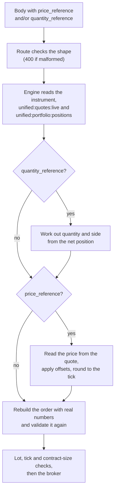

# Price and quantity references

A reference lets an order say *which* price or *which* quantity it wants instead of stating a number. "Buy at the second best offer", "sell at the midpoint" and "close whatever I hold" are all references. The order engine turns each one into a real number from the live quote or the account's positions, and then treats the order exactly as if you had typed that number yourself.

Both references are optional fields in the body of [`POST /api/orders/place`](orders.md#place-an-order): `price_reference` stands in for `price`, and `quantity_reference` stands in for `quantity`.

!!! danger "A reference is still a real order"
    A reference only decides the number. The order that results is sent to a live broker account like any other, and `liquidate_position` also decides the side for you. Try it with `"dry_run": true` first, which resolves the reference and returns the broker request without sending it.

!!! warning "Engine mode only"
    Only the order engine resolves references, so they work only when `UNIFIED_BROKER_INTERFACE_API_ORDER_PLACEMENT=engine`. The route checks a reference's shape in either mode, but nothing in the direct placement path reads `price_reference` or `quantity_reference`. See [Order engine](order-engine.md).

## Glossary of constants

The table below lists every `kind` the two references accept. These are the values of `PRICE_REFERENCE_KINDS` and `QUANTITY_REFERENCE_KINDS` in `unified_broker_interface/utilities/broker_orders/utilities/place_order_request.py`.

| Parameter | Values | Meaning |
|---|---|---|
| `price_reference.kind` | `absolute` | A price you state, rounded to the tick towards the passive side. |
| | `last` | The last traded price. |
| | `mid` | Halfway between the best bid and the best offer. |
| | `vwap` | The day's volume-weighted average price, which the quote calls `average_price`. |
| | `bid_level` | One level of the bid side of the depth, the best bid being level 1. |
| | `offer_level` | One level of the offer side of the depth, the best offer being level 1. |
| | `marketable` | The best price on the other side, which an order must reach to fill now. |
| `quantity_reference.kind` | `absolute` | The `quantity` in the body, unchanged. |
| | `add_to_position` | The `quantity` in the body, unchanged. |
| | `reduce_position` | Part of the position held, closing it, never more than is held. |
| | `liquidate_position` | All of the position held, on the side that closes it. |

## How a reference becomes a number

The engine resolves references when a type is about to build its order, reading the instrument, the quote and the positions from Redis together. The flowchart below shows the steps for a body that carries both references.



The quantity is worked out first because `liquidate_position` and `reduce_position` can change the side, and the side decides which half of the book a price reference reads. The rebuilt order goes through every check a typed number faces, so a reference is never a way around the lot size, the tick size or the contract size.

## Price references

A `price_reference` is an object with a `kind` and, depending on the kind, a few more fields. The table below lists every field.

| Field | Type | Required | Rules |
|---|---|:---:|---|
| `kind` | string | Yes | One of the seven price kinds. Case and surrounding spaces are ignored. |
| `price` | number | For `absolute` | Above zero. |
| `level` | integer | No | For `bid_level` and `offer_level` only. From 1 to 5, which is as deep as the unified quote carries. Defaults to 1. |
| `buffer_percent` | number | No | A percentage offset. May be negative. |
| `offset_percent` | number | No | A second percentage offset, applied after `buffer_percent`. May be negative. |
| `offset_ticks` | integer | No | An offset in whole ticks. May be negative. |

The order's `order_type` must still be a priced type such as `LIMIT` or `SL`. A priced order needs either `price` or `price_reference`, and the route accepts the reference in place of the number.

### How each kind is read

Each kind reads one value from the instrument's entry in `unified:quotes:live`. Every price read from the depth or the last trade is first snapped to the nearest tick, because JSON floats arrive with noise such as `1000.0999999999999`.

| Kind | Reads | Notes |
|---|---|---|
| `absolute` | The `price` field of the reference | Needs no quote. |
| `last` | `last_price` | |
| `vwap` | `average_price` | There is no field named `vwap` in the quote. |
| `mid` | `depth.buy[0]` and `depth.sell[0]` | The average of the two, left between ticks until the final rounding. |
| `bid_level` | `depth.buy[level - 1]` | Refused with `503` if the depth has fewer levels. |
| `offer_level` | `depth.sell[level - 1]` | Refused with `503` if the depth has fewer levels. |
| `marketable` | `depth.sell[0]` for a buy, `depth.buy[0]` for a sell | The other side's touch. |

### Offsets always push towards filling

An offset is always applied in the direction that makes the order more likely to fill. A buy's price goes up and a sell's goes down, so "the offer plus 0.1 per cent" means paying a little more to get done. A negative offset improves the price instead. The three offsets are applied in this order:

1. `buffer_percent`, as a percentage of the price so far.
2. `offset_percent`, as a percentage of the price after step 1.
3. `offset_ticks`, as whole ticks.

### Rounding

The final price is rounded to a whole number of ticks. Every kind except `marketable` rounds towards the passive side: a buy rounds down and a sell rounds up, so a midpoint that falls between two ticks rests rather than crossing the spread. A `marketable` reference is meant to take liquidity, so it rounds the other way, towards the market. A price that works out at zero or below is refused with `400`.

The tick size is the one that most brokers agree on for the instrument. When there is none, or two sizes tie, the order is refused with `503`.

### Worked examples

The table below shows what each reference resolves to against one quote, for a buy and for a sell. The quote is the one the offline suite `test_runs/order_engine.py` uses: a tick size of 0.05, a last price of 1000.10, an average price of 999.80, bids from 1000.00 downwards and offers from 1000.05 upwards in steps of 0.05. The values were produced by running the engine's own resolver offline, and the four marked with a check are also pinned by recorded scenarios in `test_runs/fixtures/order_engine.jsonl`.

| `price_reference` | Buy | Sell | Recorded |
|---|---:|---:|:---:|
| `{"kind": "absolute", "price": 1000.03}` | 1000.00 | 1000.05 | |
| `{"kind": "last"}` | 1000.10 | 1000.10 | |
| `{"kind": "mid"}` | 1000.00 | 1000.05 | :material-check: |
| `{"kind": "vwap"}` | 999.80 | 999.80 | :material-check: |
| `{"kind": "bid_level", "level": 3}` | 999.90 | 999.90 | |
| `{"kind": "offer_level", "level": 2}` | 1000.10 | 1000.10 | :material-check: |
| `{"kind": "marketable"}` | 1000.05 | 1000.00 | |
| `{"kind": "marketable", "buffer_percent": 0.1}` | 1001.10 | 999.00 | :material-check: |
| `{"kind": "bid_level", "offset_ticks": 2}` | 1000.10 | 999.90 | |
| `{"kind": "offer_level", "offset_ticks": -1}` | 1000.00 | 1000.10 | |

The mid of 1000.00 and 1000.05 is 1000.025, which a buy rounds down to 1000.00 and a sell rounds up to 1000.05. The marketable buy with a buffer is 1000.05 plus 0.1 per cent, which is 1001.05005, rounded up towards the market to 1001.10.

The body below asks for a limit buy at the second best offer.

=== "curl"

    ```bash
    curl -X POST http://127.0.0.1:8080/api/orders/place \
      -H "access-token: $ACCESS_TOKEN" \
      -H "Content-Type: application/json" \
      -d '{
        "instrument_id": "11111111-1111-5111-8111-000000000001",
        "transaction_type": "BUY",
        "product": "MIS",
        "order_type": "LIMIT",
        "quantity": 10,
        "price_reference": {"kind": "offer_level", "level": 2},
        "dry_run": true
      }'
    ```

=== "Python"

    ```python
    import os

    import requests

    response = requests.post(
        'http://127.0.0.1:8080/api/orders/place',
        headers={
            'access-token': os.environ['ACCESS_TOKEN'],
        },
        json={
            'instrument_id': '11111111-1111-5111-8111-000000000001',
            'transaction_type': 'BUY',
            'product': 'MIS',
            'order_type': 'LIMIT',
            'quantity': 10,
            'price_reference': {
                'kind': 'offer_level',
                'level': 2,
            },
            'dry_run': True,
        },
        timeout=30,
    )
    print(response.status_code, response.json())
    ```

In the recorded scenario for this body, the request the engine sent to the stubbed Flattrade carried `"prc": "1000.10"` and `"prctyp": "LMT"`.

## Quantity references

A `quantity_reference` is an object with a `kind` and an optional `product`. The table below lists both fields.

| Field | Type | Required | Rules |
|---|---|:---:|---|
| `kind` | string | Yes | One of the four quantity kinds. Case and surrounding spaces are ignored. |
| `product` | string | No | Only count positions of this product, spelled as `GET /api/portfolio/positions` spells it: `delivery`, `intraday`, `carry`, `margin_trading`, `cover` or `bracket`. It is lower-cased before matching. Without it, every product is added together. |

When a body carries a `quantity_reference`, `quantity` may be left out. Without a reference, a missing quantity is refused with `quantity is required`.

### How each kind is resolved

The two position kinds read the `net` rows of `unified:portfolio:positions`, add up the signed `quantity` of every row for this instrument (and product, if given), and treat a positive total as long and a negative one as short. The table below shows what each kind does with that total.

| Kind | Quantity sent | Side sent | Refused when |
|---|---|---|---|
| `absolute` | The body's `quantity` | The body's `transaction_type` | `quantity` is missing or below 1 (`400`) |
| `add_to_position` | The body's `quantity` | The body's `transaction_type` | `quantity` is missing or below 1 (`400`) |
| `reduce_position` | The smaller of the body's `quantity` and the position; the whole position when `quantity` is left out | `SELL` for a long, `BUY` for a short | No position is held (`409`) |
| `liquidate_position` | The whole position | `SELL` for a long, `BUY` for a short | No position is held (`409`) |

The side you send is overwritten for the two position kinds. The recorded scenarios show this: a `liquidate_position` body with `"transaction_type": "BUY"` sold 75 against a long of 75, and bought back 40 against a short of 40. A `reduce_position` body asking for 500 against a long of 75 sold 75, because the body's quantity is a ceiling rather than an instruction.

Quantities are in units, as the place route takes them. A reduce that is not a whole number of lots is refused by the same lot-size check that refuses a typed number.

```json
{
  "instrument_id": "11111111-1111-5111-8111-000000000001",
  "transaction_type": "SELL",
  "product": "MIS",
  "order_type": "MARKET",
  "quantity_reference": {"kind": "liquidate_position", "product": "intraday"}
}
```

## Which order types resolve references

A reference is resolved only by the order types that ask for it. The table below lists which synthetic types do and when.

| When it is resolved | Types |
|---|---|
| When the engine takes the order | `simple`, `freeze_slicer`, `oto`, `oco`, `bracket`, `cover`, `scale_out`, `time_stop`, `good_till_time`, `peg`, `chaser`, `post_only`, `discretionary`, `participation`, `liquidity_seeking`, `iceberg`, `trailing_stop`, `trailing_entry`, `atr_trail`, and the price-trigger types `market_if_touched`, `limit_if_touched`, `hidden_stop`, `candle_close_stop`, `cross_instrument`, `indicator_triggered`, `gtt` and `virtual_limit` |
| When the engine takes the order, and again for each later order | `twap`, `vwap`, `implementation_shortfall`, `accumulation`, `grid` |
| At the scheduled time, not before | `scheduled` |
| Never | `ladder`, `two_sided_breakout`, `basket`, `oca`, `legged_spread`, `strategy_stop`, `exposure_hedge`, `square_off`, `daily_stop` |

The price-trigger types resolve the reference when the order is armed, not when it fires. The types in the last row never call the resolver, so give them real numbers. [Synthetic orders](synthetic-orders.md) describes every type.

## Errors

The table below lists every message a reference can produce, with the status code it comes with. The first group comes from the route's shape check, and the second from the engine's resolution.

| Status | Message | What to do |
|---|---|---|
| <span class="status s4">400</span> | `price_reference must be a JSON object` | Send an object, not a string or a number. The same message names `quantity_reference` for that field. |
| <span class="status s4">400</span> | `price_reference kind must be one of absolute, last, mid, vwap, bid_level, offer_level, marketable` | Fix the `kind`. |
| <span class="status s4">400</span> | `quantity_reference kind must be one of absolute, add_to_position, reduce_position, liquidate_position` | Fix the `kind`. |
| <span class="status s4">400</span> | `an absolute price_reference needs a price above zero` | Add `price` to the reference. |
| <span class="status s4">400</span> | `level must be a whole number from 1 to 5, which is as deep as the unified quote carries` | Ask for a level from 1 to 5. |
| <span class="status s4">400</span> | `level must be a whole number of at least 1` | Ask for a level from 1 to 5. |
| <span class="status s4">400</span> | `buffer_percent must be a number`, `offset_percent must be a number`, `offset_ticks must be a number` | Send a finite number. |
| <span class="status s4">400</span> | `offset_ticks must be a whole number` | Send a whole number of ticks. |
| <span class="status s4">400</span> | `a <kind> quantity_reference needs a quantity of at least 1` | `absolute` and `add_to_position` still need `quantity`. |
| <span class="status s4">400</span> | `the <kind> price reference worked out at <price>, which is not a price an order can carry` | The offsets pushed the price to zero or below; use smaller offsets. |
| <span class="status s4">409</span> | `a <kind> quantity_reference found no open position in this instrument, so there is nothing to close` | There is nothing to reduce or liquidate. The body also carries `instrument_id`. |
| <span class="status s5">503</span> | `a <kind> price reference needs a live quote for this instrument and there is none` | The quote feed has not carried this instrument yet. Check the live quote services. |
| <span class="status s5">503</span> | `a <kind> price reference needs <n> level(s) on the <side> side of the book and the quote carries <m>` | The book is thinner than the level asked for; ask for a shallower level. |
| <span class="status s5">503</span> | `a <kind> price reference needs <field> in the quote and it is <value>` | The quote lacks that field right now; wait for the next quote or pick another kind. |
| <span class="status s5">503</span> | `the <side> side of the book is not readable for a <kind> price reference` | The depth entry is malformed; wait for the next quote. |
| <span class="status s5">503</span> | `a price reference needs a tick size the brokers agree on and there is none for this instrument` | The brokers' tick sizes disagree; state the price yourself. |
| <span class="status s5">503</span> | `a <kind> quantity_reference needs the unified positions and they could not be read` | Check that the unified positions service is running. |
| <span class="status s5">503</span> | `a <kind> quantity_reference needs the unified positions and they carry no net rows` | The positions document has no `net` list; check the unified positions service. |

The recorded scenario `a_reference_without_a_quote_is_refused` shows the first 503 exactly: `{"error": "a mid price reference needs a live quote for this instrument and there is none"}`. [Errors and status codes](errors.md) covers every other status the order routes return.

??? note "Under the hood"
    The shape is checked by [`PlaceOrderRequest`][unified_broker_interface.utilities.broker_orders.utilities.place_order_request.PlaceOrderRequest] in `parse_price_reference` and `parse_quantity_reference`. The engine reads the instrument, the quote from `unified:quotes:live` and the positions from `unified:portfolio:positions` through `EnginePlacement.market_context`, which queues none of the broker selector's commands, so a referenced order does not advance the round-robin rotation twice. `SyntheticOrder.concrete_order` then calls [`QuantityReference`][unified_broker_interface.utilities.order_engine.utilities.quantity_reference.QuantityReference] and [`PriceReference`][unified_broker_interface.utilities.order_engine.utilities.price_reference.PriceReference], drops both references from the body, writes the real `quantity`, `transaction_type` and `price` into it, and validates it again. What is recorded in `synthetic_order_events` and sent to the broker is the resolved number, never the reference.
