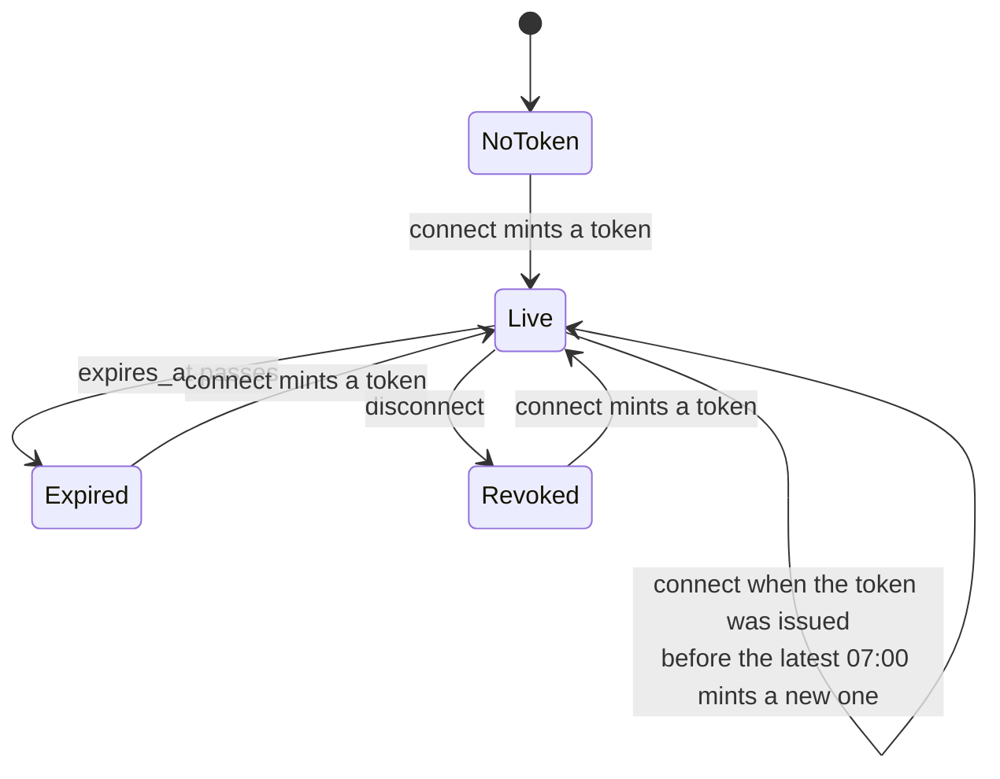
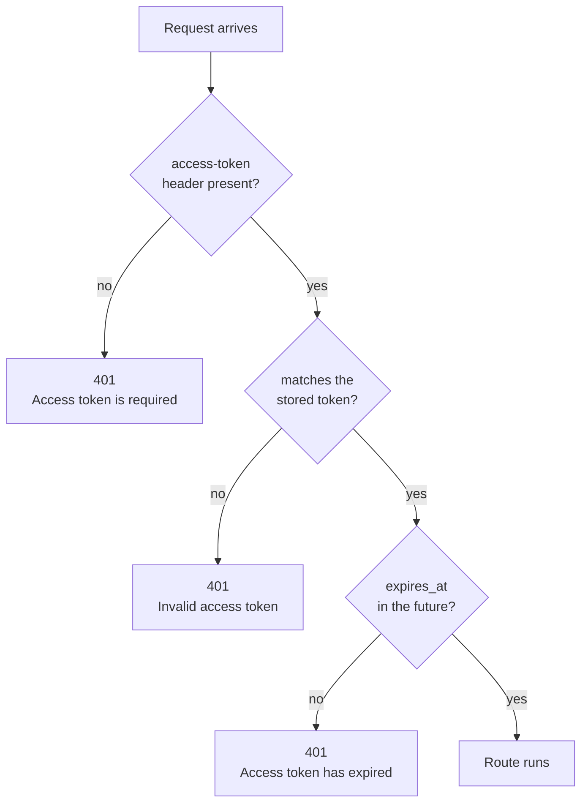

# Session

The session routes turn the API key and secret into the access token that every other route needs, report whether that token is still good, and end the session. There is one token for the whole application at a time, so these three routes manage a single shared login rather than one login per client.

The table below lists the three routes on this page.

| Method | Endpoint | Description |
|---|---|---|
| <span class="method post">POST</span> | [`/api/session/connect`](#connect) | Exchanges the `api-key` and `api-secret` headers for the access token |
| <span class="method delete">DELETE</span> | [`/api/session/disconnect`](#disconnect) | Revokes the access token for every client |
| <span class="method get">GET</span> | [`/api/session/status`](#status) | Says the token is valid and when it expires |

## How the token lives and dies

A token is a random UUID that the API mints and stores in two places. MongoDB holds the record, in the `last_login` collection under `broker_name` `unified_broker_interface`, beside the ten broker logins. Redis holds a copy in the `last_login` hash under the same field, and that copy is what every request checks.

The diagram below shows every state the token can be in and what moves it from one state to the next. "07:00" means 07:00 on the machine's clock, which the project runs on India time.



The rules behind that diagram come from `TokenStore` in `unified_broker_interface/utilities/tokens.py`, and they are listed below.

1. A `connect` first reads the stored login document from MongoDB, not from the Redis copy.
2. If that document holds a token that was issued at or after the most recent 07:00 and has not expired, the same token is returned unchanged. Before 07:00, "the most recent 07:00" is yesterday's, so a token issued after midnight is kept.
3. Otherwise a new token is minted. It replaces the old one, so any other client still holding the old token starts getting <span class="status s4">401</span>.
4. A new token is accepted for `UNIFIED_BROKER_INTERFACE_API_TOKEN_TTL_SECONDS` seconds, which defaults to `86400` (one day).
5. The new document is written to MongoDB first and to Redis second. If the Redis write fails, the Redis field is deleted instead, so the next request falls back to MongoDB rather than trusting a copy that is out of date.
6. A `disconnect` stores a document whose `access_token` and `expires_at` are both `null`, which makes the old token fail immediately.

!!! note "A token can outlive 07:00"
    The daily renewal only happens when someone calls `connect`. With the default one-day lifetime, a token issued at 10:00 stays valid until 10:00 the next day unless a `connect` after 07:00 replaces it first. A program that runs all day should call `connect` once each morning after 07:00, and it will get the same token back on any later call that day.

The login document that is stored looks like this. The values here are placeholders.

```json
{
  "broker_name": "unified_broker_interface",
  "access_token": "5b0c9d0e-8f7a-4c35-9a53-2f4f0f4f7a61",
  "last_login": "2026-09-26 07:05:11.402913",
  "expires_at": "2026-09-27 07:05:11.402913"
}
```

## How a request is checked

Every route except `connect` and `GET /api/` runs the same check before doing any work. The check reads the login document from Redis, or from MongoDB when Redis has none or cannot be reached, and compares the header against it in constant time.

The flowchart below shows the order of the checks and the message each failure returns.



A stored document without a readable `expires_at` counts as expired. After a disconnect the stored token is `null`, so every token fails the match and the answer is `Invalid access token` rather than `Access token has expired`.

## Connect

<div class="endpoint" markdown><span class="method post">POST</span> `/api/session/connect`<span class="auth">api-key and api-secret</span></div>

This route checks the key and secret against the `api_key` and `api_secret` fields of the document whose `broker_name` is `unified_broker_interface` in the MongoDB `settings` collection. If both match, it returns the token in force or mints a new one, following the rules above. It takes no body.

#### Request parameters

The two headers below are the only input.

| Name | In | Type | Required | Description |
|---|---|---|---|---|
| `api-key` | header | string | Yes | The key stored in `settings` for `unified_broker_interface` |
| `api-secret` | header | string | Yes | The matching secret |

#### Example

=== "curl"

    ```bash
    curl -X POST http://127.0.0.1:8080/api/session/connect \
      -H "api-key: $API_KEY" \
      -H "api-secret: $API_SECRET"
    ```

=== "Python"

    ```python
    import os

    import requests

    response = requests.post(
        'http://127.0.0.1:8080/api/session/connect',
        headers={
            'api-key': os.environ['API_KEY'],
            'api-secret': os.environ['API_SECRET'],
        },
        timeout=10,
    )
    access_token = response.json()['access-token']
    ```

#### Response

The token comes back under the key `access-token`, spelled with a hyphen to match the header it will be sent in.

```json
{
  "access-token": "5b0c9d0e-8f7a-4c35-9a53-2f4f0f4f7a61",
  "expires_at": "2026-09-27 07:05:11.402913"
}
```

#### Response attributes

| Attribute | Type | Description |
|---|---|---|
| `access-token` | string | The token to send in the `access-token` header of every other request |
| `expires_at` | string | When the token stops being accepted, as `YYYY-MM-DD HH:MM:SS.ffffff` in the server's local time |

#### Status codes

| Status | When |
|---|---|
| <span class="status s2">200</span> | The key and secret matched. The body holds the token in force or a newly minted one. |
| <span class="status s4">401</span> | `Invalid API key or secret`: either header is missing, empty or wrong. |
| <span class="status s5">500</span> | `unified_broker_interface settings are not configured`: MongoDB `settings` has no document for `unified_broker_interface`. |

??? note "Under the hood"
    - Route: `SessionBlueprint.connect` in `unified_broker_interface/blueprints/session.py`. Both credentials are compared with `hmac.compare_digest`.
    - Token logic: [`TokenStore.connect`][unified_broker_interface.utilities.tokens.TokenStore.connect], which calls `issue` when a new token is needed.
    - MongoDB: reads `settings`, reads and writes `last_login`.
    - Redis: writes the `last_login` hash, field `unified_broker_interface`.
    - Logs: every refused connect is logged with the caller's address, and every success says whether the token was new or reused.

## Disconnect

<div class="endpoint" markdown><span class="method delete">DELETE</span> `/api/session/disconnect`<span class="auth">access-token</span></div>

This route revokes the token in force. Because there is only one token, disconnecting ends the session for every client that shares it, not only for the caller. The route itself needs a valid token, so an expired token cannot be used to disconnect.

#### Request parameters

| Name | In | Type | Required | Description |
|---|---|---|---|---|
| `access-token` | header | string | Yes | The token in force |

#### Example

=== "curl"

    ```bash
    curl -X DELETE http://127.0.0.1:8080/api/session/disconnect \
      -H "access-token: $ACCESS_TOKEN"
    ```

=== "Python"

    ```python
    import os

    import requests

    response = requests.delete(
        'http://127.0.0.1:8080/api/session/disconnect',
        headers={
            'access-token': os.environ['ACCESS_TOKEN'],
        },
        timeout=10,
    )
    print(response.json())
    ```

#### Response

```json
{
  "status": "disconnected"
}
```

#### Response attributes

| Attribute | Type | Description |
|---|---|---|
| `status` | string | Always `disconnected` |

#### Status codes

| Status | When |
|---|---|
| <span class="status s2">200</span> | The token was revoked. |
| <span class="status s4">401</span> | `Access token is required`, `Invalid access token` or `Access token has expired`. |

??? note "Under the hood"
    - Route: `SessionBlueprint.disconnect` in `unified_broker_interface/blueprints/session.py`.
    - Token logic: [`TokenStore.revoke`][unified_broker_interface.utilities.tokens.TokenStore.revoke] stores `access_token: null`, `expires_at: null` and the current time as `last_login`, MongoDB first and Redis second.

## Status

<div class="endpoint" markdown><span class="method get">GET</span> `/api/session/status`<span class="auth">access-token</span></div>

This route answers only when the token is valid, so a <span class="status s2">200</span> is itself the proof that the session is connected. The body adds when the token expires.

#### Request parameters

| Name | In | Type | Required | Description |
|---|---|---|---|---|
| `access-token` | header | string | Yes | The token to check |

#### Example

=== "curl"

    ```bash
    curl http://127.0.0.1:8080/api/session/status \
      -H "access-token: $ACCESS_TOKEN"
    ```

=== "Python"

    ```python
    import os

    import requests

    response = requests.get(
        'http://127.0.0.1:8080/api/session/status',
        headers={
            'access-token': os.environ['ACCESS_TOKEN'],
        },
        timeout=10,
    )
    print(response.status_code, response.json())
    ```

#### Response

```json
{
  "status": "connected",
  "expires_at": "2026-09-27 07:05:11.402913"
}
```

#### Response attributes

| Attribute | Type | Description |
|---|---|---|
| `status` | string | Always `connected` |
| `expires_at` | string | When the token stops being accepted, as `YYYY-MM-DD HH:MM:SS.ffffff` in the server's local time |

#### Status codes

| Status | When |
|---|---|
| <span class="status s2">200</span> | The token is valid. |
| <span class="status s4">401</span> | `Access token is required`, `Invalid access token` or `Access token has expired`. |

??? note "Under the hood"
    - Route: `SessionBlueprint.status` in `unified_broker_interface/blueprints/session.py`.
    - The check is the `authenticated` decorator in `unified_broker_interface/blueprints/base.py`, which calls [`TokenStore.check`][unified_broker_interface.utilities.tokens.TokenStore.check].
    - [`TokenStore.current`][unified_broker_interface.utilities.tokens.TokenStore.current] reads Redis first. When Redis has nothing, it reads MongoDB and fills Redis with `HSETNX`, so filling the cache can never overwrite a `connect` that lands in between.
    - See [Sessions and logins](../architecture/sessions.md) for how the broker logins beside this document work.
