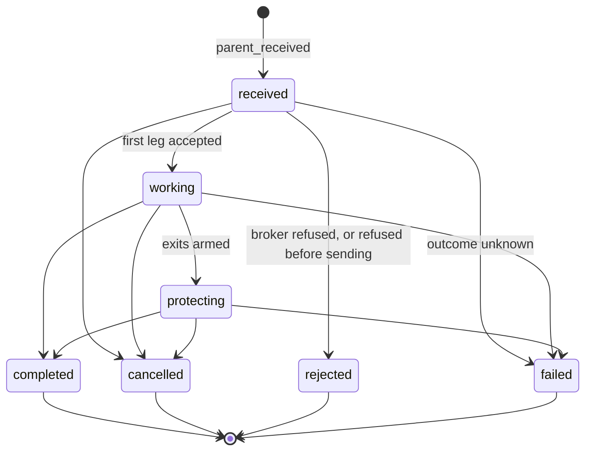

# Synthetic orders

A synthetic order is an order that no Indian exchange offers, built by the order engine out of ordinary broker orders. You ask for one by adding a `synthetic` object to the body of [`POST /api/orders/place`](orders.md#place-an-order), and the engine places, watches, moves and cancels the real orders it is made of.

This page is the glossary of all 42 types the engine runs. It lists every field each type reads from the `synthetic` object, with the defaults and limits taken from the code.

!!! danger "Synthetic orders place real orders, sometimes long after you asked"
    A synthetic order can place, modify or cancel orders at a broker minutes, hours or even days after your request, with nobody watching. Triggers, trailing stops, grids and schedules all act on their own. Send `"dry_run": true` first, which builds the first broker request without recording or sending anything.

!!! warning "Engine mode only"
    Synthetic orders run only when `UNIFIED_BROKER_INTERFACE_API_ORDER_PLACEMENT=engine` and the order engine daemon is running. See [Order engine](order-engine.md) for how the two placement modes differ and what the direct mode does with a `synthetic` object.

## How to ask for one

The request body is an ordinary order body, and the `synthetic` object sits beside the other fields. The engine reads the type from `synthetic.type`, and the rest of the object holds that type's own settings. The example below asks for a bracket: a limit buy of 10 that, once it fills, is protected by a stop and a target.

```json
{
  "instrument_id": "11111111-1111-5111-8111-000000000001",
  "transaction_type": "BUY",
  "product": "MIS",
  "order_type": "LIMIT",
  "quantity": 10,
  "price": 1000.00,
  "synthetic": {
    "type": "bracket",
    "stop_price": 990,
    "stop_limit_price": 988,
    "target_price": 1010
  }
}
```

The order fields outside `synthetic` still matter. Most types use them as the template for every order they send, so the instrument, side, product, order type, quantity and price you give are validated exactly as they are for a plain order, and each type then changes only what it has to.

Two fields can appear in any `synthetic` object. The table below lists them.

| Field | Type | Required | Meaning |
|---|---|:---:|---|
| `type` | string | Yes | One of the 42 names in the table below. A body with no `synthetic` object, or no `type`, runs as `simple`. An unknown name is refused with `400` and the message `the order engine does not run '<name>' orders; it runs <list>`. |
| `closes_position` | boolean | No | `true` says every leg of this order closes a position, so it may use the part of a broker's daily order cap kept for exits. Only the literal `true` counts. |

The engine also writes its own working values into the parent's copy of the `synthetic` object, such as `tick_size`, `triggered_at`, `watermark`, `placed_quantity`, `started_at` and `expires_at`. These are internal, so do not send them.

## What the first answer looks like

Types that act at once answer with the broker's answer plus a `parent_id`; types that send several orders at once, such as `freeze_slicer` and `ladder`, combine them into one answer with a list of `order_ids`. Types that wait for a price or a time send nothing at first, and answer <span class="status s2">202</span> with an `outcome` of `armed` or `scheduled`. The answer below was recorded by the offline suite `test_runs/order_engine.py` against stubbed brokers, for a `market_if_touched` buy waiting for 995.

```json
{
  "broker": null,
  "instrument_id": "11111111-1111-5111-8111-000000000001",
  "order_id": null,
  "outcome": "armed",
  "parent_id": "<uuid4>",
  "skipped": [],
  "status_message": "the order is recorded and will be placed when the price touches the level",
  "tag": null,
  "trigger_direction": "at_or_below",
  "trigger_level": "995"
}
```

Keep the `parent_id`. It is the only handle on an order that has not reached a broker yet.

## All 42 types

The master table below lists every type registered in `SYNTHETIC_ORDER_CLASSES`, in the order the registry holds them. The "First answer" column says whether a broker order goes out when you ask (`200`, the broker's own answer) or whether the engine waits (`202`).

| Type | Family | What it does | Key fields in `synthetic` | First answer |
|---|---|---|---|:---:|
| `simple` | Plain and laddered | Sends one order to one broker and does nothing afterwards. | none | 200 |
| `freeze_slicer` | Plain and laddered | Splits an order above the exchange's freeze quantity into even orders that each fit. | none | 200 |
| `ladder` | Plain and laddered | Places several limit orders evenly spaced between two prices. | `from_price`, `to_price`, `steps` | 200 |
| `oto` | Linked orders | Places a second order, sized to what actually filled, once the first one fills. | `then` | 200 |
| `oco` | Linked orders | Rests a stop and a target on a position you hold, each shrinking as the other fills. | `stop_price`, `stop_limit_price`, `target_price` | 200 |
| `bracket` | Linked orders | Places an entry, then arms a stop and a target on the first partial fill. | `stop_price`, `stop_limit_price`, `target_price` | 200 |
| `scale_out` | Linked orders | A bracket with several targets that take the position off in tranches. | `target_prices`, `stop_price`, `stop_limit_price`, `breakeven_after` | 200 |
| `two_sided_breakout` | Linked orders | Rests a buy stop above a range and a sell stop below it, and cancels the side that did not fire. | `buy_trigger`, `buy_limit`, `sell_trigger`, `sell_limit` | 200 |
| `scheduled` | Time-based | Holds the order until a time of day, then places it. | `at_time` | 202 |
| `good_till_time` | Time-based | Places the order now and cancels whatever has not filled at a time of day. | `until_time` | 200 |
| `time_stop` | Time-based | Places an entry and closes what filled at a time of day or after some minutes. | `until_time` or `minutes` | 200 |
| `twap` | Execution algorithms | Sends equal slices at even intervals over a period. | `slices`, `over_minutes` | 200 |
| `peg` | Book-following limits | Keeps a limit order re-priced to the bid, the offer or the midpoint. | `reference`, `offset_ticks`, `cap_price` | 200 |
| `chaser` | Book-following limits | Starts on its own side of the book and steps towards the other until it fills. | `step_ticks`, `step_seconds`, `cap_price`, `cross_after_seconds` | 200 |
| `market_if_touched` | Price triggers | Waits unseen for the price to touch a level, then sends a marketable limit. | `trigger_price`, `trigger_direction`, `buffer_ticks` | 202 |
| `limit_if_touched` | Price triggers | Waits for the price to touch a level, then rests a limit at another price. | `trigger_price`, `limit_price`, `trigger_direction` | 202 |
| `hidden_stop` | Stops and trailing | A stop kept in the engine that watches the bid or offer, with an optional real backstop. | `trigger_price`, `backstop_price`, `backstop_limit_price`, `buffer_ticks` | 202 |
| `cross_instrument` | Price triggers | A limit-if-touched order whose trigger watches a different instrument. | `watch_instrument_id`, `trigger_price`, `limit_price` | 202 |
| `indicator_triggered` | Price triggers | Sends a limit when a chosen field of the live quote crosses a level. | `watch_field`, `trigger_price`, `limit_price` | 202 |
| `trailing_stop` | Stops and trailing | A real stop at the broker whose trigger follows the market up, never down. | `trail_points` or `trail_percent`, `stop_limit_offset`, `step_ticks` | 200 |
| `trailing_entry` | Stops and trailing | A stop entry that follows a falling market down so the first bounce fills it. | `trail_points` or `trail_percent`, `stop_limit_offset`, `step_ticks` | 200 |
| `post_only` | Book-following limits | Checks that a limit would rest rather than trade before sending it. | `on_crossing` | 200 |
| `discretionary` | Book-following limits | Shows one limit price and quietly takes a slightly worse one when it comes within reach. | `discretion_points`, `discretion_quantity` | 200 |
| `vwap` | Execution algorithms | A TWAP whose slice sizes follow the shape of the day's volume. | `slices`, `over_minutes`, `volume_profile` | 200 |
| `implementation_shortfall` | Execution algorithms | A TWAP whose slices shrink, so most of the order trades early. | `slices`, `over_minutes`, `urgency` | 200 |
| `participation` | Execution algorithms | Trades a fixed share of the volume the market itself trades. | `participation_percent`, `most_slices` | 202 |
| `liquidity_seeking` | Execution algorithms | Shows nothing and strikes only when enough size appears at an acceptable price. | `limit_price`, `minimum_quantity` | 202 |
| `iceberg` | Execution algorithms | Rests one slice at a time and places the next when that slice fills. | `slice_quantity`, `randomise_percent` | 200 |
| `grid` | Plain and laddered | Rests buys below and sells above the market, each fill placing its opposite. | `levels`, `step_points`, `most_inventory` | 200 |
| `basket` | Multi-instrument | Places orders on several instruments in one request and reports each one. | `candidates` | 200 |
| `oca` | Linked orders | Places several candidate entries and cancels the rest on the first fill. | `candidates` | 200 |
| `cover` | Linked orders | An entry with a compulsory stop and no target. | `stop_price`, `stop_limit_price` | 200 |
| `legged_spread` | Multi-instrument | Works one leg passively, then takes the other at the price that makes the net. | `candidates`, `net_price` | 200 |
| `strategy_stop` | Multi-instrument | Places a basket and closes every leg when the total profit or loss crosses a line. | `candidates`, `loss_limit`, `profit_target` | 200 |
| `exposure_hedge` | Multi-instrument | Trades a hedge when the account's net exposure leaves a band. | `watched`, `lower_band`, `upper_band`, `hedge_instrument_id` | 202 |
| `candle_close_stop` | Stops and trailing | A hidden stop that fires only when a whole bar closes past the level. | `trigger_price`, `bar_minutes`, `backstop_price`, `backstop_limit_price` | 202 |
| `atr_trail` | Stops and trailing | A trailing stop whose distance is a multiple of the recent average true range. | `trail_points`, `stop_limit_offset`, `bar_minutes`, `periods`, `atr_multiple` | 200 |
| `square_off` | Time-based | At a time of day, cancels resting orders and closes the day's positions with limits. | `at_time`, `product`, `instrument_ids` | 202 |
| `accumulation` | Execution algorithms | Buys a fixed quantity at a fixed interval, each purchase resting on its own side. | `every_minutes`, `purchases` | 200 |
| `gtt` | Price triggers | A limit-if-touched order that keeps waiting across days until it expires. | `trigger_price`, `limit_price`, `valid_days` | 202 |
| `daily_stop` | Stops and trailing | Places a fresh native stop every morning for a position held overnight. | `stop_price`, `stop_limit_price`, `arm_at`, `valid_days` | 202 |
| `virtual_limit` | Book-following limits | Holds a limit order in the engine and sends it only when the other side reaches its price. | `paper` | 202 |

The chart below counts how many of the 42 types fall into each family. The families are this page's own grouping, chosen to make the list easier to scan; the code does not group them.

```vegalite
{
  "$schema": "https://vega.github.io/schema/vega-lite/v5.json",
  "description": "Number of synthetic order types in each family",
  "width": "container",
  "height": 260,
  "data": {
    "values": [
      {"family": "Linked orders", "types": 7},
      {"family": "Execution algorithms", "types": 7},
      {"family": "Stops and trailing", "types": 6},
      {"family": "Book-following limits", "types": 5},
      {"family": "Price triggers", "types": 5},
      {"family": "Plain and laddered", "types": 4},
      {"family": "Time-based", "types": 4},
      {"family": "Multi-instrument", "types": 4}
    ]
  },
  "mark": {"type": "bar", "cornerRadiusEnd": 3},
  "encoding": {
    "y": {"field": "family", "type": "nominal", "sort": "-x", "title": null},
    "x": {"field": "types", "type": "quantitative", "title": "Number of types", "axis": {"tickMinStep": 1}},
    "tooltip": [
      {"field": "family", "type": "nominal", "title": "Family"},
      {"field": "types", "type": "quantitative", "title": "Types"}
    ]
  }
}
```

## The life of a parent order

Every synthetic order is one *parent* made of one or more *legs*, where each leg is one real order at a broker. The parent moves through a small set of states defined in `unified_broker_interface/utilities/order_engine/utilities/parent_order.py`, and the diagram below shows the changes that file allows.



The states mean the following.

| State | Meaning |
|---|---|
| `received` | The parent is recorded. An armed or scheduled order stays here until its trigger fires or its time comes. |
| `working` | At least one leg is live at a broker. |
| `protecting` | A position exists and exit legs are guarding it, as in a bracket after its entry has filled. A hidden stop with a backstop is also here from the moment it is armed. |
| `completed` | The parent has nothing left to do. |
| `cancelled` | The parent was called off, for example a `good_till_time` order whose time ran out. |
| `rejected` | No request reached a broker, or the broker refused it. |
| `failed` | The engine does not know what the broker has, so a person must look. The engine never retries out of this state and never arms protective legs for a parent in it. |

`completed`, `cancelled`, `rejected` and `failed` are final. A leg has its own state as well: it starts as `sending` when the request is recorded and becomes `acknowledged`, `rejected` or `unknown` from the broker's answer.

??? note "Under the hood"
    Every change is written to the database table `synthetic_order_events` and committed before it is applied, and a leg is recorded as `leg_requested` before its request leaves. A crash between the two therefore leaves a row saying an order may exist. The parent is also copied to Redis under `unified:orders:parents`, which is a cache that expires at 06:00 IST. After a restart, the engine rebuilds every open parent by replaying its events through [`ParentOrder`][unified_broker_interface.utilities.order_engine.utilities.parent_order.ParentOrder]. The shared behavior of every type lives in [`SyntheticOrder`][unified_broker_interface.utilities.order_engine.base.SyntheticOrder].

## Rules every type shares

A few rules come from the shared base class rather than from any one type, and they explain behavior you will see across the whole list.

- **Every leg of one parent goes to the same broker.** The first leg lets the broker selector choose, and every later leg is sent to that broker. A stop at one broker cannot protect a position held at another.
- **A linked leg is reduced, not cancelled and replaced.** When one of two exits fills, the other is modified down by what filled, so the position is never unprotected and the order keeps its place in the queue.
- **A move that changes nothing is never sent.** A re-price to the price an order already has is dropped silently.
- **Re-prices are throttled and count against the daily cap.** A re-price of an entry stops where new entries stop, and a re-price of an exit may use the exit reserve. Cancels and quantity reductions are never held back.
- **Every price the engine computes is rounded to the tick.** Types that work prices out from the quote need a tick size that the brokers agree on, and are refused with `503` when there is none.
- **Stops are always stop-limit orders.** Wherever a type places a stop, you must give both the trigger and the limit, and neither is defaulted.

## Glossary by family

The tabs below describe each type in detail, grouped by family. Every field table lists only what the type reads from the `synthetic` object, and every example shows only the `synthetic` object; the rest of the body is an ordinary order.

=== "Plain and laddered"

    These four types act at once and place everything they need when you ask.

    #### `simple`

    A simple order is one order sent to one broker. It is what every request becomes when it names no type. Once the broker answers, the parent is `working` if the order was accepted, `rejected` if it was refused, or `failed` if the outcome is unknown, and nothing more happens.

    It reads no fields besides `type`.

    ```json
    {"type": "simple"}
    ```

    #### `freeze_slicer`

    An exchange rejects any single derivative order above its freeze quantity. This type reads the freeze quantity that the chosen broker publishes, compares it with the quantity in that broker's own terms, and splits the order evenly into as many orders as it needs. Every slice goes to the same broker. When the broker publishes no freeze quantity, the order is sent whole. An order that would need more than 20 slices is refused with `400`.

    It reads no fields besides `type`.

    ```json
    {"type": "freeze_slicer"}
    ```

    #### `ladder`

    A ladder places `steps` limit orders evenly spaced from `from_price` to `to_price`. The order's `quantity` is the whole ladder and is shared out as evenly as whole units allow, so 100 over three rungs is 34, 33 and 33. Each rung's price is rounded to the tick towards the passive side.

    | Field | Type | Required | Rules |
    |---|---|:---:|---|
    | `from_price` | number | Yes | Above zero. |
    | `to_price` | number | Yes | Above zero, and different from `from_price`. |
    | `steps` | integer | Yes | From 2 to 20. The order's `quantity` must be at least `steps`. |

    ```json
    {"type": "ladder", "from_price": 995, "to_price": 1000, "steps": 5}
    ```

    #### `grid`

    A grid rests `levels` buy limits below the last traded price and `levels` sell limits above it, `step_points` apart. When a buy fills, a sell is placed one step above it, and when a sell fills, a buy is placed one step below. The order's `quantity` is the size of each individual order. Once the net position the grid built reaches `most_inventory`, every resting order on the side that would make the position bigger is cancelled.

    | Field | Type | Required | Rules |
    |---|---|:---:|---|
    | `levels` | integer | Yes | From 1 to 20 on each side. |
    | `step_points` | number | Yes | Above zero. |
    | `most_inventory` | integer | Yes | At least 1. It is required because a trending market keeps filling one side. |

    ```json
    {"type": "grid", "levels": 3, "step_points": 5, "most_inventory": 30}
    ```

=== "Linked orders"

    These seven types place orders that watch each other. A fill on one leg changes, places or cancels another.

    #### `oto`

    "One triggers other" places your order and, when it fills, places a second order described by `then`. The child is sized to what the first order actually filled and grows with each further fill. The `then` object is merged over your order body, and its quantity is always replaced, so leave it out.

    | Field | Type | Required | Rules |
    |---|---|:---:|---|
    | `then` | object | Yes | An order body without a quantity, such as `{"transaction_type": "SELL", "order_type": "LIMIT", "price": 1010}`. It is validated before the first order is sent. |

    ```json
    {"type": "oto", "then": {"transaction_type": "SELL", "order_type": "LIMIT", "price": 1010}}
    ```

    #### `oco`

    "One cancels other" protects a position you already hold with a stop and a target resting together. Set `transaction_type` to the side that **opened** the position, so a long is protected by asking for a `BUY` and both exits are sells. When one exit fills, the other is reduced by what filled, and when the position is closed, what is left of the other is cancelled. The stop is an `SL` order and the target is a `LIMIT` order.

    | Field | Type | Required | Rules |
    |---|---|:---:|---|
    | `stop_price` | number | One of the two | The stop's trigger. Above zero. |
    | `stop_limit_price` | number | With `stop_price` | The stop's limit. Above zero. It is required whenever `stop_price` is given. |
    | `target_price` | number | One of the two | The target's limit. Above zero. |

    ```json
    {"type": "oco", "stop_price": 990, "stop_limit_price": 988, "target_price": 1010}
    ```

    #### `bracket`

    A bracket places your order as an entry and, on its first partial fill, arms a stop and a target for what filled. Further fills grow the exits. When an exit fills while the entry is still working, the rest of the entry is cancelled first. The exit prices are checked before the entry is sent, so a bracket with unusable exits is refused before anything reaches a broker.

    It takes the same fields as `oco`: `stop_price`, `stop_limit_price` and `target_price`, with at least one of `stop_price` and `target_price`.

    ```json
    {"type": "bracket", "stop_price": 990, "stop_limit_price": 988, "target_price": 1010}
    ```

    #### `cover`

    A cover order is a bracket with a compulsory stop and no target. It inherits the bracket's arming on the first partial fill.

    | Field | Type | Required | Rules |
    |---|---|:---:|---|
    | `stop_price` | number | Yes | The stop's trigger. |
    | `stop_limit_price` | number | Yes | The stop's limit. |
    | `target_price` | — | Must be absent | A target is refused with `400`; ask for a `bracket` instead. |

    ```json
    {"type": "cover", "stop_price": 990, "stop_limit_price": 988}
    ```

    #### `scale_out`

    A scale-out is a bracket with several targets, each taking part of the position off. A target filling reduces only the stop, not the other targets. After `breakeven_after` targets have filled, the stop is moved to the entry's average price.

    | Field | Type | Required | Rules |
    |---|---|:---:|---|
    | `target_prices` | list of numbers | Yes | At least two prices. |
    | `stop_price` | number | Yes | The stop's trigger. |
    | `stop_limit_price` | number | Yes | The stop's limit. |
    | `breakeven_after` | integer | No | How many targets must fill before the stop moves to breakeven. Defaults to 1. |

    ```json
    {"type": "scale_out", "target_prices": [1010, 1020, 1030], "stop_price": 990, "stop_limit_price": 988, "breakeven_after": 1}
    ```

    #### `two_sided_breakout`

    A two-sided breakout rests a buy stop above a range and a sell stop below it, both as stop-limit orders for the order's `quantity`. The first fill cancels the other side. Once an entry has filled, a stop and a target are armed on the side that filled, from the same `stop_price`, `stop_limit_price` and `target_price` fields a bracket uses.

    | Field | Type | Required | Rules |
    |---|---|:---:|---|
    | `buy_trigger` | number | Yes | Above zero, and above `sell_trigger`. |
    | `buy_limit` | number | Yes | Above zero. |
    | `sell_trigger` | number | Yes | Above zero, and below `buy_trigger`. |
    | `sell_limit` | number | Yes | Above zero. |
    | `stop_price`, `stop_limit_price`, `target_price` | number | When an entry fills | The exits armed after the break, read as for `oco`. |

    ```json
    {"type": "two_sided_breakout", "buy_trigger": 1010, "buy_limit": 1012, "sell_trigger": 990, "sell_limit": 988, "stop_price": 1000, "stop_limit_price": 998, "target_price": 1030}
    ```

    #### `oca`

    "One cancels all" places several candidate entries, each on its own instrument, and cancels every other candidate the moment any of them reports a fill, including a partial one. It places its candidates the way a `basket` does, so the `candidates` field follows the rules described in the Multi-instrument tab.

    | Field | Type | Required | Rules |
    |---|---|:---:|---|
    | `candidates` | list of objects | Yes | From 1 to 25 candidates, each naming a different `instrument_id`. |

    ```json
    {"type": "oca", "candidates": [
      {"instrument_id": "11111111-1111-5111-8111-000000000001", "price": 1010},
      {"instrument_id": "11111111-1111-5111-8111-000000000002", "price": 2020}
    ]}
    ```

=== "Price triggers"

    These five types send nothing when you ask. They answer `202 armed` and send one order on the first price tick where the level is reached. They fire once. They run only while the engine is running, unlike a native stop at the exchange.

    Every price trigger reads the two fields below, and each type adds its own.

    | Field | Type | Required | Rules |
    |---|---|:---:|---|
    | `trigger_price` | number | Yes | The level. Above zero. |
    | `trigger_direction` | string | No | `at_or_above` or `at_or_below`. By default a buy waits for the price to fall to the level (`at_or_below`) and a sell waits for it to rise (`at_or_above`). |

    #### `market_if_touched`

    This type waits unseen for the last traded price to touch the level. It then sends a limit priced `buffer_ticks` past the opposite touch, so it takes what is there.

    | Field | Type | Required | Rules |
    |---|---|:---:|---|
    | `buffer_ticks` | integer | No | At or above zero. Defaults to 2. |

    ```json
    {"type": "market_if_touched", "trigger_price": 995, "buffer_ticks": 2}
    ```

    #### `limit_if_touched`

    This type waits for the last traded price to touch the level and then rests a limit at `limit_price`, which is deliberately not defaulted to the trigger.

    | Field | Type | Required | Rules |
    |---|---|:---:|---|
    | `limit_price` | number | Yes | Above zero. |

    ```json
    {"type": "limit_if_touched", "trigger_price": 25000, "limit_price": 142.5}
    ```

    #### `cross_instrument`

    This is a limit-if-touched order whose trigger watches the last traded price of a different instrument. You hold an option and exit it when the index crosses a level, for example. The engine does not check that the two instruments are related.

    | Field | Type | Required | Rules |
    |---|---|:---:|---|
    | `watch_instrument_id` | string | Yes | The instrument whose price is watched. |
    | `limit_price` | number | Yes | Above zero. |

    ```json
    {"type": "cross_instrument", "watch_instrument_id": "11111111-1111-5111-8111-000000000009", "trigger_price": 24800, "trigger_direction": "at_or_below", "limit_price": 80}
    ```

    #### `indicator_triggered`

    This type sends a limit when a named field of the live quote crosses the level. It is not an indicator library: it compares one value from the quote, nothing computed.

    | Field | Type | Required | Rules |
    |---|---|:---:|---|
    | `watch_field` | string | No | `last_price`, `average_price` (the day's volume-weighted average), `previous_close`, `best_bid`, `best_offer` or `mid`. Defaults to `last_price`. |
    | `limit_price` | number | Yes | Above zero. |

    ```json
    {"type": "indicator_triggered", "watch_field": "average_price", "trigger_price": 999.8, "limit_price": 999.5}
    ```

    #### `gtt`

    "Good till triggered" is a limit-if-touched order that survives the end of the day and keeps waiting. A parent that has not triggered after `valid_days` is closed. A gap through the level fires it at the open.

    | Field | Type | Required | Rules |
    |---|---|:---:|---|
    | `limit_price` | number | Yes | Above zero. |
    | `valid_days` | integer | No | From 1 to 365. Defaults to 30. |

    ```json
    {"type": "gtt", "trigger_price": 950, "limit_price": 951, "valid_days": 30}
    ```

=== "Stops and trailing"

    These six types protect a position or enter on a move. For the ones that protect a position, set `transaction_type` to the side that **opened** it, so a long is protected by asking for a `BUY`.

    #### `hidden_stop`

    A hidden stop lives in the engine and answers `202 armed`. It watches the **bid** when protecting a long and the **offer** when protecting a short, rather than the last trade, and falls back to the last trade when that side of the book is empty. When it fires, it cancels the backstop first and sends an exit priced `buffer_ticks` past the touch. By default a long's stop fires when the price falls to the level. It takes `trigger_price` and `trigger_direction` as the price triggers do.

    | Field | Type | Required | Rules |
    |---|---|:---:|---|
    | `trigger_price` | number | Yes | The hidden level. |
    | `backstop_price` | number | No | A real stop-loss limit's trigger, placed at the broker when the parent is armed. Give both backstop fields or neither. |
    | `backstop_limit_price` | number | With `backstop_price` | The backstop's limit. |
    | `buffer_ticks` | integer | No | At or above zero. Defaults to 2. |

    ```json
    {"type": "hidden_stop", "trigger_price": 990, "backstop_price": 980, "backstop_limit_price": 978}
    ```

    #### `candle_close_stop`

    This is a hidden stop that fires only when a whole bar has closed past the level. The bars are built from the engine's own price ticks from the moment the order was placed, so the first bar has to finish before anything can fire. It takes every `hidden_stop` field plus the one below.

    | Field | Type | Required | Rules |
    |---|---|:---:|---|
    | `bar_minutes` | number | No | Above zero. Defaults to 5. |

    ```json
    {"type": "candle_close_stop", "trigger_price": 990, "bar_minutes": 15, "backstop_price": 975, "backstop_limit_price": 973}
    ```

    #### `trailing_stop`

    A trailing stop is a real stop-loss limit order at the broker. Its trigger follows the best last traded price seen since it was placed, at a fixed or proportional distance, and never moves back. Each move is a modify request. The parent is `protecting` once the stop rests.

    | Field | Type | Required | Rules |
    |---|---|:---:|---|
    | `trail_points` | number | One of the two | A fixed distance. Above zero. |
    | `trail_percent` | number | One of the two | A distance as a percentage of the best price seen. Above zero. Give one of the two, not both. |
    | `stop_limit_offset` | number | Yes | How far past the trigger the limit sits. Above zero. |
    | `step_ticks` | integer | No | How far the trigger must be able to move before it is moved. At least 1. Defaults to 1. |

    ```json
    {"type": "trailing_stop", "trail_points": 10, "stop_limit_offset": 2}
    ```

    #### `trailing_entry`

    A trailing entry is the same mechanism with the stop on the side you want to end up on. Here `transaction_type` is that side. A buy stop sits above the market and is lowered as the market falls, so the first bounce of the trail distance fills it. It takes the same fields as `trailing_stop`. The parent is `working` once the stop rests.

    ```json
    {"type": "trailing_entry", "trail_percent": 1, "stop_limit_offset": 2}
    ```

    #### `atr_trail`

    This is a trailing stop whose distance is `atr_multiple` times the average true range of the last `periods` bars. The bars are built from the engine's own ticks, so until `periods` bars have closed it trails at `trail_points`.

    | Field | Type | Required | Rules |
    |---|---|:---:|---|
    | `trail_points` | number | Yes | The fixed distance used until enough bars exist. Above zero. |
    | `stop_limit_offset` | number | Yes | As for `trailing_stop`. |
    | `bar_minutes` | number | No | Above zero. Defaults to 5. |
    | `periods` | integer | No | At least 2. Defaults to 14. |
    | `atr_multiple` | number | No | Above zero. Defaults to 2.0. |
    | `step_ticks` | integer | No | As for `trailing_stop`. |

    ```json
    {"type": "atr_trail", "trail_points": 10, "stop_limit_offset": 2, "bar_minutes": 5, "periods": 14, "atr_multiple": 2}
    ```

    #### `daily_stop`

    A daily stop places a fresh native stop every morning at `arm_at` for a position held overnight, and answers `202 scheduled`. If the market has already gapped through the stop, no stop is placed; the position is exited with a limit priced past the touch instead. It stops re-arming after `valid_days`.

    | Field | Type | Required | Rules |
    |---|---|:---:|---|
    | `stop_price` | number | Yes | The stop's trigger. Above zero. |
    | `stop_limit_price` | number | Yes | The stop's limit. Above zero. |
    | `arm_at` | string | No | A time of day as `HH:MM` or `HH:MM:SS`, India time. Defaults to `09:20`. |
    | `valid_days` | integer | No | From 1 to 365. Defaults to 30. |

    ```json
    {"type": "daily_stop", "stop_price": 990, "stop_limit_price": 988, "arm_at": "09:20", "valid_days": 30}
    ```

=== "Book-following limits"

    These five types price a limit order from the live order book instead of leaving it at one price.

    #### `peg`

    A peg keeps a limit order re-priced to a place in the book. The throttle and the rule against moves that change nothing keep it from churning.

    | Field | Type | Required | Rules |
    |---|---|:---:|---|
    | `reference` | string | No | `own_touch` (your own side's best price), `mid` (between the touch) or `opposite_touch` (the other side's best price). Defaults to `own_touch`. |
    | `offset_ticks` | integer | No | Ticks away from filling; negative moves towards the market. Defaults to 0. |
    | `cap_price` | number | No | The price it never goes past. Above zero. |

    ```json
    {"type": "peg", "reference": "own_touch", "offset_ticks": 0, "cap_price": 1005}
    ```

    #### `chaser`

    A chaser starts on its own side of the book and steps towards the other side until it fills. It rests at `cap_price` if it reaches it. With `cross_after_seconds`, it moves to the other side's touch once that long has passed.

    | Field | Type | Required | Rules |
    |---|---|:---:|---|
    | `step_ticks` | integer | No | At least 1. Defaults to 1. |
    | `step_seconds` | number | No | Above zero. Defaults to 5.0. |
    | `cap_price` | number | No | The worst price it will take. Above zero. |
    | `cross_after_seconds` | number | No | Above zero. |

    ```json
    {"type": "chaser", "step_ticks": 1, "step_seconds": 5, "cap_price": 98.5, "cross_after_seconds": 60}
    ```

    #### `post_only`

    A post-only order checks the price against the book before sending. A buy is passive at or below the best bid, and a sell at or above the best offer. The book can still move while the order is in flight. The order is not watched afterwards.

    | Field | Type | Required | Rules |
    |---|---|:---:|---|
    | `on_crossing` | string | No | `refuse` answers `409` and sends nothing; `rest` moves the price back to your own touch and sends it. Defaults to `refuse`. |

    ```json
    {"type": "post_only", "on_crossing": "refuse"}
    ```

    #### `discretionary`

    A discretionary order rests a visible limit at your `price`. If the other side comes within `discretion_points` of that price, the engine reduces the resting order first and then takes the other side.

    | Field | Type | Required | Rules |
    |---|---|:---:|---|
    | `discretion_points` | number | Yes | Above zero. |
    | `discretion_quantity` | integer | No | How much to take when the chance comes. At least 1. Defaults to everything still resting. |

    ```json
    {"type": "discretionary", "discretion_points": 0.25}
    ```

    #### `virtual_limit`

    A virtual limit is held in the engine's own book and sent, as a limit at your price, only once the other side reaches it: for a buy, when the best offer is at or below the price. It spends one daily order message instead of two for a limit that never fills. The body must be a `LIMIT` order with a `price`. A quote marked stale is never acted on. The separate `virtual_book` process estimates what a resting order would have filled, and that estimate is recorded as `missed_quantity` when the order is sent.

    | Field | Type | Required | Rules |
    |---|---|:---:|---|
    | `paper` | boolean | No | `true` never sends anything; the order is filled on paper from the queue estimate and recorded as `paper_filled` events. |

    ```json
    {"type": "virtual_limit", "paper": false}
    ```

=== "Execution algorithms"

    These seven types work a large order into the market over time or volume, or wait for liquidity.

    #### `twap`

    A time-weighted average price order splits the order into `slices` equal parts sent at even intervals over `over_minutes`. The first slice goes at once. A slice that fell due while the engine was busy is sent as soon as it is noticed. Every slice goes to the first slice's broker.

    | Field | Type | Required | Rules |
    |---|---|:---:|---|
    | `slices` | integer | Yes | From 2 to 60. The order's `quantity` must be at least `slices`. |
    | `over_minutes` | number | Yes | Above zero. |

    ```json
    {"type": "twap", "slices": 12, "over_minutes": 60}
    ```

    #### `vwap`

    A volume-weighted order is a TWAP whose slice sizes follow the day's volume, while slices still go out on an even clock. The default profile is an ordinary Indian equity day in half-hour buckets from 09:15 to 15:30.

    | Field | Type | Required | Rules |
    |---|---|:---:|---|
    | `slices`, `over_minutes` | | Yes | As for `twap`. |
    | `volume_profile` | list of numbers | No | Relative weights, one per half hour from the open. None may be negative, and they must add up to more than zero. |

    ```json
    {"type": "vwap", "slices": 12, "over_minutes": 120}
    ```

    #### `implementation_shortfall`

    This is a TWAP whose slices shrink, so most of the order trades near the price it started from. Each slice is `1 - urgency / 2` of the one before. The arrival price is recorded on the parent.

    | Field | Type | Required | Rules |
    |---|---|:---:|---|
    | `slices`, `over_minutes` | | Yes | As for `twap`. |
    | `urgency` | number | No | From 0 to 1. At 0 it is exactly a TWAP. Defaults to 0.5. |

    ```json
    {"type": "implementation_shortfall", "slices": 10, "over_minutes": 30, "urgency": 0.8}
    ```

    #### `participation`

    A percentage-of-volume order answers `202 armed` and then, on each price tick, sends `participation_percent` of the volume traded since its last slice, as a limit priced 2 ticks past the opposite touch. A share smaller than one unit is carried forward. It has no deadline.

    | Field | Type | Required | Rules |
    |---|---|:---:|---|
    | `participation_percent` | number | Yes | Above zero and at most 100. |
    | `most_slices` | integer | No | At least 1. Defaults to 60. |

    ```json
    {"type": "participation", "participation_percent": 10}
    ```

    #### `liquidity_seeking`

    A liquidity-seeking order answers `202 armed`, shows nothing and watches the other side of the book. When the displayed size at prices at or inside `limit_price` adds up to at least `minimum_quantity`, it sends a limit at `limit_price` for the smaller of what is showing and what is left.

    | Field | Type | Required | Rules |
    |---|---|:---:|---|
    | `limit_price` | number | Yes | Above zero. |
    | `minimum_quantity` | integer | Yes | At least 1. |

    ```json
    {"type": "liquidity_seeking", "limit_price": 101.5, "minimum_quantity": 500}
    ```

    #### `iceberg`

    An iceberg rests one slice at a time and places the next when that slice fills. Each slice is a new order, so it joins the back of the queue.

    | Field | Type | Required | Rules |
    |---|---|:---:|---|
    | `slice_quantity` | integer | Yes | At least 1, and smaller than the order's `quantity`. |
    | `randomise_percent` | number | No | Varies each slice by up to this much either way. At or above 0 and below 100. Defaults to 0. |

    ```json
    {"type": "iceberg", "slice_quantity": 500, "randomise_percent": 20}
    ```

    #### `accumulation`

    An accumulation buys the order's `quantity` every `every_minutes`, `purchases` times, measured from when the order was placed. Each purchase rests on its own side of the book and is not chased if it does not fill.

    | Field | Type | Required | Rules |
    |---|---|:---:|---|
    | `every_minutes` | number | Yes | Above zero. |
    | `purchases` | integer | Yes | From 1 to 100. |

    ```json
    {"type": "accumulation", "every_minutes": 30, "purchases": 8}
    ```

=== "Time-based"

    These four types act at a time of day. Every time is read as `HH:MM` or `HH:MM:SS` in India time (`Asia/Kolkata`), and a time that has already passed today is refused with `400` rather than taken to mean tomorrow.

    #### `scheduled`

    A scheduled order is held until `at_time` and then placed. It answers `202 scheduled`.

    | Field | Type | Required | Rules |
    |---|---|:---:|---|
    | `at_time` | string | Yes | A time later today. |

    ```json
    {"type": "scheduled", "at_time": "09:20"}
    ```

    #### `good_till_time`

    This type places the order now and, at `until_time`, cancels whatever part is still resting. What has filled is kept.

    | Field | Type | Required | Rules |
    |---|---|:---:|---|
    | `until_time` | string | Yes | A time later today. |

    ```json
    {"type": "good_till_time", "until_time": "14:30"}
    ```

    #### `time_stop`

    A time stop places an entry and, at `until_time` or `minutes` after it was placed, cancels whatever is still resting and then closes what filled with a `MARKET` order in the closing direction. It closes only the position this order opened, not the account's whole position. If both fields are given, `until_time` is used.

    | Field | Type | Required | Rules |
    |---|---|:---:|---|
    | `until_time` | string | One of the two | A time later today. |
    | `minutes` | number | One of the two | Above zero. |

    ```json
    {"type": "time_stop", "minutes": 20}
    ```

    #### `square_off`

    A square-off answers `202 scheduled` and, at `at_time`, cancels every open order on each instrument it is closing and then closes the positions with limit orders priced 2 ticks past the touch. Unlike [`POST /api/orders/flatten`](flatten.md), it leaves other products and other instruments alone.

    | Field | Type | Required | Rules |
    |---|---|:---:|---|
    | `at_time` | string | Yes | A time later today, well before the broker's own square-off. |
    | `product` | string | No | The product to close, as the positions route spells it. Defaults to `intraday`. |
    | `instrument_ids` | list of strings | No | Limits the square-off to these instruments. |

    ```json
    {"type": "square_off", "at_time": "15:10", "product": "intraday"}
    ```

=== "Multi-instrument"

    These four types trade more than one instrument from one request. Every leg goes to the broker the first leg chose, because margin offsets exist only inside one account.

    Three of them (`basket`, `legged_spread` and `strategy_stop`), and `oca` from the Linked orders tab, read a `candidates` list. Each candidate is an object that names its `instrument_id` and carries only what differs from your order body. The fields a candidate may override are `transaction_type`, `product`, `order_type`, `validity`, `quantity`, `price`, `trigger_price` and `tag`. A list may hold at most 25 candidates, and no instrument may appear twice.

    #### `basket`

    A basket places each candidate in the order given and reports every leg's outcome. It is not all-or-nothing. The parent goes to `failed` when any leg's outcome is unknown.

    | Field | Type | Required | Rules |
    |---|---|:---:|---|
    | `candidates` | list of objects | Yes | From 1 to 25. |

    ```json
    {"type": "basket", "candidates": [
      {"instrument_id": "11111111-1111-5111-8111-000000000003", "transaction_type": "BUY", "quantity": 75},
      {"instrument_id": "11111111-1111-5111-8111-000000000004", "transaction_type": "SELL", "quantity": 75}
    ]}
    ```

    #### `legged_spread`

    A legged spread works the first candidate as sent and, once it fills, takes the second at whatever price makes the pair add up to `net_price`, or better. Put the less liquid leg first, and for futures and options margin, the leg you are buying.

    | Field | Type | Required | Rules |
    |---|---|:---:|---|
    | `candidates` | list of objects | Yes | Exactly two. |
    | `net_price` | number | Yes | The net debit per unit: positive when the spread costs money, negative when it brings money in. |

    ```json
    {"type": "legged_spread", "net_price": 2, "candidates": [
      {"instrument_id": "11111111-1111-5111-8111-000000000005", "transaction_type": "BUY", "price": 12},
      {"instrument_id": "11111111-1111-5111-8111-000000000006", "transaction_type": "SELL"}
    ]}
    ```

    #### `strategy_stop`

    A strategy stop places its candidates as a basket, marks every leg to its last traded price on each tick and adds them up. When the total falls below `loss_limit` or rises above `profit_target`, every leg is closed, shorts first and their hedges after.

    | Field | Type | Required | Rules |
    |---|---|:---:|---|
    | `candidates` | list of objects | Yes | As for `basket`. |
    | `loss_limit` | number | One of the two | In rupees for the whole strategy. Below zero. |
    | `profit_target` | number | One of the two | In rupees for the whole strategy. Above zero. |

    ```json
    {"type": "strategy_stop", "loss_limit": -5000, "profit_target": 3000, "candidates": [
      {"instrument_id": "11111111-1111-5111-8111-000000000007", "transaction_type": "SELL", "quantity": 75},
      {"instrument_id": "11111111-1111-5111-8111-000000000008", "transaction_type": "BUY", "quantity": 75}
    ]}
    ```

    #### `exposure_hedge`

    An exposure hedge answers `202 armed` and, on every tick, adds up the account's positions in the watched instruments, each multiplied by its `exposure_per_unit`. The positions are the account's own, read from `unified:portfolio:positions`. When the total leaves the band, it trades `hedge_instrument_id` to bring the total back to the middle of the band. A hedge already sent counts at once, so it is not sent again while the positions catch up. It works in exposure, not in greeks: pass a delta you computed elsewhere as `exposure_per_unit` for a delta hedge.

    | Field | Type | Required | Rules |
    |---|---|:---:|---|
    | `watched` | list of objects | Yes | Each object names an `instrument_id` and may give `exposure_per_unit`, which defaults to 1. |
    | `lower_band` | number | Yes | Below `upper_band`. |
    | `upper_band` | number | Yes | Above `lower_band`. |
    | `hedge_instrument_id` | string | Yes | The instrument to trade. |
    | `hedge_exposure_per_unit` | number | No | Not zero. Defaults to 1. |

    ```json
    {"type": "exposure_hedge", "lower_band": -50, "upper_band": 50, "hedge_instrument_id": "11111111-1111-5111-8111-000000000009", "watched": [
      {"instrument_id": "11111111-1111-5111-8111-000000000007", "exposure_per_unit": 0.45},
      {"instrument_id": "11111111-1111-5111-8111-000000000008", "exposure_per_unit": -0.30}
    ]}
    ```

## Prices and quantities worked out for you

Many types accept a `price_reference` or a `quantity_reference` in the body instead of a number, such as "the second best offer" or "the whole position". [Price and quantity references](price-quantity-references.md) describes them and lists which types resolve them.
