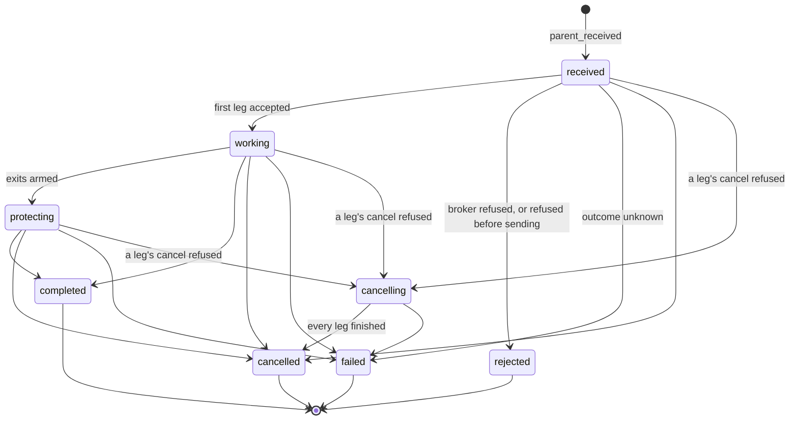

# Synthetic orders

A synthetic order is an order that no Indian exchange offers, built by the order engine out of ordinary broker orders. You ask for one by adding a `synthetic` object to the body of [`POST /api/orders/place`](orders.md#place-an-order), and the engine places, watches, moves and cancels the real orders it is made of.

This page is the glossary of all 54 types the engine runs. It lists every field each type reads from the `synthetic` object, with the defaults and limits taken from the code.

!!! danger "Synthetic orders place real orders, sometimes long after you asked"
    A synthetic order can place, modify or cancel orders at a broker minutes, hours or even days after your request, with nobody watching. Triggers, trailing stops, grids and schedules all act on their own. Send `"dry_run": true` first, which builds the first broker request without recording or sending anything.

!!! note "The order engine runs them"
    Synthetic orders are run by the [order engine](order-engine.md), which places every order the REST API accepts, so it has to be running.

## Changing a synthetic order

A leg of a synthetic order can be changed through [`PUT /api/orders/modify`](orders.md#an-order-the-engine-placed) like any other order, and the order type carries on from the change. The table below says what each kind of type does with it.

| Type | After you change a leg |
|---|---|
| `trailing_stop`, `trailing_entry`, `atr_trail` | The trail continues from the trigger you set, whichever way you moved it |
| `peg` | The peg follows the market at the new distance from its reference |
| `chaser` | The chase continues from your price after a full step interval |
| `oco`, `bracket`, `cover` | Reducing one exit reduces the other to match; an exit cannot be raised |
| `scale_out` | The other exits stay as they were; an exit cannot be raised |
| `iceberg`, `participation`, `liquidity_seeking` | A changed slice counts against the total, so later slices place the rest |
| `twap`, `vwap`, `implementation_shortfall` | The difference is carried into the next slice |
| Every other type | The leg simply keeps your new values |

Only the price, trigger price and quantity of a synthetic order's leg can be changed.

## How to ask for one

The request body is an ordinary order body, and the `synthetic` object sits beside the other fields. The engine reads the type from `synthetic.type`, and the rest of the object holds that type's own settings. The example below asks for a bracket: a limit buy of 10 that, once it fills, is protected by a stop and a target.

```json
{
  "instrument_id": "11111111-1111-5111-8111-000000000001",
  "transaction_type": "BUY",
  "product": "MIS",
  "order_type": "LIMIT",
  "quantity": 10,
  "price": 1000.00,
  "synthetic": {
    "type": "bracket",
    "stop_price": 990,
    "stop_limit_price": 988,
    "target_price": 1010
  }
}
```

The order fields outside `synthetic` still matter. Most types use them as the template for every order they send, so the instrument, side, product, order type, quantity and price you give are validated exactly as they are for a plain order, and each type then changes only what it has to.

Two fields can appear in any `synthetic` object. The table below lists them.

| Field | Type | Required | Meaning |
|---|---|:---:|---|
| `type` | string | Yes | One of the 54 names in the table below. A body with no `synthetic` object, or no `type`, runs as `simple`. An unknown name is refused with `400` and the message `the order engine does not run '<name>' orders; it runs <list>`. |
| `closes_position` | boolean | No | `true` says every leg of this order closes a position, so it may use the part of a broker's daily order cap kept for exits. Only the literal `true` counts. |

The engine also writes its own working values into the parent's copy of the `synthetic` object, such as `tick_size`, `triggered_at`, `watermark`, `placed_quantity`, `started_at` and `expires_at`. These are internal, so do not send them.

## What the first answer looks like

Types that act at once answer with the broker's answer plus a `parent_id`; types that send several orders at once, such as `freeze_slicer` and `ladder`, combine them into one answer with a list of `order_ids`. The combined answer follows one rule for `freeze_slicer`, `ladder`, `grid`, `two_sided_quote`, `basket`, `oco`, `bracket` and `two_sided_breakout`, and each order's own outcome is listed in it:

| The orders' outcomes | `outcome` | HTTP status |
|---|---|---|
| All accepted | `accepted` | <span class="status s2">200</span> |
| Some accepted, some not | `partial` | <span class="status s2">207</span> |
| None accepted | `unknown` if any is unknown, otherwise `rejected` | The highest of their statuses |

When a combined answer is refused and does not already carry an `error` or `status_message`, the engine adds `status_message` holding each distinct reason its brokers gave, joined by `; `. Not every type lists a reason beside each of its orders, so this top-level field is where to read why the order was refused.

Types that wait for a price or a time send nothing at first, and answer <span class="status s2">202</span> with an `outcome` of `armed` or `scheduled`. The answer below was recorded by the offline suite `test_runs/order_engine.py` against stubbed brokers, for a `market_if_touched` buy waiting for 995.

```json
{
  "broker": null,
  "instrument_id": "11111111-1111-5111-8111-000000000001",
  "order_id": null,
  "outcome": "armed",
  "parent_id": "<uuid4>",
  "skipped": [],
  "status_message": "the order is recorded and will be placed when the price touches the level",
  "tag": null,
  "trigger_direction": "at_or_below",
  "trigger_level": "995"
}
```

Keep the `parent_id`. It is the only handle on an order that has not reached a broker yet.

## All 54 types

The master table below lists every type registered in `SYNTHETIC_ORDER_CLASSES`, in the order the registry holds them. The "First answer" column says whether a broker order goes out when you ask (`200`, the broker's own answer) or whether the engine waits (`202`).

| Type | Family | What it does | Key fields in `synthetic` | First answer |
|---|---|---|---|:---:|
| `simple` | Plain and laddered | Sends one order to one broker and does nothing afterwards. | none | 200 |
| `freeze_slicer` | Plain and laddered | Splits an order above the exchange's freeze quantity into even orders that each fit. | none | 200 |
| `ladder` | Plain and laddered | Places several limit orders evenly spaced between two prices. | `from_price`, `to_price`, `steps` | 200 |
| `oto` | Linked orders | Places a second order, sized to what actually filled, once the first one fills. | `then` | 200 |
| `oco` | Linked orders | Rests a stop and a target on a position you hold, each shrinking as the other fills. | `stop_price`, `stop_limit_price`, `target_price` | 200 |
| `bracket` | Linked orders | Places an entry, then arms a stop and a target on the first partial fill. | `stop_price`, `stop_limit_price`, `target_price` | 200 |
| `scale_out` | Linked orders | A bracket with several targets that take the position off in tranches. | `target_prices`, `stop_price`, `stop_limit_price`, `breakeven_after` | 200 |
| `two_sided_breakout` | Linked orders | Rests a buy stop above a range and a sell stop below it, and cancels the side that did not fire. | `buy_trigger`, `buy_limit`, `sell_trigger`, `sell_limit` | 200 |
| `scheduled` | Time-based | Holds the order until a time of day, then places it. | `at_time` | 202 |
| `good_till_time` | Time-based | Places the order now and, at a time of day, cancels whatever has not filled or makes it marketable. | `until_time`, `at_expiry` | 200 |
| `time_stop` | Time-based | Places an entry and closes what filled at a time of day or after some minutes. | `until_time` or `minutes` | 200 |
| `twap` | Execution algorithms | Sends equal slices at even intervals over a period. | `slices`, `over_minutes` | 200 |
| `peg` | Book-following limits | Keeps a limit order re-priced to the bid, the offer or the midpoint. | `reference`, `offset_ticks`, `cap_price` | 200 |
| `chaser` | Book-following limits | Starts on its own side of the book and steps towards the other until it fills. | `step_ticks`, `step_seconds`, `cap_price`, `cross_after_seconds` | 200 |
| `market_if_touched` | Price triggers | Waits unseen for the price to touch a level, then sends a marketable limit. | `trigger_price`, `trigger_direction`, `buffer_ticks` | 202 |
| `limit_if_touched` | Price triggers | Waits for the price to touch a level, then rests a limit at another price. | `trigger_price`, `limit_price`, `trigger_direction` | 202 |
| `hidden_stop` | Stops and trailing | A stop kept in the engine that watches the bid or offer, with an optional real backstop. | `trigger_price`, `backstop_price`, `backstop_limit_price`, `buffer_ticks` | 202 |
| `cross_instrument` | Price triggers | A limit-if-touched order whose trigger watches a different instrument. | `watch_instrument_id`, `trigger_price`, `limit_price` | 202 |
| `indicator_triggered` | Price triggers | Sends a limit when a chosen field of the live quote crosses a level. | `watch_field`, `trigger_price`, `limit_price` | 202 |
| `trailing_stop` | Stops and trailing | A real stop at the broker whose trigger follows the market up, never down. | `trail_points` or `trail_percent`, `stop_limit_offset`, `step_ticks`, `activate_at` | 200, or 202 with `activate_at` |
| `trailing_entry` | Stops and trailing | A stop entry that follows a falling market down so the first bounce fills it. | `trail_points` or `trail_percent`, `stop_limit_offset`, `step_ticks` | 200 |
| `post_only` | Book-following limits | Checks that a limit would rest rather than trade before sending it. | `on_crossing` | 200 |
| `discretionary` | Book-following limits | Shows one limit price and quietly takes a slightly worse one when it comes within reach. | `discretion_points`, `discretion_quantity` | 200 |
| `vwap` | Execution algorithms | A TWAP whose slice sizes follow the shape of the day's volume. | `slices`, `over_minutes`, `volume_profile` | 200 |
| `implementation_shortfall` | Execution algorithms | A TWAP whose slices shrink, so most of the order trades early. | `slices`, `over_minutes`, `urgency` | 200 |
| `participation` | Execution algorithms | Trades a fixed share of the volume the market itself trades. | `participation_percent`, `most_slices` | 202 |
| `liquidity_seeking` | Execution algorithms | Shows nothing and strikes only when enough size appears at an acceptable price. | `limit_price`, `minimum_quantity` | 202 |
| `iceberg` | Execution algorithms | Rests one slice at a time and places the next when that slice fills. | `slice_quantity`, `randomise_percent` | 200 |
| `grid` | Plain and laddered | Rests buys below and sells above the market, each fill placing its opposite. | `levels`, `step_points`, `most_inventory` | 200 |
| `basket` | Multi-instrument | Places orders on several instruments in one request and reports each one. | `candidates` | 200 |
| `oca` | Linked orders | Places several candidate entries and cancels the rest on the first fill. | `candidates` | 200 |
| `cover` | Linked orders | An entry with a compulsory stop and no target. | `stop_price`, `stop_limit_price` | 200 |
| `legged_spread` | Multi-instrument | Works one leg passively, then takes the other at the price that makes the net. | `candidates`, `net_price` | 200 |
| `strategy_stop` | Multi-instrument | Places a basket and closes every leg when the total profit or loss crosses a line. | `candidates`, `loss_limit`, `profit_target` | 200 |
| `exposure_hedge` | Multi-instrument | Trades a hedge when the account's net exposure leaves a band. | `watched`, `lower_band`, `upper_band`, `hedge_instrument_id` | 202 |
| `candle_close_stop` | Stops and trailing | A hidden stop that fires only when a whole bar closes past the level. | `trigger_price`, `bar_minutes`, `backstop_price`, `backstop_limit_price` | 202 |
| `atr_trail` | Stops and trailing | A trailing stop whose distance is a multiple of the recent average true range. | `trail_points`, `stop_limit_offset`, `bar_minutes`, `periods`, `atr_multiple` | 200 |
| `square_off` | Time-based | At a time of day, cancels resting orders and closes the day's positions with limits. | `at_time`, `product`, `instrument_ids` | 202 |
| `accumulation` | Execution algorithms | Buys a fixed quantity at a fixed interval, each purchase resting on its own side. | `every_minutes`, `purchases` | 200 |
| `gtt` | Price triggers | A limit-if-touched order that keeps waiting across days until it expires. | `trigger_price`, `limit_price`, `valid_days` | 202 |
| `daily_stop` | Stops and trailing | Places a fresh native stop every morning for a position held overnight. | `stop_price`, `stop_limit_price`, `arm_at`, `valid_days` | 202 |
| `virtual_limit` | Book-following limits | Holds a limit order in the engine and sends it only when the other side reaches its price. | `paper` | 202 |
| `opening_auction` | Time-based | Places the order during the pre-open, so it fills at the opening auction's price. | `at_time` | 202 |
| `closing_price` | Execution algorithms | Slices the order by volume through the half hour the closing price is computed from. | `slices`, `window_start` | 202, or 200 inside the window |
| `underlying_peg` | Book-following limits | Moves a resting limit by delta times another instrument's move, such as an option bid following the index. | `watch_instrument_id`, `delta`, `lowest_price`, `highest_price`, `step_ticks` | 200 |
| `volatility` | Book-following limits | Prices an option from an implied volatility with Black-76, and re-prices it as the underlying and time move. | `watch_instrument_id`, `volatility`, `interest_rate` | 200 |
| `stepped_stop` | Stops and trailing | A native stop moved to set levels at set profits, and switched to trailing at the last. | `entry_price`, `stop_price`, `stop_limit_offset`, `rules` | 200 |
| `close_on_trigger` | Price triggers | At a level, cancels every order on the instrument to free margin, then closes the whole position. | `trigger_price`, `trigger_direction`, `trigger_on` | 202 |
| `stop_and_reverse` | Price triggers | At a level, closes the position and opens the same size the other way. | `trigger_price`, `method` | 202 |
| `attached_hedge` | Linked orders | Hedges each fill in another instrument, by a ratio or by an option's delta, in whole lots. | `hedge_instrument_id`, `ratio` or `delta_volatility` | 200 |
| `scale_with_profit_taker` | Plain and laddered | A ladder whose every filled rung gets its own profit-taker, and is placed again once that profit is taken. | `from_price`, `to_price`, `steps`, `profit_points`, `most_cycles` | 200 |
| `two_sided_quote` | Plain and laddered | A bid and an offer kept around the fair price, leaning away from the inventory they build. | `half_spread_points`, `skew_ticks`, `most_inventory` | 200 |
| `account_conditional` | Price triggers | Sends an order when free margin, the day's profit or the open position count reaches a level, or cancels it then. | `account_field`, `account_level`, `trigger_direction`, `action` | 202, or 200 with `action: cancel` |
| `plan` | Plans | An order described as a plan of parts: orders that may wait for a trigger, protect a position, trail the market, be priced by one pricing rule and be sent in pieces, joined with then and either. | `plan` | 200, or 202 when nothing is placed at once |

The chart below counts how many of the 54 types fall into each family. The families are this page's own grouping, chosen to make the list easier to scan; the code does not group them.

```vegalite
{
  "$schema": "https://vega.github.io/schema/vega-lite/v5.json",
  "description": "Number of synthetic order types in each family",
  "width": "container",
  "height": 260,
  "data": {
    "values": [
      {"family": "Linked orders", "types": 8},
      {"family": "Execution algorithms", "types": 8},
      {"family": "Stops and trailing", "types": 7},
      {"family": "Book-following limits", "types": 7},
      {"family": "Price triggers", "types": 8},
      {"family": "Plain and laddered", "types": 6},
      {"family": "Time-based", "types": 5},
      {"family": "Multi-instrument", "types": 4},
      {"family": "Plans", "types": 1}
    ]
  },
  "mark": {"type": "bar", "cornerRadiusEnd": 3},
  "encoding": {
    "y": {"field": "family", "type": "nominal", "sort": "-x", "title": null},
    "x": {"field": "types", "type": "quantitative", "title": "Number of types", "axis": {"tickMinStep": 1}},
    "tooltip": [
      {"field": "family", "type": "nominal", "title": "Family"},
      {"field": "types", "type": "quantitative", "title": "Types"}
    ]
  }
}
```

## The life of a parent order

Every synthetic order is one *parent* made of one or more *legs*, where each leg is one real order at a broker. The parent moves through a small set of states defined in `unified_broker_interface/utilities/order_engine/utilities/parent_order.py`, and the diagram below shows the changes that file allows.


```mermaid
stateDiagram-v2
    [*] --> received: parent_received
    received --> working: first leg accepted
    received --> rejected: broker refused, or refused before sending
    received --> failed: outcome unknown
    received --> cancelled
    working --> protecting: exits armed
    working --> completed
    working --> cancelled
    working --> failed
    protecting --> completed
    protecting --> cancelled
    protecting --> failed
    received --> cancelling: a leg's cancel refused
    working --> cancelling: a leg's cancel refused
    protecting --> cancelling: a leg's cancel refused
    cancelling --> cancelled: every leg finished
    cancelling --> failed
    completed --> [*]
    cancelled --> [*]
    rejected --> [*]
    failed --> [*]
```

The states mean the following.

| State | Meaning |
|---|---|
| `received` | The parent is recorded. An armed or scheduled order stays here until its trigger fires or its time comes. |
| `working` | At least one leg is live at a broker. |
| `protecting` | A position exists and exit legs are guarding it, as in a bracket after its entry has filled. A hidden stop with a backstop is also here from the moment it is armed. |
| `cancelling` | You cancelled the parent, but a broker refused the cancel of one of its legs, or its outcome is unknown, so that leg may still be live. The order type no longer acts on the parent. It becomes `cancelled` once every leg has finished, and cancelling it again retries the legs still resting. |
| `completed` | The parent has nothing left to do. |
| `cancelled` | The parent was called off, for example a `good_till_time` order whose time ran out. |
| `rejected` | No request reached a broker, or the broker refused it. |
| `failed` | The engine does not know what the broker has, so a person must look. The engine never retries out of this state and never arms protective legs for a parent in it. |

A `simple`, `freeze_slicer`, `ladder`, `basket`, `oca` or `post_only` parent places everything at once and does nothing afterwards, so it finishes on its own once every order has: `completed` when any of them traded, `cancelled` when none did. That includes an order cancelled through `DELETE /api/orders/cancel`. Every other type decides for itself when it is done.

`completed`, `cancelled`, `rejected` and `failed` are final. A leg has its own state as well: it starts as `sending` when the request is recorded and becomes `acknowledged`, `rejected` or `unknown` from the broker's answer.

??? note "Under the hood"
    Every change is written to the database table `synthetic_order_events` and committed before it is applied, and a leg is recorded as `leg_requested` before its request leaves. A crash between the two therefore leaves a row saying an order may exist. The parent is also copied to Redis under `unified:orders:parents`, which is a cache that expires at 06:00 IST. After a restart, the engine rebuilds every open parent by replaying its events through [`ParentOrder`][unified_broker_interface.utilities.order_engine.utilities.parent_order.ParentOrder]. The shared behavior of every type lives in [`SyntheticOrder`][unified_broker_interface.utilities.order_engine.base.SyntheticOrder].

## Rules every type shares

A few rules come from the shared base class rather than from any one type, and they explain behavior you will see across the whole list.

- **Every leg of one parent goes to the same broker.** The first leg lets the broker selector choose, and every later leg is sent to that broker. A stop at one broker cannot protect a position held at another. The three types that close positions they did not open, `square_off`, `close_on_trigger` and `stop_and_reverse`, are the exception: they read each broker's own positions, as [`POST /api/orders/flatten`](flatten.md) does, and send each closing order to the broker that holds that position.
- **A linked leg is reduced, not cancelled and replaced.** When one of two exits fills, the other is modified down by what filled, so the position is never unprotected and the order keeps its place in the queue.
- **A move that changes nothing is never sent.** A re-price to the price an order already has is dropped silently.
- **Re-prices are throttled and count against the daily cap.** A re-price of an entry stops where new entries stop, and a re-price of an exit may use the exit reserve. Cancels and quantity reductions are never held back.
- **Every price the engine computes is rounded to the tick.** Types that work prices out from the quote need a tick size that the brokers agree on, and are refused with `503` when there is none.
- **Stops are always stop-limit orders.** Wherever a type places a stop, you must give both the trigger and the limit, and neither is defaulted.

## Reduce-only orders

Any type can be marked reduce-only (the Atlas's G11) by adding `"reduce_only": true` to its `synthetic` object. A plain order uses the `simple` type for this.

```json
{"type": "simple", "reduce_only": true}
```

Every leg of a reduce-only order is checked against the net position just before it is sent. The engine reads the position held in the leg's instrument and product, and lets the leg go only when it is on the side that closes that position and is no bigger than it. Anything else is refused with <span class="status s4">409</span> and sent to no broker:

| Position held | Leg | Result |
|---|---|---|
| Long 75 | Sell 50 | Sent |
| Long 75 | Sell 100 | Refused, because it would leave a short of 25 |
| Long 75 | Buy 10 | Refused, because it would add to the long |
| Short 40 | Buy 40 | Sent |
| Nothing | Either side | Refused |

The check reads the position at the moment of sending, so a trigger that fires hours later is checked against the position as it is then. It does not count other orders still resting, so two reduce-only orders that are each smaller than the position can together be larger than it. A value other than `true` or `false` is refused with `400`.

## Glossary by family

The tabs below describe each type in detail, grouped by family. Every field table lists only what the type reads from the `synthetic` object, and every example shows only the `synthetic` object; the rest of the body is an ordinary order.

=== "Plain and laddered"

    These six types act at once and place everything they need when you ask.

    #### `simple`

    A simple order is one order sent to one broker. It is what every request becomes when it names no type. Once the broker answers, the parent is `working` if the order was accepted, `rejected` if it was refused, or `failed` if the outcome is unknown, and nothing more happens.

    It reads no fields besides `type`.

    ```json
    {"type": "simple"}
    ```

    #### `freeze_slicer`

    An exchange rejects any single derivative order above its freeze quantity. This type reads the freeze quantity that the chosen broker publishes, compares it with the quantity in that broker's own terms, and splits the order evenly into as many orders as it needs. Every slice goes to the same broker. When the broker publishes no freeze quantity, the order is sent whole. An order that would need more than 20 slices is refused with `400`.

    It reads no fields besides `type`.

    ```json
    {"type": "freeze_slicer"}
    ```

    #### `ladder`

    A ladder places `steps` limit orders evenly spaced from `from_price` to `to_price`. The order's `quantity` is the whole ladder and is shared out as evenly as whole units allow, so 100 over three rungs is 34, 33 and 33. Each rung's price is rounded to the tick towards the passive side.

    | Field | Type | Required | Rules |
    |---|---|:---:|---|
    | `from_price` | number | Yes | Above zero. |
    | `to_price` | number | Yes | Above zero, and different from `from_price`. |
    | `steps` | integer | Yes | From 2 to 20. The order's `quantity` must be at least `steps`. |

    ```json
    {"type": "ladder", "from_price": 995, "to_price": 1000, "steps": 5}
    ```

    #### `grid`

    A grid rests `levels` buy limits below the last traded price and `levels` sell limits above it, `step_points` apart. When a buy fills, a sell is placed one step above it, and when a sell fills, a buy is placed one step below. The order's `quantity` is the size of each individual order. Once the net position the grid built reaches `most_inventory`, every resting order on the side that would make the position bigger is cancelled.

    | Field | Type | Required | Rules |
    |---|---|:---:|---|
    | `levels` | integer | Yes | From 1 to 20 on each side. |
    | `step_points` | number | Yes | Above zero. |
    | `most_inventory` | integer | Yes | At least 1. It is required because a trending market keeps filling one side. |

    ```json
    {"type": "grid", "levels": 3, "step_points": 5, "most_inventory": 30}
    ```

    #### `two_sided_quote`

    A two-sided quote (the Atlas's G16, a market-making pair) keeps one buy and one sell limit around a fair price, which is the mid between the best bid and offer unless `fair_price` says `last`. Every second, both are moved to where they belong:

    - The bid sits `half_spread_points` below the fair price and the ask the same distance above.
    - **Inventory leans both quotes.** For each order's worth held, both prices move `skew_ticks` against the position. A long lowers both, so its ask is more likely to be taken and its bid less.
    - A quote is only modified once it would move by at least `step_ticks`.
    - When one side fills, the other is not cancelled; it is re-priced by the new lean, and the filled side is quoted again.
    - Once the net position reaches `most_inventory`, the side that would add to it is cancelled and not quoted again until the position comes back.

    In the offline suite, a quote of 10 with a half spread of 1 around a mid of 1000.025 was placed at 999.00 and 1001.05. When the market moved to 1010.025, both were modified, to 1009.00 and 1011.05. With `skew_ticks` 2 and `most_inventory` 10, a filled bid stopped the buying and moved the ask two ticks lower, to 1000.95.

    !!! warning "This type sends the most modifies of any"
        Every move of the fair price by a step is two modify messages, and each counts towards the broker's daily order messages and the order-to-trade ratio. Keep `step_ticks` as wide as the strategy allows.

    The order's `quantity` is the size of each quote. The parent does not finish on its own; cancel it with [`DELETE /api/orders/parents`](orders.md#cancel-a-parent).

    | Field | Type | Required | Rules |
    |---|---|:---:|---|
    | `half_spread_points` | number | Yes | Above zero. |
    | `most_inventory` | integer | Yes | At least 1, as for `grid`. |
    | `skew_ticks` | integer | No | At or above zero. Defaults to 0. |
    | `step_ticks` | integer | No | At least 1. Defaults to 1. |
    | `fair_price` | string | No | `mid` or `last`. Defaults to `mid`. |

    ```json
    {"type": "two_sided_quote", "half_spread_points": 1, "skew_ticks": 2, "step_ticks": 2, "most_inventory": 50}
    ```

    #### `scale_with_profit_taker`

    A scale order with profit-takers (the Atlas's G15, Interactive Brokers' ScaleTrader) is a `ladder` that books its profit one rung at a time. The rungs are placed as a ladder places them. Each rung then goes round a cycle:

    1. When the rung has completely filled, a limit for the same quantity goes out `profit_points` better, rounded to the tick: a sell above a filled buy, a buy below a filled sell.
    2. When that profit-taker fills, the rung is placed again at its own price.
    3. The cycle repeats, up to `most_cycles` times per rung, or until you cancel the parent.

    A rung is placed again only after its profit-taker has closed it, so the position never grows past the ladder's own `quantity`. That is the cap the Atlas asks for. A rung that only partly fills waits for the rest before its profit-taker goes out. The parent does not finish on its own; cancel it with [`DELETE /api/orders/parents`](orders.md#cancel-a-parent) when you are done.

    | Field | Type | Required | Rules |
    |---|---|:---:|---|
    | `from_price`, `to_price`, `steps` | | Yes | As for `ladder`. |
    | `profit_points` | number | Yes | Above zero. |
    | `most_cycles` | integer | No | At least 1. Without it, a rung cycles until the parent is cancelled. |

    ```json
    {"type": "scale_with_profit_taker", "from_price": 1000, "to_price": 990, "steps": 3, "profit_points": 4, "most_cycles": 5}
    ```

=== "Linked orders"

    These eight types place orders that watch each other. A fill on one leg changes, places or cancels another.

    #### `oto`

    "One triggers other" places your order and, when it fills, places a second order described by `then`. The child is sized to what the first order actually filled and grows with each further fill. The `then` object is merged over your order body, and its quantity is always replaced, so leave it out.

    | Field | Type | Required | Rules |
    |---|---|:---:|---|
    | `then` | object | Yes | An order body without a quantity, such as `{"transaction_type": "SELL", "order_type": "LIMIT", "price": 1010}`. It is validated before the first order is sent. |

    ```json
    {"type": "oto", "then": {"transaction_type": "SELL", "order_type": "LIMIT", "price": 1010}}
    ```

    #### `attached_hedge`

    An attached hedge (the Atlas's G14) is an entry whose fills are hedged in another instrument as they happen. The hedge is `−ratio × filled`, in units of the hedge instrument, rounded to its nearest whole lot. A positive ratio hedges on the opposite side, so a bought stock is hedged by a sold future; a negative one, such as a bought put's delta, hedges on the same side.

    There are two ways to size it, and you give exactly one:

    | Field | Sizes the hedge by | Example |
    |---|---|---|
    | `ratio` | A fixed number of hedge units per filled unit: a beta, a pair ratio, or 1 for a stock hedged with its own future | A stock with a beta of 1.2 hedged with an index future |
    | `delta_volatility` | The option's Black-76 delta at this volatility, worked out at each fill with the hedge instrument as the forward. The entry must be an option. | A Nifty option hedged with Nifty futures |

    The hedge grows with the entry. After each fill, the target is worked out again from everything filled so far, and a new hedge order is sent for the whole lots still missing, so no resting order is resized. Each hedge goes to the entry's broker, as a limit two ticks past the hedge instrument's other side, rounded to that instrument's own tick.

    In the offline suite, a buy of 1000 RELIANCE with `ratio` 1 against a future with a lot of 500 sent no hedge until 600 had filled, sold 500 futures then, and sold 500 more when the rest filled. A bought Nifty call of 1500 units, at a delta of about 0.5, was hedged with 1000 futures, which is 754 units rounded to 2 lots.

    | Field | Type | Required | Rules |
    |---|---|:---:|---|
    | `hedge_instrument_id` | string | Yes | The instrument to hedge in. Not the entry's own. |
    | `ratio` | number | One of the two | Not zero. |
    | `delta_volatility` | number | One of the two | A percentage above zero. |

    ```json
    {"type": "attached_hedge", "hedge_instrument_id": "<RELIANCE future id>", "ratio": 1}
    ```

    #### `oco`

    "One cancels other" protects a position you already hold with a stop and a target resting together. Set `transaction_type` to the side that **opened** the position, so a long is protected by asking for a `BUY` and both exits are sells. When one exit fills, the other is reduced by what filled, and when the position is closed, what is left of the other is cancelled. The stop is an `SL` order and the target is a `LIMIT` order.

    | Field | Type | Required | Rules |
    |---|---|:---:|---|
    | `stop_price` | number | One of the two | The stop's trigger. Above zero. |
    | `stop_limit_price` | number | With `stop_price` | The stop's limit. Above zero. It is required whenever `stop_price` is given. |
    | `target_price` | number | One of the two | The target's limit. Above zero. |

    ```json
    {"type": "oco", "stop_price": 990, "stop_limit_price": 988, "target_price": 1010}
    ```

    #### `bracket`

    A bracket places your order as an entry and, on its first partial fill, arms a stop and a target for what filled. Further fills grow the exits. When an exit fills while the entry is still working, the rest of the entry is cancelled first. The exit prices are checked before the entry is sent, so a bracket with unusable exits is refused before anything reaches a broker.

    It takes the same fields as `oco`: `stop_price`, `stop_limit_price` and `target_price`, with at least one of `stop_price` and `target_price`.

    ```json
    {"type": "bracket", "stop_price": 990, "stop_limit_price": 988, "target_price": 1010}
    ```

    #### `cover`

    A cover order is a bracket with a compulsory stop and no target. It inherits the bracket's arming on the first partial fill.

    | Field | Type | Required | Rules |
    |---|---|:---:|---|
    | `stop_price` | number | Yes | The stop's trigger. |
    | `stop_limit_price` | number | Yes | The stop's limit. |
    | `target_price` | — | Must be absent | A target is refused with `400`; ask for a `bracket` instead. |

    ```json
    {"type": "cover", "stop_price": 990, "stop_limit_price": 988}
    ```

    #### `scale_out`

    A scale-out is a bracket with several targets, each taking part of the position off. A target filling reduces only the stop, not the other targets. After `breakeven_after` targets have filled, the stop is moved to the entry's average price.

    | Field | Type | Required | Rules |
    |---|---|:---:|---|
    | `target_prices` | list of numbers | Yes | At least two prices. |
    | `stop_price` | number | Yes | The stop's trigger. |
    | `stop_limit_price` | number | Yes | The stop's limit. |
    | `breakeven_after` | integer | No | How many targets must fill before the stop moves to breakeven. Defaults to 1. |

    ```json
    {"type": "scale_out", "target_prices": [1010, 1020, 1030], "stop_price": 990, "stop_limit_price": 988, "breakeven_after": 1}
    ```

    #### `two_sided_breakout`

    A two-sided breakout rests a buy stop above a range and a sell stop below it, both as stop-limit orders for the order's `quantity`. The first fill cancels the other side. Once an entry has filled, a stop and a target are armed on the side that filled, from the same `stop_price`, `stop_limit_price` and `target_price` fields a bracket uses.

    | Field | Type | Required | Rules |
    |---|---|:---:|---|
    | `buy_trigger` | number | Yes | Above zero, and above `sell_trigger`. |
    | `buy_limit` | number | Yes | Above zero. |
    | `sell_trigger` | number | Yes | Above zero, and below `buy_trigger`. |
    | `sell_limit` | number | Yes | Above zero. |
    | `stop_price`, `stop_limit_price`, `target_price` | number | When an entry fills | The exits armed after the break, read as for `oco`. |

    ```json
    {"type": "two_sided_breakout", "buy_trigger": 1010, "buy_limit": 1012, "sell_trigger": 990, "sell_limit": 988, "stop_price": 1000, "stop_limit_price": 998, "target_price": 1030}
    ```

    #### `oca`

    "One cancels all" places several candidate entries, each on its own instrument, and cancels every other candidate the moment any of them reports a fill, including a partial one. It places its candidates the way a `basket` does, so the `candidates` field follows the rules described in the Multi-instrument tab.

    | Field | Type | Required | Rules |
    |---|---|:---:|---|
    | `candidates` | list of objects | Yes | From 1 to 25 candidates, each naming a different `instrument_id`. |

    ```json
    {"type": "oca", "candidates": [
      {"instrument_id": "11111111-1111-5111-8111-000000000001", "price": 1010},
      {"instrument_id": "11111111-1111-5111-8111-000000000002", "price": 2020}
    ]}
    ```

=== "Price triggers"

    These eight types send nothing when you ask, apart from an `account_conditional` order with `action: cancel`. They answer `202 armed` and send one order on the first price tick where the level is reached, or, with `trigger_on`, where it is confirmed. They fire once. They run only while the engine is running, unlike a native stop at the exchange.

    Every price trigger reads the two fields below, and each type adds its own.

    | Field | Type | Required | Rules |
    |---|---|:---:|---|
    | `trigger_price` | number | Yes | The level. Above zero. |
    | `trigger_direction` | string | No | `at_or_above` or `at_or_below`. By default a buy waits for the price to fall to the level (`at_or_below`) and a sell waits for it to rise (`at_or_above`). |
    | `trigger_on` | string | No | Which price is compared with the level, and how it must confirm. One of `last`, `bid`, `ask`, `mid`, `double_last` or `held`. Defaults to `last`. The table below explains each. |
    | `hold_seconds` | number | With `held` | How long the level must stay reached. Above zero. |

    `trigger_on` covers the Atlas's G10 triggers. It lets a trigger ignore a single stray trade, which is the usual reason a stop fires on a spike and then the price comes straight back.

    | `trigger_on` | Price compared with the level | Fires on |
    |---|---|---|
    | `last` | The last traded price | The first tick that reaches the level |
    | `bid` | The best bid | The first tick that reaches the level |
    | `ask` | The best offer | The first tick that reaches the level |
    | `mid` | Halfway between the best bid and offer | The first tick that reaches the level |
    | `double_last` | The last traded price | The second tick in a row that reaches the level; a tick that does not reach it starts the count again |
    | `held` | The last traded price | The first tick at least `hold_seconds` after the level was first reached, if every tick in between reached it too |

    `hidden_stop`, `candle_close_stop`, `virtual_limit`, `indicator_triggered` and `account_conditional` already choose the price they watch, so they refuse `trigger_on` with `400`.

    ```json
    {"type": "market_if_touched", "trigger_price": 995, "trigger_on": "held", "hold_seconds": 5}
    ```

    #### `market_if_touched`

    This type waits unseen for the last traded price to touch the level. It then sends a limit priced `buffer_ticks` past the opposite touch, so it takes what is there.

    | Field | Type | Required | Rules |
    |---|---|:---:|---|
    | `buffer_ticks` | integer | No | At or above zero. Defaults to 2. |

    ```json
    {"type": "market_if_touched", "trigger_price": 995, "buffer_ticks": 2}
    ```

    #### `limit_if_touched`

    This type waits for the last traded price to touch the level and then rests a limit at `limit_price`, which is deliberately not defaulted to the trigger.

    | Field | Type | Required | Rules |
    |---|---|:---:|---|
    | `limit_price` | number | Yes | Above zero. |

    ```json
    {"type": "limit_if_touched", "trigger_price": 25000, "limit_price": 142.5}
    ```

    #### `cross_instrument`

    This is a limit-if-touched order whose trigger watches the last traded price of a different instrument. You hold an option and exit it when the index crosses a level, for example. The engine does not check that the two instruments are related.

    | Field | Type | Required | Rules |
    |---|---|:---:|---|
    | `watch_instrument_id` | string | Yes | The instrument whose price is watched. |
    | `limit_price` | number | Yes | Above zero. |

    ```json
    {"type": "cross_instrument", "watch_instrument_id": "11111111-1111-5111-8111-000000000009", "trigger_price": 24800, "trigger_direction": "at_or_below", "limit_price": 80}
    ```

    #### `indicator_triggered`

    This type sends a limit when a named field of the live quote crosses the level. It is not an indicator library: it compares one value from the quote, nothing computed.

    | Field | Type | Required | Rules |
    |---|---|:---:|---|
    | `watch_field` | string | No | `last_price`, `average_price` (the day's volume-weighted average), `previous_close`, `best_bid`, `best_offer` or `mid`. Defaults to `last_price`. |
    | `limit_price` | number | Yes | Above zero. |

    ```json
    {"type": "indicator_triggered", "watch_field": "average_price", "trigger_price": 999.8, "limit_price": 999.5}
    ```

    #### `gtt`

    "Good till triggered" is a limit-if-touched order that survives the end of the day and keeps waiting. A parent that has not triggered after `valid_days` is closed. A gap through the level fires it at the open.

    | Field | Type | Required | Rules |
    |---|---|:---:|---|
    | `limit_price` | number | Yes | Above zero. |
    | `valid_days` | integer | No | From 1 to 365. Defaults to 30. |

    ```json
    {"type": "gtt", "trigger_price": 950, "limit_price": 951, "valid_days": 30}
    ```

    #### `close_on_trigger`

    A close-on-trigger order (the Atlas's G12) is a stop that makes sure its exit is not rejected for margin. When the level is reached it does two things in order:

    1. It cancels every order resting on the instrument, at every broker, including orders placed outside the engine. Pending orders hold margin, and on a short option position that margin can be what an exit is refused for.
    2. It closes the whole net position held on the instrument and the order's product, with a limit two ticks past the other side's best price. A position held at several brokers is closed with one order at each of them, for the part that broker holds.

    It closes what is held when it fires, not a quantity named in advance, so the body's `quantity` is not used. Set `transaction_type` to the side that opened the position: a long is protected by a `BUY`, which fires when the price falls to the level. If nothing is held when it fires, the parent completes without sending an order. It takes no fields besides the price trigger fields above, including `trigger_on`.

    ```json
    {"type": "close_on_trigger", "trigger_price": 995, "trigger_on": "held", "hold_seconds": 3}
    ```

    #### `stop_and_reverse`

    A stop-and-reverse order (the Atlas's G13) turns a long of 75 into a short of 75, or the other way, when the level is reached. Like `close_on_trigger`, it first cancels every order resting on the instrument to free margin, acts on the net position held at that moment, and completes without an order if nothing is held. `method` decides how the flip is sent:

    | `method` | What is sent | Trade-off |
    |---|---|---|
    | `sequential` (default) | A closing order for the position, and, once it has completely filled, a second order of the same size and side that opens the reverse | Nothing opens until the old position is gone, but there is a gap between the two |
    | `double` | One order for twice the position | Faster, but the exchange sees one order of double size, and the broker must accept margin for the new side before the old one closes |

    Both are limits two ticks past the other side's best price. A position held at several brokers is flipped at each of them, for the part that broker holds, and a sequential reverse at one broker waits only for that broker's close. A sequential close that only partly fills sends no reverse until it completes.

    | Field | Type | Required | Rules |
    |---|---|:---:|---|
    | `method` | string | No | `sequential` or `double`. Defaults to `sequential`. |

    ```json
    {"type": "stop_and_reverse", "trigger_price": 995, "method": "sequential"}
    ```

    #### `account_conditional`

    An account-conditional order (the Atlas's G17) waits on the account rather than on a price. It compares one of three figures with `account_level`, in `trigger_direction`:

    | `account_field` | The figure | Read from |
    |---|---|---|
    | `available_balance` | The free margin across every broker | `summary.available_balance` in [the funds document](portfolio.md#funds) |
    | `day_pnl` | Realized plus unrealized profit across every broker, as the daily loss lockout reads it | `pnl` in the funds document |
    | `open_positions` | How many net positions are open | The `net` rows of [the positions document](portfolio.md#positions) with a quantity |

    `action` says what happens when the condition holds:

    - `place`, the default, sends nothing until then, which covers "send this once margin frees up" and "only once the book is flat". It answers `202 armed`.
    - `cancel` sends the order at once and cancels it then, such as pulling a resting bid when the day's loss reaches a limit. It answers with the broker's answer, and the parent becomes `cancelled`.

    The figures are read about once a second. `trigger_direction` is required, because the side of the order says nothing about which way the account has to move, `trigger_price` is not used, and `trigger_on` is refused with `400` when `action` is `place`.

    | Field | Type | Required | Rules |
    |---|---|:---:|---|
    | `account_field` | string | Yes | `available_balance`, `day_pnl` or `open_positions`. |
    | `account_level` | number | Yes | The level. May be negative, for a loss. |
    | `trigger_direction` | string | Yes | `at_or_above` or `at_or_below`. |
    | `action` | string | No | `place` or `cancel`. Defaults to `place`. |

    ```json
    {"type": "account_conditional", "account_field": "day_pnl", "account_level": -5000, "trigger_direction": "at_or_below", "action": "cancel"}
    ```

=== "Stops and trailing"

    These seven types protect a position or enter on a move. For the ones that protect a position, set `transaction_type` to the side that **opened** it, so a long is protected by asking for a `BUY`.

    #### `hidden_stop`

    A hidden stop lives in the engine and answers `202 armed`. It watches the **bid** when protecting a long and the **offer** when protecting a short, rather than the last trade, and falls back to the last trade when that side of the book is empty. When it fires, it cancels the backstop first and sends an exit priced `buffer_ticks` past the touch. By default a long's stop fires when the price falls to the level. It takes `trigger_price` and `trigger_direction` as the price triggers do.

    With a backstop, the backstop is a real stop-limit order placed at once, and the armed answer says so: it carries a `backstop` object with the `broker`, `order_id`, `outcome`, `trigger_price` and `price` of that order, and its `status_message` names the broker. `candle_close_stop` answers the same way.

    | Field | Type | Required | Rules |
    |---|---|:---:|---|
    | `trigger_price` | number | Yes | The hidden level. |
    | `backstop_price` | number | No | A real stop-loss limit's trigger, placed at the broker when the parent is armed. Give both backstop fields or neither. |
    | `backstop_limit_price` | number | With `backstop_price` | The backstop's limit. |
    | `buffer_ticks` | integer | No | At or above zero. Defaults to 2. |

    ```json
    {"type": "hidden_stop", "trigger_price": 990, "backstop_price": 980, "backstop_limit_price": 978}
    ```

    #### `candle_close_stop`

    This is a hidden stop that fires only when a whole bar has closed past the level. The bars are built from the engine's own price ticks from the moment the order was placed, so the first bar has to finish before anything can fire. It takes every `hidden_stop` field plus the one below.

    | Field | Type | Required | Rules |
    |---|---|:---:|---|
    | `bar_minutes` | number | No | Above zero. Defaults to 5. |

    ```json
    {"type": "candle_close_stop", "trigger_price": 990, "bar_minutes": 15, "backstop_price": 975, "backstop_limit_price": 973}
    ```

    #### `trailing_stop`

    A trailing stop is a real stop-loss limit order at the broker. Its trigger follows the best last traded price seen since it was placed, at a fixed or proportional distance, and never moves back. Each move is a modify request. The parent is `protecting` once the stop rests.

    | Field | Type | Required | Rules |
    |---|---|:---:|---|
    | `trail_points` | number | One of the two | A fixed distance. Above zero. |
    | `trail_percent` | number | One of the two | A distance as a percentage of the best price seen. Above zero. Give one of the two, not both. |
    | `stop_limit_offset` | number | Yes | How far past the trigger the limit sits. Above zero. |
    | `step_ticks` | integer | No | How far the trigger must be able to move before it is moved. At least 1. Defaults to 1. |
    | `activate_at` | number | No | A price the market must reach before the stop is placed. Above zero. |

    ```json
    {"type": "trailing_stop", "trail_points": 10, "stop_limit_offset": 2}
    ```

    With `activate_at`, the order is a trailing take-profit (the Atlas's G9). Nothing is placed when you ask, and the answer is <span class="status s2">202</span> with an `outcome` of `armed`. On the first price tick where the last traded price reaches `activate_at` (at or above it for a sell stop, at or below it for a buy stop), the stop is placed a trail's distance from that price and trails from there. A profit that runs on is followed, and the first pullback of the trail distance exits.

    ```json
    {"type": "trailing_stop", "trail_points": 10, "stop_limit_offset": 2, "activate_at": 1030}
    ```

    #### `stepped_stop`

    A stepped stop (the Atlas's G8, an adjustable stop or stop strategy) is a native stop-limit that is moved by a table of profit milestones. It is placed at `stop_price`. Each rule has a `gain`, the profit in points from `entry_price` that sets it off, and says either where to put the stop or that the stop should start trailing. The table below shows the example rules and what each does to a long bought at 1000.

    | Rule | Reached at | What happens to the stop |
    |---|---|---|
    | `{"gain": 20, "stop_at_gain": 0}` | 1020 | Moves to 1000, breakeven |
    | `{"gain": 40, "stop_at_gain": 15}` | 1040 | Moves to 1015, locking in 15 points |
    | `{"gain": 60, "trail_points": 25}` | 1060 | Trails 25 points behind the best price, as a `trailing_stop` |

    A market that jumps past several milestones at once applies them all on one tick, as one modify. A stop is only ever moved in the position's favour. A trailing rule must be the last, and a `stop_at_gain` at or past its own `gain` is refused, because that stop would fire at once. Changing the stop's trigger yourself before the trail starts leaves it there until the next milestone moves it further.

    | Field | Type | Required | Rules |
    |---|---|:---:|---|
    | `entry_price` | number | Yes | The price the position was opened at, which gains are measured from. Above zero. |
    | `stop_price` | number | Yes | Where the stop starts. Above zero. |
    | `stop_limit_offset` | number | Yes | As for `trailing_stop`. |
    | `rules` | list | Yes | From 1 to 20 rules, each with a `gain` above zero and larger than the one before, and exactly one of `stop_at_gain` (a number, negative to keep some risk) or `trail_points` (above zero). |
    | `step_ticks` | integer | No | As for `trailing_stop`, once trailing. |

    `trail_points`, `trail_percent` and `activate_at` are refused outside a rule.

    ```json
    {"type": "stepped_stop", "entry_price": 1000, "stop_price": 990, "stop_limit_offset": 2, "rules": [{"gain": 20, "stop_at_gain": 0}, {"gain": 40, "stop_at_gain": 15}, {"gain": 60, "trail_points": 25}]}
    ```

    #### `trailing_entry`

    A trailing entry is the same mechanism with the stop on the side you want to end up on. Here `transaction_type` is that side. A buy stop sits above the market and is lowered as the market falls, so the first bounce of the trail distance fills it. It takes the same fields as `trailing_stop`. The parent is `working` once the stop rests.

    ```json
    {"type": "trailing_entry", "trail_percent": 1, "stop_limit_offset": 2}
    ```

    #### `atr_trail`

    This is a trailing stop whose distance is `atr_multiple` times the average true range of the last `periods` bars. The bars are built from the engine's own ticks, so until `periods` bars have closed it trails at `trail_points`.

    | Field | Type | Required | Rules |
    |---|---|:---:|---|
    | `trail_points` | number | Yes | The fixed distance used until enough bars exist. Above zero. |
    | `stop_limit_offset` | number | Yes | As for `trailing_stop`. |
    | `bar_minutes` | number | No | Above zero. Defaults to 5. |
    | `periods` | integer | No | At least 2. Defaults to 14. |
    | `atr_multiple` | number | No | Above zero. Defaults to 2.0. |
    | `step_ticks` | integer | No | As for `trailing_stop`. |

    ```json
    {"type": "atr_trail", "trail_points": 10, "stop_limit_offset": 2, "bar_minutes": 5, "periods": 14, "atr_multiple": 2}
    ```

    #### `daily_stop`

    A daily stop places a fresh native stop every trading morning at `arm_at` for a position held overnight, and answers `202 scheduled` with `first_arm_on`, the first date it will place one. It never arms on a weekend or an exchange holiday, and an order sent after that day's `arm_at` first arms on the next trading day. If the market has already gapped through the stop, no stop is placed; the position is exited with a limit priced past the touch instead. It stops re-arming after `valid_days`, counted in calendar days.

    | Field | Type | Required | Rules |
    |---|---|:---:|---|
    | `stop_price` | number | Yes | The stop's trigger. Above zero. |
    | `stop_limit_price` | number | Yes | The stop's limit. Above zero. |
    | `arm_at` | string | No | A time of day as `HH:MM` or `HH:MM:SS`, India time. Defaults to `09:20`. |
    | `valid_days` | integer | No | From 1 to 365. Defaults to 30. |

    ```json
    {"type": "daily_stop", "stop_price": 990, "stop_limit_price": 988, "arm_at": "09:20", "valid_days": 30}
    ```

=== "Book-following limits"

    These seven types price a limit order from the market instead of leaving it at one price.

    #### `peg`

    A peg keeps a limit order re-priced to a place in the book. The throttle and the rule against moves that change nothing keep it from churning.

    | Field | Type | Required | Rules |
    |---|---|:---:|---|
    | `reference` | string | No | `own_touch` (your own side's best price), `mid` (between the touch) or `opposite_touch` (the other side's best price). Defaults to `own_touch`. |
    | `offset_ticks` | integer | No | Ticks away from filling; negative moves towards the market. Defaults to 0. |
    | `cap_price` | number | No | The price it never goes past. Above zero. |

    ```json
    {"type": "peg", "reference": "own_touch", "offset_ticks": 0, "cap_price": 1005}
    ```

    #### `underlying_peg`

    An underlying peg (the Atlas's G6, pegged-to-stock or delta-pegged) is a limit order whose price follows another instrument, usually an option's underlying. It is placed at your `price`, and from then on its price is:

    `price = your price + delta × (underlying now − underlying when placed)`

    For a Nifty call bought with a delta of 0.5, a 40-point rise in the index moves the bid up by 20. The option's own book is never read, which matters on a far strike where one order can move the premium. The price is rounded to the option's tick, kept between `lowest_price` and `highest_price`, and modified only once it has moved at least `step_ticks`. If you change the order's price yourself, the peg starts again from your new price and the underlying's price at that moment.

    | Field | Type | Required | Rules |
    |---|---|:---:|---|
    | `watch_instrument_id` | string | Yes | The instrument to follow. Not the traded instrument itself; use `peg` for that. |
    | `delta` | number | Yes | How much the price moves per point of the underlying. Negative for a put. |
    | `lowest_price` | number | No | The lowest price the order is moved to. Above zero. |
    | `highest_price` | number | No | The highest price the order is moved to. Above zero, and not below `lowest_price`. |
    | `step_ticks` | integer | No | The smallest move worth a modify. At least 1. Defaults to 1. |

    The order must be a `LIMIT` with a `price`. It answers with the broker's answer plus `underlying_start`, the underlying's price the peg measures from.

    ```json
    {"type": "underlying_peg", "watch_instrument_id": "<Nifty index id>", "delta": 0.5, "step_ticks": 4}
    ```

    #### `volatility`

    A volatility order (the Atlas's G7) is an option order stated as an implied volatility rather than a premium: "buy this call at 12.5 volatility". The engine works out the premium with the Black-76 model, and re-prices the order as the underlying moves and expiry comes closer. It follows the underlying through the same step and throttle as `underlying_peg`, and takes the same `lowest_price`, `highest_price` and `step_ticks`.

    The model needs four things besides the volatility, and the table below says where each comes from.

    | Input | Source |
    |---|---|
    | Strike, expiry and call or put | The traded instrument's catalogue entry. The option expires at 15:30 India time on its expiry date. |
    | Forward price | The watched instrument's last price. When it is a future, it is used as the forward directly; otherwise, such as for the index itself, it is grown by `interest_rate` to expiry. |
    | Interest rate | `interest_rate`, 0 unless you give one. |
    | Time to expiry | From now to expiry, in years of 365 days. |

    The order must be a `LIMIT`, and its `price` is the worst it will accept: the most a buy pays, the least a sell takes. The model's premium is used whenever it is better than that price. That price stays what the order was placed with, even after you change the leg. If you change the leg's price yourself, the order takes the volatility your price implies and carries on at that volatility. The answer carries `priced_at`, the price the order was first sent at.

    | Field | Type | Required | Rules |
    |---|---|:---:|---|
    | `watch_instrument_id` | string | Yes | The underlying: the future of the same expiry for a true Black-76 forward, or the index. |
    | `volatility` | number | Yes | A percentage above zero and at most 500, such as `12.5`. |
    | `interest_rate` | number | No | A percentage. Defaults to 0. |

    ```json
    {"type": "volatility", "watch_instrument_id": "<Nifty future id>", "volatility": 12.5, "step_ticks": 4}
    ```

    For example, a Nifty 25000 call with 6.2 days to run, with the index at 25000 and a volatility of 12.5, was placed at 162.85 in the offline suite. When the index rose 100 points it was modified to 218.00.

    #### `chaser`

    A chaser starts on its own side of the book and steps towards the other side until it fills. It rests at `cap_price` if it reaches it. With `cross_after_seconds`, it moves to the other side's touch once that long has passed.

    | Field | Type | Required | Rules |
    |---|---|:---:|---|
    | `step_ticks` | integer | No | At least 1. Defaults to 1. |
    | `step_seconds` | number | No | Above zero. Defaults to 5.0. |
    | `cap_price` | number | No | The worst price it will take. Above zero. |
    | `cross_after_seconds` | number | No | Above zero. |

    ```json
    {"type": "chaser", "step_ticks": 1, "step_seconds": 5, "cap_price": 98.5, "cross_after_seconds": 60}
    ```

    #### `post_only`

    A post-only order checks the price against the book before sending. A buy is passive at or below the best bid, and a sell at or above the best offer. The book can still move while the order is in flight. The order is not watched afterwards.

    | Field | Type | Required | Rules |
    |---|---|:---:|---|
    | `on_crossing` | string | No | `refuse` answers `409` and sends nothing; `rest` moves the price back to your own touch and sends it. Defaults to `refuse`. |

    ```json
    {"type": "post_only", "on_crossing": "refuse"}
    ```

    #### `discretionary`

    A discretionary order rests a visible limit at your `price`. If the other side comes within `discretion_points` of that price, the engine reduces the resting order first and then takes the other side.

    | Field | Type | Required | Rules |
    |---|---|:---:|---|
    | `discretion_points` | number | Yes | Above zero. |
    | `discretion_quantity` | integer | No | How much to take when the chance comes. At least 1. Defaults to everything still resting. |

    ```json
    {"type": "discretionary", "discretion_points": 0.25}
    ```

    #### `virtual_limit`

    A virtual limit is held in the engine's own book and sent, as a limit at your price, only once the other side reaches it: for a buy, when the best offer is at or below the price. It spends one daily order message instead of two for a limit that never fills. The body must be a `LIMIT` order with a `price`. A quote marked stale is never acted on. The separate `virtual_book` process estimates what a resting order would have filled, and that estimate is recorded as `missed_quantity` when the order is sent.

    Every plain `LIMIT` order runs as a virtual limit unless it names another type, because [limit orders are held by default](orders.md#limit-orders-are-held-until-they-can-fill). While it is held, its price and quantity can be changed through [`PUT /api/orders/modify` with `parent_id`](orders.md#a-held-order), which sends nothing to a broker; once it has been sent, it is changed by its broker order id like any other order.

    | Field | Type | Required | Rules |
    |---|---|:---:|---|
    | `paper` | boolean | No | `true` never sends anything; the order is filled on paper from the queue estimate and recorded as `paper_filled` events. |

    ```json
    {"type": "virtual_limit", "paper": false}
    ```

=== "Execution algorithms"

    These eight types work a large order into the market over time or volume, or wait for liquidity.

    #### `twap`

    A time-weighted average price order splits the order into `slices` equal parts sent at even intervals over `over_minutes`. The first slice goes at once. A slice that fell due while the engine was busy is sent as soon as it is noticed. Every slice goes to the first slice's broker.

    | Field | Type | Required | Rules |
    |---|---|:---:|---|
    | `slices` | integer | Yes | From 2 to 60. The order's `quantity` must be at least `slices`. |
    | `over_minutes` | number | Yes | Above zero. |

    ```json
    {"type": "twap", "slices": 12, "over_minutes": 60}
    ```

    #### `vwap`

    A volume-weighted order is a TWAP whose slice sizes follow the day's volume, while slices still go out on an even clock. The default profile is an ordinary Indian equity day in half-hour buckets from 09:15 to 15:30.

    | Field | Type | Required | Rules |
    |---|---|:---:|---|
    | `slices`, `over_minutes` | | Yes | As for `twap`. |
    | `volume_profile` | list of numbers | No | Relative weights, one per half hour from the open. None may be negative, and they must add up to more than zero. |

    ```json
    {"type": "vwap", "slices": 12, "over_minutes": 120}
    ```

    #### `closing_price`

    A closing-price order (the Atlas's G2, market-on-close or limit-on-close) aims to pay close to the day's official closing price. NSE and BSE compute an equity's closing price as the volume-weighted average of trades from 15:00 to 15:30, so this type is a `vwap` spread across that window. The cash segment's post-closing session fills at the closing price exactly, but it takes only delivery orders; for futures, options and intraday orders this is the nearest there is.

    An order that arrives before the window answers `202 scheduled`, and its first slice goes out when the window opens. One that arrives inside the window sends its first slice at once and spreads the rest over what is left until 15:30. One that arrives after 15:30 is refused with `400`. The duration is worked out from the window, so `over_minutes` is refused.

    | Field | Type | Required | Rules |
    |---|---|:---:|---|
    | `slices` | integer | No | From 2 to 60. Defaults to 6, one every five minutes across the default window. |
    | `window_start` | string | No | From 09:15 and before 15:30. Defaults to `15:00`. |
    | `volume_profile` | list of numbers | No | As for `vwap`. |

    ```json
    {"type": "closing_price", "slices": 6}
    ```

    #### `implementation_shortfall`

    This is a TWAP whose slices shrink, so most of the order trades near the price it started from. Each slice is `1 - urgency / 2` of the one before. The arrival price is recorded on the parent.

    | Field | Type | Required | Rules |
    |---|---|:---:|---|
    | `slices`, `over_minutes` | | Yes | As for `twap`. |
    | `urgency` | number | No | From 0 to 1. At 0 it is exactly a TWAP. Defaults to 0.5. |

    ```json
    {"type": "implementation_shortfall", "slices": 10, "over_minutes": 30, "urgency": 0.8}
    ```

    #### `participation`

    A percentage-of-volume order answers `202 armed` and then, on each price tick, sends `participation_percent` of the volume traded since its last slice, as a limit priced 2 ticks past the opposite touch. A share smaller than one unit is carried forward. It has no deadline.

    | Field | Type | Required | Rules |
    |---|---|:---:|---|
    | `participation_percent` | number | Yes | Above zero and at most 100. |
    | `most_slices` | integer | No | At least 1. Defaults to 60. |

    ```json
    {"type": "participation", "participation_percent": 10}
    ```

    #### `liquidity_seeking`

    A liquidity-seeking order answers `202 armed`, shows nothing and watches the other side of the book. When the displayed size at prices at or inside `limit_price` adds up to at least `minimum_quantity`, it sends a limit at `limit_price` for the smaller of what is showing and what is left.

    | Field | Type | Required | Rules |
    |---|---|:---:|---|
    | `limit_price` | number | Yes | Above zero. |
    | `minimum_quantity` | integer | Yes | At least 1. |

    ```json
    {"type": "liquidity_seeking", "limit_price": 101.5, "minimum_quantity": 500}
    ```

    #### `iceberg`

    An iceberg rests one slice at a time and places the next when that slice fills. Each slice is a new order, so it joins the back of the queue.

    | Field | Type | Required | Rules |
    |---|---|:---:|---|
    | `slice_quantity` | integer | Yes | At least 1, and smaller than the order's `quantity`. |
    | `randomise_percent` | number | No | Varies each slice by up to this much either way. At or above 0 and below 100. Defaults to 0. |

    ```json
    {"type": "iceberg", "slice_quantity": 500, "randomise_percent": 20}
    ```

    #### `accumulation`

    An accumulation buys the order's `quantity` every `every_minutes`, `purchases` times, measured from when the order was placed. Each purchase rests on its own side of the book and is not chased if it does not fill. A `LIMIT` order's `price` is the most a buy pays, or the least a sell takes: a purchase rests at the book's own touch when that is better, and at your price otherwise, including when the book shows nothing on that side.

    | Field | Type | Required | Rules |
    |---|---|:---:|---|
    | `every_minutes` | number | Yes | Above zero. |
    | `purchases` | integer | Yes | From 1 to 100. |

    ```json
    {"type": "accumulation", "every_minutes": 30, "purchases": 8}
    ```

=== "Time-based"

    These five types act at a time of day. Every time is read as `HH:MM` or `HH:MM:SS` in India time (`Asia/Kolkata`), on the instrument's own trading calendar:

    | When you send the order | A time such as `15:00` means |
    |---|---|
    | On a trading day, before that time | That time today |
    | On a trading day, after that time | Nothing: the order is refused with `400`, rather than taken to mean tomorrow |
    | On a weekend or an exchange holiday | That time on the next trading day |

    The trading calendar is the one the tick pipeline uses, read from the exchanges' published holiday lists for the instrument's calendar (equity, currency or commodity), including special sessions such as Muhurat trading. When the time falls on a later day, the answer names the date, as in `"place_at": "15:00 on 2026-09-28"`. The same rule applies to `closing_price`'s window, `opening_auction`'s pre-open and `daily_stop`'s arming time. A `time_stop` given in `minutes` is refused on a closed day, because minutes from now mean nothing until the market opens; give `until_time` instead.

    #### `scheduled`

    A scheduled order is held until `at_time` and then placed. It answers `202 scheduled`.

    | Field | Type | Required | Rules |
    |---|---|:---:|---|
    | `at_time` | string | Yes | A time later today. |

    ```json
    {"type": "scheduled", "at_time": "09:20"}
    ```

    #### `good_till_time`

    This type places the order now and, at `until_time`, cancels whatever part is still resting. What has filled is kept.

    | Field | Type | Required | Rules |
    |---|---|:---:|---|
    | `until_time` | string | Yes | A time later today. |
    | `at_expiry` | string | No | `cancel` or `market`. Defaults to `cancel`. |

    ```json
    {"type": "good_till_time", "until_time": "14:30"}
    ```

    With `"at_expiry": "market"`, the order is a limit that becomes marketable at `until_time` (the Atlas's G5) instead of being cancelled. Each part still resting is modified to a limit two ticks past the other side's best price, or past the last traded price when that side of the book is empty, so it takes what is there. It stays a limit, as every order the engine sends to take liquidity does, and the parent carries on until the rest fills.

    ```json
    {"type": "good_till_time", "until_time": "14:30", "at_expiry": "market"}
    ```

    #### `time_stop`

    A time stop places an entry and, at `until_time` or `minutes` after it was placed, cancels whatever is still resting and then closes what filled with a `MARKET` order in the closing direction. It closes only the position this order opened, not the account's whole position. If both fields are given, `until_time` is used.

    | Field | Type | Required | Rules |
    |---|---|:---:|---|
    | `until_time` | string | One of the two | A time later today. |
    | `minutes` | number | One of the two | Above zero. |

    ```json
    {"type": "time_stop", "minutes": 20}
    ```

    #### `square_off`

    A square-off answers `202 scheduled` and, at `at_time`, cancels every open order on each instrument it is closing and then closes the positions with limit orders priced 2 ticks past the touch. Positions are read from each broker's own positions, and each closing order goes to the broker that holds that position, so a position split across two brokers is closed with one order at each. A position whose broker token does not name exactly one instrument today is left open and counted in the parent's status message. Each of those cancels takes a rate token and is recorded on the square-off's own parent, as `outside_cancel_requested` and `outside_cancelled`, because the order it cancels may not be one the engine placed. Unlike [`POST /api/orders/flatten`](flatten.md), it leaves other products and other instruments alone.

    | Field | Type | Required | Rules |
    |---|---|:---:|---|
    | `at_time` | string | Yes | A time later today, well before the broker's own square-off. |
    | `product` | string | No | The product to close, as the positions route spells it. Defaults to `intraday`. |
    | `instrument_ids` | list of strings | No | Limits the square-off to these instruments. |

    ```json
    {"type": "square_off", "at_time": "15:10", "product": "intraday"}
    ```

    #### `opening_auction`

    An opening-auction order (the Atlas's G1, market-on-open or limit-on-open) is placed while the pre-open session collects orders, so it takes part in the opening call auction and fills at the single price the auction discovers. It answers `202 scheduled` and is placed at `at_time`, or on the next clock tick when collection is already open.

    The pre-open takes only some orders, and this type refuses the rest with `400` rather than sending them into continuous trading:

    | Instrument | Limit orders until | Market orders until |
    |---|---|---|
    | NSE and BSE equities and exchange-traded funds | 09:10 | 09:05 |
    | NSE stock and index futures | 09:07 | 09:05 |
    | Options, commodities, currencies and everything else | No pre-open | No pre-open |

    NSE collects futures orders until a random moment between 09:07 and 09:08, so this type stops at 09:07. Only current-month futures have a pre-open, and this type does not check the month, so a later-month future is sent and the broker or exchange decides. Stop orders and `IOC` are refused, because the pre-open does not take them.

    | Field | Type | Required | Rules |
    |---|---|:---:|---|
    | `at_time` | string | No | From 09:00 and before the collection closes for the order, as in the table above. Defaults to `09:00:30`. |

    ```json
    {"type": "opening_auction"}
    ```

=== "Multi-instrument"

    These four types trade more than one instrument from one request. Every leg goes to the broker the first leg chose, because margin offsets exist only inside one account.

    Three of them (`basket`, `legged_spread` and `strategy_stop`), and `oca` from the Linked orders tab, read a `candidates` list. Each candidate is an object that names its `instrument_id` and carries only what differs from your order body. The fields a candidate may override are `transaction_type`, `product`, `order_type`, `validity`, `quantity`, `price`, `trigger_price` and `tag`. A list may hold at most 25 candidates, and no instrument may appear twice.

    #### `basket`

    A basket places each candidate in the order given and reports every leg's outcome. It is not all-or-nothing. The parent goes to `failed` when any leg's outcome is unknown.

    Every leg goes to the broker the first leg chooses, and the lowest-cost selector only chooses a broker that can afford the whole basket, at the highest point its margin reaches as the legs go out in the given order. With `hedge_benefit`, options and futures on one underlying and expiry are priced together as one position, at the brokers known to allow that; an iron condor then needs about a quarter of its legs added up. Put the legs you buy first: the sold legs sent first need the full naked margin until the protection arrives. [Choosing a broker by cost](../architecture/broker-selection.md#strategies-and-hedge-benefit) shows the numbers.

    | Field | Type | Required | Rules |
    |---|---|:---:|---|
    | `candidates` | list of objects | Yes | From 1 to 25. |
    | `hedge_benefit` | boolean | No | `true` to price hedged legs together when checking that the broker can afford them. Anything else, or leaving it out, adds every leg up. |

    ```json
    {"type": "basket", "hedge_benefit": true, "candidates": [
      {"instrument_id": "11111111-1111-5111-8111-000000000003", "transaction_type": "BUY", "quantity": 75},
      {"instrument_id": "11111111-1111-5111-8111-000000000004", "transaction_type": "SELL", "quantity": 75}
    ]}
    ```

    #### `legged_spread`

    A legged spread works the first candidate as sent and, once it fills, takes the second at whatever price makes the pair add up to `net_price`, or better. Put the less liquid leg first, and for futures and options margin, the leg you are buying.

    | Field | Type | Required | Rules |
    |---|---|:---:|---|
    | `candidates` | list of objects | Yes | Exactly two. |
    | `net_price` | number | Yes | The net debit per unit: positive when the spread costs money, negative when it brings money in. |

    ```json
    {"type": "legged_spread", "net_price": 2, "candidates": [
      {"instrument_id": "11111111-1111-5111-8111-000000000005", "transaction_type": "BUY", "price": 12},
      {"instrument_id": "11111111-1111-5111-8111-000000000006", "transaction_type": "SELL"}
    ]}
    ```

    #### `strategy_stop`

    A strategy stop places its candidates as a basket, marks every leg to its last traded price on each tick and adds them up. When the total falls below `loss_limit` or rises above `profit_target`, every leg is closed, shorts first and their hedges after.

    | Field | Type | Required | Rules |
    |---|---|:---:|---|
    | `candidates` | list of objects | Yes | As for `basket`. |
    | `hedge_benefit` | boolean | No | As for `basket`. |
    | `loss_limit` | number | One of the two | In rupees for the whole strategy. Below zero. |
    | `profit_target` | number | One of the two | In rupees for the whole strategy. Above zero. |

    ```json
    {"type": "strategy_stop", "loss_limit": -5000, "profit_target": 3000, "candidates": [
      {"instrument_id": "11111111-1111-5111-8111-000000000007", "transaction_type": "SELL", "quantity": 75},
      {"instrument_id": "11111111-1111-5111-8111-000000000008", "transaction_type": "BUY", "quantity": 75}
    ]}
    ```

    #### `exposure_hedge`

    An exposure hedge answers `202 armed` and, on every tick, adds up the account's positions in the watched instruments, each multiplied by its `exposure_per_unit`. The positions are the account's own, read from `unified:portfolio:positions`. When the total leaves the band, it trades `hedge_instrument_id` to bring the total back to the middle of the band. A hedge already sent counts at once, so it is not sent again while the positions catch up. It works in exposure, not in greeks: pass a delta you computed elsewhere as `exposure_per_unit` for a delta hedge.

    | Field | Type | Required | Rules |
    |---|---|:---:|---|
    | `watched` | list of objects | Yes | Each object names an `instrument_id` and may give `exposure_per_unit`, which defaults to 1. |
    | `lower_band` | number | Yes | Below `upper_band`. |
    | `upper_band` | number | Yes | Above `lower_band`. |
    | `hedge_instrument_id` | string | Yes | The instrument to trade. |
    | `hedge_exposure_per_unit` | number | No | Not zero. Defaults to 1. |

    ```json
    {"type": "exposure_hedge", "lower_band": -50, "upper_band": 50, "hedge_instrument_id": "11111111-1111-5111-8111-000000000009", "watched": [
      {"instrument_id": "11111111-1111-5111-8111-000000000007", "exposure_per_unit": 0.45},
      {"instrument_id": "11111111-1111-5111-8111-000000000008", "exposure_per_unit": -0.30}
    ]}
    ```

=== "Plans"

    A plan describes an order as a tree of parts rather than naming one of the fixed types. It is the start of the composable synthetic orders, which will let any number of the other types be combined in one order. A plan's orders can wait for a trigger, protect a position and be priced by one pricing rule, built from presets or written out as slot values, and they can be joined with `then` and `either`. The other joins in the design, `together`, `using`, `repeat` and `sequence`, come in later stages, and naming one is refused as not built yet.

    #### `plan`

    A plan order reads and checks the whole of `plan` before anything is recorded or sent. A plan with any problem is refused with <span class="status s4">400</span>, and the answer lists every problem found, not just the first, each with the `path` of the part it is in, the `rule` it breaks and a `message`. A dry run answers with the broker request the order would be sent as and the plan as it would run in `plan`, with every slot's value or default written out.

    Each node of the plan is an object holding exactly one key: `order`, `then`, `either`, `together`, `sequence` or `repeat`. An order's instrument, side, quantity, product and validity are the rest of the body unless the order gives its own; an order inside a Then or Either join is sized by the join. An order in a plan takes these settings:

    | Field | Type | Required | Rules |
    |---|---|:---:|---|
    | `presets` | list | No | Objects each holding one preset name and its settings, from the table below. An order with no presets and no slot values runs as `simple`. |
    | `trigger` | object | No | What the order waits for: one condition, or `all` or `any` with a list of them. With no trigger the order is placed at once. |
    | `side` | string | No | `buy`, `sell`, `protect`, which trades against the position the body's side opened, so a body `BUY` with `protect` sends a sell, `close`, which closes the position held when the order fires and needs a position `quantity`, or `against_delta`, which hedges the option the plan traded against its delta, opposite the opening side for a call and on the same side for a put, and needs a `parent_fill_delta` quantity. Defaults to the body's side. |
    | `pricing` | list | No | One pricing setter (`fixed`, `marketable`, `native_stop`, `trail`, `stages`, `peg`, `chase`, `follow_instrument`, `option_model` or `from_parent_fill`), and optionally the modifiers `cap` and `discretion`. Defaults to `fixed` with the body's own order type and price. |
    | `execution` | list | No | One execution value, which cuts the order into pieces and says when each is sent: `all_at_once`, `iceberg`, `twap`, `vwap`, `front_loaded`, `participation`, `book_depth`, `top_up`, `daily`, `ladder` or `freeze_limit`. Defaults to `all_at_once`. Nesting one execution inside another is not built yet. |
    | `guards` | list | No | Checks made before an order is sent or moved: `post_only` so far. |
    | `lifetime` | list | No | One object saying when the order stops and what is done then, described below. Defaults to the body's validity. |
    | `venue` | list | No | One object, `{"session": "pre_open", "at_time": "09:00:30"}`, which sends the order in the pre-open session so it trades at the opening auction's price. `at_time` defaults to 09:00:30 and must fall while the pre-open takes the order. The order is sent at `at_time` through a `time_from` trigger, so it takes no trigger of its own (`pre_open_sets_its_time`). The pre-open takes only `LIMIT` and `MARKET` orders on NSE and BSE cash (until 09:10, market orders until 09:05) and NSE stock and index futures (until 09:07); anything else, and an order taken after collection closed on a trading day, is refused with `400` as `opening_auction` is today. `{"session": "paper"}` never sends the order: it is filled from the virtual book's queue estimate, as a resting order at its limit would have filled, each fill recorded as a `paper_filled` event and the plan completing once the whole quantity has filled. A paper order waits on `limit_marketable` alone (`paper_needs_limit_marketable`) and is the whole plan (`paper_is_the_whole_plan`). |
    | `instrument_id`, `quantity`, `transaction_type`, `product`, `validity`, `tag` | as in the body | No | The order's own values, written over the body's, so the orders of one plan can trade different instruments, sides and sizes. Every broker order of a plan still goes to the broker the first one chose, except a close's. `quantity` can also be `{"position": {...}}`, described below, or, for a Then join's child, `{"parent_fill": {"ratio": 0.5, "whole_lots": true}}`, which scales what the first plan filled by `ratio` (default 1) and, with `whole_lots`, rounds it to whole lots of the order's own instrument; a size under one lot waits for more fills. `{"parent_fill_delta": {"volatility": 12.5, "whole_lots": true}}` instead scales what filled by the Black-76 delta, at that volatility in percent, of the option that is the plan's own instrument, with this order's instrument's last price as the forward, worked out at each fill; a plan on anything other than an option is refused with `400`, and an expired option or a forward with no price leaves the size as it was. |

    The trigger conditions are these:

    | Condition | Settings | Holds when |
    |---|---|---|
    | `price_crosses` | `level` (required), `direction` (`at_or_above` or `at_or_below`), `field` (`last`, `bid`, `ask`, `mid`, `average_price`, `previous_close` or `opposite_touch`, default `last`), `instrument_id` (default the order's own), `confirm` (`none`, `double_last` or `held`, default `none`), `hold_seconds` (required for `held`) | The price reaches the level from the side that fires. With no direction, a body `BUY` waits for the price to fall to the level and a `SELL` for it to rise, which is market-if-touched's meaning for an entry and a stop's meaning for a protecting order. `opposite_touch` is the best offer for an order sent as a buy and the best bid for one sent as a sell. |
    | `time_at`, `time_after` | A time of day such as `"10:00"` | From that time on the instrument's next trading day. A time already passed on a trading day is refused. |
    | `time_before` | A time of day | Until that time, which keeps another condition to part of the day inside `all`. |
    | `time_from` | A time of day | As `time_at`, except that a time already passed today holds at once rather than being refused. |
    | `trails` | `points` or `percent`, exactly one | The last price has pulled back from its best by that distance: for an order sent as a sell, the best is the highest price seen and the pullback a fall; for a buy, the lowest and a rise. It is a trailing stop kept in the engine, so the order it triggers can be priced any way, but it does nothing while the engine is down. |
    | `candle_closes` | `level`, required; `direction`; `bar_minutes`, default 5 | A bar built from the engine's own ticks, aligned to the clock, closes past the level, so a wick through it does not count. It answers once per bar, at its close, and nothing is known until the first bar after the order rests has closed. With no direction, a long waits for a close at or below the level and a short for one at or above it. |
    | `account` | `field` (`available_balance`, `day_pnl` or `open_positions`), `level` and `direction`, all required | The free margin across every broker, the day's realized and unrealized profit across every broker, or the count of open net positions, reaches the level. It reads no quotes, so it is checked once a second on the clock. |
    | `limit_marketable` | None, written `{}` | The other side of the book reaches the order's own limit price, so it would fill straight away: for a buy, the best offer at or below the limit, and for a sell, the best bid at or above it. A stale quote never holds. The order must be a `LIMIT` with a price (`400` otherwise) and is priced at the body's own limit (`held_at_the_body_price`). When it fires, how much a resting order at the limit would have filled while it was held is kept as `missed_quantity` in the order's part record, from the queue estimate `bin/unified/orders/virtual_book` keeps under `<parent id>/<path>`. |
    | `all`, `any` | A list of conditions | Every condition holds, or any one does. |

    The pricing rules are these:

    | Pricing | Settings | What is sent |
    |---|---|---|
    | `fixed` | `price` and `order_type` (`LIMIT` or `MARKET`), both optional | The body's order type and price, a limit at `price`, or a market order. |
    | `marketable` | `buffer_ticks`, default 2 | A limit that many ticks past the opposite touch, read when the order is sent. With no book to price against, the order waits for the next tick. |
    | `native_stop` | `trigger_price` and `limit_price`; `exit_if_gapped`, default false | A stop-limit (`SL`) resting at the broker. With `exit_if_gapped`, a stop the last price has already passed when it is sent is sent as a limit two ticks past the other side's touch instead, since such a stop would be refused or fire at whatever the gap left. |
    | `trail` | `points` or `percent`, exactly one; `limit_offset`, required; `step_ticks`, default 1 | A stop-limit resting at the broker, placed `points` (or `percent` of the price) behind the last price and moved after the best price seen, never back. A sell stop follows the highest price up and a buy stop the lowest price down. It moves only when it can move by at least `step_ticks`, and every move passes the repricing throttle and rate budget. |
    | `trail` with `atr` | `points`, required; `limit_offset`; `step_ticks`; `atr`: `bar_minutes` (default 5), `periods` (default 14, at least 2) and `multiple` (default 2) | A trail whose distance is `multiple` times the average true range of bars built from the engine's own ticks since the stop rested. Until `periods` bars have closed there is nothing to average, so it trails `points` behind: fourteen five-minute bars take seventy minutes. |
    | `stages` | `entry_price`, `stop_price`, `limit_offset` and `rules`, required; `step_ticks` | A stop-limit resting at `stop_price` and moved by profit milestones. Each of up to 20 rules has a `gain` from `entry_price`, larger than the rule before, and either `stop_at_gain`, where the stop goes measured the same way (0 is breakeven), or `trail_points`, which must be the last rule and hands the rest of the trade to a trail. The stop only moves in the position's favour, so a rule that would loosen it is skipped. |
    | `peg` | `reference`: `own_touch` (default), `mid` or `opposite_touch`; `offset_ticks`, default 0; `follows`, default true; `within_body_price`, default false | A limit at that place in the book, moved `offset_ticks` away from filling (a negative offset moves towards it), and moved again whenever the reference moves. Every move passes the repricing throttle, and a move that changes nothing is not sent. With `follows: false` the order is priced at its reference when sent and left there. With `within_body_price`, a `LIMIT` body's price is the worst the order takes, and it rests at that price when the book shows no reference. |
    | `chase` | `step_ticks`, default 1; `step_seconds`, default 5; `cross_after_seconds`, optional | A limit at its own side's touch that steps `step_ticks` towards the market every `step_seconds`, from where it is, never past the other side's touch. With `cross_after_seconds`, once that long has passed it moves to the other side's touch. Its clock is recorded with each step, so a restart neither steps at once nor forgets when it began. |
    | `follow_instrument` | `instrument_id` and `delta`, required; `lowest`, `highest`, `step_ticks` (default 1) | The body's own limit, moved by `delta` times how far `instrument_id` has moved since the order was sent: a call bid with a delta of 0.5 rises 20 when the index rises 40. The price stays inside `lowest` and `highest`, never goes below a tick, and moves only by at least `step_ticks`. The body must be a `LIMIT` with a price, and the instrument another one, or the plan is refused with <span class="status s4">400</span>. |
    | `option_model` | `instrument_id` (the underlying) and `volatility` (a percentage, at most 500), required; `interest_rate` (a percentage, default 0), `lowest`, `highest`, `step_ticks` | An option's premium at that implied volatility, from the Black-76 model, with the option's strike and expiry read from the catalogue when the plan is placed, re-priced as the underlying moves and expiry nears. A future as the underlying is the forward; otherwise the spot is grown by the interest rate. The body's own price is the worst accepted. An instrument that is not an option is refused with <span class="status s4">400</span>. |
    | `from_parent_fill` | `net_price`, required, the net debit per unit (negative for a credit) | For a Then join's child only: the price that makes this order and the first plan's average fill add up to `net_price`, the first leg's side signing its fill and this order's side signing the result. A price at or below zero is not sent. The first plan must be one order (`from_parent_fill_needs_then`). |
    | `discretion` | `points`, required; `quantity`, optional | A modifier: the visible limit rests where the setter priced it, and when the other side comes within `points` of it, `quantity` (default all that rests) is taken with a limit two ticks past the touch, never past the visible price plus `points`. The visible order is reduced or cancelled before the taking order is sent. It needs one visible limit, so it is refused on a stop (`discretion_needs_limit`) and with an execution other than `all_at_once` (`discretion_not_sliced`). |
    | `cap` | `worst_price`, required | Not a setter but a limit on one: whatever the setter works out, when the order is sent and every time it moves, a buy's limit is held at or below `worst_price` and a sell's at or above it. A market order has no limit to cap. |

    The `post_only` guard takes `on_crossing`, `refuse` (default) or `rest`. Before a limit is sent it is checked against the book: one that would trade, a buy at or above the best offer or a sell at or below the best bid, is refused with `on_crossing: refuse`, which ends the order and answers <span class="status s4">409</span> when it was the plan's first order, or moved back to its own side's touch with `rest`. A move of a resting order that would cross is skipped with `refuse` and held at the own touch with `rest`. Indian exchanges have no post-only flag, so the book can still move while the order is in flight.

    A price the caller changes on a plan's pegged order is not yet taken up as the `peg` type takes it up: the next tick moves the order back to its reference. A chase steps on from the caller's price, as the `chaser` type does. A post-only guard on an order whose pricing means to trade at once (`marketable`, `chase`, a `peg` to the `opposite_touch` or a `MARKET` order) is refused with `post_only_crosses`, and on a stop with `post_only_needs_limit`.

    A lifetime is one object with `at_time`, a time of day such as `"14:30"` on the instrument's next trading day, `after_minutes`, counted from when the plan is placed, `after_days`, 1 to 365 days of 24 hours from then, or `when`, any trigger condition, checked on every tick, such as an `account` figure reaching a level; `applies_to`, `waiting`, `working` or `both` (default), saying which part of the order's life the end bounds; and `on_end`. An order still waiting for its trigger when its time comes is done as expired. An order working when its time comes ends according to `on_end`:

    | `on_end` | What is done |
    |---|---|
    | `cancel` (default) | Whatever is still resting is cancelled; what filled is kept. The order is done once the broker confirms the cancel. |
    | `marketable` | Whatever is still resting is moved two ticks past the other side's touch, so it fills. A stop has no limit to make marketable, so it is refused with `marketable_needs_limit`. |
    | `close_filled` | Whatever is still resting is cancelled first, then what filled is closed with a market order the other way, sent as `<path>.close`. Only a plan that is one order can do this, because orders joined to it are sized to its fills (`close_filled_needs_whole_plan`), and not an order that itself protects a position (`close_filled_on_protect`). |

    Minutes asked for on a day the instrument does not trade are refused with <span class="status s4">400</span>. The engine checks lifetimes, triggers that wait only for a time, and pieces sent on a schedule, on every price tick and once a second on the clock, so an order ends, or is sent, on time even when its instrument stops quoting. A plan with a lifetime in `after_days` outlives the trading day: the engine rebuilds it from the record after the 06:00 reset and after a restart, while every other plan ends with its day as before. Like the `gtt` type, it works only while the engine runs, and it cannot protect against a gap: a level the price opens through fires at the open.

    A close reads the position held when it fires. `quantity` is `{"position": {...}}` with `product` (`intraday`, `delivery` or `carry`; default the body's product), `instrument_ids` or `every_instrument: true` (default the order's own instrument), `ratio` (1 to close, 2 to close and open the reverse in one order) and `cancel_resting_first` (default true). It cancels every order resting on those instruments first, so a stop or target left live cannot re-open the position, and then sends each broker's share to the broker that holds it, as a limit two ticks past the other side's touch. A close takes no pricing or execution of its own (`close_prices_itself`). Nothing held ends the plan `completed` without an order.

    The execution values are these. Each piece is priced by the order's pricing when it is sent, and what an execution has sent is read from the order's own broker orders, so a restart neither repeats nor skips a piece.

    | Execution | Settings | What is sent |
    |---|---|---|
    | `all_at_once` | none | The whole quantity as one broker order. Under a join, a change of size changes that order. |
    | `iceberg` | `visible_quantity`, required; `randomise_percent`, 0 to 99, default 0 | One piece at a time, the next only once the last has filled; each piece may vary by up to `randomise_percent`. A piece cancelled or rejected stops the iceberg. |
    | `twap` | `slices`, 2 to 60; `over_minutes`, above zero | Equal slices, one every `over_minutes × 60 / slices` seconds, the first at once. |
    | `vwap` | as `twap`, and `volume_profile`, one weight per half hour from 09:15; or `until`, a time of day, instead of `over_minutes` | Slices sized by the half hour they fall in; the default profile is today's NSE equity shape. With `until`, the slices are spread from when the order starts until that time, and an order starting after it is refused. |
    | `front_loaded` | as `twap`, and `urgency`, 0 to 1, default 0.5 | Slices each `1 - urgency × 0.5` of the one before. |
    | `participation` | `percent`, above zero and at most 100; `most_slices`, default 60 | On each tick, `percent` of the volume traded since the last slice, counted from the live quote's `volume` when the order starts working. A share under one unit waits for more volume. The unfilled part of a cancelled slice is sent again by later slices; a rejected slice stops the order. |
    | `book_depth` | `limit_price`, required; `minimum_quantity`, at least 1 | Nothing until the other side of the book shows at least `minimum_quantity` at or inside `limit_price`, then one strike for the smaller of what is shown and what is left. A strike that partly fills rests at its price, and later strikes are only for what is neither traded nor resting. A rejected strike stops the order. |
    | `top_up` | none | One new broker order for whatever the order's target is missing, each time a join raises it, never resizing a resting one. A cancelled order's unfilled part is sent again; a rejection stops it. |
    | `daily` | `arm_at`, a time of day, default `09:20` | The whole order again each trading day at `arm_at`, for an order the exchange ends at the close such as a native stop, and not on the day of placing when that time has passed. Once anything trades, no more is sent. A stop may be renewed this way, unlike being split into pieces. Pair it with a lifetime in `after_days`, which ends it and keeps the plan across days. |
    | `ladder` | `from_price` and `to_price`, which differ; `steps`, 2 to 20 | Every rung at once, as limits evenly spaced from `from_price` to `to_price`, each rounded to the tick on the passive side, the quantity shared as evenly as whole units allow. The rung prices replace the pricing's. A quantity smaller than `steps` is refused. |
    | `freeze_limit` | none | The broker is chosen first, then the order is split evenly into orders each within that broker's published freeze quantity, compared in the broker's own units, and every slice is sent to it at once. A broker that publishes none gets the order whole; more than 20 slices is refused. |

    A pricing that moves its order moves every piece still resting, so a `twap` with a `peg` keeps each slice on the bid. A resting stop, `native_stop`, `trail` or `stages` pricing, cannot be split into pieces, because it protects the whole position at once; a plan that tries is refused with `stop_not_sliced`. A later preset's execution replaces an earlier one with a warning, as pricing does. An order whose execution is paced by ticks (`twap`, `vwap`, `front_loaded`, `participation` and `book_depth`) starts working as soon as its trigger holds, even when nothing is due yet, so `participation` counts volume from that moment.

    `freeze_limit` is one execution among the others rather than applied inside every piece, because a plan's order takes one execution; an order above the freeze quantity that also wants slicing over time is not built yet.

    The presets stand for slot values and take the settings of the type they are named after:

    | Preset | Stands for |
    |---|---|
    | `simple` | Nothing: the order as the body describes it. |
    | `trailing_stop` | The `protect` side and `trail` pricing. Takes `trail_points` or `trail_percent`, `stop_limit_offset`, `step_ticks` and `activate_at`; with `activate_at`, nothing rests until the price reaches that level from the side of the position's profit. |
    | `trailing_entry` | `trail` pricing on the body's own side, so a buy stop follows a falling market down and fills on the first rebound. Takes the same settings as `trailing_stop`. |
    | `iceberg` | `iceberg` execution with `visible_quantity` from `slice_quantity`. Takes `slice_quantity` and `randomise_percent`. |
    | `twap` | `twap` execution. Takes `slices` and `over_minutes`. |
    | `vwap` | `vwap` execution. Takes `slices`, `over_minutes` and `volume_profile`. |
    | `implementation_shortfall` | `front_loaded` execution. Takes `slices`, `over_minutes` and `urgency`. |
    | `participation` | `participation` execution with `percent` from `participation_percent`, and `marketable` pricing two ticks past the touch. Takes `participation_percent` and `most_slices`. |
    | `liquidity_seeking` | `book_depth` execution and `fixed` pricing at `limit_price`, so a strike that does not fill rests at the limit. Takes `limit_price` and `minimum_quantity`. |
    | `peg` | `peg` pricing, and a `cap` at `cap_price` when it is given. Takes `reference`, `offset_ticks` and `cap_price`. |
    | `chaser` | `chase` pricing, and a `cap` at `cap_price` when it is given. Takes `step_ticks`, `step_seconds`, `cross_after_seconds` and `cap_price`. |
    | `post_only` | The `post_only` guard. Takes `on_crossing`. The order's price is the body's, or a `fixed` pricing of its own. |
    | `underlying_peg` | `follow_instrument` pricing on `watch_instrument_id`. Takes `watch_instrument_id`, `delta`, `lowest_price`, `highest_price` and `step_ticks`. |
    | `volatility` | `option_model` pricing on `watch_instrument_id`. Takes `watch_instrument_id`, `volatility`, `interest_rate`, `lowest_price`, `highest_price` and `step_ticks`. |
    | `discretionary` | The `discretion` modifier beside the body's own price. Takes `discretion_points` and `discretion_quantity`. |
    | `atr_trail` | The `protect` side and `trail` pricing with `atr`. Takes `trail_points`, `stop_limit_offset`, `step_ticks`, `activate_at`, `bar_minutes`, `periods` and `atr_multiple`. |
    | `stepped_stop` | The `protect` side and `stages` pricing. Takes `entry_price`, `stop_price`, `stop_limit_offset`, `step_ticks` and `rules`. |
    | `good_till_time` | A lifetime ending `at_time` `until_time`, cancelling what rests, or with `at_expiry: market` making it marketable. Takes `until_time` and `at_expiry`. |
    | `time_stop` | A lifetime ending at `until_time` or after `minutes`, closing what filled. Takes `until_time` or `minutes`. |
    | `bracket` | A Then join: the order, then a `native_stop` stop and a `fixed` target that reduce each other, sized to each fill; an exit filling cancels the rest of the entry. Takes `stop_price`, `stop_limit_price` and `target_price`. |
    | `cover` | A Then join: the order, then a `native_stop` stop sized to each fill. Takes `stop_price` and `stop_limit_price`, both required. |
    | `oco` | An Either join that reduces: a stop and a target protecting a position already held. It has no order of its own, so it cannot be named beside other presets or slot values. |
    | `basket` | A together join with `group_margin`: one order per candidate, each the rest of the order with the candidate's `instrument_id`, `transaction_type`, `product`, `validity`, `quantity` and `tag`, and its `price` and `order_type` as `fixed` pricing, or with a `trigger_price` a `native_stop`. Takes `candidates`, 1 to 25, and `hedge_benefit`. Unlike the `basket` type, an instrument may appear twice, because each order is told apart by its path. |
    | `attached_hedge` | A Then join: the order, then a hedge on `hedge_instrument_id` of `ratio` times what filled in whole lots, opposite to the entry for a positive ratio, `top_up` execution, two ticks past the hedge's touch. Takes `hedge_instrument_id` and exactly one of `ratio` and `delta_volatility`; with `delta_volatility` the hedge is `against_delta` with a `parent_fill_delta` quantity in whole lots. |
    | `legged_spread` | A Then join: the first candidate, worked at its own price, then the second candidate sized to each fill and priced `from_parent_fill` at `net_price`, `top_up` execution. Takes `net_price` and exactly two `candidates`. |
    | `candle_close_stop` | As `hidden_stop`, with a `candle_closes` trigger instead of a touch: the `protect` side and `marketable` pricing, and with `backstop_price` and `backstop_limit_price` the same Either join with a native backstop. Takes `trigger_price`, `trigger_direction`, `bar_minutes`, `buffer_ticks` and the backstop's two prices. |
    | `ladder` | `ladder` execution. Takes `from_price`, `to_price` and `steps`. |
    | `freeze_slicer` | `freeze_limit` execution. Takes no settings. |
    | `closing_price` | A `time_from` trigger at `window_start` (default 15:00, from 09:15 and before 15:30) and `vwap` execution of `slices` (default 6) `until` 15:30, so it starts at once when placed inside the window. Takes `window_start` and `slices`. |
    | `opening_auction` | A `pre_open` venue at `at_time` (default 09:00:30). Takes `at_time`. |
    | `virtual_limit` | A `limit_marketable` trigger, and with `paper: true` the `paper` venue. Takes `paper`. Changing a held plan order's price or quantity through `PUT /api/orders/modify`, as today's type allows, is not built yet. |
    | `account_conditional` | An `account` trigger, or with `action: cancel` a lifetime ending `when` the account condition holds, which sends the order at once and cancels it then. Takes `account_field`, `account_level`, `trigger_direction` (required) and `action`. |
    | `daily_stop` | The `protect` side, a `native_stop` at `stop_price` and `stop_limit_price` that exits if gapped, `daily` execution at `arm_at`, and a lifetime of `valid_days` (default 30). Takes those four settings. |
    | `good_till_triggered` | `limit_if_touched`, kept waiting across trading days for `valid_days` (default 30, at most 365) by a lifetime in `after_days` that bounds only the wait; once triggered, its limit lives as any order does. Takes the `limit_if_touched` settings and `valid_days`. |
    | `two_sided_breakout` | A Then join: an Either join that cancels, of a buy stop-limit at `buy_trigger` and `buy_limit` and a sell stop-limit at `sell_trigger` and `sell_limit`, then the bracket's exits, which protect whichever side filled. Takes those four prices, `stop_price` and `stop_limit_price`, and `target_price`. |
    | `accumulation` | A repeat join of the order every `every_minutes`, `purchases` times (at most 100), each purchase a `peg` to the own touch that does not follow, within the body's limit. Takes `every_minutes` and `purchases`. |
    | `close_on_trigger` | A `price_crosses` trigger, the `close` side and the position on the order's own instrument. Takes `trigger_price`, `trigger_direction`, `trigger_on` and `hold_seconds`. |
    | `square_off` | A `time_at` trigger at `at_time`, the `close` side and every position on `product` (default `intraday`), or on `instrument_ids`. Takes `at_time`, `product` and `instrument_ids`. |
    | `stop_and_reverse` | With `method: double`, a close of twice the position. With `sequential`, the default, a Then join: the close on the trigger, then once it is done an order the other way for what it closed, priced two ticks past the touch. Takes the trigger's settings and `method`. |
    | `oca` | An Either join that cancels: one order per candidate, as for `basket`, and the first to fill cancels the rest. Takes `candidates`, at least two. |
    | `oto` | A Then join: the order, then the `then` order sized to each fill. `then` takes `transaction_type`, `order_type` (`LIMIT`, `MARKET` or `SL`), `price` and `trigger_price` so far. |
    | `market_if_touched` | A `price_crosses` trigger at `trigger_price` and `marketable` pricing. Takes `trigger_price`, `trigger_direction`, `trigger_on`, `hold_seconds` and `buffer_ticks`. |
    | `limit_if_touched` | A `price_crosses` trigger and `fixed` pricing at `limit_price`. |
    | `scheduled` | A `time_at` trigger at `at_time`. |
    | `indicator_triggered` | A `price_crosses` trigger on the quote field `watch_field` and `fixed` pricing at `limit_price`. |
    | `cross_instrument` | A `price_crosses` trigger on `watch_instrument_id` and `fixed` pricing at `limit_price`. |
    | `hidden_stop` | The `protect` side, a `price_crosses` trigger on the opposite touch and `marketable` pricing. With `backstop_price` and `backstop_limit_price`, an Either join that cancels: the engine-side stop beside a native backstop, where the stop cancels the backstop before it is sent and a backstop fill stops the engine-side stop. |
    | `grid` | Kept whole: buy limits below the last traded price and sell limits above it, `levels` on each side `step_points` apart, each the body's quantity; a filled rung is answered once by its opposite one step away, and once the grid's net position reaches `most_inventory` the resting rungs that would add to it are cancelled. Takes `levels` (1 to 20), `step_points` and `most_inventory`, all required. |
    | `two_sided_quote` | Kept whole: a buy and a sell limit `half_spread_points` either side of the fair price (`fair_price` `mid`, the default, or `last`), each the body's quantity, moved on a tick once a whole `step_ticks` (default 1) out of place and both skewed `skew_ticks` (default 0) against the position for every order's worth held; a filled side is quoted again on the next tick, and the side that would pass `most_inventory` is pulled. It quotes until its join or the caller stops it. Takes `half_spread_points` and `most_inventory`, both required, `skew_ticks`, `step_ticks` and `fair_price`. |
    | `scale_with_profit_taker` | Kept whole: the rungs a ladder would place from `from_price` to `to_price` in `steps` (2 to 20), sharing the body's quantity; when a rung fills, a profit-taker for its quantity `profit_points` better, and when that fills, the rung again at its own price, at most `most_cycles` times. It is done once every one of its orders has finished, which today's type never is. Takes `from_price`, `to_price`, `steps` and `profit_points`, all required, and `most_cycles`. |

    The joins relate whole plans:

    | Join | Settings | What it does |
    |---|---|---|
    | `then` | `first`, and exactly one of `each_fill` or `on_complete`; `cancel_first_on_child_fill`, default false | Starts the child once the first plan fills anything, sized to what has filled, and resizes it as more fills. A `protect` or `close` order in the child works against the side the first plan actually filled on, so exits follow whichever way a two-sided entry broke. With `on_complete`, waits until the first plan is done. With `cancel_first_on_child_fill`, a fill on the child cancels whatever of the first plan is still working. |
    | `together` | `children`, 1 to 25 plans; `group_margin`, default true; `hedge_benefit`, default false; `done_when`, `all` (default) or `any` | Starts every child at once, each trading its own quantity. With `group_margin`, the broker selector chooses a broker that can afford the whole group, priced as a hedged whole with `hedge_benefit`. With `done_when: any`, the rest are cancelled once one child is done. A together join cannot be a Then join's child, which is sized to fills (`join_not_sized`). |
    | `repeat` | `child`, an order; `times`, 1 to 100; `every_minutes`, above zero | Sends the order `times` times, the first at once and each later copy `every_minutes` after the one before, counted from when the plan was placed. A copy that has a trigger of its own waits for both. A copy that does not fill is left resting. `every_trading_day_at` and `until` are in the design but not built yet, because a plan does not outlive the trading day. It cannot be a Then join's child. |
    | `sequence` | `children`, 2 to 25 plans | Starts each child only once the one before it is done, whether it filled or ended. It cannot be a Then join's child either. |
    | `either` | `children`, two or more plans; `sibling_rule`, `cancel` or `reduce`; `cancel_before_send`, default false | Runs the children at once. With `cancel`, the first child to fill cancels the others. With `reduce`, the children share one quantity and each is kept at that quantity less what its siblings have filled, so each child must be a single order. With `cancel_before_send`, a child whose trigger holds cancels its siblings' resting orders before it is sent. |

    Because the slots are independent, an order can wait for one thing and be sent another way: a `trails` trigger with `twap` execution is a trailing stop that, once it fires, sells over a minute rather than all at once, and `[iceberg, bracket]` is a bracket whose entry shows only part of its size, with exits that grow as each piece fills.

    A join preset stands for a whole join built around the rest of the order it is named in, so `[{"market_if_touched": {"trigger_price": 995}}, {"bracket": {...}}]` is a bracket whose entry waits for 995. An order can name only one join preset.

    Some types run by rules no join expresses, so their presets are kept whole: the order is one part that places and follows several broker orders of its own, remembering what it has answered in its part record so a restart repeats nothing. A kept-whole preset sits in a plan like any order and can be a join's child, but it takes no other preset and no slot value beside it (`kept_whole_alone`); the order's own instrument, quantity, product, validity and tag still apply.

    Presets and the order's own slot values are merged in order, presets first. Triggers from several sources are joined with `all`, so naming `scheduled` and `market_if_touched` waits until after the time and until the price is touched. A later pricing rule replaces an earlier one, and the answer carries a `warnings` entry saying so. Two different sides are refused.

    ```json
    {"type": "plan", "plan": {"order": {"presets": [{"scheduled": {"at_time": "10:00"}}, {"market_if_touched": {"trigger_price": 995}}]}}}
    ```

    A plan that places nothing at once answers <span class="status s2">202</span> with `outcome: armed`. A plan whose root is one order placed at once answers with that order's broker answer, and any other plan answers with `legs`, one entry per order placed, each with its `path`, and an outcome combined as today's types combine several orders: `accepted` when every order was, `partial` with <span class="status s2">207</span> when only some were, and otherwise `rejected` or `unknown`. The engine checks every waiting order on every price tick and places it once, on the first tick its trigger holds. After every order update the whole plan is settled: each join brings its children in line with the fills as they are now, which is what keeps a second partial fill from being taken off an exit twice. An order that protects a position on its own, rather than one a `then` join's first plan opened, is refused with <span class="status s4">409</span> and the rule `protect_needs_position` when no position is held on the body's side, because it would open one.

    Each part of the plan has a path, starting at `root`: a `then` join's plans are at `root.first` and `root.each_fill`, and an `either` join's at `root.children.0` and so on. Every broker order a part places carries its path as its `leg_role`, and each part's state is kept in the parent's `parameters.parts` under its path: `state` (`pending`, `waiting`, `working` or `done`), once done its `reason` (`filled`, `partly_filled`, `refused` or `cancelled`), `target`, the quantity a join set, `memory`, what its trigger remembers between ticks, and `fired_at`. Only the plan's main order carries the caller's `tag`. The parent ends when every part is done: `completed` when anything traded, `rejected` when a broker refused an order and nothing traded, and `cancelled` otherwise. [`GET /api/orders/parents`](orders.md#the-engines-parents) shows the parts with the rest of the parent.

    A refused plan answers like this:

    ```json
    {
      "error": "the plan cannot run; every problem found is listed in problems",
      "problems": [
        {"path": "root.presets.0.trigger.price_crosses", "rule": "bad_setting", "message": "level must be a number above zero, not -5"},
        {"path": "root.side", "rule": "two_sides", "message": "this order is already protect, so it cannot also be buy"}
      ]
    }
    ```

## Snap and midprice orders

Two of the Atlas's order types need no type of their own, because a `price_reference` already expresses them.

- **A snap order (G3)** is a limit priced from the book at the moment it is sent. Send a `simple` order, or no `synthetic` at all, with a `price_reference` such as `{"kind": "marketable"}` to take the other side's best price, or `{"kind": "bid_level", "offset_ticks": 1}` to join the bid one tick better.
- **A midprice order (G4)** is a limit halfway between the best bid and offer. `{"kind": "mid"}` prices it once, when it is sent. For one that stays at the mid as the book moves, use `peg` with `"reference": "mid"`.

## Prices and quantities worked out for you

Many types accept a `price_reference` or a `quantity_reference` in the body instead of a number, such as "the second best offer" or "the whole position". [Price and quantity references](price-quantity-references.md) describes them and lists which types resolve them.
